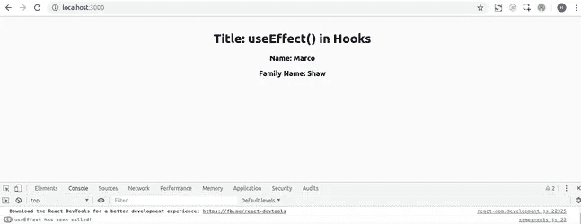
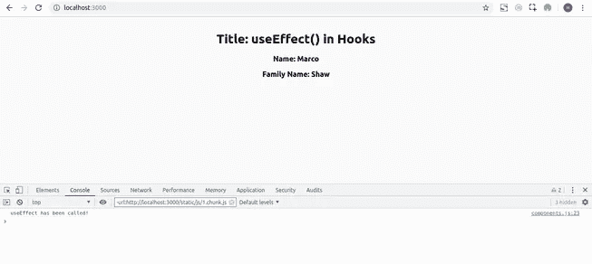

# React 钩子:如何使用 useEffect()

> 原文：<https://javascript.plainenglish.io/react-hooks-how-to-use-useeffect-ecea3e90d84f?source=collection_archive---------0----------------------->

## 回顾

在上一篇文章中，我介绍了 React Hook 和 useState()的基本原理，最后我们制作了第一个自定义钩子。正如我在[中提到的，React Hooks 对于初学者来说，既可爱又有点复杂](https://medium.com/@hossein98.ahmadi/react-hooks-for-beginners-sweet-and-a-little-complex-31a1225bd2f7)在理解了 useState()的核心概念之后，我们将在 Hooks 中进行更多的探究，下一个主题是 useEffect()。钩子最重要和最有用的部分之一，如果选择钩子，每个开发者都需要使用它。这有点挑战性，也有点难以理解，但是如果你用 hooks 的方式思考，我保证你会喜欢用它写代码。

请继续关注我，我希望你能理解本文末尾的 useEffect()方法及其用法。

## 关于 useEffect()

如果您参考 ReactJS 的官方文档并在 hook 部分搜索 useEffect，您将看到的第一个提示是:

> 如果你熟悉 React 类生命周期方法，你可以把 useEffect 钩子看作 componentDidMount、componentDidUpdate 和 componentWillUnmount 的组合。

基于类的组件中的生命周期方法非常重要。有时候你想在渲染组件时从 API 获取一些数据，有时候你想在组件更新时执行特定的操作。最重要的方法是**组件卸载**和**组件更新**。

你还记得上一篇文章中提到的一件非常重要的事情吗？

> 钩子可以让你编写功能组件，并且仍然可以挂钩到基于类的特性并使用它们。

UseState 让我们为功能组件添加状态。状态和生命周期方法是基于类的组件特性的两大部分。UseEffect 允许我们在生命周期方法中处理我们的逻辑。从它的名字你可以理解，每次有东西影响你的组件时，都会调用 useEffect。

厉害！显而易见，它是 componentDidMount 和 componentDidUpdate 的定义。

Photo by [Joshua Aragon](https://unsplash.com/@goshua13?utm_source=medium&utm_medium=referral) on [Unsplash](https://unsplash.com?utm_source=medium&utm_medium=referral)

## useEffect()的不同用法

好吧！让我们编写一些代码来深入了解 useEffect()。在这一部分中，我想使用 ReactJS 文档的示例，并对其进行一些重要的修改，以便练习并清楚地了解 useState()和 useEffect()的用法。假设我们想在声明什么是对象时声明一个属性。并且有两个属性:name 和 familyName。初始状态将是“名称”和“家庭”,在渲染组件后，它应该被更改为其他东西。

> 注意:您可以通过 Firefox 或 Chrome 中的 React dev tools 扩展来跟踪您的状态。

**第一步:定义状态**

**第二步:定义 useEffect()**

正如您在代码中看到的，useEffect()的参数是一个函数，当某些东西影响您的组件时，它处理您的操作。让我们来看看结果:

太好了！像我一样，你应该看到你在州中选择的名字和家庭名称。

但是让我们检查一下别的东西。我想在 useEffect 中记录一个特殊的句子，看看它会被调用多少次。

结果是:

哎呀！和我一样，你知道每次组件改变时，useEffect 都会被调用。这不是我们要找的。我们的 useEffect 方法现在的行为类似于 componentDidUpdate。如果你熟悉 componentDidUpdate，我们可以通过条件来控制它何时应该动作。在 useEffect 中，你可以传递一个数组作为第二个参数。这个数组清楚地告诉 react，当 me 中的字段被更改时，只需调用 useEffect。所以如果你把“name”放在数组里，作为 useEffect()的第二个参数传递；当“名称”改变时，将调用您的方法。

这仍然不是我们的答案。我们要 componentDidMount！要让 useEffect 像 componentDidMount 一样工作，只需传递一个空数组，一切都会很完美。让我们检查一下:

我们的日志:

太好了！现在我们已经使用了不同类型的 useEffect()，我希望你已经理解了 useEffect()的核心概念。

## 使用 useEffect 提取数据

我们想更进一步，使用我们关于 React 钩子的知识。我们想做一个实际的有用的任务，我们所有人在实际项目中都将面临这个任务:从一个 API 获取数据。在我们继续之前，您应该知道一些提示:

> 1.我们使用 axios 来获取我们的 API。太干净太好用了。你可以在这里了解: [Axios GitHub](https://github.com/axios/axios)
> 
> 2.我们使用其他国家的全球 API。URL 为:“https://rest countries . eu/rest/v2/all”

好吧！所有设置都很好，足够了。我们在这里的任务是从我们的 API 中获取国家列表，并在项目符号列表中显示它们。

我们需要在状态中提供 3 个变量:

1.  **国家:**我们国家的名单给他们看
2.  **Load:** 显示一个加载文本，直到我们的获取过程完成。(为了避免异步/等待类型错误)
3.  **Error:** 显示从我们的 fetch 方法返回的错误，而不是国家列表

好吧！宣布我们的状态:

很好！现在我们在 useEffect()中使用 axios 获取我们的 API。不要忘记传递一个空数组作为第二个参数，因为我们希望我们的 useEffect 像 componentDidMount 一样工作。

我们的加载初始状态是布尔类型 ***false*** 并且我们的错误是未定义的。当我们的组件挂载时，我们获取我们的 API。如果 API 返回状态代码 200 或 OK，我们通过返回的数据设置我们的国家数组。但是，如果我们的获取过程失败，我们设置一个错误等于返回的错误。在这两种情况下，我们都将我们的 load " ***设置为 true*** "以向访问者显示最终结果。最后，我们的最后一步:

太好了！我们完了！由于 useEffect，我们成功地在一个功能组件中获取了 API，并处理了加载和错误。

## 让我们的代码更干净

我们可以让我们的代码更干净。让我们将 fetch 方法移到另一个文件中，并为整个项目实现一个 get 方法。在我们继续之前，知道我们将使用承诺是很重要的，因为获取 API 需要时间，并且我们希望避免类型错误。你可以在[掌握 JavaScript 访谈中读到关于承诺的内容:什么是承诺？埃里克·埃利奥特。](https://medium.com/javascript-scene/master-the-javascript-interview-what-is-a-promise-27fc71e77261)

正如埃里克·埃利奥特所说:

> 承诺是一个可能在未来某个时间产生单个值的对象:一个已解决的值，或者一个未解决的原因(例如，发生了网络错误)。承诺可能处于三种状态之一:已履行、已拒绝或待定。Promise 用户可以附加回调来处理实现的值或拒绝的原因。

因此，我们创造了一个承诺，并告诉他做我们的行动。承诺解决我们一些答案或数据，如果行动成功完成，或拒绝我们与一些原因，如果行动失败。现在让我们在另一个文件中创建 getItems 方法，例如 generalMethods.js:

现在，每当我们想要获取 get API 时，我们都可以导入并使用它。我们只需要传递我们的网址。请注意，现在我们可以删除我们的负载状态并忽略它，但不要这样做。也许我们的获取过程需要一些时间，因为用户的网速或我们的服务器。

清晰明了。

## 最后的谈话

在我的两篇关于钩子的文章中，我试图向你展示功能组件和钩子的强大功能和好处。如果你对使用钩子有一点困惑和恐惧，我可以理解。很正常。基于类的组件统治了 react 大约 5 年，打破这种习惯太难了，太可怕了。但是你应该击中目标。慢慢移动。挑战自我。在另一个项目中通过钩子实现你的类。试着战胜你的习惯，试一试钩子。我保证你会喜欢的。在下一篇文章中，我将为使用 redux 的开发人员解释 useReducer。我们将只使用功能组件和钩子创建一个真正的 web 应用程序。在接下来的文章中，你会清楚地看到钩子的模块化和美丽。

如果你喜欢这篇文章，并且对你有用，别忘了鼓掌，欢迎通过电子邮件联系我:【hossein.ahmadi98@outlook.com