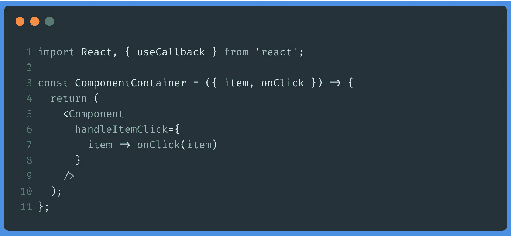
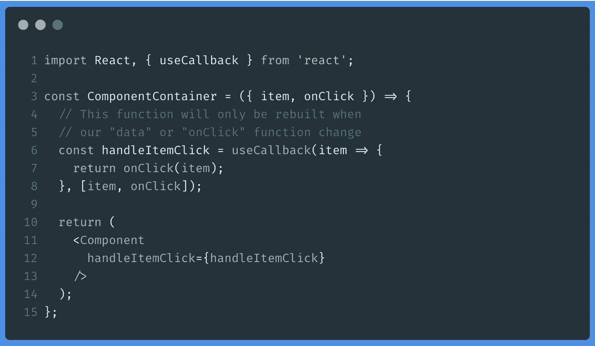
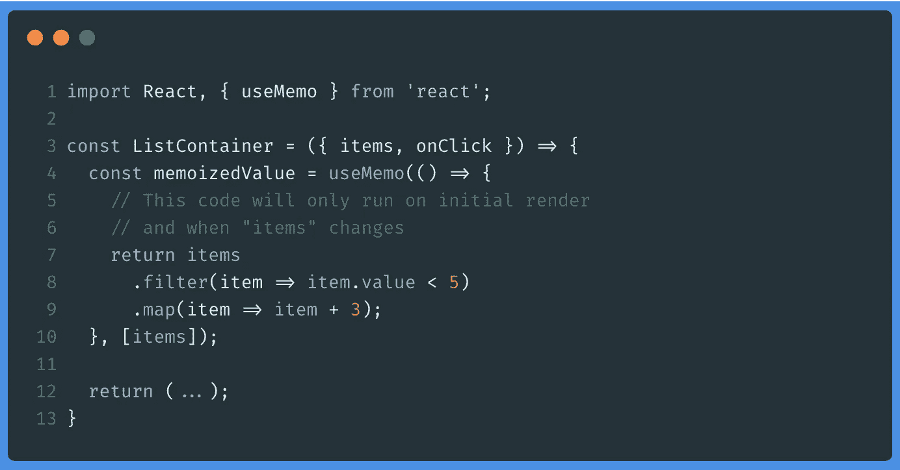

# 反应挂钩以优化性能

> 原文：<https://javascript.plainenglish.io/react-hooks-to-optimize-performance-2bb876b25d67?source=collection_archive---------5----------------------->

## useMemo 和 useCallback hooks 使用指南来提高我们的应用程序的性能

Photo by [Christian Englmeier](https://unsplash.com/@christianem?utm_source=medium&utm_medium=referral) on [Unsplash](https://unsplash.com?utm_source=medium&utm_medium=referral)

当我们用 **React** 开发应用程序时，我们会担心它的性能(越快越好😛).一般来说，一旦我们开始开发中型应用程序，优化和性能通常是最头疼的问题之一。

在本文中，利用对 **React 挂钩**的整合，我想提出一些解决方案，帮助避免导致应用程序性能低下的两个典型问题:

*   不必要的重新渲染。
*   在组件中重复繁重的计算运算。

`**useCallback**`和`**useMemo**`钩子是两个简单的工具，使用它们我们可以防止一些导致这种问题的情况。

让我们看看他们！

# 不必要的重新渲染

众所周知，当`props`或 React 组件的状态发生变化时，它会自动重新渲染该组件。

这通常是一件好事，事实上这就是 React 的工作方式。然而，有时我们可以“帮助”在决定何时强制重新渲染的任务中做出反应，以节省多余的周期，因为正如您所知，如何在屏幕上绘画是应用程序必须面对的最昂贵的操作之一。

**注**。如果你对 React 的虚拟 Dom 是如何工作的感到好奇，我留下一篇我不久前写的文章。

[https://medium . com/@ ger 86/y-ESO-del-virtual-DOM-de-react-qué-es-3 feed 6366925](https://medium.com/@ger86/y-eso-del-virtual-dom-de-react-qu%C3%A9-es-3feed6366925)

这些重新呈现的一个常见原因是每次组件更改时都要向子组件传递一个新函数。

在这种情况下，我们在每次呈现`ComponentContainer`时都创建一个匿名函数，这迫使在`Component`组件中呈现，因为属性(即使函数也是这样)已经改变了(我们传递给它一个新的“对象”)。

如果底层数据没有改变，这种重新呈现可能变得不必要。

为了避免这种情况，我们可以使用`**useCallback**` **钩子**，它“记忆”该函数，并且只在其中一个指定的依赖关系改变时才返回“重建”:

通过这种方式，`Component`组件将总是收到对`handleItemClick`的相同回调，直到`item`或`onClick`元素发生变化。这将**防止我们不必要的渲染。**

# 昂贵的计算

导致 **React** 性能不佳的另一个原因可能是组件内计算的复杂性。

此时，`**useMemo**` `**useMemo**`特别有用，因为它允许“记忆”一个值，以便在需要时随时获取，而无需重新计算，直到计算的依赖关系改变。

例如:

这样，我们将在每次更新`ListContainer`组件时保存重新计算的过滤列表，直到依赖项(在本例中是`items`属性)改变。

# 最后的想法

尽管这是一篇相当短的文章，但我相信这些类型的出版物有助于您熟悉诸如 **hooks** 之类的工具，并找到帮助我们解决使用 React 开发应用程序时可能会遇到的问题的用例。

我希望你喜欢这篇文章！

# 你想看更多这样的文章吗？

如果你喜欢这篇文章，我鼓励你订阅我每周日发送的时事通讯，里面有类似的出版物和更多的推荐内容:👇👇👇

 [## 拿铁和代码

### 这是一份最新的时事通讯，代码是 recibirás cada domingo。——洛斯多斯乌尔蒂莫斯艺术博物馆……

eepurl.us20.list-manage.com](https://eepurl.us20.list-manage.com/subscribe?u=c14cad2102bcf33bf216cc69e&id=2790da9378)