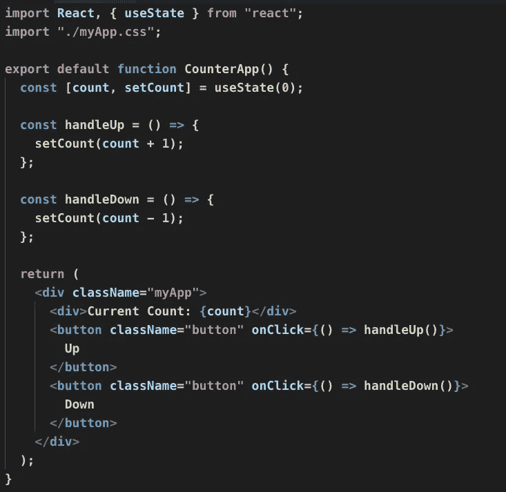

# 反应钩子-使用状态，使用效果

> 原文：<https://javascript.plainenglish.io/react-hooks-usestate-useeffect-54e23b019d32?source=collection_archive---------12----------------------->


# 什么是 React 钩子？

来自 React 文档

```
*Hooks* are a new addition in React 16.8\. They let you use state and other React features without writing a class.
```

> 换句话说，
> 
> 在 React 16.8 之前，当开发人员需要使用状态和生命周期事件时，他们被迫使用类组件。因为功能组件是无状态组件，没有任何生命周期事件。


钩子将打破这些障碍。

通过钩子，可以在功能组件中使用状态(use State)和生命周期事件(useEffect)。

我们将把钩子的使用作为一个例子。

下面的截图显示了名为`Counter`的 react 应用程序的用户界面，它将

*   点击`Up`按钮时，计数增加 1
*   点击`Down`按钮，计数减 1。


# 类别组件

下面是`Counter` App 的类组件代码。


我们将 count 作为一个状态变量，并在单击按钮时更新状态变量。

# 功能成分

我们将看到，我们将如何实现相同的`Counter`应用程序与使用功能组件挂钩。



# 使用状态

useState 是一个钩子，技术上是一个 JavaScript 函数，可以从 react 库中导入。


它采用状态变量的默认值，并返回

*   状态变量(计数)
*   设置状态变量(setCount)的函数引用

count(state)和 setCount(setState)可以引用和操纵功能组件中的状态。

# 使用效果

useEffect 是另一个可以在功能组件中实现生命周期事件的钩子。

我们将采用以下两种场景

*   `Welcome message` 应在`Counter`应用首次打开时显示
*   每当计数状态改变时，消息应该显示计数是奇数还是偶数。


当`Counter`应用程序加载时，它会加载一条欢迎消息。


这是因为下面有`useEffect`挂钩。


useEffect 有两个参数:

*   回调函数。
*   排列

如果第二个参数是一个空数组，useEffect 将在第一次渲染时只执行一次。

每当我们改变计数时，下面的钩子将显示计数是偶数还是奇数。


你可以注意到在`useEffect`第二个参数中有`count`状态变量。这是为了控制`useEffect`仅在`count`状态改变时执行。

# 结论

`useState`和`useEffect`是 react 中的基本钩子。这篇文章可以帮助你理解这一点。如果你有任何问题，请在评论中告诉我。感谢阅读我的文章。

*更多内容请看*[***plain English . io***](https://plainenglish.io/)*。*

*报名参加我们的* [***免费每周简讯***](http://newsletter.plainenglish.io/) *。关注我们关于* [***推特***](https://twitter.com/inPlainEngHQ)[***LinkedIn***](https://www.linkedin.com/company/inplainenglish/)*[***YouTube***](https://www.youtube.com/channel/UCtipWUghju290NWcn8jhyAw)*[***不和***](https://discord.gg/GtDtUAvyhW) ***。*****

*****对缩放您的软件启动感兴趣*** *？检查* [***电路***](https://circuit.ooo?utm=publication-post-cta) *。***