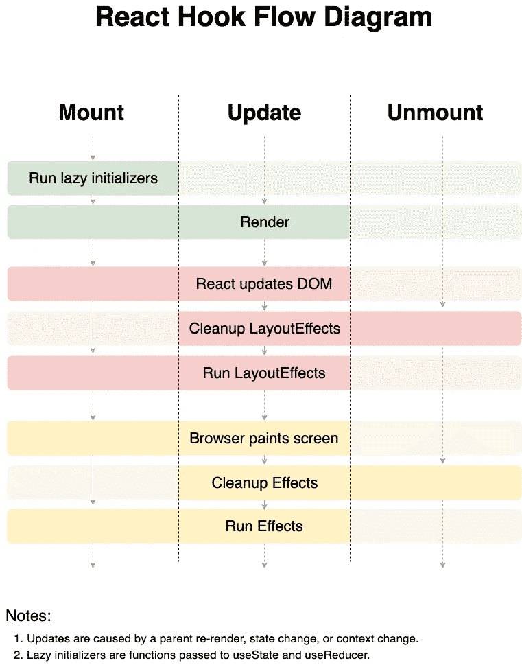
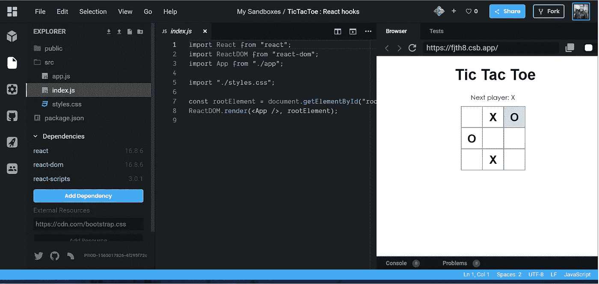

# React Hooks —使用状态、使用效果、使用参考、使用备忘录(TicTacToe 游戏)

> 原文：<https://javascript.plainenglish.io/react-hooks-usestate-useeffect-useref-usememo-926fc2a86a6a?source=collection_archive---------0----------------------->

想象一下:你的应用程序中有一个优秀的函数组件，但有一天你需要在其中添加一个生命周期方法。经过一段时间的思考，你可以将函数组件转换成一个类&这就对了。

您将转换类 Temp 扩展 React。组件，然后在 render body 中复制您的返回函数。

然而，新的 React-Hooks 有更好的方法来做这件事。您也可以在功能组件和生命周期方法中使用状态。

> 注意:这篇文章需要 React 的基础知识。

**钩子让你把状态&生命周期反应特性插入功能组件。**

***useState*** :这个钩子可以让你在功能组件中添加状态。在类组件中，我们可以有“this”。有了“this”的帮助，我们可以在构造函数中初始化状态，并可以做我们的工作。但是在函数组件中，我们没有“this ”,所以我们不能赋值或读取“this”。

```
import React, { useState } from 'react';

function Example() {
  // Declare a new state variable, which we'll call "count"
  const [count, setCount] = useState(0);
```

在上面的例子中，我们使用了 react 包中的“useState”。在这个例子中，我们有一个变量“count ”,它的值作为一个参数设置在 useState(0)中。所以“0”将是它的初始值，它可以是任何你需要的数据类型。

```
// Can be modified as setCount method which we mentioned in useState.
<button onClick={() => setCount(count + 1)}> 
    {count} // Can be read in this way
  </button>
```

> 完整示例:

```
 1:  import React, { useState } from 'react';
 2:
 3:  function Example() {
 4:    const [count, setCount] = useState(0);
 5:
 6:    return (
 7:      <div>
 8:        <p>You clicked {count} times</p>
 9:        <button onClick={() => setCount(count + 1)}>
10:         Click me
11:        </button>
12:      </div>
13:    );
14:  }
```

当我们用`useState`声明一个状态变量时，它返回一对——一个包含两项的数组。第一项是当前值，第二项是让我们更新它的函数。

## 自定义挂钩:

React 钩子最好的一点是它们是常规的 JS 函数调用，所以我们可以将它们的所有逻辑重构为一个小函数。

```
*// 🐨 Make a custom hook called useCounter that accepts the step and
// initialCount and returns the count and increment function* function useCounter({stepCount = 1, initialCount = 0}) {
 const [count, setCount] = React.useState(initialCount)
 const increment = () => setCount(count + stepCount)
 return [count, increment]
}function Counter({step = 1, initialCount = 0}) {
 const [count, increment] = useCounter(step, initialCount)
 return <button onClick={increment}>{count}</button>
}
```

## 使用效果:

可以用' useEffect '直接在函数组件内部处理 3 个生命周期事件，即:componentDidMount，componentDidUpdate，componentWillUnmount。

有时我们希望每次渲染时都运行我们的代码。我们传递给“React.useEffect”的回调是在组件的 *_every_* 渲染(包括重新渲染)之后调用的。

```
React.useEffect( () => {
   Console.log("useEffect runs");
});
```

但有时我们只想使用一个有效的回调函数来运行我们的变量值的变化。在这种情况下，对我们来说幸运的是，“React.useEffect”允许您传递第二个参数，称为“依赖关系数组”,当(且仅当)这些依赖关系发生变化时，它会通知 React 您的效果回调函数应该被调用。所以我们可以用这个来避免做不必要的工作！

```
//Custom useState hook 
function useLocalStorageCounter({step = 1, initialCount = 0, key = 'count'}) {
const [count, setCount] = React.useState(() =>
  Number(window.localStorage.getItem('count') || initialCount),
)
React.useEffect(() => {
window.localStorage.setItem('count', count)
}, [count]);const increment = () => setCount(c => c + step)return [count, increment]
}
```



如果我在 useEffect 中提供了空的依赖项，那么这意味着我只想在初始加载时加载回调函数。或者，如果我从回调函数中返回一些东西，那么它将像 componentWillUnmount lifeCycle 方法一样工作。

## useRef:

`useRef`返回一个可变的 ref 对象，其`.current`属性被初始化为传递的参数(`initialValue`)。返回的对象将在组件的整个生存期内保持不变。

```
function formMethod() {
  const username= useRef(null);
  const onUsernameClick = () => {
    // `current` points to the mounted text input element
    username.current.focus();
  };
  return (
    <>
      <input ref={username} type="text" />
      <button onClick={onUsernameClick}>Focus the input</button>
    </>
  );
}
```

请记住，`useRef` *不会在内容改变时通知您。改变`.current`属性不会导致重新渲染。*

## 使用备忘录:

```
const memoizedValue = useMemo(() => modifyValue(a), [a]);
```

`useMemo`只有当其中一个依赖关系发生变化时，才会重新计算记忆值。这种优化有助于避免每次渲染时进行昂贵的计算。

记住传递给`useMemo`的函数在渲染时运行。不要做任何渲染时通常不会做的事情。如果没有提供数组，每次渲染都会计算一个新值。

为了让你的手脏在代码中，我在 CodeSandbox 的 react hooks 中做了一个例子。

[https://codesandbox.io/s/tictactoe-react-hooks-fjth8](http://TicTacToe Game in react hooks)

> [https://github.com/vinodchauhan7/react-hooks-ticTacToe](https://github.com/vinodchauhan7/react-hooks-ticTacToe)



如果你喜欢这个，请提供你的建设性意见和分享。