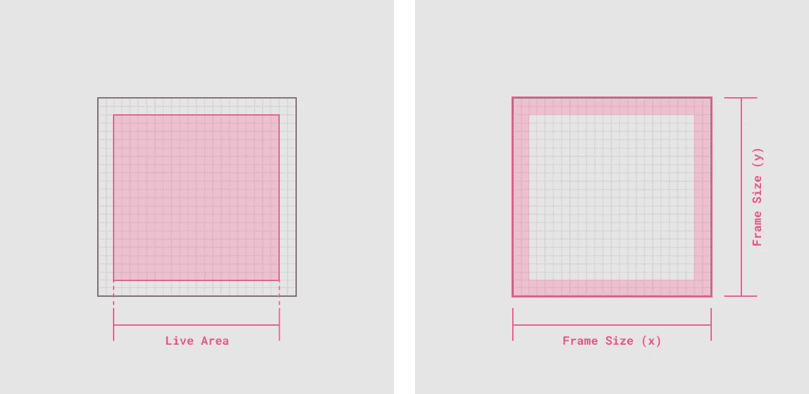

# 反应图标系统

> 原文：<https://javascript.plainenglish.io/react-icon-system-4ec388ed24d5?source=collection_archive---------5----------------------->

图标在界面设计中起着至关重要的作用。它们当然可以用作视觉上的修饰，但是它们经常能够在没有额外文本的情况下传达它们的意思，这使得它们成为设计师和开发人员的便利工具。有许多不同的方法来建立图标系统。在过去，我曾经写过关于基于精灵技术的文章。从那以后，工具已经成熟，并且有了更好的方法。本文将向您展示如何使用 [SVGR](https://react-svgr.com/) 建立一个图标系统——一个将 SVG 转换成 React 组件的工具。

# 准备 SVG 文件

我们的起点是 SVG 文件——每个图标一个。你可能会使用设计工具，如 Figma，Illustrator 或 Sketch 来创建这些。

设计这些图标时，请考虑使用一致的画板尺寸。这确保了所有图标都遵循相同的布局规则，并且可以互换使用。您还应该考虑在画板中添加一些填充，以保持图标内容在视觉上居中。



Artboard size, live area and padding

# 生成图标组件

SVGR 将 SVG 文件转换成 React 组件。它以节点库、CLI 工具和 webpack 插件的形式提供。

Create React App 自带[预配置](https://create-react-app.dev/docs/adding-images-fonts-and-files/#adding-svgs)SVGR。您可以导入 SVG 文件并将其用作组件。这是一个很好的开始。它减少了使用 SVG 和 React 所需的工作量。

```
import { ReactComponent as Logo } from './logo.svg';
function App() {
  return (
    <div>
      {/* Logo is an actual React component */}
      <Logo />
    </div>
  );
}
```

通过使用 SVGR CLI，您可以定制组件生成并进一步改进您的工作流。您可以为组件生成提供一个定制模板，甚至转换 SVG 本身。首先，使用以下命令安装 CLI:

```
$ npm install @svgr/cli --save-dev
```

要创建图标，请运行:

```
$ npx svgr --icon --replace-attr-values "#000=currentColor" my-icon.svg
```

注意，`--icon`标志。它为我们执行几项重要任务:

1.  它将宽度和高度值设置为`1em`,以便用继承的字体大小缩放 SVG。
2.  它保留了`viewBox`,以确保 SVG 以正确的纵横比缩放。

`--replace-attr-values "#000=currentColor"`标志用`currentColor`替换选择的颜色，允许你使用`font-color` CSS 属性控制图标颜色。

在幕后，SVGR 还使用 [SVGO](https://github.com/svg/svgo) 来优化 SVG 文件，然后将它转换成一个组件。这是您可以预期的输出示例:

```
// MyIcon.jsimport * as React from 'react';

function SvgMyIcon(props) {
  return (
    <svg
      width="1em"
      height="1em"
      viewBox="0 0 24 24"
      fill="none"
      stroke="currentColor"
      strokeWidth={2}
      strokeLinecap="round"
      strokeLinejoin="round"
      {...props}
    >
      <path d="M22 12h-4l-3 9L9 3l-3 9H2" />
    </svg>
  );
}

export default SvgMyIcon;
```

要转换整个图标目录，请使用:

```
$ npx svgr --icon --replace-attr-values "#000=currentColor" -d icons icons
```

我通常将这些生成的图标组件视为构建工件。所有的 SVG 文件都位于一个`icon`目录中，并且该目录中的`.js`文件被 git 忽略。然后使用 npm 任务在构建时生成图标组件。

```
// package.json{
  ...
  "scripts": {
    "start": "react-scripts start",
    "build": "react-scripts build",
    "prebuild": "npm run icons",    "test": "react-scripts test",
    "eject": "react-scripts eject"
    "icons": "svgr --icon --replace-attr-values '#000=currentColor' -d src/icons src/icons"  }
}
```

# 自定义图标组件

您可以提供自定义模板来修改生成的组件代码。下面的模板创建了一个图标组件，该组件利用样式化组件来控制其样式。

```
// icon-template.jsfunction template(
  { template },
  opts,
  { imports, componentName, props, jsx, exports }
) {
  const styledComponentName = 'Styled' + componentName;

  return template.ast`
    ${imports}
    import styled from 'styled-components';

    const SVG = (${props}) => ${jsx};

    const ${componentName} = styled(SVG)\`
      display: \${(props) => (props.block ? 'block' : 'inline-block')};
      font-size: \${(props) => (props.fontSize ? props.fontSize : '16px')};
      color: \${(props) => (props.color ? props.color : '#ccc')};
      vertical-align: middle;
      shape-rendering: inherit;
      transform: translate3d(0, 0, 0);
    \`;

    export default ${componentName};
  `;
}

module.exports = template;
```

对于半径设计系统，我们使用的是类型脚本、样式组件和样式系统。我们的[定制模板](https://github.com/rangle/radius/blob/master/packages/ds/icon-template.js)生成了正确键入并与我们的设计令牌适当连接的图标。

# 复合图标组件

我们可以通过将所有生成的图标组合到一个复合图标组件中来进一步简化图标的使用。

```
import { Icons } from 'ds';

export const App = () => (
  <>
    <Icons.Airplay aria-title="airplay the video" />
    <Icons.AlertCircle aria-title="error" />
  </>
);
```

SVGR 允许我们指定自定义索引模板。该模板用于转换 SVG 目录时生成`index.js`文件。以下模板生成一个复合组件。

```
// icon-index-template.jsconst path = require('path');

function indexTemplate(files) {
  const compoundExportEntries = [];

  const importEntries = files.map(file => {
    const componentName = path.basename(file, path.extname(file));
    compoundExportEntries.push(componentName);

    return `import { default as ${componentName} } from './${componentName}';`;
  });

  return `${importEntries.join('\n')}

    export const Icons = {
      ${compoundExportEntries.join(',\n  ')}
    };
  `;
}

module.exports = indexTemplate;
```

它为所有组件添加一个 import 语句，根据文件名为组件生成一个名称，最后将它们合并到`Icons`对象中。

```
// src/icons/index.jsimport { default as Activity } from './Activity';
import { default as Airplay } from './Airplay';
import { default as AlertCircle } from './AlertCircle';
import { default as AlertOctagon } from './AlertOctagon';

export const Icons = {
  Activity,
  Airplay,
  AlertCircle,
  AlertOctagon,
};
```

这是 npm 任务的最终版本:

```
// package.json{
  "scripts": {
    ...
    "icons": "svgr --icon --replace-attr-values '#000=currentColor' --template icon-template.js --index-template ./icon-index-template.js -d src/icons src/icons"
  }
}
```

SVGR 是一个非常棒的工具。您可以使用现成的“创建反应应用程序”。您也可以对其进行自定义，以更好地适应您的工作流程。该示例的完整代码可在[或](https://github.com/winkerVSbecks/react-icons-demo)处获得。对于一个更复杂的例子，我建议查看 Radius [源代码](https://github.com/rangle/radius/tree/master/packages/ds)。