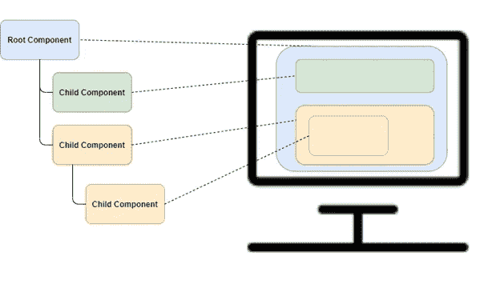

# 7 分钟后做出反应

> 原文：<https://javascript.plainenglish.io/react-in-7-minutes-a4fe81eb13ef?source=collection_archive---------3----------------------->

## React.js 的简明介绍


Watch How Fast

React 是最重要的前端开发框架是有原因的。

乍一看这似乎很复杂，但实际上很容易理解。本指南将为您一一解析。

以下是我们将要介绍的 React 要点。

*   基于组件的
*   数据 DOM 绑定
*   组件定义
*   组件嵌套
*   组件交互
*   重复
*   事件处理
*   状态更新
*   JSX

看我们能多快报道这件事。

> 前面没有废话。

# 基于组件的

React 是一个基于组件的 UI 框架。基于组件的 UI 的本质是视图由多个代表其部分的组件组成。

本质上，React 维护了一个组件树，然后这些组件被表示为在屏幕上看到的内容。如下图所示:



让我们看看这在代码中是如何工作的。

这段代码在 JSFiddle [这里](https://jsfiddle.net/mtyson/bcnyrfum/9/)是活的。

这是我们正在创建的(到目前为止):

First Version End Result

简单:显示一个父 div 和一个子 div。

# 单根容器元素

首先要记住的是，有一个*根元素。因此，我们的 HTML 页面中的标记如下所示:*

```
<div id=”container”>
</div>
```

现在让我们告诉 React 我们想对这个标记做什么。(请注意，JSFiddle 中已经包含了 React minified 发行版。)

```
class Parent extends React.Component {
 render() {
 return <div class=”parent”>Parent
   <Child></Child>
 </div>;
 }
}class Child extends React.Component {
 render() {
 return <div class=”child”>child</div>;
 }
}ReactDOM.render(
 <Parent />,
 document.getElementById(‘container’)
);
```

别担心，这个其实很简单。

首先，跳到最后一条语句，在那里它调用了`ReactDOM.render(...)`这是 React get 与你的 HTML DOM 关联的地方。

*   第一个参数(`<Parent/>`)告诉 React“这些是您将绘制的组件”
*   第二个论点`document.getElementById('container')`说:“这是画他们的地方。”

`<Parent />`元素是一个 JSX 元素，类似于一个定制的 HTML 元素。

# JSX

不要太担心前面的 JSX，它实际上是一个相当不令人惊讶的技术。它允许类似 HTML 的标记和 JavaScript 一起使用。最后变成 JS 代码输出你的组件。

一般来说，你可以把 JSX 想象成拥有 JS 超能力的 HTML(或者如果你愿意，也可以把 JS 想象成拥有 HTML 超能力的 HTML)。

接下来，让我们看看 JSX 是如何知道为`<Parent />`标签放置什么的。

这项工作直接在上面的 JS 中完成，我们在那里定义父组件:

```
class Parent extends React.Component {
 render() {
   return <div class=”parent”>Parent
     <Child></Child>
   </div>;
 }
}
```

我们还有一个渲染方法。这一次，render 方法返回一个简单的 div，其中包含一个类、一些文本内容和另一个名为 Child 的组件。

# 组件嵌套

`<Child>`引用是组件嵌套的一个例子。

就在父组件定义的下面，是子组件，也很简单。

你可以看到这些组件(用一点 CSS)如何变成我们看到的输出。到目前为止，它看起来只是一种迂回的 HTML 输出方式。

但是组件的强大之处在于，正如我们所看到的，它们不仅仅包含视图。它们还包含行为和状态。

# 数据 DOM 绑定

我所说的数据 bom 绑定是指框架负责将应用程序中的数据绑定到浏览器 DOM 中的表达式或表现形式。这与 jQuery 不同，在 jQuery 中，大部分框架和开发人员都在维护这种一致性。

事实证明，这是一个非常强大且能提高生产力的想法。它支撑着 React、Vue 和 Angular 的快速提升。

React 组件中基本上有两种数据:

*   属性(或*道具*)
*   状态

# 性能

首先:属性。

Props 是通过元素属性从外部设置的组件数据(因此得名 props)。本质上，标记属性允许组件中的数据通信。

这里是更新的小提琴:[https://jsfiddle.net/fy0rpvtm/1/](https://jsfiddle.net/fy0rpvtm/1/)。

Result with Data Binding

首先，请注意父构件的视图样板已更改，以包含一个属性:

```
Parent, called {this.props.name}
```

所以我们可以从 JSX 模板引用`this`并引用组件，就像它是一个对象一样——它就是这样。

`this.props`指组件对象上的属性集。这是组件状态的一部分；它是从外部传入组件的部分。

你怎么告诉组件这个道具会是什么？

一种方法是在这里完成:当使用组件时，在组件上显式设置它:

```
<Parent name=”John Lennon”/>
```

我想在这里真正地强调一点，我们正在做的是将状态的可用性分离到组件中，并在该组件的 *use* 中指定该状态的内容。

也就是说，组件定义与其属性的规范完全分离。

# 状态

现在，以类似的方式，组件展示了一个*状态*成员属性。组件的内部状态。

状态只是把变量放在组件内部，只有它自己看得见。状态不是直接从外部设置的。

下面是更新后的提琴使用状态:[https://jsfiddle.net/89k1zcdp/](https://jsfiddle.net/89k1zcdp/4/)

在我们的例子中，我们将以编程方式在构造函数中设置父状态:

```
constructor(props) {
 super(props); // Normal JS call to super, req'd for react
 this.state = { // Set the state
 children: [
     {name: “Julien Lennon”},
     {name: “Sean Lennon”}
   ]
 }
}
```

侧边栏:`constructor`是对象上的一个方法，在创建对象时被调用。

还有其他设置状态的方法。状态可以与 props 菊花链连接，以便 prop 初始化状态(这不是直接完成的，但是，它通过 JS 代码将两者联系在一起)。或者，可以通过调用后端来设置状态。

本质上，我们获取内置的 state 成员属性，并赋予它一个“children”属性，然后直接在 JSON 中设置它。同样，这可能来自后端或任何地方的用户输入。

# 重复

现在让我们看看如何以迭代的方式输出它:

```
<ul>
 {this.state.children.map(function(child, index){
   return <li key={ index }>{child.name}</li>;
 })}
 </ul>
```

使用 JSX 的能力来交错标记和 JS，我们使用前面初始化的`this.state.children`对象，并使用 JS `.map`函数来输出一个列表项。

现在我们想使用我们的子组件。我们可以像这样更新父视图模板:

```
return <div class=”parent”>Parent, called {this.props.name}
 {this.state.children.map((child, index) => {
 return (
 <Child name={child.name} />
 );
 })}
```

因此，我们没有使用 HTML 的和 LI 元素，而是使用了之前看到的子组件，并将迭代数据作为道具传递给子组件。

所以子组件可以反映这个道具，我们给它添加视图标记:

```
class Child extends React.Component {
  render() {
    return <div class=”child”>Child named {this.props.name}</div>;
  }
}
```

新提琴:[https://jsfiddle.net/89k1zcdp/10/](https://jsfiddle.net/89k1zcdp/10/)

这样给你迭代感和亲子沟通感。

所以你已经看到了组件、道具、状态、迭代和从父母到孩子的交流。这些是用 React 构建 UI 的核心元素。

现在，让我们看看如何处理一个事件并删除一个子事件。

新提琴:[https://jsfiddle.net/89k1zcdp/12/](https://jsfiddle.net/dybzphLw/12/)

基本上，我们在父列表中添加一个按钮:

```
<div>
   <Child name={child.name} />
   <button onClick={(e) => this.removeChild(index, e)}>Remove</button>
 </div>
```

我们添加了带有`onClick`处理程序的按钮元素。当按钮被点击时，它将执行指定的 JS。

我们再次使用粗箭头符号来确保`this`解析为组件对象，并使用它简单地重新路由对`this.removeChild()`的调用，传入所单击的列表元素的索引。

在真正的应用程序中，我们最有可能使用驱动列表的数据中的主键。对于这个介绍，我们将只使用数组索引(由于 JS 不保证数组的排序，这并不安全)。

现在让我们看看这个事件是如何处理的:

```
removeChild(index){
  var array = […this.state.children]; 
  if (index !== -1) {
    array.splice(index, 1);
    this.setState({children: array});
   }
 }
```

将`removeChild(index)`方法添加到与组件上的构造函数和`render()`方法相同的级别。

# 状态的“不变性”

当您查看这段代码时，要认识到的重要事情是:在 ReactJS 中，状态是不可直接修改的。通过`setState()`只能*修改*。考虑到这一点，`removeChild()`方法变得非常不言自明:从状态中复制我们想要的数组，删除有问题的元素，然后用`setState()`将新的、修改过的数组设置到对象状态中。

这是最终的结果:

Final Result

# 包裹

这是一个快速，没有废话介绍反应的基本原则。

有了这些技术，你就可以开始构建一套技能来构建高级的、设计良好的应用程序 UI。

马特·泰森是[黑马集团公司](http://www.darkhorse.tech/)的首席技术官


Dark Horse Group, Inc.

[](https://twitter.com/matttyson) [## 马特·泰森

### 马特·泰森的最新推文(@matttyson):“来自寒冷的非常棒的版本！鲍勃马利和…

twitter.com](https://twitter.com/matttyson) [](https://www.linkedin.com/in/matt444/) [## Matt Tyson -软件架构师-公司机密| LinkedIn

### 查看马特·泰森在全球最大的职业社区 LinkedIn 上的个人资料。马特有 13 项工作列在他们的…

www.linkedin.com](https://www.linkedin.com/in/matt444/)