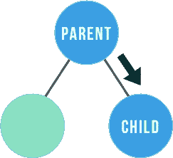
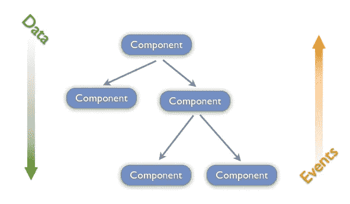

# 反应继承:状态和道具

> 原文：<https://javascript.plainenglish.io/react-inheritance-states-and-props-658d7c433d8a?source=collection_archive---------0----------------------->

## 分解把状态和类方法作为道具传下去的过程…


eact 是一个强大的 JavaScript 库，用于构建用户界面。它为开发人员提供了许多工具来帮助构建应用程序，并且像所有代码一样，它坚持“单一来源的真理”的实践

“真实的单一来源”意味着当编写代码时，它的结构使得对象模型(类结构)和它们相关联的数据模式将属于一起，而不是在任何其他位置(即，一个模型的类方法将与所有其他与该模型相关联的方法和属性一起编写在一个文件中)。它要干净得多，并且使代码更容易调试。

如果我们想在一个对象模型中编写一个方法，要求访问一个只存在于不同模型中的属性，那该怎么办？我们如何让这个模型访问另一个模型的属性呢？

这就是`states`和`props`的用武之地。



如果您熟悉其他面向对象的编程语言(比如 Ruby)，您就会知道在定义对象模型时，定义将在每个实例中分配给该模型的属性是非常重要的。

在 Ruby 中，类是用一组属性初始化的(例如，一个 Person 的模型类可以用名字、年龄、性别等属性初始化)。).

在 JavaScript 中，我们使用*构造函数*和关键字 *this* 来调用这个属性赋值。关键字*这个*告诉开发商房产属于谁。

> 我可以写一个全新的博客来说明“这个”对于 JavaScript 的重要性，但这不是我这篇博客的重点…😅

在 React 中，您的应用程序文件(包括模型)被分成叫做*组件*的东西。它们非常像普通的 JavaScript 函数，但行为像对象模型。

这是 React 组件的语法(确保将‘React’作为一个依赖项包含在您的`package.json`文件中，并预先`npm install`):

```
import React from 'react'export default class Example extends React.Component{
  render() {
    return (
      <div>This is an Example Component</div>
    )
  }
}
```

当然，组件不一定必须是类组件。

它可以是一个功能组件:

```
import React from 'react'const Example = (props) => {
  return (
    <div>This is an Example Functional Component</div>
  )
}export default Example
```

请注意，在这两个文件中，我不得不`import`‘反应’。这很重要，因为它告诉你的应用程序你的 React 库在哪里被使用。如果不先从 React 库导入，就不能编写 React 代码。

请记住，无论何时使用 React，都要以`import React from 'react'`开始文件。

现在你可能想知道:我在哪里给这个组件分配属性？


很棒的问题！

让我们看看这个组件在另一个组件中被调用时的样子:

```
import React from 'react'
import Example from './Example'export default class ExampleContainer extends React.Component{ state={
    firstProperty: 'I am number One!'
    secondProperty: 'Second is the best!'
  } componentMethod = () => {
    this.setState({
      secondProperty: 'Sucks to be second...'
    })
  } render () {
    return (
      <div>
        <Example firstProperty={this.state.firstProperty} 
                 secondProperty={this.state.secondProperty}
                 classMethod={this.componentMethod} 
      />
      </div>
    )
  }
}
```

重要的是，在编写每个组件时，也要将它导出。这样,*从它那里导入*的每个其他组件都可以使用这个组件。

如果您正在使用一个类组件，您还必须包含一个 render 函数，该函数被调用并返回您希望在 DOM 上显示的内容(一个函数组件在没有呈现的情况下返回相同的内容)。

我刚才做了什么？


首先，让我们回顾一下`props`和`states`是什么。

`Props`是继承自另一个成分。在上面的示例组件中，我传入了三个`props` : *firstProperty* 、 *secondProperty* 和 *classMethod* 。

这基本上与*在 Ruby 中初始化*具有某些属性的模型实例，并使用*构造函数*在普通 JavaScript 中定义对象模型的属性是一样的。

`Props`无法改变。虽然可以在 Ruby 对象的实例中重新分配属性，但是不能直接修改组件的属性。

遵循同样的约定，将父组件的一个属性指定为子组件的一个`prop`。

现在什么是`state`？


`States`是我们计划操作的组件的属性。它们将被赋予一个初始值，但是可以通过我们写入组件的方法进行修改。

因为`state`是一个对象，所以我使用 *this.state* 和属性的键来调用这个属性。请注意，我将我的`prop`赋值的值用花括号括起来。这是因为我使用的是 JavaScript 代码，在 React 中使用 JavaScript 代码时，必须用花括号括起来。

当你想修改`state`时，你必须使用一个调用方法 *this.setState* 的函数，因为 React 不喜欢你直接修改状态。

在我的 ExampleContainer 组件中，我有一个修改`state`的方法。我将这个方法作为道具传递给示例组件。这允许子组件从自身内部调用该方法。要调用这个方法，通常要将它分配给一个事件处理程序(onClick、onSubmit 等)。

调用方法的类组件的示例:

```
import React from 'react'export default class Example extends React.Component{
  render() {
    return (
      <div onClick={this.props.classMethod}>This is an Example Component</div>
    )
  }
}
```

调用方法的功能组件的示例:

```
import React from 'react'const Example = (props) => {
  return (
    <div onClick={props.classMethod}>This is an Example Functional Component</div>
  )
}export default Example
```

为了让一个功能组件访问它的`props`,你必须把它作为一个参数传递给它。类组件没有要传递给它的参数。你可以用 *this.props* 调用它的道具。

功能组件没有*这个。*

对于一个类组件，当你引用它的时候，你可以在`props`前加上 *this* 。

记住，您传递的是方法定义，而不是方法调用！



此外，由于`props`基本上是属性赋值，只要引用正确的父属性，就可以给它取任何名称。

这意味着，如果您有一个只有一个事件处理程序(即 onClick)的子组件，您可以根据子组件被调用的位置为该事件处理程序提供多个方法。

例如，如果我有另一个容器也调用示例组件:

```
import React from 'react'export default class NewContainer extends React.Component{ state={
    differentProperty: 'I am not like the first!'
    anotherProperty: 'Do not underestimate me!'
  } anotherClassMethod = () => {
    this.setState({
      anotherProperty: 'I give up...'
    })
  } render() {
    return (
      <div>
        <Example differentProperty={this.state.differentProperty}
                 anotherProperty={this.state.anotherProperty}
                 classMethod={this.anotherClassMethod}
        />
      </div>
    )
  }
}
```

在这里，我将一组全新的属性传递到一个示例组件中，该示例组件在另一个父组件中被调用。

注意，我仍然使用 *classMethod* 作为专有名称。这是因为我编写了一个事件处理程序，在 Example 的类组件中调用这个 prop 方法。

但是由于分配给正确名称的属性是不同的，所以我实际上调用了一个不同的方法，而不是示例组件在 ExampleContainer 组件中时所调用的方法。

我基本上是为示例组件中引用的`prop`重新分配一个新属性。


这基本上总结了如何将属性传递给组件以及修改状态。如果您希望在层次结构中更低的位置调用父组件中编写的方法，也可以将 props 链接到孙组件。

> 请注意，我改变了在组件内部编写函数的方式。有时我使用箭头函数，有时我使用函数声明。我这样做是因为箭头函数为我提供了“这个”的隐式绑定。
> 
> 因为这个博客关注的是如何传递道具和状态，所以我不会讨论“这个”对于保持真理的单一来源的重要性。
> 
> 但是请记住“这个”在反应中非常重要。作为一个好习惯，为了安全起见，我尽量使用箭头函数来编写我的所有方法，因为我不希望“this”改变。
> 
> 如果你不明白“这个”的重要性，你应该谷歌一下为什么会这样。😊