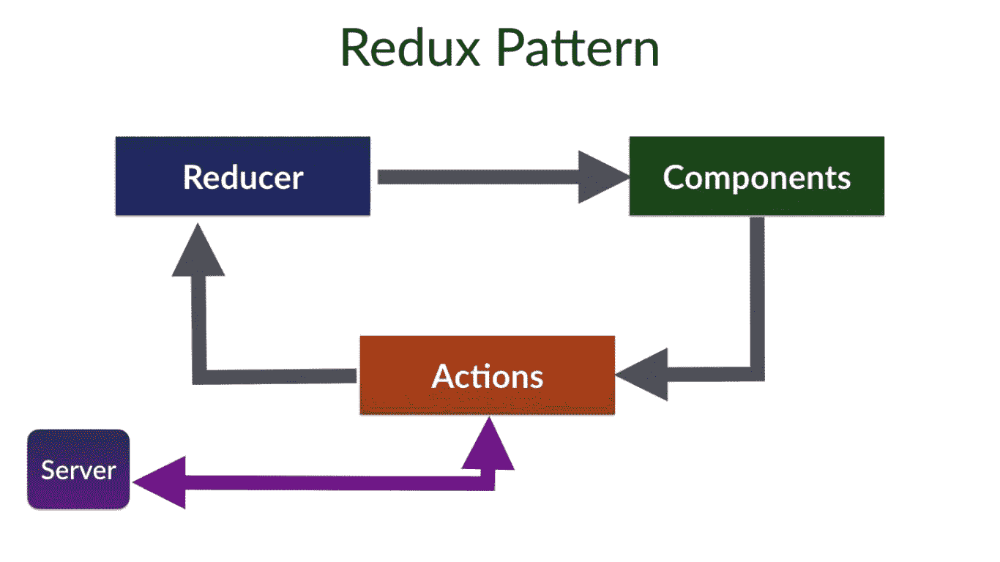

# Redux 快速介绍

> 原文：<https://javascript.plainenglish.io/react-js-and-react-redux-introduction-to-redux-884cb3f1b7af?source=collection_archive---------7----------------------->

## **Redux 是什么？**

Redux 是一个轻量级的状态管理工具，帮助 React 应用中的组件相互通信。这背后的简单概念是，组件的每个状态都保存在一个全局存储中。以便每个组件都可以从该存储中访问任何状态。

Cover Image React Redux

Redux 因其简单性和优秀的文档而变得流行。另一个很棒的地方是 Redux 的大小只有 2kb。因此我们不必担心应用程序的大小。

Redux 可以和任何 Javascript 库 React、Angular 等等一起使用。

## **为什么要用 Redux？**

1.  **全局访问状态:**由于状态是全局的，所以可以很容易地管理应用程序的状态。
2.  **轻松通信:**帮助组件之间轻松通信，无需从一个组件向另一个组件发送任何道具。
3.  可维护性:Redux 帮助我们组织我们的代码库。以便熟悉 Redux 的人可以很容易地理解应用程序的结构。
4.  **测试和调试:** Redux 帮助我们轻松地测试和调试代码。

## 【Redux 是如何工作的？

Redux 应用程序由一个保存整个应用程序状态的全局存储组成。每个组件都可以访问中央存储器来访问状态。

Redux Architecture

Redux 由三部分组成。

a.商店。

b.行动。

c.减速器。

1.  **商店**

存储保存了整个应用程序的状态。每个应用程序只能有一个商店。作为开发人员，我们可以访问、更新、注册或取消注册存储中的状态。

2.**动作**

动作是事件。这是我们向任何 API 调用或用户交互发出所有请求的地方。使用`store.dispatch()`功能发送动作。

3.**减速器**

Reducers 是纯粹的函数，它接受应用程序的当前状态，执行一个动作，然后返回一个新状态。这些状态存储为对象，它们指定应用程序的状态如何更改以响应发送到存储区的操作。

到目前为止，我们只讨论了一点关于 redux 的内容。在下一篇博客中，让我们看看 Redux 是如何与 React 一起工作的。保持联系。

如有任何疑问，请随时联系我。邮箱:sjlouji10@gmail.com 领英:[https://www.linkedin.com/in/sjlouji/](https://www.linkedin.com/in/sjlouji/)

编码快乐！