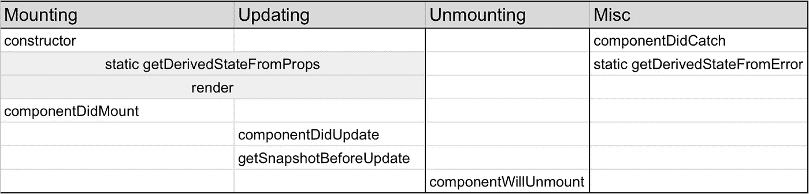

# React:用钩子复制生命周期方法

> 原文：<https://javascript.plainenglish.io/react-lifecycle-methods-replicated-with-hooks-d96080af1b4e?source=collection_archive---------5----------------------->

对于来自面向对象编程(OOP)背景的新开发人员来说，类和生命周期方法可能更容易理解。然而，React 的 Hook API 在前端世界中变得越来越流行和可用。


Image Provided by reactjs.org

# 什么是生命周期方法？

下面的图表列出了组件每个阶段的所有生命周期方法:挂载、更新和卸载。正如您所看到的，安装和更新共享一些方法，但是其他的对于生命周期中的每一步都是非常不同的。



Image by Author, Aman Bhimani

# 钩子中的生命周期

本文的其余部分将解释每个生命周期方法的用途，并展示如何使用 Hooks API 复制类似的行为。

## 构造器

构造函数是 React 组件的特殊构造函数。反应过来的事实。components 是一个类，我们必须从 React 为我们所有的组件扩展这个类。React 钩子的工作方式有点不同:它们不是类，而是函数。也就是说，我们不需要构造函数！

然而，要点仍然是:构造函数通常用于设置基于类的组件的初始状态。您仍然可以使用 useState 挂钩来设置初始状态:

```
// useState takes initial state as first argument
const [list, setList] = useState([]);
```

或者，您也可以选择向 useState 传递一个函数，该函数将返回您的初始状态。这对于依赖于一些大型 CPU 密集型计算的初始值非常有用:

```
import {getInitialTodoList} from ‘./../data-api’;// useState can take functions which return your initial state
const [list, setList] = useState(() => getInitialTodoList());
```

## 组件安装

这个方法是不言自明的，它在组件第一次安装时运行一次。重要的是要记住，它是在 render 方法完成并绘制 DOM 之后运行的。如果您在这个生命周期方法中调用 API，请确保您已经设置了加载器，否则数据在第一次绘制时将为空。

您可以使用 useEffect 钩子完成同样的工作。它接受两个参数:要运行的函数和要观察的依赖项。对于这个用例，我们不希望这段代码运行两次，所以我们没有任何依赖。

```
useEffect(() => { **// code to run after first render**
  const subscription = myTodoObservable.subscribe(() => { … })}, []) **// Empty array means only run this code once after render**
```

## 组件将卸载

下一个你可能想知道的是关于 componentWillUnmount。在此方法中，您必须取消订阅任何事件处理程序。Hooks API 的优点是你的代码非常紧密，它使用闭包来引用变量。

useEffect 可以返回一个“清理”函数，该函数将在效果完成后运行，如下所示:

```
useEffect(() => {
  const subscription = myTodoObservable.subscribe(() => { … }) **// Clean up for “componentWillUnmount”**
  return () => {
    subscription.unsubscribe()
  }
}, [])
```

## 提供；给予

render 方法是最常用的方法，它的工作是:渲染提供的 JSX。由于钩子被用在基于函数的组件中，我们可以像 render 方法一样返回我们自己的 JSX。只需删除“渲染”关键字，并返回 JSX。

```
function TodoList() {
  const [list, setList] = useState([]);

  return (
    <ul>
      {list.map(item =>
        <li key={item.id}>{item.name}</li>}
    <ul/>
  )
}
```

## componentDidUpdate

这个函数有点棘手，因为每次属性或状态更新(来自父组件或全局上下文)时都会调用它。componentDidUpdate 接受 3 个参数:

*   prevProps:上次渲染的道具
*   prevState:上一次渲染的状态
*   snapshot:来自 getSnapshotBeforeUpdate 的值，我们接下来将讨论这个值。

您之所以要运行这个方法，是因为组件状态或属性中的某些东西已经更新，您需要对它做出反应(双关语)。当你的道具或状态值更新时，你可以通过运行一个“效果”来完成同样的事情。

比方说，每当您的待办事项列表达到 5 的倍数时，您都需要调用一个 API。通常，componentDidUpdate 中可能有一些 if-else 块。让我们用钩子来做这件事:

```
function TodoList() {
  const [list, setList] = useState([]); **// effect to run**
  useEffect(() => {
    if (list.length % 5 === 0) {
 **// call your API here**
    } **// Our dependency is “list”. Run every time list updates**
  }, [list]);

  return (
    <ul>{list.map(item => <li key={item.id}>{item.name}</li>}<ul/>
  )
}
```

像 useEffect 这样的钩子让我们编写彼此相关的代码块。在这个 useEffect 块中，您可以编写与列表更新时间相关的代码。代替几个 if-else 块，你可以有单独的 useEffects。

请记住:您可以拥有无限数量的 useEffect 块，它们具有相同或不同的依赖关系。它们将从上到下依次运行。尽量不要将所有代码都塞进一个 useEffect 中。

## 静态 getDerivedStateFromProps

此方法的主要目的是在组件呈现之前或呈现期间更新组件的状态。这也是基于一个条件语句。你应该尽量避免使用这种方式来创建用户界面。React JS 博客也建议:你可能不需要派生状态。但是如果必须的话，这就像在渲染之前更新状态一样:

```
function TodoList({isLoggedIn}) {
  const [list, setList] = useState([]);
  const [prevIsLoggedIn, setPrevIsLoggedIn] = useState(null);

  **// if statement right before return**
  if (isLoggedIn !== prevIsLoggedIn) {
    **// call setState on a state variable**
    setList([]);
    **// set previous value of your prop**
    setPrevIsLoggedIn(isLoggedIn);
  }

  return (<>...</>);
}
```

## 误差边界

目前，没有错误边界的替代品，React 16.8+或 17 只支持错误边界作为类组件。如果您想知道如何使用误差边界，可以观看下面的视频: