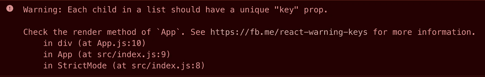
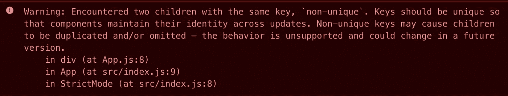

# 如何正确地将键传递给反应列表

> 原文：<https://javascript.plainenglish.io/react-lists-and-keys-101-12d251982482?source=collection_archive---------4----------------------->

## 所以它不会导致意外的行为:反应列表和键 101

Photo by [Matt Artz](https://unsplash.com/@mattartz?utm_source=unsplash&utm_medium=referral&utm_content=creditCopyText) on [Unsplash](https://unsplash.com/s/photos/keys?utm_source=unsplash&utm_medium=referral&utm_content=creditCopyText)

通常在阅读文章或阅读 React 教程时，您会看到许多开发人员使用元素索引作为列表呈现键的例子。

它保持了代码的简单和优雅，当然，也消除了您在控制台中看到的警告。但不幸的是，这是一种反模式。

> "如果项目的顺序可能会改变，我们不建议对键使用索引。这可能会对性能产生负面影响，并可能导致组件状态出现问题。—根据 [React 的文件](https://reactjs.org/docs/lists-and-keys.html)。

在本文中，我想向您展示在呈现列表时如何明智地使用关键道具，以及在向其传递索引时可能会遇到的问题。

# React 的列表和键

“key”是一个特殊的字符串属性，您需要在创建元素列表时包含它。

当试图在不传递一个`key`属性的情况下呈现一个元素列表时，您会得到一个警告，提示您应该为列表项提供一个键。

关键字有助于识别哪些项目已经更改、添加或删除。应该给数组内部的元素赋予键，以给元素一个稳定的标识。

选择一个键的最好方法是使用一个字符串，这个字符串在它的兄弟列表中唯一地标识一个列表项。

大多数情况下，您会将数据中的 id 用作键。

# 问题是

有时当用`.map`呈现一个列表时，我们不会有唯一标识数组中每一项的 ID。我们可以使用另一个属性作为键，但是如果它不一定是惟一的呢？

在前面的示例中，键被设置为 names 数组中的名称，它有一个重复的值，并且键属性必须是惟一的。

如果你看一下控制台，你应该可以看到一个新的警告遇到了两个孩子用同一把钥匙。

# 天真的解决方案

传递给 map 方法的 arrow 函数接收第二个参数，它是当前迭代中元素的索引。

我们可以在呈现列表时使用这个索引作为键，这样键就等于索引。这样，每一项都会收到一个唯一的键值，所以这就是如何使用索引值作为列表呈现的键。

**让我告诉你，使用索引作为键，在某些情况下可能会导致一些严重的 UI 问题。**

> 根据 React 的文档,“当你没有稳定的 id 用于渲染项目时，你可以使用项目索引作为一个键作为最后的手段”。

# 一个例子！

在这个例子中，您可以看到使用`.map`呈现的两个列表。

第一个列表(红色)接收索引作为键，第二个列表(绿色)接收每个元素的 ID 作为键。

您可以看到，通过单击其中一个按钮，颠倒列表的顺序，或者在开头添加一个元素，这两个列表的行为是不同的。

我们希望数字(id)和动物名称保持不变(0 —狗，1 —猫，等等)。

点击按钮反转列表，看红色的，可以看到数字和名字出乎意料地混合在一起。而绿色的表现良好。

同样，在列表的开头添加一个元素会导致红色列表中动物的 id 改变。

此外，如果你打开控制台，你会看到实际发生了什么。最初，这两个列表为每个元素呈现并记录动物的 ID 和名称。然后，通过点击其中的一个按钮，只有红色的列表，我们把它作为一个键传递给它，导致打印，也就是执行一个重新渲染。

传递一个惟一的值会使我们正在呈现的列表像预期的那样运行。

# 什么时候可以用索引做键？

现在你可能会问这个问题。如果使用索引作为关键字，会导致这样的问题，为什么这么多的文章或视频会证明这一点？事实证明，如果您的列表满足某些条件，您可以使用索引作为键:

*   **列表中的项目没有唯一的 ID** 。如果项目确实有唯一的 ID，总是使用它。
*   **列表是一个静态列表，不会改变**。例如，您永远不会在列表中添加或删除项目。
*   **列表永远不会被重新排序或过滤**。例如，基于列值的排序或基于用户输入的筛选。

当您的列表不仅满足一个条件，而且满足所有三个条件时，您可以安全地将索引用作键。

大多数情况下，您最终会拥有一个惟一的 ID，或者列表会满足这三个条件。如果没有，您可以尝试一个为列表生成唯一 ID 的 NPM 包，或者尝试从一个现有的属性中散列出一个唯一值。

但是底线是，尽量避免使用索引作为键，并把它作为最后的手段。

# 结论

事实上，如果您没有指定 key prop，React 会使用索引作为键。当然，我们刚刚了解到，在某些情况下，这可能会是一场灾难。

> "如果您选择不为列表项分配显式键，那么 React 将默认使用索引作为键。"—根据 [React 的文档](https://reactjs.org/docs/lists-and-keys.html)。

好吧。我希望您现在已经很好地理解了 React 中的列表和键。

祝您愉快！感谢阅读！🎾