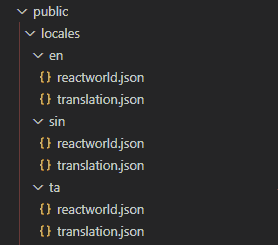

# 使用 React-i18n 进行 react 本地化和国际化

> 原文：<https://javascript.plainenglish.io/react-localization-and-internationalization-with-react-i18n-3045aee346e7?source=collection_archive---------4----------------------->


Photo by [Jesus Kiteque](https://unsplash.com/@jesuskiteque?utm_source=medium&utm_medium=referral) on [Unsplash](https://unsplash.com?utm_source=medium&utm_medium=referral)

如果一个网站要被不同国籍的人访问，那么肯定需要将网站提升到一个新的水平，并提供更多的语言版本。

这就是为什么在这篇文章中，我非常乐意讨论一个叫做国际化的话题。

让我们考虑一个英语网站，我们被要求提供葡萄牙语。我们需要准备好必要的翻译。现在需要让他们有能力用他们的母语来写文章。

在进入内容之前，让我们对以下主题有一个清晰的概念。

# **国际化**

在这个过程中，应用程序被设计成无需工程更改就能适应多种语言和地区。

## **什么是 react-i18next？**

最初让我们了解一下 react-i18next 是什么。正是基于 ***i18next*** 的强大框架，被很多开发者用于国际化的目的。这个可以用在 **React 和 React-Native 中。**由于这个框架是最佳的，它最适合服务器端呈现，它包括多个组件，以便在更改语言时呈现内容。它提供了从 web 到移动平台和基于 web 的应用程序平台的产品本地化的完整解决方案。

## **react-i18 的优点下一个**

它包括多个插件，检测用户友好的各种语言并加载多种语言的翻译。

它有一个显著的优点，就是可以选择缓存翻译，并且提供了使用其他包的灵活性。

因为它对最新的 react 特性的适应速度很快，大多数 React 开发人员似乎都喜欢并使用 react-i18next，而不是其他库。

它是一个高效的应用程序接口。

让我们用 react-i18next 和 React hooks 开发一个 React 国际化应用程序

## **文件的要点**

*   用***create-React-app***创建一个新的 React 应用
*   选择首选语言
*   英语
*   僧伽罗语
*   泰米尔人
*   react-i18n 和其他依赖项的安装
*   创建提供商
*   用 ***格式化消息*** 包装器让生活更简单
*   演示
*   单元测试

## **创建一个新的 React 应用程序**

让我们使用节点包管理器(npm)创建一个 React 应用程序。使用以下命令

```
npx create-react-app react-translation-app
```

React 应用程序可以使用任何名称。

成功创建应用程序后，进入项目文件夹，即 react-translation-app:

```
cd react-translation-app
```

在 visual studio 代码**中打开项目(您可以使用任何其他编辑器)**

## **安装**

让我们安装应用程序所需的所有依赖项。使用以下命令并执行。

```
npm install i18next react-i18next i18next-xhr-backendnpm install i18next-browser-languagedetector
```

在 src 文件夹中创建一个名为 **i18next.js** 的 JavaScript 文件。

打开 **i18next.js** 文件，并:

*   导入所有需要的模块，如下所述

*   现在我们已经准备好初始化语言和其他功能
*   创建一组在整个应用程序中实现的语言

```
const Languages = [“en”, “sin”, “ta”];
```

这里我们使用了英语、僧伽罗语和泰米尔语。

*   创建一个导出默认函数为 ***i18n***
*   添加以下代码

**使用(后端):** —识别用户输入语言

**使用(LanguageDetector):-** 将 i18n 实例传递给 react-i18next 的模块

**use(initreact 18 next):**—i18 next 的实例化。

**fallbackng:" en ":-**默认语言为英语

打开 **index.js** 文件并

*   导入 **i18next.js** 文件

```
import “./i18next”;
```

这里是入口点

*   让我们插入 React 提供的悬挂特性。所以，导入悬念如下

```
import React, { Suspense } from “react”;
```

## **为什么要卖关子？**

通常，这是组件从缓存加载数据时暂停呈现的一种通用方式。

当考虑到较差的连接时，它提供了对在何处显示占位符的完全控制。

*   让我们用 react 悬念来包装<app>标签</app>

```
<Suspense fallback={<div>Loading ……</div>}><App /></Suspense>
```

打开 **App.js** 文件，并:

*   删除返回语句中的现有代码
*   从 **react-i18n** 模块导入`useTranslation`函数

```
import { useTranslation } from “react-i18next”;
```

添加将在 return 语句中呈现的以下代码片段

初始化 App 函数中的 useTranslation 函数

```
const { t, i18n } = useTranslation();
```

基本上，它接收 **t** 作为函数和一个 **i18n** 的实例

*   让我们定义一个函数 handleClick

```
function handleClick(lang) { i18n.changeLanguage(lang);}
```

让我们定义目标语言。

打开 public 文件夹，并在返回的 locales 中创建一个目录。

打开 locales 目录，分别创建 en、sin 和 ta 三个目录。

确保目录中提到的名称应该与下面给出的 **i18next.js** 文件中的名称相似:

```
const Languages = [“en”, “sin”, “ta”];
```

让我们为每个目录(即 en、sin 和 ta 目录)创建一个 JSON 文件。

将 json 文件命名为 **translation.json** 。

打开 *en* 目录下的 json 文件，添加我们的自定义代码如下:

我们可以使用任何可以呈现的信息

类似地，打开 *sin* 目录下的 json 文件，添加以下代码片段:

最后，将以下内容插入到 *ta* 目录下的 json 文件中:

现在让我们运行 React 应用程序。

```
npm start serve
```

我们完了。

## **一种使用 React 和 React-i18 的语言中多个名称空间的方法下一步**

让我们考虑一下下面提到的语言是否有多个翻译名称空间



在新创建的 json 文件中包含一些文本:

**en/reactworld.json**

```
**{** **“title”: “This is a basic example in english”****}**
```

**sin/reactworld.json**

```
**{** **“title”: “This is a basic example in sinhala”****}**
```

**ta/reactworld.json**

```
**{** **“title”: “This is a basic example in tamil”****}**
```

你可以在上述文件中连接你的例子

## **通过实现 react-i18n 和缓存来定位图像**

让我们创建一个 react 应用程序，根据目标语言对图像进行本地化。当点击不同的语言时，我们甚至改变图像，而不仅仅是释放文本。

让我们进入内容。

*与上面的例子类似，让我们跳过安装和其他导入依赖项。一些文件和组件保持原样。*

在 **i18n.js** 文件中定义以下内容

```
const fallbackLng = [‘en’];
```

如果没有可用的语言。我们将只使用英语

```
const availableLanguages = [‘en’, sin, ‘ta’];
```

这里我们需要指定用于翻译的可用语言。

添加以下代码:

检查白名单:真

仅检测白名单中的可用语言。

我们成功定义了 **i18n.js** 文件中的所有函数。

在 src 文件夹中创建一个目录资产，然后确保将这三个图像添加到资产目录中的 images 文件夹中。

React 团队建议将图像添加到 src 目录，而不是公共文件夹。

## **为什么鼓励这样做？**

*   丢失文件可能会导致编译错误，而不是用户的 404 错误
*   结果文件名包含内容哈希，所以不用担心浏览器会缓存它们的旧版本

打开 **App.js** 文件:

*   删除返回语句中的现有代码
*   从 react-i18n 模块导入 useTranslation 函数

```
import { useTranslation } from “react-i18next”;
```

*   导入 React 应用程序所需的以下模块

```
import i18next from “./i18n/i18next”;import imgEng from “./assets/images/1.jpg”;import imgSin from “./assets/images/2.jpg”;import imgTa from “./assets/images/3.jpg”;
```

*   初始化 App 函数中的 useTranslation 函数

```
const { t } = useTranslation();
```

基本上，它接收 **t** 作为函数和一个 **i18n** 的实例

*   让我们定义一个函数 handleClick

```
function handleClick(lang) { i18next.changeLanguage(lang);}
```

添加将在 return 语句中呈现的以下代码片段

让我们定义目标语言。

打开 public 文件夹，并在返回的 locales 中创建一个目录。

打开 locales 目录，分别创建 en、sin 和 ta 三个目录

确保目录中提到的名称应该与下面给出的 **i18next.js** 文件中的名称相似。

*const Languages = ["en "，" sin "，" ta "]；*

让我们在每个目录中创建一个 JSON 文件，即 en、sin 和 ta 目录。

将 json 文件命名为 **translation.json** 。

打开 *en* 目录下的 json 文件，添加我们的自定义代码如下

```
{"Wish": { "text": "Thank you" },"Message": { "text": "for Reading this article" }}
```

我们可以使用任何可以呈现的信息。

同样，打开 *sin* 目录下的 json 文件，添加以下代码片段:

```
{"Wish": { "text": "මෙම ලිපිය කියවීමට" },"Message": { "text": "ස්තූතියි" }}
```

最后，将以下内容插入到 *ta* 目录下的 json 文件中:

```
{"Wish": { "text": "இந்த கட்டுரையைப் படித்ததற்கு" },"Message": { "text": "நன்றி" }}
```

现在让我们运行 React 应用程序。

```
npm start serve
```

我们完了。