# React 本地化—赢家是 i18next + i18nexus

> 原文：<https://javascript.plainenglish.io/react-localization-the-winner-is-i18next-i18nexus-b7cd9f14094e?source=collection_archive---------7----------------------->


React Localization with i18nexus

我们将看一看用 [react-i18next](https://github.com/i18next/react-i18next) 和 [i18nexus](https://i18nexus.com) 本地化 React 应用。i18next 是最受欢迎的 JavaScript 本地化库之一，但是当它与 i18nexus 及其出色的可伸缩翻译管理 API 一起使用时，它的威力才真正释放出来。

# 启动项目

我将使用 [create-react-app](https://github.com/facebook/create-react-app) 引导一个简单的 React 应用程序:

`npx create-react-app my-app`

接下来，让我们`cd`进入 React app 目录并安装几个 i18next 包:

`npm install i18next react-i18next i18next-http-backend i18next-browser-languagedetector --save`

别担心，这些包都非常轻便，易于使用。他们是这样做的:

[**i18next**](https://github.com/i18next/i18next/) :基 i18next 库。
[**react-i18next**](https://github.com/i18next/react-i18next):为 i18 next 提供 React 友好的钩子、组件和函数。
[**i18 next-http-back end**](https://github.com/i18next/i18next-http-backend):让我们使用 AJAX 来加载翻译文件。
[**i18 next-browser-language detector**](https://github.com/i18next/i18next-browser-languageDetector):根据浏览器设置检测用户的首选语言。

让我们用`npm start`启动我们的开发服务器

我们走吧！

# i18next + i18nexus =🔥

自从开始用 [i18nexus](https://i18nexus.com) 之后，没有用过 i18next。i18nexus 允许我们将应用程序字符串存储在云中，并自动将其翻译成我们想要的多种语言。当你准备雇佣专业翻译时，你只需邀请他们加入 i18nexus 项目，就大功告成了。

一个字:牛逼。

去[i18nexus.com](https://app.i18nexus.com/sign-up)注册一个免费账户。命名您的项目后，您将被定向到您的语言仪表板:

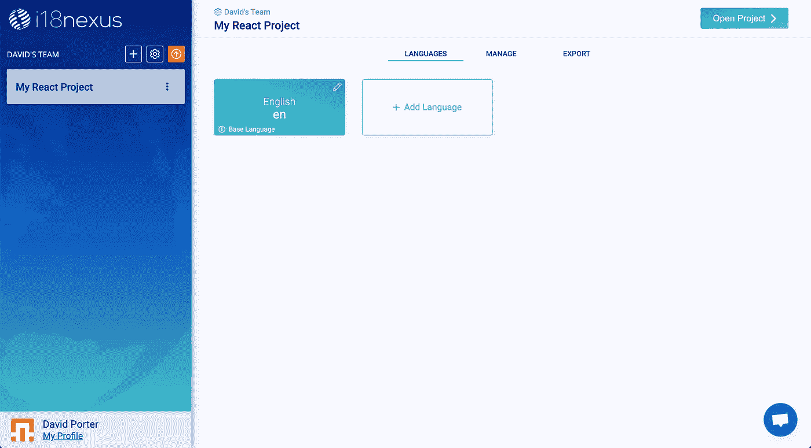

第一个语言板块是你的基础语言——你从翻译过来的语言。

点按“添加语言”以选择您希望您的应用使用的语言。你想选多少就选多少。我想我会选择西班牙语:

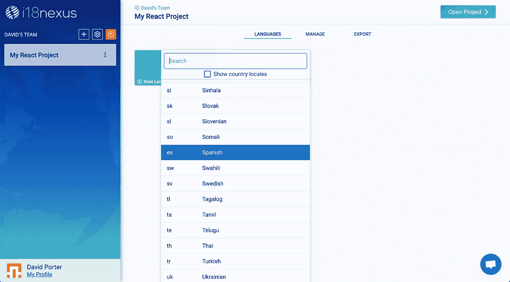

Language Selection

接下来，让我们转到要添加字符串的页面。点击右上角的**打开项目**，进入字符串管理页面。

要添加第一个字符串，点击**添加字符串**。我将添加一个字符串，欢迎用户使用我的应用程序:

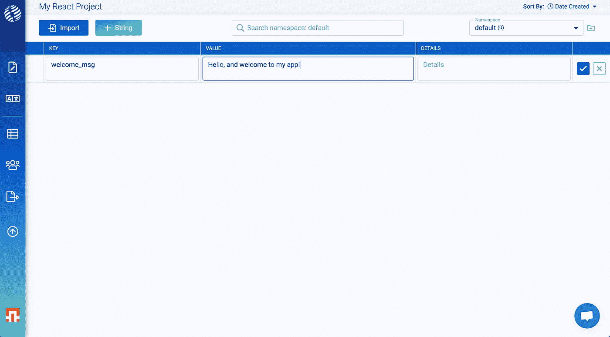

**Key**: “welcome_msg” **Value**: “Hello, and welcome to my app!”

**键**是你在应用中引用这个字符串的方式。

**值**是将在您的应用程序中显示的文本。

**详细信息**字段是可选的。它旨在为您提供有关字符串上下文的任何额外信息，以备您准备聘请专业翻译时使用。你甚至可以在这里添加一张图片来获得更多的背景信息！

添加字符串后，您可以展开该行以查看自动翻译:

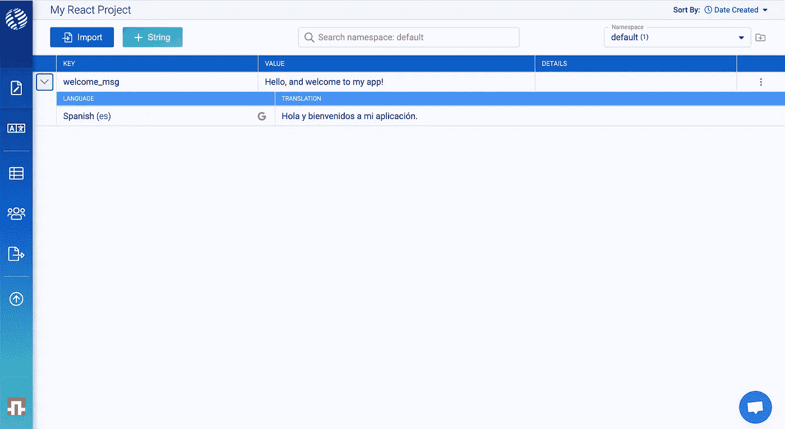

Strings automatically translated

# 让我们连接到我们的应用

回到 Export 选项卡，我们可以找到一个 i18next 配置代码片段，将我们的 React 应用程序连接到我们的 i18nexus 翻译。确保从**反应**选项卡复制:

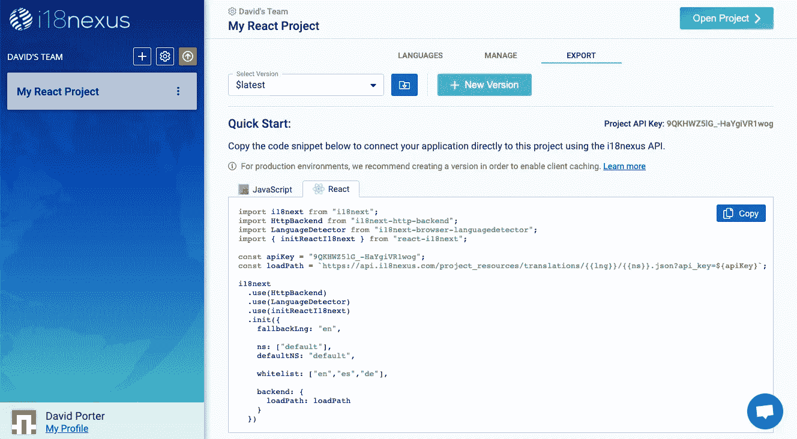

让我们在`src`文件夹中创建一个名为`i18n.js`的文件，然后粘贴代码片段:

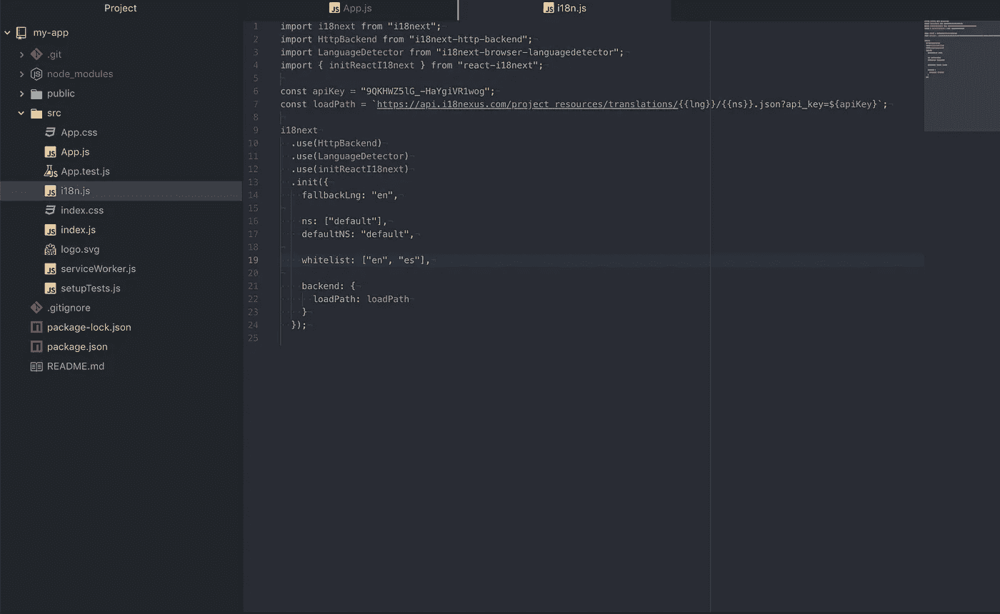

*点击了解有关 i18 下一个配置选项[的更多信息。](https://www.i18next.com/overview/configuration-options)

这段代码从 i18nexus API 中异步获取我们的字符串。我从来没有遇到过加载速度的问题，但是对于生产环境，建议使用 i18nexus CDN 并实现浏览器缓存。我们不会在本教程中讨论这个问题，但是你可以在这里了解更多。

我将在`index.js`中导入`i18n.js`文件，然后使用 React 的`Suspense`组件阻止渲染，直到请求完成。

我的`index.js`文件现在看起来像这样:

```
import React, { Suspense } from "react";
import ReactDOM from "react-dom";
import "./index.css";
import App from "./App";
import * as serviceWorker from "./serviceWorker";
import "./i18n.js";ReactDOM.render(
  <React.StrictMode>
    <Suspense fallback="loading">
      <App />
    </Suspense>
  </React.StrictMode>,
  document.getElementById("root")
);serviceWorker.unregister();
```

# 渲染我们的琴弦

当应用程序加载时，它从 i18nexus 获取我们所有的字符串。现在，我的应用程序只有默认的 create-react-app 页面，带有硬编码的字符串:

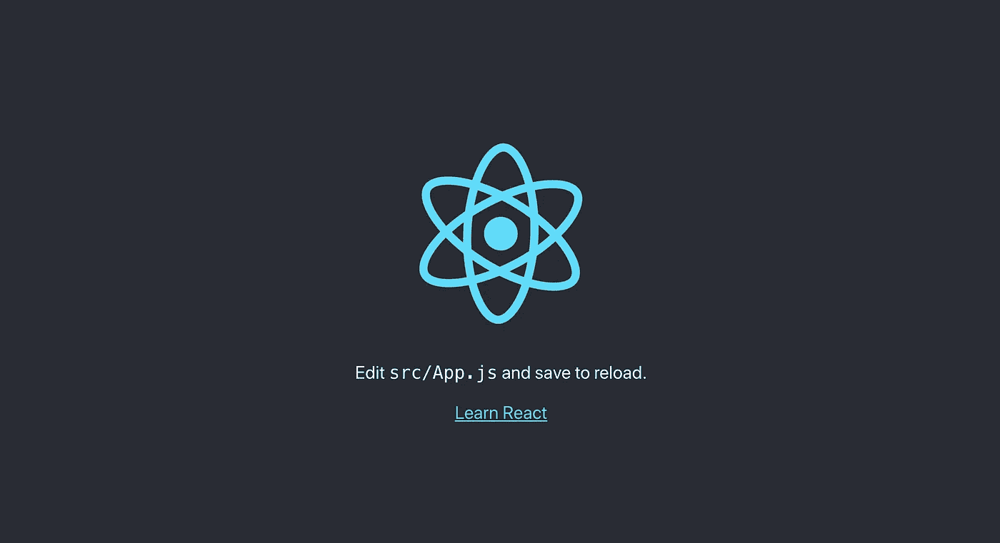

Default create react app screen

让我们用自己的字符串替换文本！

# 使用翻译

为了使用我们的字符串，我们必须从`react-i18next`导入`useTranslation`钩子。这个钩子返回一个名为`t`的函数，我们可以通过将**键**作为第一个参数传递来获取一个字符串。

回到 i18nexus，我添加的字符串有关键字“welcome_msg”。我们来渲染一下。我的`App.js`文件现在看起来像这样:

```
import React from "react";
import logo from "./logo.svg";
import "./App.css";
import { useTranslation } from "react-i18next";function App() {
  const { t } = useTranslation(); return (
    <div className="App">
      <header className="App-header">
        
        <p>{t("welcome_msg")}</p>
      </header>
    </div>
  );
}export default App;
```

这就是了！

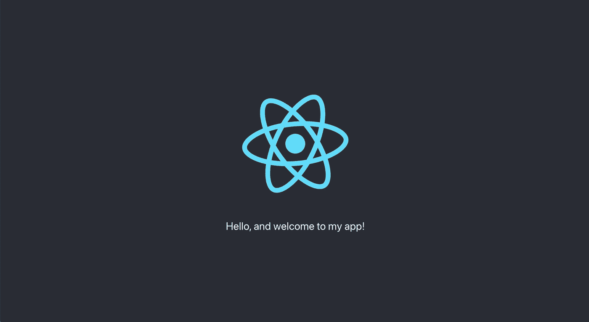

The rendered English string

由于我的个人浏览器语言设置为英语，i18next 自动选择了呈现字符串的英语版本。这要感谢`i18next-browser-languagedetector`库！

为了让用户选择他们的语言，您只需创建一个下拉菜单，在更改时调用`i18next.changeLanguage(<language_code>)`。当然，你可以在 [i18next 文档](https://www.i18next.com/)中阅读更多关于 i18next 函数的内容。

现在，如果你想预览你的应用程序在另一种语言下的样子，可以在 URL 中添加`lng`查询参数。如果我用`[http://localhost:3000/?lng=es](http://localhost:3000/?lng=es,)` [加载应用程序，](http://localhost:3000/?lng=es,) i18next 将使用西班牙语翻译:

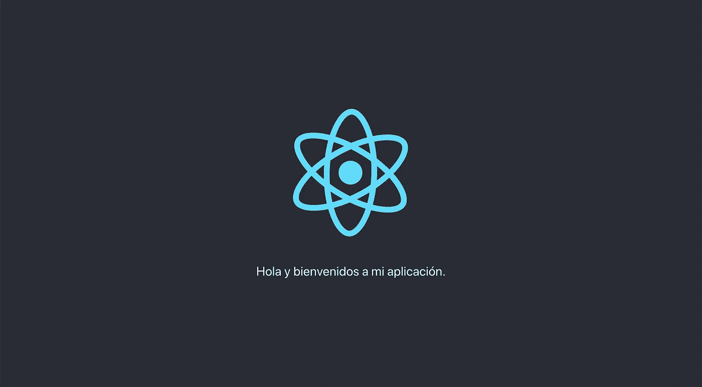

[http://localhost:3000/?lng=es](http://localhost:3000/?lng=es)

厉害！

# 插入文字

让我们给 i18nexus 添加另一个使用**插值**的字符串。(点击了解有关 i18next 插值[的更多信息)](https://www.i18next.com/translation-function/interpolation)

在 i18nexus 中，我将创建一个值为“我的名字是{{name}}”的字符串。i18next 使用双花括号进行插值:

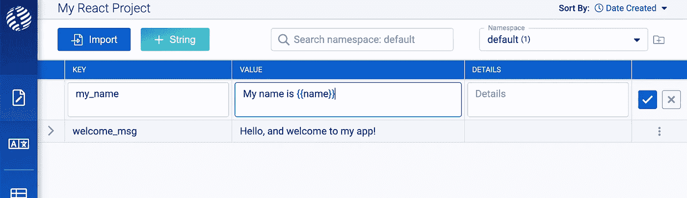

i18nexus even has syntax highlighting for interpolation

现在让我们使用带有插值的`t`函数:

```
import React from "react";
import logo from "./logo.svg";
import "./App.css";
import { useTranslation } from "react-i18next";function App() {
  const { t } = useTranslation();
  const userName = "David"; return (
    <div className="App">
      <header className="App-header">
        
        <p>{t("welcome_msg")}</p>
        <p>{t("my_name", { name: userName })}</p>
      </header>
    </div>
  );
}export default App;
```

现在我们看到插值:

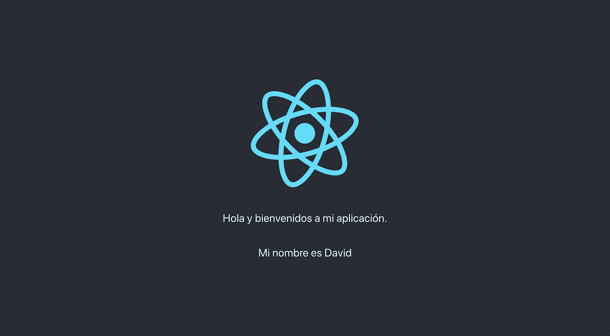

将所有字符串和翻译添加到 i18nexus 后，您的应用程序可以立即访问它们。我喜欢它。

现在，我将在 i18nexus 仪表板中的项目中添加德语:

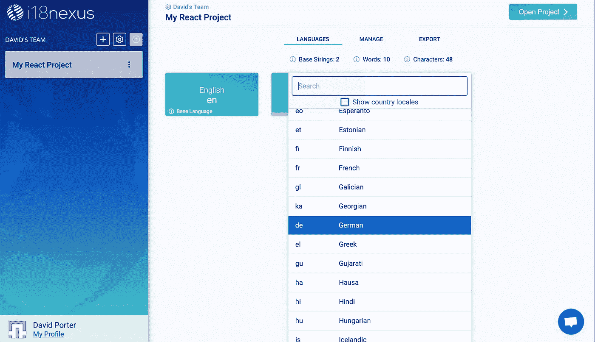

Adding German to my project

当您向 i18nexus 项目添加另一种语言时，记得通过向数组添加新的语言代码来更新您的`i18n.js`文件中的`supportedLngs`参数。

或者，您可以再次从“导出”选项卡复制/粘贴代码片段。我将手动将“de”添加到我的`supportedLngs`中:

```
i18next
  .use(HttpBackend)
  .use(LanguageDetector)
  .use(initReactI18next)
  .init({
    fallbackLng: "en", ns: ["default"],
    defaultNS: "default", supportedLngs: ["en", "es", "de"], backend: {
      loadPath: loadPath
    }
  });
```

现在，让我们访问`http://localhost:3000/?lng=de`查看我们的德语应用程序:


`[http://localhost:3000/?lng=de](http://localhost:3000/?lng=de)`

*牛逼！(*或者我应该说*)*这是幻想！”)**

# 总结一下

**i18next** 和 **i18nexus** 是 React 中可扩展本地化的惊人组合。对于 i18next 和 i18nexus 中的定制，我们只是触及了皮毛，但希望这足以让您入门！欢迎在评论中提问。

## **用简单英语写的 JavaScript**

喜欢这篇文章吗？如果有，通过 [**订阅我们的 YouTube 频道**](https://www.youtube.com/channel/UCtipWUghju290NWcn8jhyAw) **获取更多类似内容！**