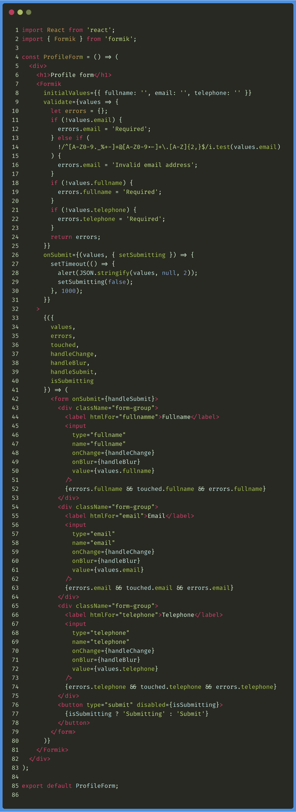
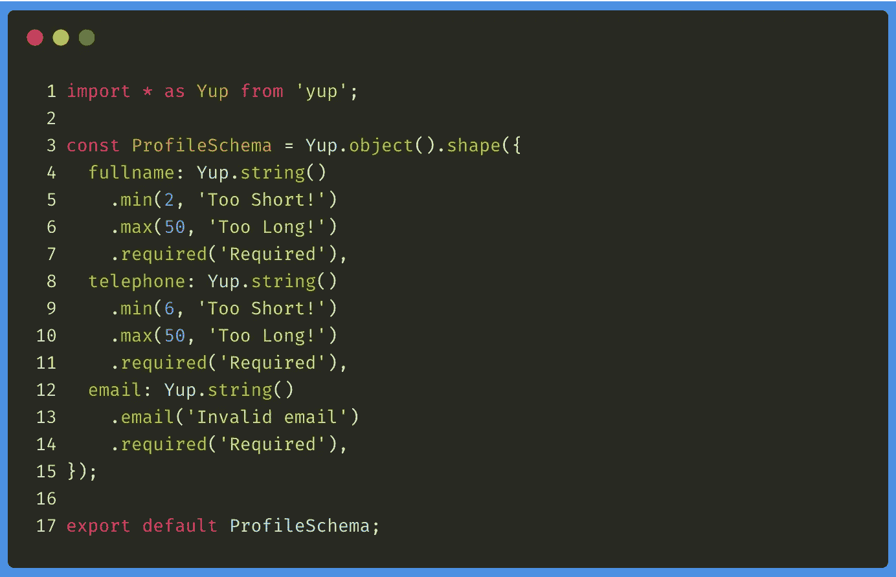
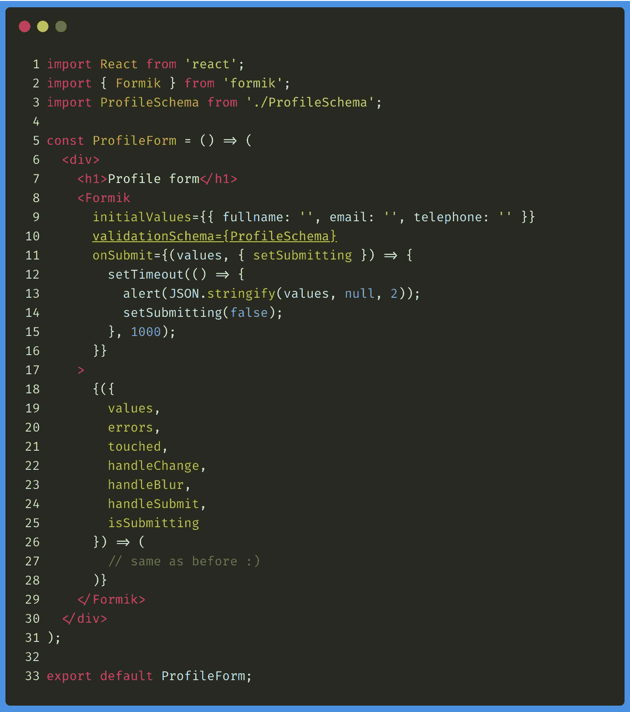
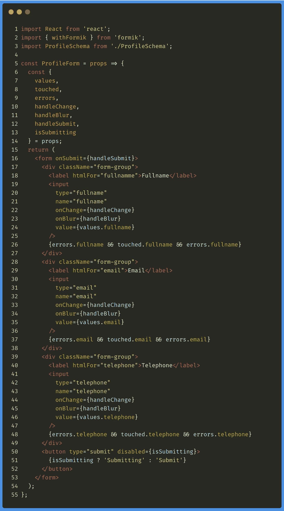

# 使用 Formik 管理 React 中的表单

> 原文：<https://javascript.plainenglish.io/react-managing-forms-with-formik-c90a2ea75f4b?source=collection_archive---------5----------------------->

## 介绍在 React 中管理表单的 Formik 库


Photo by [Artem Sapegin](https://unsplash.com/@sapegin?utm_source=medium&utm_medium=referral) on [Unsplash](https://unsplash.com?utm_source=medium&utm_medium=referral)

今天我想谈谈 [**Formik**](https://jaredpalmer.com/formik/) 库，它允许我们在 React 中以简单干净的方式创建表单，这通常是一项复杂的任务，而像 Redux Forms 这样的库已经以相对的方式解决了这个问题。

是否需要使用第三方库来管理我们的应用程序的表单在很大程度上取决于我们的应用程序的复杂性。对于最简单的，我们可能能够求助于组件的内部状态，但是对于更复杂的，我们可能需要一些帮助。

这就是为什么今天我想介绍一下 **Formik** 库，它对自己的描述如下:

> 在没有眼泪的情况下做出反应😭

我不需要更多的介绍，对不对？所以，让我们开始吧！

# 与 Redux 形式的比较

根据 Formik 的文档，这个库比 [Redux Form](https://github.com/erikras/redux-form) 突出的地方有三点:

*   **一个表单的状态是短暂的和局部的**，所以根据 Dan Abramov 的观点，让它保持 Redux 的全局状态是没有意义的。
*   当我们使用 **Redux Form** 时，每次按下一个键，它都会在 reducing 时被调用，这**会降低大型应用程序的性能**。
*   **缩小的 Formik 大小是 Redux 形式的一半**(12.7 kB vs 22.5 kB)。

# 安装 Formik 并构建我们的第一个模板

我们可以在项目中使用`npm` / `yarn`安装 Formik，如下所示:

```
yarn add formik
```

一旦完成，我们就可以使用库的 **Formik** 组件来创建我们的第一个表单。该组件可以接收以下参数:

*   `initialValues`，我们将向其传递一个对象来定义我们表单的初始值。
*   `validate`，我们将传递一个函数来验证用户输入的值。
*   `onSubmit`，我们将向其传递一个函数，该函数接收发送的值作为第一个参数，接收一个对象作为第二个参数，该对象将为我们提供`setSubmitting`方法，通知 Formik 我们完成表单处理的时刻。

了解了这一点，一个基本的联系方式可以是这样的:



您将会看到，代码非常简单:

*   在第 8 行和第 9 行，我们定义了表单的初始值以及验证函数(当用户填写表单时执行该函数，因此此时会显示错误)。
*   在第 26 行，我们建立了传递给参数`onSubmit`的函数。在这种情况下，`setTimeout`复制对外部 API 的调用。一秒钟后，我们用`false`调用`setSubmitting`方法。
*   在第 34 到 40 行，我们有一个可以从表单中访问的所有方法和属性的列表。例如，我们可以获取允许您管理表单更改(`handleChange`)或提交(`handleSubmit`)的值、验证错误或方法。
*   最后，从第 42 行到第 79 行，我们通常使用上述属性来绘制表单。

简单对吗？通过这种方式，我们的表单状态保持在本地管理，并且代码非常易读。但是还有更多…

# 用 Yup 验证 Formik 表单

正如您所看到的，我们可以编写自己的验证函数，或者将它委托给其他第三方库，这样我们可以轻松地使用它们。

不过 Formik 自己的一个建议用 [**Yup**](https://github.com/jquense/yup) 库。这个库允许我们定义一个可以在表单中使用的验证方案，这要感谢`validationSchema`选项，它会自动将由 Yup 抛出的验证错误转换成适合 Formik 的对象。

要安装 Yup，我们将通过`npm` / `yarn`来完成:

```
yarn add yup
```

完成后，我们可以为前面的表单定义如下的验证方案:



这个验证方案的定义非常简单。定义**中的**称为`shape`就足够了，T9 是一个对象，其中的属性是表单中每个字段的名称及其值，要进行的验证是从语义上编写的，就像你在`email`字段的例子中看到的那样。

一旦完成，我们就可以使用`Formik`组件的`validationSchema`属性来使用我们的`ProfileSchema`:



这样，我们的表格就更短、更简单了。

# 特设 withFormik

最后，Formik 还为我们提供了使用 HOC(高阶组件)`withFormik`的可能性，以便将所有属性和`handlers`传递给用这个 HOC 包装的组件。

为此，我们要做的第一件事是如下声明我们的`ProfileForm`组件:



可以传递给这个 HOC 的其余选项可以在 [Formik 文档本身中读取。](https://jaredpalmer.com/formik/docs/api/withformik#reference)

这样我们的表单又可以工作了。

# 最后的想法

如你所见， **Formik** 库允许我们非常容易地管理应用程序的表单，而不像 Redux Form 那样求助于全局状态。

在这篇介绍之后，在接下来的文章中，我将教你创建更复杂的表单，比如那些涉及管理图像或动态元素的表单。

目前，我希望这篇文章能帮助你了解一家正在 2019 年底获得力量的书店。

# 贮藏室ˌ仓库

我留下了一个简单应用程序的存储库，如果您想继续使用 **Formik** 进行练习，您可以在其中找到我在本文中评论的代码。

[](https://github.com/ger86/react-formik) [## ger86/react-formik

### 这个项目是用 Create React App 引导的。在项目目录中，您可以运行:在…中运行应用程序

github.com](https://github.com/ger86/react-formik) 

# 你想看更多这样的文章吗？

如果你喜欢这篇文章，我鼓励你订阅我每周日发送的时事通讯，里面有类似的出版物和更多的推荐内容:👇👇👇

[](https://eepurl.us20.list-manage.com/subscribe?u=c14cad2102bcf33bf216cc69e&id=2790da9378) [## 拿铁和代码

### 这是一份最新的时事通讯，代码是 recibirás cada domingo。——洛斯多斯乌尔蒂莫斯艺术博物馆……

eepurl.us20.list-manage.com](https://eepurl.us20.list-manage.com/subscribe?u=c14cad2102bcf33bf216cc69e&id=2790da9378)