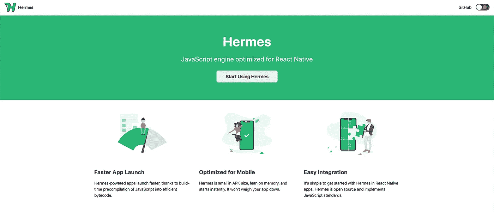
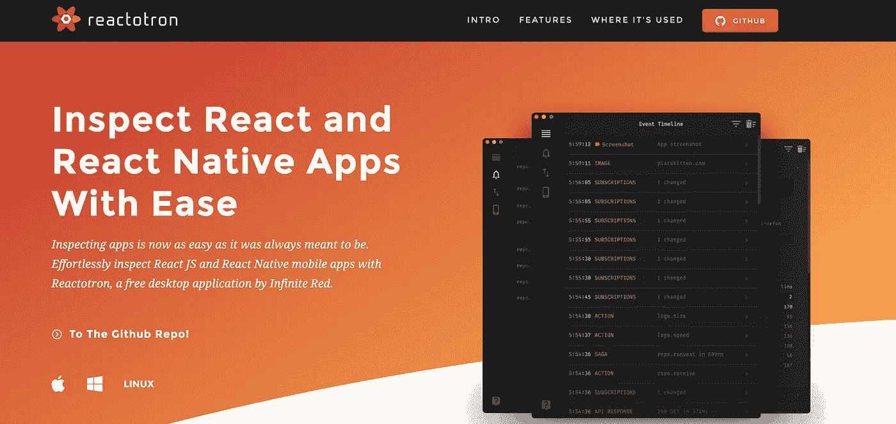
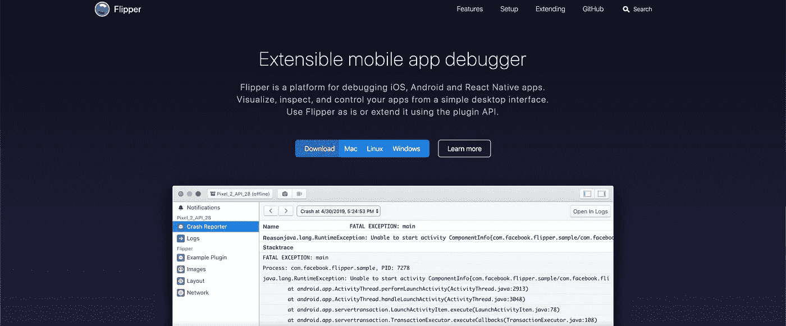
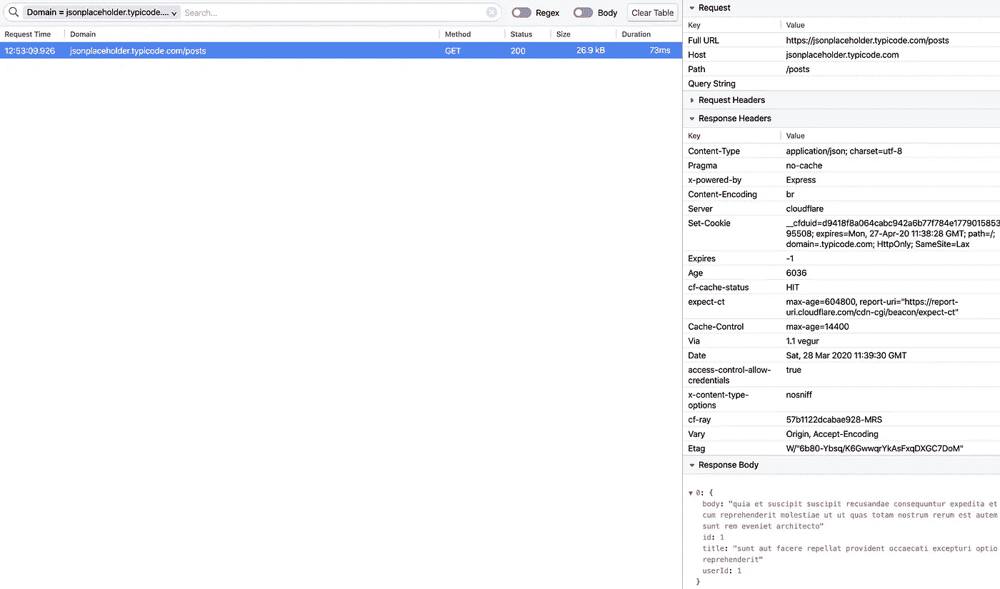
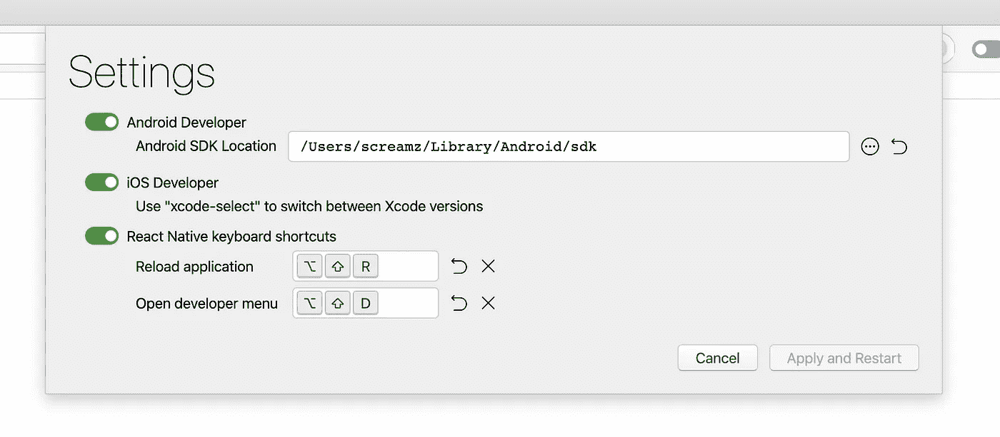
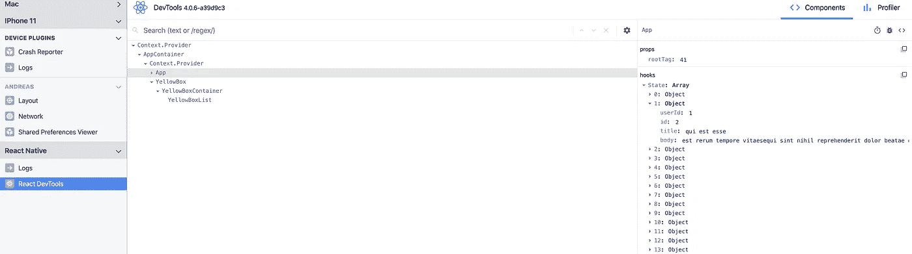
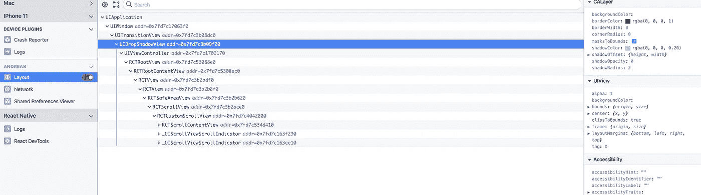
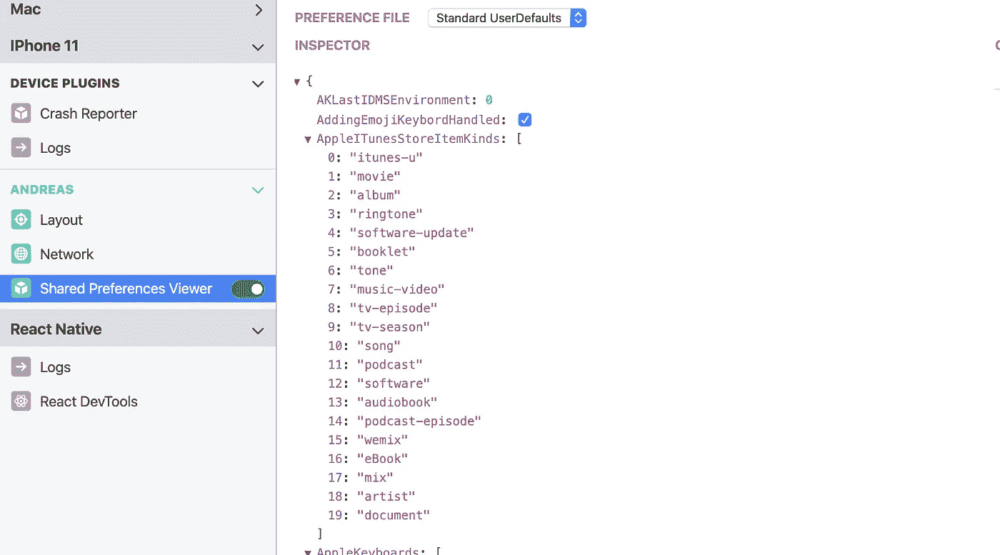
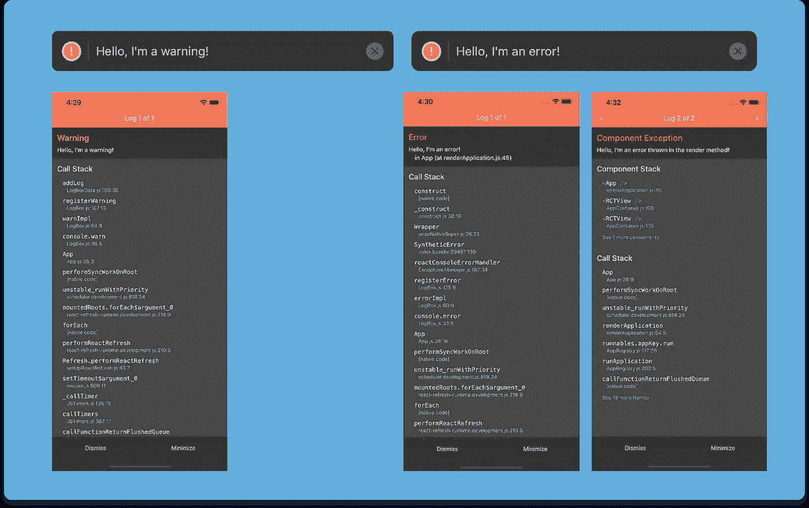

# React Native 0.62 和 Flipper 将改变你的移动开发体验，让它变得更简单！

> 原文：<https://javascript.plainenglish.io/react-native-0-62-and-flipper-will-change-your-mobile-development-experience-and-make-it-easier-8945d345f644?source=collection_archive---------0----------------------->

## 反应自然

## 简而言之:这是一次全新的、更好的开发体验之旅，它才刚刚开始。也是一个迁移向导助手。


# 对本地移动开发现状做出反应

直到 2020 年，React native 在调试工具方面还是一个很差的框架。大多数时候，为了获取系统日志(logcat 等)、调试和分析性能缺陷或渲染问题，您不得不依赖各种针对 Android 和 IOS 平台的工具。

那是框架的原生部分。

**关于 Javascript**

您可以使用通过浏览器调试器完成的远程调试来调试 Javascript。这意味着，你的应用程序代码运行在 chrome 的 V8 引擎中，而不是在设备 Javascript 引擎中运行代码(当然，如果你使用的是基于 chrome 的浏览器)。

这可能会导致一些奇怪的行为，因为引擎是不一样的，并且因为您的代码是在浏览器中运行的，而您的计算机 CPU 的能力，您可能不会在开发时看到性能坑，并且当回到设备时会感到惊讶，例如，当在 staging 上发布时。



在 Android 上发布时，这甚至变得更糟，因为取决于 Android 版本和设备型号，系统的 Javascript 引擎不是同质的，有些东西可能会有不同的行为。这也是为什么**脸书逐渐引入工具来提高跨设备和调试工具**的可靠性，例如 [**赫尔墨斯**](https://hermesengine.dev/) ，一个用于 Android 的嵌入式 Javascript 引擎。



到目前为止，面对 react-native 可用工具的贫乏，一些公司构建了自己的工具，如 InfiniteRed with[**react otron**](https://infinite.red/reactotron)。这个工具很棒，因为它通过插件带来了一些很好的功能，如网络检查器、覆盖或 redux 商店检查器等，这些都是 react-native 应用程序中缺少的。

但是除了 Reactotron 和嵌入 CLI 的 React Devtools 版本(在 v4 中不可用)…

**很明显，在像 Flutter 这样的并发应用中，我们缺乏可以轻松使用的平台工具，并且从一开始就考虑开发这样的工具。**

但是脸书一点一点地做出了反应，并开始构建一个很好的工具来填补这个空白，这个工具你可能听说过，但是直到今天对许多开发人员来说才这么受欢迎…

这个工具被命名为 **Flipper，在任何 react-native > 0.62 应用程序中默认正式提供。**



**Flipper** : ***一款可扩展的手机 app 调试器***

> Flipper 是一个调试 iOS、Android 和 React 原生应用的平台。从简单的桌面界面可视化、检查和控制您的应用。按原样使用 Flipper 或使用插件 API 扩展它。

让我们看看为什么这是 react native 移动开发的好消息。

# 一种新的发展经验已经觉醒。

有什么新鲜事？为什么是和过去很好的决裂点？正如我们上面看到的，react 原生工具的开发体验并不好，但 Flipper 带来了很多改进，记住:这只是开始。请随意为它制作你自己的插件！

## 相当好的调试体验

*   **Flipper 现已与 react-native 项目集成。**

**Flipper** 提供以下功能，无需任何额外的配置步骤。

现在，您可以使用**网络检查器**来调试发生的网络请求，之前您必须使用 Reactotron 之类的东西并在代码中引导它。



Request inspector interface from Flipper

它适用于 HTTP 调用，您可以访问有效负载的任何元素，如标头、格式化的正文。您还可以根据一些规则过滤请求，并使用排序。

**Metro Actions:** *重新加载应用程序，并直接从工具栏触发开发菜单。*

正如我在我的关于 react 本地开发菜单的文章中已经提到的，你可以在这里找到

[](https://medium.com/javascript-in-plain-english/some-better-ways-than-shaking-your-device-to-show-dev-menu-in-react-native-1fd6d051bf90) [## 一些比摇动你的设备更好的方法来在 React Native 中显示菜单

### 用简单的动作拯救你的手机和你的手，不要再成为那个在户外摇晃着一切的陌生人…

medium.com](https://medium.com/javascript-in-plain-english/some-better-ways-than-shaking-your-device-to-show-dev-menu-in-react-native-1fd6d051bf90) 

**有了一种处理设备快捷方式的新方法。**你现在可以使用 Flipper 提供一个键盘快捷键来重新加载或显示开发菜单，不管你的应用模拟器是否有焦点。当您在 chrome 中使用 Javascript 调试器并希望重新加载应用程序时，这非常有用。



Flipper settings panel where you can configure React Native keyboard shortcuts

**崩溃报告者:***查看 Android 和 iOS 设备的崩溃报告。*

有些 bug 是开发中不会发生的，这就是 crash reporter 的闪光点。这对于在 React Native 的`release`模式构建变体上调试崩溃尤其重要，因为如果在运行应用程序时发生崩溃，您将在 Flipper 中获得触发错误堆栈跟踪。

此外，如果任何一个本地库触发了崩溃，您将在这里得到日志。

[**React DevTools:**](https://chrome.google.com/webstore/detail/react-developer-tools/fmkadmapgofadopljbjfkapdkoienihi)***最新的 React 开发工具，帮助检查组件状态和道具。***

**这个工具无论从开发体验还是调试来说，都是一个杰作。对于那些熟悉 React web 的人来说，这是完全相同的工具！这是一件好事。**

****

**Inspect your hooks and component tree with React Devtool 4**

**简而言之，它提供了两个选项卡:一个`**components**` 选项卡，允许我们实时检查组件树和状态/道具挂钩。以及有助于发现性能陷阱(如过度渲染)的`**profiler**`选项卡。**

**也可以在 Flipper 中的设备日志中**搜索，如果使用远程调试，这些日志最初打印在 metro bundler 控制台或 chrome 控制台中。这样，如果您的应用程序有一堆日志，您可以使用自定义过滤器，防止不堪重负。****

**这对于业务逻辑复杂、事件众多的应用尤其有用，比如基于蓝牙通信的应用。**

**您可以 **n 检查由反应本地渲染器**输出的本地 Ios/android 布局并编辑它。这可能有助于您理解臭虫产生的一些影响。**

****

**我最喜欢的是**数据库**和**首选项检查器插件。****

**使用该选项，您最终可以看到异步存储和嵌入式 SQLite 数据库中的数据。对于添加自定义数据库，如**西瓜数据库** *(基于 SQLite)* ，您需要添加一些代码，我们将在另一篇文章中看到如何。但是到了那个时候，[看到了那个](https://fbflipper.com/docs/setup/databases-plugin.html)。**

****

**Shared Preferences Viewer**

*   ****新日志框改善错误显示****

**该版本还附带全新的日志框。**

**你可以在你的根文件中使用`require(‘react-native’).unstable_enableLogBox();`(通常为`index.js`)作为一个实验性的特性来打开它们。它们更加时尚，不那么突兀，并且堆栈得到了增强，尤其是对于组件异常。**

****

*   ****贬损**T4**库****

> **移除 PropTypes:我们正在从核心组件中移除`propTypes`，以减少 React Native 核心对应用程序大小的影响，并支持在编译时而不是运行时进行检查的静态类型系统。**

**幕后发生的另一件事是对道具类型库的贬低，它被用来在运行时某些道具丢失时显示警告。在我看来，这是一件很好的事情，因为它将逐步推动人们采用静态打字器来练习 Javascript。这有助于在 transpilation 中提前发现这些问题。**

**你可能会看一下众所周知的**打字稿**是你没有意识到吗**

# **如何迁移到 0.62 版本**

**对于那些还没有项目的人来说，创建一个新的 reaction-native CLI 很容易，你会立刻得到最新的版本:)，对于像我这样使用`0.61.5`版本的人来说，你需要一些针对安卓和 IOS 的步骤。**

**如果您遵循迁移工具，请不要认为 Gradle 已经更新到版本 6，这可能会在您的库中引入一些突破性的变化。**

**你需要跟随[https://react-native-community.github.io/upgrade-helper/?从=0.61.5 &到=0.62.0](https://react-native-community.github.io/upgrade-helper/?from=0.61.5&to=0.62.0) 的迁移指南。**

**我只想强调，有些部分需要处理并适应您项目的具体情况:**

**名为`package com.rndiffapp;`的所有内容必须对应于您自己的包名，并且您必须相应地调整您的文件夹结构。您可以在`android/app/src/main/java/<your/package/name>/MainApplication.java`找到您的应用程序包名称**

**在同一文件中还要注意的是`initializeFlipper`方法正在使用类反射来瞄准您将要创建的 Flipper 配置类，您可能也需要在这里调整包名。**

```
Class<?> aClass = Class.forName("<your/package/name>.ReactNativeFlipper");
```

**`ReactNativeFlipper`类包含你所有的 Flipper 插件配置，这是你可以添加更多的地方。**

**[**🇫🇷STOP！你是法国人吗🥖？**Alors tu devrais Pluto t cliquer ici pour receivoir ma 时事通讯 privée en franais🙂](https://codingspark.io)**