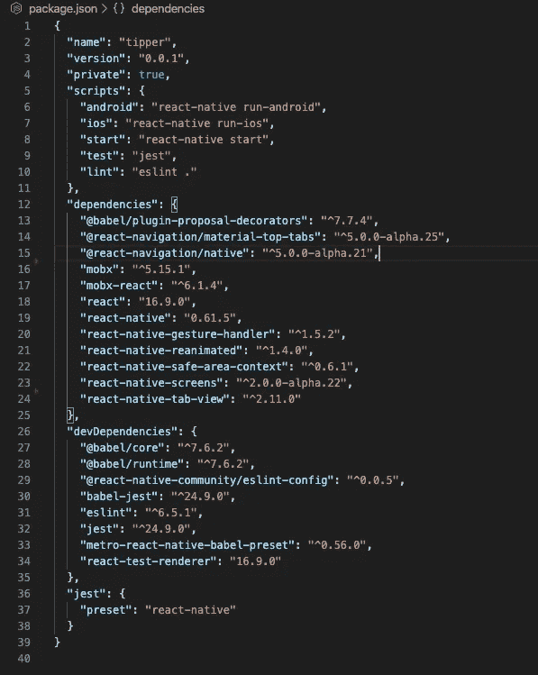

# React Native:使用 React-navigation(v5)和 MobX(第一部分)的动画 TabBar。

> 原文：<https://javascript.plainenglish.io/react-native-animated-tabbar-using-react-navigation-v5-and-mobx-part-i-18a7e2630203?source=collection_archive---------13----------------------->

Animated Circular tab bar (react-native)

最近，我偶然发现了在基于 MobX 和 react-navigation(v5)的 react-native 应用程序上添加自定义 Tabbar 的问题。我试图在网上搜索很多信息，关于 MobX 在 react-native 应用程序中处理路由的方式，但没有找到多少，所以我决定写一个小教程，让其他几个问题解决者不像我一样挣扎。

这将是一个 3 部分系列，将使用 ReactJs(钩子和功能组件)的最新概念，并将使用最新的 MobX 和 React-Nav 包，我还将使用动画 api 和声音来使 tabBar 尽可能具有交互性。

第一部分:环境设置。第二部分:路由器设置和一些代码。第三部分:动画和互动。(高级水平)

对于那些对阅读代码感兴趣的人来说，这里不是一篇文章，而是 **GitHub repo** 。

[](https://github.com/Samykills/react-native-circular-tab-bar) [## Samy kills/react-native-circular-tab-bar

github.com](https://github.com/Samykills/react-native-circular-tab-bar) 

Animated tab bar

# 第一部分:环境设置

让我们从头开始创建一个新的 react-native 项目:

```
npx react-native init tipper
```

完成后，让我们回顾一下我们将在这个项目中使用的主要包:

**React-navigation(V5+)** 这仍然处于 alpha 阶段，但它正在变成一个真正令人敬畏的库(现在有了原生路由)。
要了解更多关于 v5 的信息，请务必阅读文档(并确保点击网站中的版本，转到下一个的**，这对我来说也很难找到。)
下面是链接:**

 [## React 导航入门

### React 导航诞生于 React 本地社区对可扩展且易于使用的导航解决方案的需求…

reactnavigation.org](https://reactnavigation.org/docs/en/next/getting-started.html) 

起初，安装这个库可能会让人们感到有些困惑，因为它现在依赖于许多其他的包，因为我们要构建一个自定义的选项卡栏，我们将需要下面的包列表:

```
“@react-navigation/material-top-tabs”,
“@react-navigation/native”,
“react-native-gesture-handler”,
“react-native-reanimated”,
“react-native-safe-area-context”,
“react-native-screens”,
“react-native-tab-view”
```

**MobX (v5+)** MobX 库已经证明了其作为状态管理库的核心，它促进了反应式编程方法，并且与 redux 相比，不太复杂，易于学习，样板代码非常少。

```
yarn add mobx
```

为 react-native 设置 mobx 对于第一次使用的人来说可能会很困惑，因为这个库依赖于使用 decorator(es6 特性)。

为了更好地了解装饰者，我发现这篇文章非常有见地。

[](https://medium.com/google-developers/exploring-es7-decorators-76ecb65fb841) [## 探索 EcmaScript 装饰器

### 迭代器、生成器和数组理解；JavaScript 和 Python 之间的相似性不断增加…

medium.com](https://medium.com/google-developers/exploring-es7-decorators-76ecb65fb841) 

**MobX-react (v5+)** 为了让“mobx”与 reactJs 一起正常工作，我们还需要“Mobx-react”包，这个包充当“Mobx”库和“ReactJs”之间的链接，这让我们可以在 react 中使用 Mobx 的功能。

```
yarn add mobx-react
```

在安装了上面提到的包之后，我们的 package.json 应该看起来像这样。



package.json with react-nav and mobx

这标志着项目设置的结束。为了确保项目运行良好，您可以通过以下命令运行它:

```
yarn ios
```

或者

```
yarn android
```

在第二部分中，我们将为应用程序添加路由器(标签)和商店，应用程序将利用 react-hooks 和 react-nav 提供的钩子。

[](https://medium.com/@ullasgupta/react-native-animated-tabbar-using-react-navigation-v5-and-mobx-part-ii-c7e1e2651de5) [## React-native:使用 React-navigation(v5)和 MobX(第二部分)的动画 TabBar。

### 这是关于如何使用“反应-导航”和“MobX”制作自定义动画标签栏的 3 部分系列的第 2 部分。

medium.com](https://medium.com/@ullasgupta/react-native-animated-tabbar-using-react-navigation-v5-and-mobx-part-ii-c7e1e2651de5) [](https://medium.com/@ullasgupta/react-native-animated-tabbar-using-react-navigation-v5-and-mobx-part-iii-a6e39ac699fe) [## React-native:使用 React-navigation(v5)和 MobX (Part-III)的动画 TabBar。

### 这是关于如何使用“反应-导航”和“Mobx”制作自定义动画标签栏的 3 部分系列的第 3 部分。

medium.com](https://medium.com/@ullasgupta/react-native-animated-tabbar-using-react-navigation-v5-and-mobx-part-iii-a6e39ac699fe)