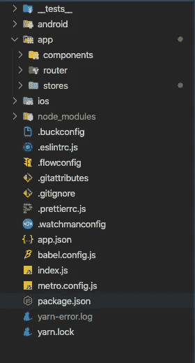
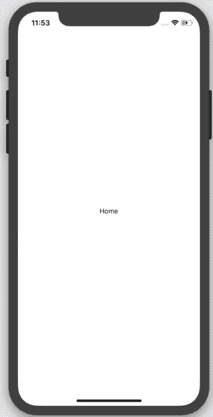
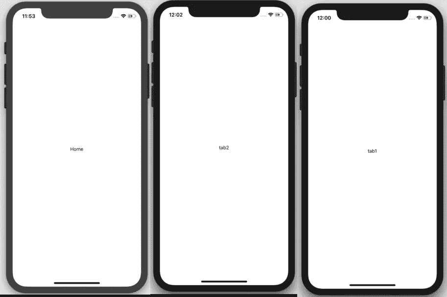
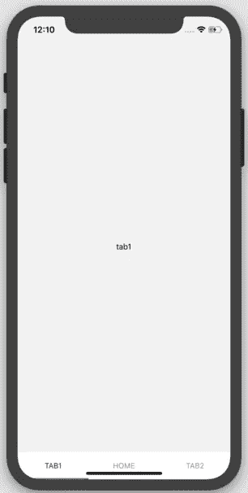
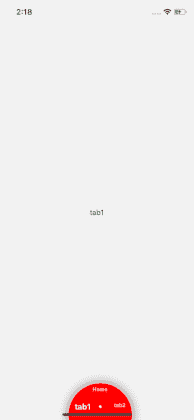

# React Native:使用 React-navigation(v5)和 MobX(第二部分)的动画 TabBar。

> 原文：<https://javascript.plainenglish.io/react-native-animated-tabbar-using-react-navigation-v5-and-mobx-part-ii-c7e1e2651de5?source=collection_archive---------8----------------------->

Animated Circular tab bar (react-native)

这是关于如何使用' **react-navigation** 和' **MobX** '制作自定义动画标签栏的 3 部分系列的第 2 部分。

这是链接到-

**第一部**:

[](https://medium.com/@ullasgupta/react-native-animated-tabbar-using-react-navigation-v5-and-mobx-part-i-18a7e2630203) [## React-native:使用 React-navigation(v5)和 MobX(第一部分)的动画 TabBar。

### 最近，我偶然发现了在基于 MobX 和…的 react-native 应用程序上添加自定义 Tabbar 的问题

medium.com](https://medium.com/@ullasgupta/react-native-animated-tabbar-using-react-navigation-v5-and-mobx-part-i-18a7e2630203) 

**GitHub 回购**:

[](https://github.com/Samykills/react-native-circular-tab-bar) [## Samy kills/react-native-circular-tab-bar

github.com](https://github.com/Samykills/react-native-circular-tab-bar) 

# 第二部分:路由器设置和一些代码。

让我们开始吧。

在前一篇文章中，我们已经为我们的项目设置了环境，并能够运行我们的应用程序，以及基本的必需包列表。

这一部分将涵盖使用 MobX 为我们的 React-native 应用程序和商店设置路由器所需的大部分代码。

在我们开始真正的编码之前，我们需要理解和遵循一些东西。

## 构建代码:

为了能够更好更快地编码，总是要确保你的代码在任何时候都是结构良好和可读的。为此，我倾向于遵循我在从事某些 Java 和 Angular(typeScript)项目时学到的一些原则。

因为我们的应用程序很简单，所以我将代码分成以下几个文件夹:

*组件(react 组件。)
路由器(使用 react-navigation 的 app 的路由处理程序。)
商店(app 所需的 mobx 商店。)*

这是它的样子:



一旦你准备好这些文件夹，让我们继续:)

# App.js

react-native init 命令最初提供的 App.js 文件有助于确保我们的包安装正确并且正在运行。

我们用自己的东西代替现在的 App.js 吧。

创建一个 home.js 文件，并向其中添加以下代码。

Home.js

要确保这是应用程序中呈现的第一个屏幕，请转到 index.js 并将其更改为:

index.js

重新加载(ios 的 Cmd+r)或让快速刷新为您工作。



类似于 Home.js，创建另外两个名为 tab1.js 和 tab2.js 的屏幕

tab1.js

tab2.js



# Router.js

现在我们已经准备好了三个组件，是时候设置路由器了。

在 router 文件夹中创建一个文件 router.js，并向其中添加以下代码。

router.js

这是应用程序现在的样子:



With default tab bars.

现在我们的应用程序用 react-navigation 包提供的默认标签栏看起来很酷。

然而，我们可以通过在这里放置我们自己版本的标签栏来使它变得更酷。

输入“tabBar.js”。

# TabBar.js

react-navigation 最好的特性之一是，它允许我们用 JS 创建自己的 tabBar 组件并呈现它。


What we want to make!

为了制作上面显示的 tabBar 组件，让我们尝试创建并呈现一个自定义的 tab bar。为此，让我们返回到' **router.js'** ,并将' *tabBar* '属性添加到我们的代码中。

```
<Tab.Navigator tabBar={() => <TabBar />} tabBarPosition={'bottom'}>
```

现在，在 components 文件夹中创建一个文件 tabBar.js，并添加以下代码。

tabBar v1

使用上面的代码，我们的标签栏将如下所示:


tabBar v1

我们的标签栏现在还没有功能，还不知道如何导航到不同的标签。

这可以通过使用 MobX 商店来解决。

# MobX 商店

让我们在 stores 文件夹中创建第一个名为' r *outerStore.js* 的商店。

routerStore.js

这将是一个单独的类，因为我们希望整个应用程序中只存在一个路由器存储实例。

这将存储路由器的当前状态和一个 routerRef，以便我们可以从任何存储中使用 react-navigation 提供的导航对象(即代码中不是 react-component 的任何部分)。)

让我们创建另一个商店' *tabBarStore.js* '，它将负责 tabBar.js(我们的自定义 tabBar 组件)中的更改。

tabBarStore.js

现在在商店文件夹中创建一个商店管理员，' ***index.js*** '。

store/index.js

为了使用 react 中的这些 MobX 存储，' ***mobx-react*** '包附带了一个 **<提供者>。**

Provider 是一个包装组件，它使所有的存储对其子组件可用。这些子组件现在可以在需要的时候将商店注入到他们的道具中。

现在修改我们现有的'***router . js****'*如下:

router.js(modified)

刷新时，应用程序看起来仍然一样，但点击/按压选项卡将不会起作用，但是由于 react-nav，滑动确实可以工作，但我们的选项卡栏不能反映这一变化。

routerStore 和 tabBarStore 可以一起改变这种情况。

以下是方法:

在 tabBar.js 中进行以下更改:

tabBar v2

添加后，我们需要 TabBar store 的**current scene***observable*在三个选项卡中的任何一个被聚焦时改变它的值。

为了实现这一点，我们当前的组件(home.js、tab1.js、tab2.js)需要做一些改变。

home(v2).js

tab1(v2).js

tab2(v2).js

将 **TabBarStore** 注入到所有组件中，并使用***react-navigation***提供的**‘UseFocusEffect’**钩子，以确保当该组件被聚焦时，我们通过 TabBarStore.js 中的 **setCurrentScene** 动作更新可观察到的 **currentScene**

现在，我们的标签栏在滑动或点击时会像这样。



active tabbar v2

第二部分到此结束，因为我们已经成功地将商店和路由器配置添加到我们的应用程序中。对于那些只需要关于如何添加自定义标签栏并使其与 **MobX** 一起工作的信息的人来说，这已经足够了，但是对于所有想要更深入地了解 React-Native 的感兴趣的人来说，让我们在第三部分中通过使用**动画 Api** 和声音添加动画来完成。

[](https://medium.com/@ullasgupta/react-native-animated-tabbar-using-react-navigation-v5-and-mobx-part-iii-a6e39ac699fe) [## React-native:使用 React-navigation(v5)和 MobX (Part-III)的动画 TabBar。

### 这是关于如何使用“反应-导航”和“Mobx”制作自定义动画标签栏的 3 部分系列的第 3 部分。

medium.com](https://medium.com/@ullasgupta/react-native-animated-tabbar-using-react-navigation-v5-and-mobx-part-iii-a6e39ac699fe)