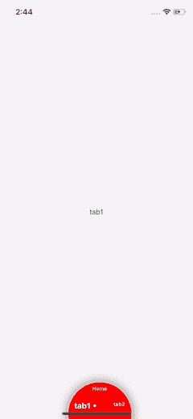

# React Native:使用 React-navigation(v5)和 MobX(第三部分)的动画 TabBar。

> 原文：<https://javascript.plainenglish.io/react-native-animated-tabbar-using-react-navigation-v5-and-mobx-part-iii-a6e39ac699fe?source=collection_archive---------12----------------------->

Animated Circular tab bar (react-native)

这是关于如何使用' **react-navigation** 和' **Mobx** '制作自定义动画标签栏的 3 部分系列的第 3 部分。

这是链接到-

**第一部**:

 [## React-native:使用 React-navigation(v5)和 MobX(第一部分)的动画 TabBar。

### 最近，我偶然发现了在基于 MobX 和…的 react-native 应用程序上添加自定义 Tabbar 的问题

medium.com](https://medium.com/@ullasgupta/react-native-animated-tabbar-using-react-navigation-v5-and-mobx-part-i-18a7e2630203) 

**第二部分**:

 [## React-native:使用 React-navigation(v5)和 MobX(第二部分)的动画 TabBar。

### 这是关于如何使用“反应-导航”和“MobX”制作自定义动画标签栏的 3 部分系列的第 2 部分。

medium.com](https://medium.com/@ullasgupta/react-native-animated-tabbar-using-react-navigation-v5-and-mobx-part-ii-c7e1e2651de5) 

**GitHub 回购**:

 [## Samy kills/react-native-circular-tab-bar

github.com](https://github.com/Samykills/react-native-circular-tab-bar) 

# 第三部分:动画和互动。

让我们开始吧。

在上一篇文章中，我们制作了一个自定义的标签栏，看起来像这样(没有动画) :

custom tab bar(without animations)

Animated custom tabBar(final)

现在让我们添加动画和声音，使它更加流畅和互动。

> **注意**:继续本教程，我假设你对**动画 api** 和**反应钩子**有一些基本的了解。

 [## 动画反应原生

### 动画库旨在使动画流畅、强大，并且易于构建和维护。动画…

facebook.github.io](https://facebook.github.io/react-native/docs/animated)  [## 介绍钩子-反应

### 钩子是 React 16.8 中的新增功能。它们允许您使用状态和其他 React 特性，而无需编写类。这个…

reactjs.org](https://reactjs.org/docs/hooks-intro.html) 

# 动画片

我们会使用 react-native 提供的非常牛逼的' ***动画'*** Api。有了开发人员掌握的 api 知识，许多事情都成为可能。

让我们移动到“ **tabBar.js** ”并尝试将指针移动到当前聚焦的选项卡:

tabbar v3 with pointer movement animations

刷新模拟器时，我们可以看到动画效果。

Animated tabBar v3

## 将显示和隐藏动画添加到标签栏:

现在我们有了指针移动，让我们通过隐藏不活动/不需要的标签栏来使标签栏更适合现代设计(节省空间)。

要做到这一点:
1。我们必须在每次滑动时显示标签栏，并在给定时间内点击和隐藏它。
2。当用户按下标签栏区域时显示标签栏。

将当前 tabBar.js 中的代码替换为:

tabBar(final).js

为了提供淡入/淡出效果，我们在父选项卡栏视图上使用了一个动画值'**Animated tab capacity**'。

**‘use effect’**使用钩子，以便在每次重新呈现标签栏时正确清除超时，这样旧的超时就不会运行，从而防止任何内存泄漏。

对于处理移动指针的动画，我们添加了**‘useNativeDriver:true’**，以便它们由原生 UI 线程处理，导致颜色变化的动画由 JS 线程处理，也是可执行的。

**‘Switch’**语句根据当前聚焦的屏幕处理定时动画。

生成的 tabBar 现在看起来更加平滑和整洁。

the disappearing tab bar animation

# 添加声音。

向应用程序中添加动画会使其在视觉上更具吸引力，但有时我们需要通过添加声音来为用户创造最佳体验。

不幸的是，React-native 没有任何声音/音频 api，因此我们必须依赖 react-native-community 来获得合适的 Api。

幸运的是，react-native 社区非常庞大，有许多开发人员已经发布了一些非常有用的库，可以为我们施展魔法。

我为这个项目考虑的一些库:

1.  反应-自然-声音
2.  反应-原生-音频
3.  反应-本地-声音-播放器

> **‘react-native-sound’**和**‘react-native-audio’**是非常棒的库，但是它们不再被积极维护了。

 [## jsierles/react-native-audio

### React Native 的录音机库。通过创建一个帐户来为 jsierles/react-native-audio 开发做贡献…

github.com](https://github.com/jsierles/react-native-audio)  [## zmxv/react-native-sound

### React 本机模块，用于在 iOS、Android 和 Windows 上播放声音剪辑。请注意，这个软件是阿尔法质量和…

github.com](https://github.com/zmxv/react-native-sound) 

所以我选择了 react-native-sound-player，很容易和 react-native v 0.60+集成

 [## 约翰逊苏/反应-原生-声音-播放器

### 播放音频文件，从 URL 流音频，使用 ReactNative。//纱纱添加 react-native-sound-player //或 npm npm…

github.com](https://github.com/johnsonsu/react-native-sound-player#readme) 

我得到的声音文件来自网站[**FreeSound.org**](https://freesound.org/home/)。
这里是 文件的 [**下载链接。**](https://freesound.org/people/waveplay_old/sounds/201766/download/201766__waveplay-old__tick.wav)

要在动画 TabBar 中使用该文件，我们需要将该文件添加到本地 iOS 和 Android 代码中:

1.  在 iOS 上，将声音文件拖放到 Xcode 中的项目中。记住选中“如果需要，复制项目”选项和“添加到目标”。
2.  在 Android 上，把声音文件放在`{project_root}/android/app/src/main/res/raw/`里。如果文件夹不存在，就创建它。

为了保持我们的代码在 iOS 中的整洁，我添加了一个 **assets** 文件夹，并且符号链接了来自`android/app/src/main/res/raw/`的 res 的文件

为了播放每次标签变化(滑动/点击)时的声音，我们需要添加 SoundPlayer 到 tabbar store**setCurrentScene**动作。

TabBarStore.js(with sound)

在这里，我们加载声音文件，以便每当我们改变标签时，它总是准备好播放。

关于使用 MobX 和 react-navigation 创建动画 TabBar 的 3 部分系列到此结束。你可以在 这里找到教程 [**的完整代码。**](https://github.com/Samykills/react-native-circular-tab-bar)

希望这对你有帮助。