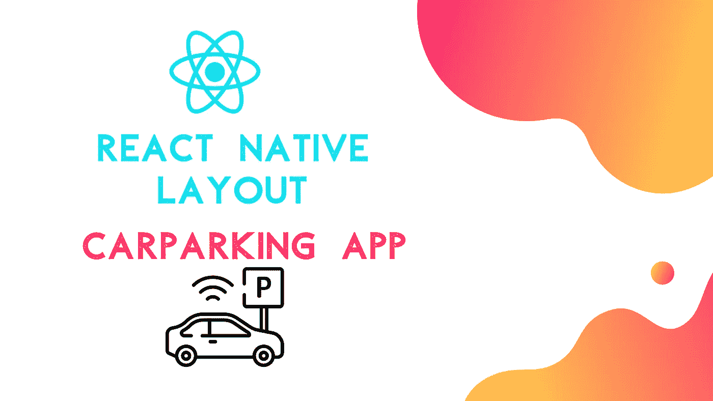
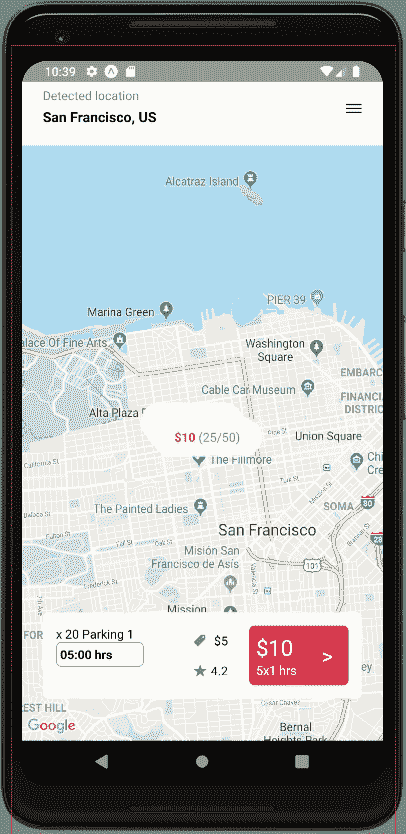
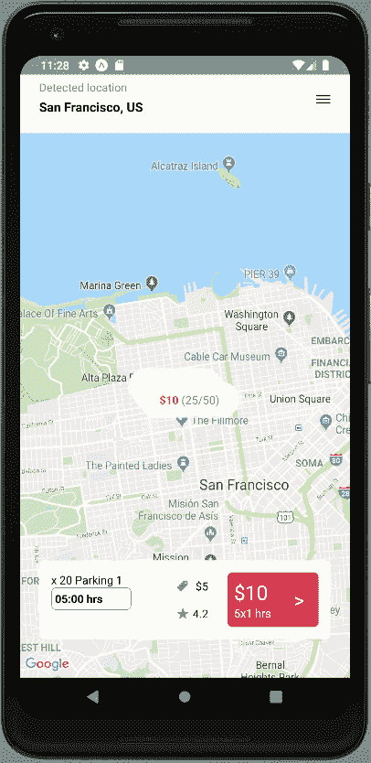
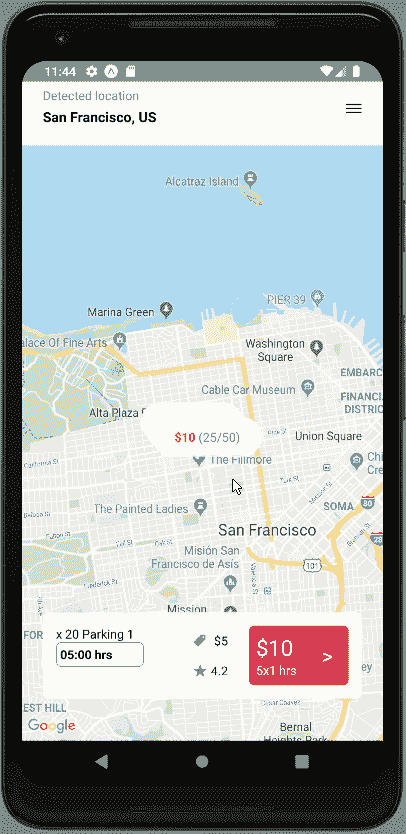

# React 本地汽车停车查找器应用程序 UI 克隆#6:实现模态视图

> 原文：<https://javascript.plainenglish.io/react-native-car-parking-finder-app-ui-clone-6-implementing-modal-view-6216af0e9278?source=collection_archive---------4----------------------->



本教程是我们 React 原生停车 App UI 克隆系列的第六部分。在[的最后一部分](https://kriss.io/react-native-car-parking-finder-app-ui-clone-5-header-section/)中，我们成功地实现了地图屏幕中的标题部分，并组织了我们的代码。在教程系列的这一部分，我们将从上一部分停止的地方继续。因此，建议通读本教程系列的所有前几部分，以便全面了解该项目的进展情况。

如果有人想从头开始学习，这个教程系列的所有部分都可以在下面找到:

*   [React 原生汽车泊车查询应用 UI 克隆# 1:地图视图](https://kriss.io/react-native-car-parking-finder-app-ui-clone-1-map-view/)
*   [React Native Car Parking Finder App UI 克隆# 2:滚动/滑动过渡](https://kriss.io/react-native-car-parking-finder-app-ui-clone-2-scrolling-swiping-transition/)
*   [Building React 原生汽车停车查找器 App UI 克隆# 3:停车点卡](https://kriss.io/react-native-car-parking-finder-app-ui-clone-3-parking-spot-cards/)
*   [React Native Car Parking Finder App UI Clone # 4:地图标记](https://kriss.io/react-native-car-parking-finder-app-ui-clone-4-map-markers/)
*   [R](https://kriss.io/react-native-car-parking-finder-app-ui-clone-4-map-markers/)

如前所述，本教程系列的动机来自于 [React Native 商店定位器应用程序模板](https://www.instamobile.io/app-templates/react-native-store-locator-app-template/)，它为我们提供了一个用 React Native 编写的动态、完全编码的初学者工具包，任何人都可以使用它来构建自己的商店定位器 React Native 应用程序或启动自己的创业。第五部分也是 YouTube 视频教程中的编码实现和设计的延续，由 [React UI Kit](https://www.youtube.com/watch?v=CuMR9kRZJCw&list=PLNRPou200YIeu4UllJkv8-Ca19Ld_eOay&index=8) 为汽车停车查找器应用程序 UI 克隆。视频教程似乎使用快速编码风格来交付不同 UI 部分的实现，这对于任何开发人员，尤其是初学者来说可能难以理解。然而，本教程对每个 UI 部分的实现给出了逐步的指导。因此，读者可以放松下来，花时间学习和实现 UI。

## **概述**

在本系列教程的第六部分中，我们将实现一个模型，用不同的 UI 部分显示停车卡部分的扩展信息。想法是安装 react-native-modal 包并将其集成到地图屏幕中。然后，我们将配置模态，以使它看起来像在实际应用程序中。最后，我们将在模态视图中实现不同的部分，并对它们进行样式化。

*那么，让我们开始吧！！*

## 安装模块包

这里我们将把 [react-native-modal](https://github.com/react-native-community/react-native-modal) 包安装到我们的项目中。这个软件包提供了一个增强的，动画的和可定制的反应原生模型。这个包的主要目的是通过添加动画和样式定制选项来扩展原来的 react-native `Modal`组件，同时仍然提供一个简单的 API。现在，为了将这个包安装到我们的项目中，我们需要运行以下命令:

```
expo install react-native-modal
```

然后，我们需要在 Map.js 文件中将这个包作为`Modal`组件导入，如下面的代码片段所示:

```
import Modal from 'react-native-modal';
```

## 实现模式

在这一步中，我们将在地图屏幕中实现模态。为此，我们需要定义一个名为`activeModal`的状态来处理模态的打开和关闭。应该如下面的代码片段所示定义`activeModal`:

```
state = {
    hours: {},
    active : null,
    activeModal : null
  }
```

现在，我们需要在按下停车卡上的购买按钮时激活模式。为此，我们需要更改`TouchableOpacity`组件的`onPress`事件中`activeModal`的状态，如下面的代码片段所示:

```
<TouchableOpacity style={styles.buy} onPress={() => this.setState({ activeModal: item })}>
                  <View style={styles.buyTotal}> 
                    <Text style={styles.buyTotalPrice}>${item.price *2}</Text>
                    <Text style={{ color : theme.COLORS.white}}>{item.price}x{hours[item.id]} hrs</Text>
                  </View>
                  <View style={styles.buyButton}>
                    <Text style={{fontSize: 25, color : theme.COLORS.white}}>></Text>
                  </View>
              </TouchableOpacity>
```

这里，我们刚刚实现了一个打开模态的触发器，但是还没有实现实际的`Modal`组件。所以现在，我们要实现实际的模态。

## **定义模态的新功能**

这里，我们将定义一个名为`renderModal()`的新函数。该函数将返回带有`Modal`组件的模板。下面的代码片段提供了该函数的整体实现:

```
renderModal(){
     const {activeModal} = this.state;

     if (!activeModal) return null;     

     return(
       <Modal
        isVisible
        onBackButtonPress={() => this.setState({ activeModal: null })}
        onBackdropPress={() => this.setState({ activeModal: null })}
       >
         <View style={styles.modal}>
           <Text>{activeModal.title}</Text>
         </View>
       </Modal>
     )
   }
```

这里，在`renderModal()`方法中，我们从状态变量中定义了`activeModal`常量。然后，如果`activeModal`状态为空，则`renderModal()`函数将返回 null，这将不会在应用程序屏幕上显示模态。但是，如果`activeModal`状态不为空，该函数将返回带有`Modal`组件的模板。这里的`Modal`组件配置了不同的道具。

`isVisible`道具用于在屏幕上显示模态。在`Modal`组件的`onBackButtonPress`和`onBackdropPress`事件中，我们已经将`activeModal`状态更改为空，以便在屏幕上隐藏模态。我们还将一些`View`组件包装`Text`组件与一些内联样式集成在一起。

现在，我们需要调用 Map.js 文件的`render()`函数中的`renderModal()`方法，如下面的代码片段所示:

```
render(){
   return(
  …………
           {this.renderParkings()}
           {this.renderModal()}
      </View>

   )
}
```

现在，下面的代码片段提供了在 `renderModal()`函数中使用的所需样式:

```
modal : {
    backgroundColor : theme.COLORS.white
  }
```

因此，我们将在模拟器屏幕中获得以下结果:



正如我们所看到的，一个模态出现在屏幕上。但是 modal 太小了，为了让 modal 更吸引人，我们需要配置更多的道具和样式。

## **配置模态属性和样式**

这里，我们将为`Modal`组件配置一些额外的道具和样式。为此，我们需要使用以下代码片段中的代码:

```
renderModal(){
     const {activeModal} = this.state;

     if (!activeModal) return null;     

     return(
       <Modal
        isVisible
        useNativeDriver
        style={styles.modalContainer}
        onBackButtonPress={() => this.setState({ activeModal: null })}
        onBackdropPress={() => this.setState({ activeModal: null })}
        onSwipeComplete={() => this.setState({ activeModal: null })}

       >
         <View style={styles.modal}>
           <Text>{activeModal.title}</Text>
         </View>
       </Modal>
     )
   }
```

这里，我们包含了一个名为`useNativeDriver`的道具，它使用本地驱动配置和属性来处理 Modal 的工作。我们还包含了一个将`activeModal`状态更改为 null 的`inSwipeComplete`事件。然后，我们还为下面的代码片段中提供的`Modal`组件提供了一个样式属性:

```
modalContainer: {
    margin: 0,
    justifyContent: 'flex-end',
  },
  modal: {
    height: height * 0.75,
    backgroundColor: theme.COLORS.white,
  },
```

因此，我们将在模拟器屏幕中获得以下结果:


正如我们所见，`Modal`组件现在覆盖了屏幕下部的一半以上。

## 添加模态内容

现在，我们将在模态视图中添加一些内容。我们已经添加了当我们在每个停车位按下购买按钮时打开模式的触发器。触发时，我们将`activeModal`状态设置为来自`parkingsSpots`数据数组的特定停车点数据。现在，我们将使用存储在`activeModal`状态中的值，以便将不同的停车位信息添加到模型中。为此，我们需要在`renderModal`函数中使用以下代码片段中的代码:

```
renderModal(){
     const {activeModal , hours} = this.state;

     if (!activeModal) return null;     

     return(
       <Modal
        isVisible
        useNativeDriver
        style={styles.modalContainer}
        onBackButtonPress={() => this.setState({ activeModal: null })}
        onBackdropPress={() => this.setState({ activeModal: null })}
        onSwipeComplete={() => this.setState({ activeModal: null })}

       >
         <View style={styles.modal}>
           <View>
            <Text>{activeModal.title}</Text>
           </View>
           <View>
              <Text>{activeModal.description}</Text>
            </View>
            <View style={{flexDirection : 'row'}}>
              <Text>{activeModal.price}</Text>
              <Text>{activeModal.rating}</Text>
              <Text>{activeModal.distance}</Text>
              <Text>{activeModal.free}/{activeModal.total}</Text>
            </View>
            <View>
              <Text>Choose your Booking Period</Text>
            </View>
            <View>
                <TouchableOpacity style={styles.buy}>
                    <View style={styles.buyTotal}> 
                      <Text style={styles.buyTotalPrice}>${activeModal.price *2}</Text>
                      <Text style={{ color : theme.COLORS.white}}>{activeModal.price}x{hours[activeModal.id]} hrs</Text>
                    </View>
                    <View style={styles.buyButton}>
                      <Text style={{fontSize: 25, color : theme.COLORS.white}}>></Text>
                    </View>
                </TouchableOpacity>
            </View>
         </View>

       </Modal>
     )
   }
```

这里，我们添加了不同的`View`和`Text`组件来显示`parkingsSpots`数据数组中的信息。我们还使用了`TouchableOpacity`组件，它包装了模态中最终购买按钮的`View`和`Text`组件。组件被绑定到不同的样式，这些样式在下面的代码片段中提供:

```
modal: {
    flexDirection: 'column',
    height: height * 0.75,
    padding: theme.SIZES.base * 2,
    backgroundColor: theme.COLORS.white,
    borderTopLeftRadius: theme.SIZES.base,
    borderTopRightRadius: theme.SIZES.base,
  },
```

因此，我们将在模拟器屏幕中获得以下结果:



正如我们所看到的，一些内容已经出现在屏幕上，但位置不当。现在，我们需要正确地设计它们的样式，以使模态内容看起来像实际应用程序一样吸引人。

这里，我们还可以注意到，我们在模态内容中添加了额外的`distance`和`description`数据。但是这些数据不包含在`parkingsSpots`数据数组中。因此，我们需要首先包括这一点。

## 添加附加数据

这里，我们将把`distance`和`description`数据添加到`parkingsSpots`数据数组中的每一项，如下面的代码片段所示:

```
const parkingsSpots = [
  {
    id: 1,
    title: 'Parking 1',
    price: 5,
    rating: 4.2,
    spots: 20,
    free: 10,
    coordinate: {
      latitude: 37.78735,
      longitude: -122.4334,
    },
    distance : 2.5,
    description: `Description about this parking lot

Open year 2018
Secure with CTV`,
  },
  {
    id: 2,
    title: 'Parking 2',
    price: 7,
    rating: 3.8,
    spots: 25,
    free: 20,
    coordinate: {
      latitude: 37.78845,
      longitude: -122.4344,
    },
    distance : 3.5,
    description: `Description about this parking lot

Open year 2018
Secure with CTV`,
  },
  {
    id: 3,
    title: 'Parking 3',
    price: 10,
    rating: 4.9,
    spots: 50,
    free: 25,
    coordinate: {
      latitude: 37.78615,
      longitude: -122.4314,
    },
    distance : 1,
    description: `Description about this parking lot

Open year 2018
Secure with CTV`,
  },
];
```

## 设计内容的样式

这里，我们将对`Modal`组件中的组件进行样式化，以使模态内容看起来像在实际应用程序中一样。为此，我们需要使用以下代码片段中的代码:

```
<Modal
        isVisible
        useNativeDriver
        style={styles.modalContainer}
        onBackButtonPress={() => this.setState({ activeModal: null })}
        onBackdropPress={() => this.setState({ activeModal: null })}
        onSwipeComplete={() => this.setState({ activeModal: null })}

       >
         <View style={styles.modal}>
          <View>
            <Text style={{ fontSize: theme.SIZES.font * 1.5 }}>
              {activeModal.title}
            </Text>
          </View>
          <View style={{ paddingVertical: theme.SIZES.base }}>
            <Text style={{ color: theme.COLORS.gray, fontSize: theme.SIZES.font * 1.1 }}>
              {activeModal.description}
            </Text>
          </View>
          <View style={styles.modalInfo}>
            <View style={[styles.parkingIcon, {justifyContent: 'flex-start'} ]}>
              <Text style={{ fontSize: theme.SIZES.icon * 1.15 }}> ${activeModal.price}</Text>
            </View>
            <View style={[styles.parkingIcon, {justifyContent: 'flex-start'} ]}
              <Text style={{ fontSize: theme.SIZES.icon * 1.15 }}> {activeModal.rating}</Text>
            </View>
            <View style={[styles.parkingIcon, {justifyContent: 'flex-start'} ]}>
              <Text style={{ fontSize: theme.SIZES.icon * 1.15 }}> {activeModal.distance}km</Text>
            </View>
            <View style={[styles.parkingIcon, {justifyContent: 'flex-start'} ]}>
              <Text style={{ fontSize: theme.SIZES.icon * 1.15 }}> {activeModal.free}/{activeModal.spots}</Text>
            </View>
          </View>
          <View style={styles.modalHours}>
            <Text style={{ textAlign: 'center', fontWeight: '500' }}>Choose your Booking Period:</Text>
          </View>
          <View>
            <TouchableOpacity style={styles.payBtn}>
              <Text style={styles.payText}>
                Proceed to pay ${activeModal.price * hours[activeModal.id]}
              </Text>
              <FontAwesome name='angle-right' size={theme.SIZES.icon * 1.75} color={theme.COLORS.white} />
            </TouchableOpacity>
          </View>
        </View>

       </Modal>
```

这里，我们添加了不同的内联样式属性以及来自`StyleSheet`组件的样式。下面的代码片段提供了`StyleSheet`组件所需的样式:

```
modalInfo: {
    flexDirection: 'row',
    justifyContent: 'space-evenly',
    paddingVertical: theme.SIZES.base,
    borderTopWidth: 1,
    borderBottomWidth: 1,
    borderTopColor: theme.COLORS.overlay,
    borderBottomColor: theme.COLORS.overlay,
  },
 modalHours: {
    paddingVertical: height * 0.11,
  },
 payBtn: {
    borderRadius: 6,
    flexDirection: 'row',
    alignItems: 'center',
    justifyContent: 'space-between',
    padding: theme.SIZES.base * 1.5,
    backgroundColor: theme.COLORS.red,
  },
  payText: {
    fontWeight: '600',
    fontSize: theme.SIZES.base * 1.5,
    color: theme.COLORS.white,
  }
```

因此，我们将在模拟器屏幕中获得以下结果:



正如我们所看到的，我们已经将所有组件放置在适当的位置，这使得模型看起来更有吸引力。现在，我们需要添加图标到模态。

## 添加图标

这里，我们将把图标添加到模式内容中相应的 UI 部分。我们已经从世博会客户提供的 vector-icons 包中导入了`Ionicons`包。现在，我们将包含`Ionicons`组件，如下面的代码片段所示:

```
<View style={styles.modalInfo}>
            <View style={[styles.parkingIcon, {justifyContent: 'flex-start'} ]}>
              <Ionicons name='ios-pricetag' size={theme.SIZES.icon * 1.1} color={theme.COLORS.gray} />
              <Text style={{ fontSize: theme.SIZES.icon * 1.15 }}> ${activeModal.price}</Text>
            </View>
            <View style={[styles.parkingIcon, {justifyContent: 'flex-start'} ]}>
              <Ionicons name='ios-star' size={theme.SIZES.icon * 1.1} color={theme.COLORS.gray} />
              <Text style={{ fontSize: theme.SIZES.icon * 1.15 }}> {activeModal.rating}</Text>
            </View>
            <View style={[styles.parkingIcon, {justifyContent: 'flex-start'} ]}>
              <Ionicons name='ios-pin' size={theme.SIZES.icon * 1.1} color={theme.COLORS.gray} />
              <Text style={{ fontSize: theme.SIZES.icon * 1.15 }}> {activeModal.distance}km</Text>
            </View>
            <View style={[styles.parkingIcon, {justifyContent: 'flex-start'} ]}>
              <Ionicons name='ios-car' size={theme.SIZES.icon * 1.3} color={theme.COLORS.gray} />
              <Text style={{ fontSize: theme.SIZES.icon * 1.15 }}> {activeModal.free}/{activeModal.spots}</Text>
            </View>
          </View>
```

这里，我们已经为`Ionicons`组件提供了大小和颜色属性。道具是根据我们的来自 theme.js 文件的`COLORS`和`SIZES`变量。

因此，我们将在模拟器屏幕中获得以下结果:


正如我们所看到的，在我们的模态视图中有图标。但是我们可以看到“选择您的预订期”部分有所遗漏。在这一部分，我们需要像在停车位卡中一样添加小时部分。

## 将小时部分添加到模式

在这里，我们只是将小时部分添加到 modal 中。我们将使用下面的`Text`组件添加此部分，该组件具有“选择您的预订期”文本，如下面的代码片段所示:

```
<View style={styles.modalHours}>
            <Text style={{ textAlign: 'center', fontWeight: '500' }}>Choose your Booking Period:</Text>
            <View style={styles.modalHoursDropdown}>
              <Text style={{ color: theme.COLORS.gray }}>5:00 hrs</Text>
            </View>
          </View>
```

这里，`View`组件用显示小时的文本包装了`Text`组件。下面的代码片段提供了所需的样式:

```
modalHours: {
    paddingVertical: height * 0.15,
  },
  modalHoursDropdown: {
    flexDirection: 'row',
    justifyContent: 'center',
    alignItems: 'center',
    paddingVertical: theme.SIZES.base,
  },
```

因此，我们将在模拟器屏幕中获得以下结果:


正如我们所看到的，在我们的模式中有小时部分。至此，我们已经结束了这部分的教程。

最后，我们成功地在地图屏幕上实现了模态。

## 结论

本教程是 React 原生汽车停车查找器 App UI 克隆教程系列的第六部分。在这一部分中，我们从本系列教程的第四部分中停止的地方继续。在教程的这一部分，我们学习了如何设置 **react-native-modal** 包，以便在我们的地图屏幕中实现模型。我们还学习了如何配置模态组件，以便使它看起来和转换更好。然后，我们还深入了解了如何在模态组件中添加不同的 UI 部分。最后，我们成功地实现了模态视图，就像在实际的应用程序设计中一样。

在本系列教程的下一部分，我们将在停车卡部分实现一个时间下拉菜单。