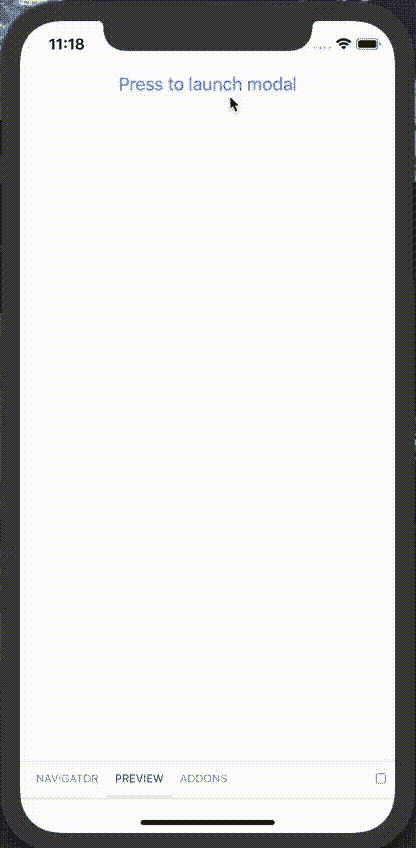

# React 本地组件库——让事物主题化

> 原文：<https://javascript.plainenglish.io/react-native-component-library-making-things-theme-able-82cfee4993ac?source=collection_archive---------5----------------------->

作为 React 原生组件库的一部分，我一直在构建一个遗留 React 原生应用程序，以使维护更容易，我一直在重构组件处理样式的方式。

最初的复杂组件有一个样式表来覆盖它包含的所有较小的组件，当我将这些较小的组件分解到组件库中时，我只是复制了这个样式表，并删除了该组件未使用的样式。

An example component with separate stylsheet

这种方法导致每个组件都有一个样式表，由于原始样式表从未重用过任何样式，因此它声明有许多重复的样式。

与我一起工作的团队表示，由于不同样式表的数量，最初的样式实现有点笨拙，他们更喜欢与他们习惯使用的 CSS 样式表类似的东西。

由于需要重构实现，我认为更好的方法是将代码库中的所有样式提取到一个对象中，该对象将使用组件库中的层次结构。

使用这种方法，位于`src/inputs/pokemonPicker/Cell`的组件需要一个名为`background`的样式对象，它将使用主题对象中的`inputs.pokemonPicker.Cell.background`属性。

这将允许我通过将公共值提取到主题中的其他样式定义中并更新组件以使用这些值来删除重复的样式。

# 访问组件中的主题

将所有组件样式移入一个对象的主要挑战之一是，如何使组件可以访问该对象，而不必将该属性传递给每个组件，然后再传递给其子组件。

使用 [React 上下文挂钩](https://reactjs.org/docs/context.html)可以很容易做到这一点，因为它允许您将组件包装在一个更高阶的组件(HOC)中，该组件将从上下文中获取主题，并将其作为道具传递给包装的组件。

Context Providing component and withTheme HOC

然后，将上下文提供组件添加到组件层次结构的顶部，并设置主题属性，主题 HOC 将把该属性传递给它所包装的组件。

一旦设置了上下文，就需要将主题属性添加到组件`propTypes`定义中。

您可以根据需要设置主题属性，或者如果您想提供一个默认值(这样您就不需要依赖于传递主题来进行测试)，您可以在`defaultProps`中设置主题。

然而，我在使用 defaultProps 方法时遇到的一个问题是，我在库中提供了一个围绕表单输入的通用主题，它从来没有接收过默认的主题属性，所以当我在组件中分解 Props 对象时，我必须为主题设置一个默认值。

Providing a default value to props de-structure or using defaultProps will allow a default theme to be used when the component isn’t wrapped by the withTheme HOC

# 主题的好处

从样式表转移到主题对象的最大好处是，现在每个组件的代码都更加清晰，而且主题对象遵循与组件库相同的层次结构，因此更容易看到样式背后的逻辑。

第二是改变主题的能力。

The dark mode override object made only 8 changes but the styles changes are drastic

为了展示主题允许对应用程序进行广泛的风格更改是多么容易，我创建了一个 override 对象，该对象将对现有主题应用“黑暗模式”,并使用`deepmerge`创建一个新主题。

Creating a ‘dark mode’ theme using deepmerge

由于主题只是一个 JavaScript 对象，这也为应用程序提供了从网络服务器下载不同主题的机会，并为应用程序提供基于季节或事件的风格变化。