# 反应本地组件(第 2 部分)

> 原文：<https://javascript.plainenglish.io/react-native-component-part-2-d69e8bac3c2c?source=collection_archive---------9----------------------->

核心组件→从 React 本地应用程序使用→因为这些是本地编译的。

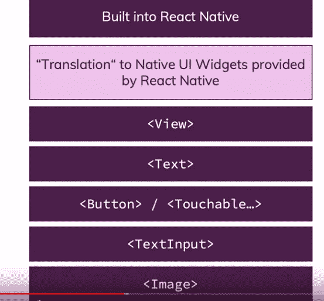

还有更多→但是大部分对于 app 来说已经足够好了。

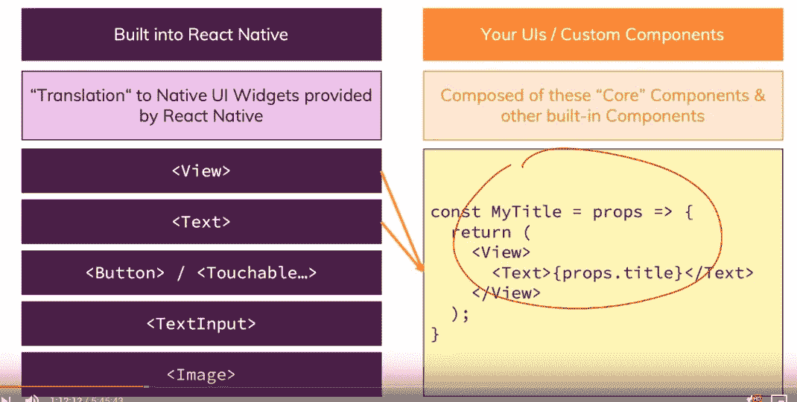

我可以创建自己的→但是构建块来自原生组件 CSS 不支持 React native 我们必须使用不同的东西。

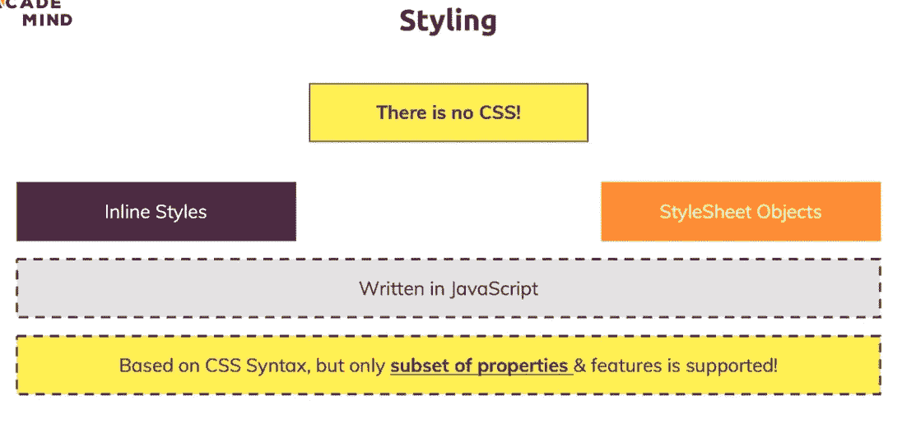

以 expo →选项为空白重新开始，现在可以创建一个新的应用程序。(app 的编译和使用是如此的简单)。(应用程序启动→开始的项目看起来不错→现在能够创建更详细的实现)。

创建一个我们可以保存目标的应用程序→超级酷和有趣。

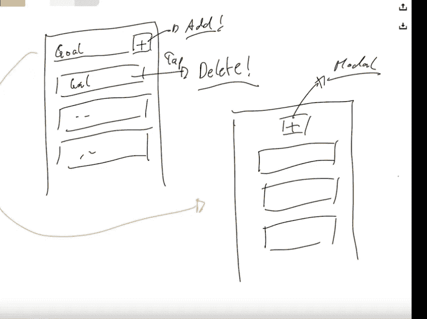

按钮等→文本列表等。(视图是 div，文本是单词→但是我们需要在视图之间给出文本)。

这很重要→这不是 web 开发。

我们可以在一个视图中看到另一个视图 LOL。

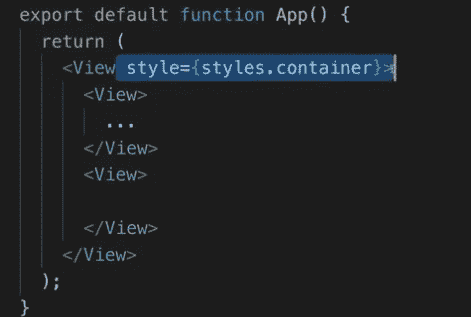

React 本地组件有自己的任务要执行。(导游会对 react-native 有很好的解释)。

我们可以有文本输入和按钮。

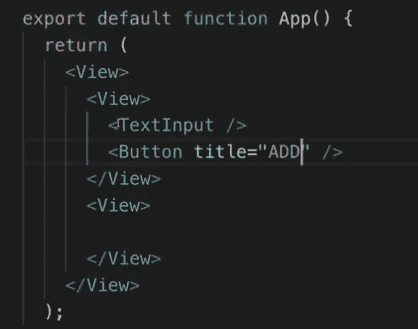

是时候设计应用程序了→我们可以有填充和一些其他的 CSS →这很好，也很有趣。(布局等)。

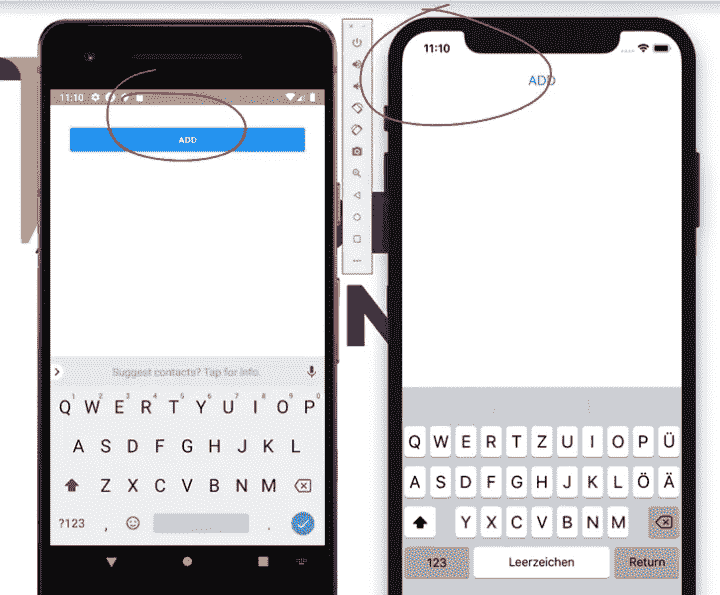

按钮上方有输入部分→很有意思。(这太酷了)。

占位符→我们要把文本放在文本输入里面。

我们必须在文档中使用属性名→这是一件好事，因为我们能够统一。

布局是应用程序开发的关键。

FlexBOX →是另一个关键组件。

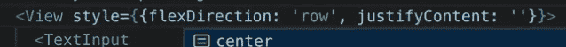

这种改变简单而有效。

对于应用程序开发来说，布局是关键的变化。

这些都不理想→不得不用 flexbox。

Flexbox →组织视点等等→这就是 Flexbox 正在做的事情。(如何制作儿童和成人元素)(这个概念在 HTML 中也有)。

有很多超参数需要添加→改变视图。

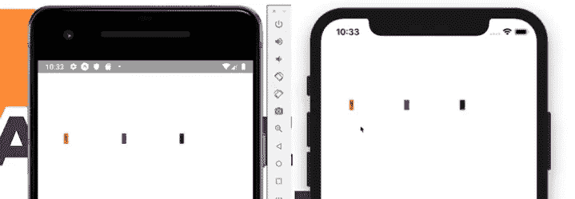

正如我们所看到的→上面的用户可以改变布局→所以看起来好像 react development 或多或少地改变了布局。

这很重要→但我对此不感兴趣→了解基础知识很好→但我们通常可以在编码业务逻辑时使用模板。

样式表→同样，这是→如何安排应用程序中的元素→前端部分。(我应该从不同的值自举)。

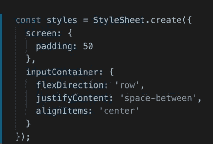

这些都是好的有趣的东西。

反应钩是必须学会的→这太性感了。

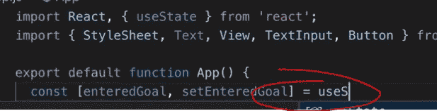

钩住状态→现在我们不再需要阶级→改变。

每个输入→改变变量。

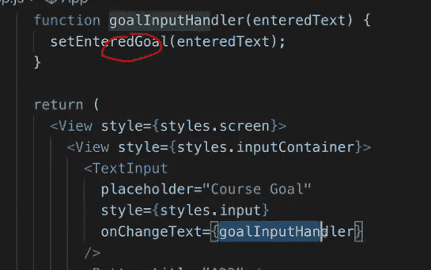

就是这样！→只要有变化，就运行代码。

绑定值→就大功告成了。(基本上→创建一个函数，开始把它们绑定成不同的东西)。

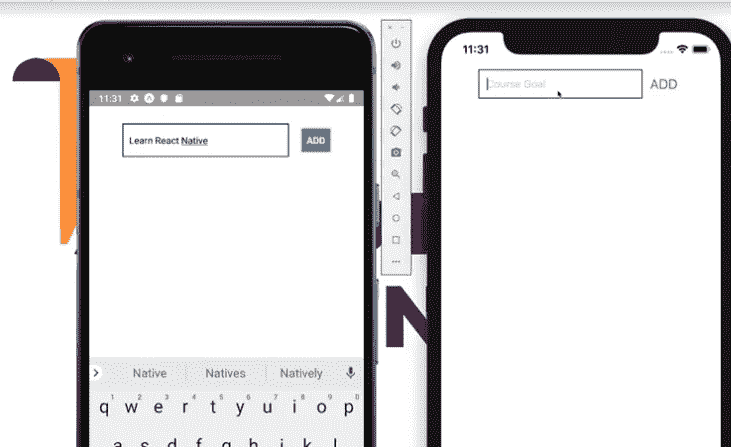

支持控制台日志！