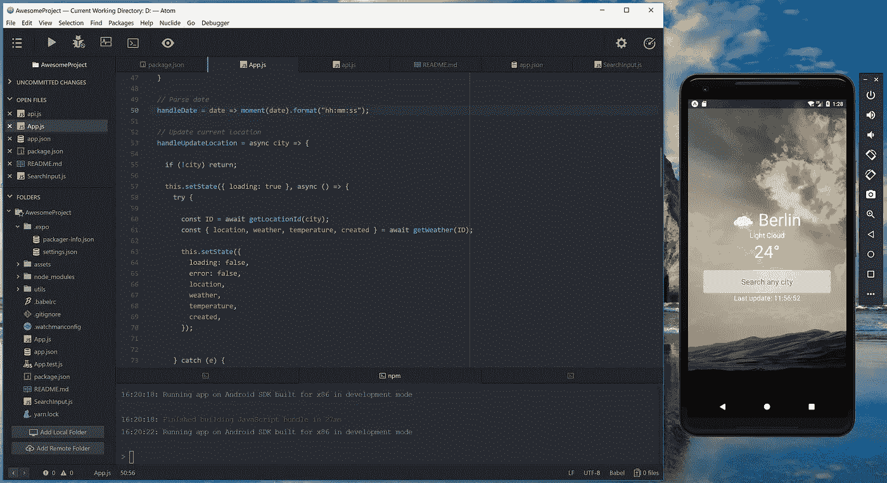
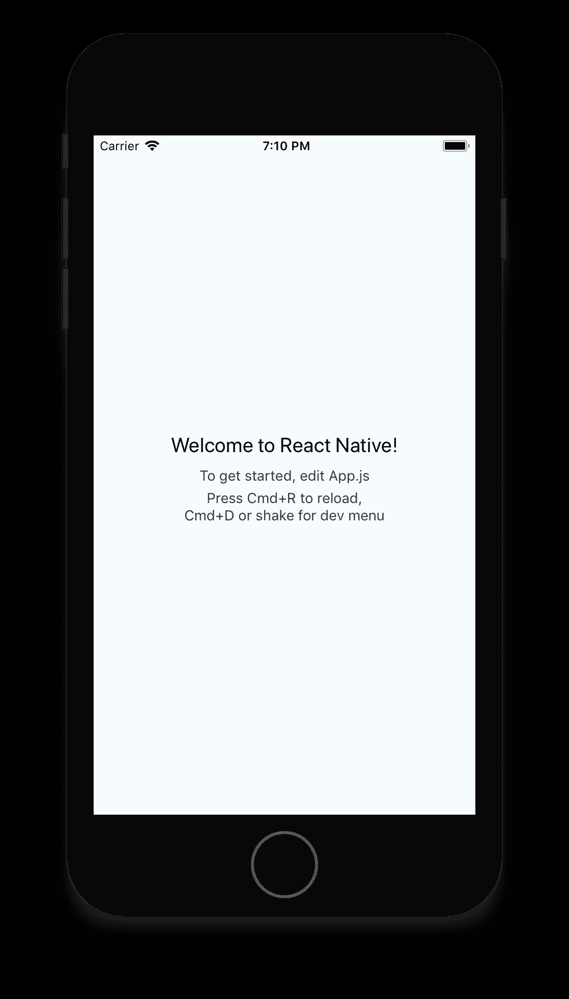
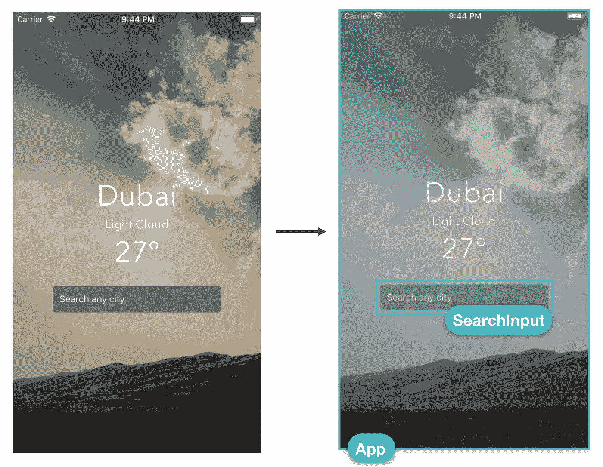

# 在 React Native 中创建简单的应用程序

> 原文：<https://javascript.plainenglish.io/react-native-creating-a-simple-application-298fa0637e72?source=collection_archive---------1----------------------->



# React Native 简介

通过 React Native，我们可以使用 JavaScript 和 React 为多个平台构建原生移动应用程序。

> 重要的是，我们可以构建的接口**被翻译成本地视图。**
> 
> React 原生应用不是由 WebViews 组成的。

我们将能够在 iOS 和 Android 之间共享我们编写的大量代码。React Native 使得在需要时编写特定于每个平台的代码变得容易。

我们开始使用一种语言( **JavaScript** )、一个框架( **React** )、一个样式引擎和一个工具链来为两个平台编写应用程序。

***学一次，写哪里。***

# 我们一开始做的是:



1.  创建一个`package.json`文件，并将其直接添加到我们的项目中

```
$ yarn init 
```

2.将特定的包安装到项目中，并将其作为依赖项包含在`package.json`中。

或者，您可以使用[工具，该工具使开始使用 React 原生项目变得非常容易](https://facebook.github.io/react-native/blog/2017/03/13/introducing-create-react-native-app):

```
$ yarn global add create-react-native-app$ create-react-native-app AwesomeProject$ cd AwesomeProject$ yarn start
```

[**package.json**](https://gist.github.com/rymaruk/cc7cc2d3a149507adf4116484131292a#file-package-json)

让我们仔细看看生成的`package.json`文件:

> **世博会**

Expo 是一个平台，它提供了许多不同的工具来构建全功能的 React 本地应用，而无需编写本地代码。

使用 Expo 客户端应用程序，我们无需使用原生工具(iOS 版 Xcode 或 Android 版 Android Studio)即可运行您的应用程序。

 [## 快速入门-博览会文件

### 使用 Expo 启动和运行升级 Expo 升级 Expo SDK 演练术语表配置使用…

docs.expo.io](https://docs.expo.io/versions/latest/) 

# 🌥️应用程序的源代码



我们有一个`**App**` 组件，它代表整个*屏幕*并包含显示给用户的天气信息。

在这个组件中，我们有一个`**SearchInput**` 组件，它允许我们搜索不同的城市。

当我们使用 **React Native** 时，我们将应用程序的不同部分表示为组件。这意味着我们可以使用不同的可重用逻辑块来构建我们的应用程序，每个逻辑块显示我们 UI 的一个特定部分。

# App.js —循序渐进:

让我们来看看实现的一般情况:

> **导入所需组件**

```
import **React** from '**react**'; // ReactJSimport {  
   **StyleSheet**,
   **View**,
   **ImageBackground**,  
   **Text**,  
   **KeyboardAvoidingView**,  
   **Platform**,  
   **ActivityIndicator**,  
   **StatusBar**,
} from '**react-native**';
```

*   样式表 — [样式表是一种类似于 CSS 样式表的抽象](https://facebook.github.io/react-native/docs/stylesheet)

```
const styles = **StyleSheet.create({**
  **container**: {
    flex: 1,
    backgroundColor: '#34495E',
  },
  **imageContainer**: {
    flex: 1,
  },
  **image**: {
    flex: 1,
    width: null,
    height: null,
    resizeMode: 'cover',
  },
  **detailsContainer**: {
    flex: 1,
    justifyContent: 'center',
    backgroundColor: 'rgba(0,0,0,0.2)',
    paddingHorizontal: 20,
  },
  **textStyle**: {
    textAlign: 'center',
    fontFamily: Platform.OS === 'ios' ? 'AvenirNext-Regular' : 'Roboto',
    color: 'white',
  },
  **largeText**: {
    fontSize: 44,
  },
  **smallText**: {
    fontSize: 18,
  },
});
```

*   **视图** — [构建 UI 最基本的组件，](https://facebook.github.io/react-native/docs/view.html#docsNav) `[View](https://facebook.github.io/react-native/docs/view.html#docsNav)` [是一个支持 flexbox 布局、样式、一些触摸处理和可访问性控件的容器](https://facebook.github.io/react-native/docs/view.html#docsNav)
*   **图片背景** — [熟悉 web 的开发者的一个常见功能需求是](https://facebook.github.io/react-native/docs/images#background-image-via-nesting) `[background-image](https://facebook.github.io/react-native/docs/images#background-image-via-nesting)`
*   **文本** — [用于显示文本的 React 组件。](https://facebook.github.io/react-native/docs/text.html#docsNav) `[Text](https://facebook.github.io/react-native/docs/text.html#docsNav)` [支持嵌套、样式和触摸处理](https://facebook.github.io/react-native/docs/text.html#docsNav)。
*   **keyboard avoiding view**—[这是一个组件，用于解决视图需要移出虚拟键盘的常见问题](https://facebook.github.io/react-native/docs/keyboardavoidingview#docsNav)
*   **平台** — [当构建一个跨平台的应用程序时，你会希望尽可能多地重用代码。可能会出现代码不同有意义的情况，例如，您可能希望为 ios 和 Android 实现单独的可视化组件。](https://facebook.github.io/react-native/docs/platform-specific-code#docsNav)
*   **活动指示器** — [显示圆形装载指示器](https://facebook.github.io/react-native/docs/activityindicator#docsNav)。
*   **状态栏** — [控制 app 状态栏的组件。](https://facebook.github.io/react-native/docs/statusbar.html#docsNav)

在`[**utils**](https://github.com/rymaruk/reactnative-weather/tree/master/utils)` [](https://github.com/rymaruk/reactnative-weather/tree/master/utils)目录中，我们在`[**api.js**](https://github.com/rymaruk/reactnative-weather/blob/master/utils/api.js)`中设置了两个独立的 API 调用:

*   `getLocationId` —基于搜索查询返回位置数组
*   `getWeather` —使用称为[的位置标识符返回关于特定位置的天气详情](https://developer.yahoo.com/geo/geoplanet/guide/concepts.html)

这两个调用的组合将允许我们搜索一个城市并检索其天气信息。

如果你有兴趣，可以随意打开文件看看这些方法是如何工作的。

```
import { **getLocationId**, **getWeather** } from '**./utils/api**';import **getImageForWeather** from '**./utils/getImageForWeather**';import **getIconForWeather** from '**./utils/getIconForWeather**';
```

*   `getImageForWeather`——[一份可能背景的清单](https://github.com/rymaruk/reactnative-weather/blob/master/utils/getImageForWeather.js)；
*   `getIconForWeather` — [可能图标的列表](https://github.com/rymaruk/reactnative-weather/blob/master/utils/getIconForWeather.js)；

```
import **moment** from '**moment**';
```

*   `**moment**` - [用 JavaScript 解析、验证、操作和显示日期和时间](https://momentjs.com/)

```
import **SearchInput** from './SearchInput';
```

**搜索输入**组件:

# **生命周期方法**

[](https://medium.com/@andrewrymaruk/react-js-lifecycle-methods-fafc98068a17) [## 反应 JS。生命周期方法

### React 组件封装了部分 UI。您的整个 React 应用程序 UI 呈现为一个由许多嵌套的…

medium.com](https://medium.com/@andrewrymaruk/react-js-lifecycle-methods-fafc98068a17) 

最常用的生命周期方法是允许我们在组件安装后`**componentDidMount()**`设置组件数据*。*

**该方法通常用于触发网络请求，以获取组件所需的数据。**

```
**componentDidMount()** {
   this.handleUpdateLocation('Kiev');
}
```

*   **源代码:**

[](https://github.com/rymaruk/reactnative-weather) [## 赖马鲁克/反应-天气

### GitHub 是人们构建软件的地方。超过 2800 万人使用 GitHub 来发现、分享和贡献超过…

github.com](https://github.com/rymaruk/reactnative-weather) 

> **我的学习建议**

[](https://medium.com/@andrewrymaruk/react-js-lifecycle-methods-fafc98068a17) [## 反应 JS。生命周期方法

### React 组件封装了部分 UI。您的整个 React 应用程序 UI 呈现为一个由许多嵌套的…

medium.com](https://medium.com/@andrewrymaruk/react-js-lifecycle-methods-fafc98068a17) [](https://medium.com/react-native-motion/transition-challenge-9bc9fdef56c7) [## React Native 中的动画过渡！

### 如何从带有几个项目的列表页面导航到一个项目的详细页面——用漂亮的动画！

medium.com](https://medium.com/react-native-motion/transition-challenge-9bc9fdef56c7) [](https://www.fullstackreact.com/react-native/) [## 全栈反应本机

### 最新的，深入的，完整的指南反应原生。使用 JavaScript 创建漂亮的移动应用程序并作出反应。

www.fullstackreact.com](https://www.fullstackreact.com/react-native/) [](https://github.com/fullstackreact) [## 全栈反应

### GitHub 是人们构建软件的地方。超过 2800 万人使用 GitHub 来发现、分享和贡献超过…

github.com](https://github.com/fullstackreact) [](https://reactdom.com/react-native) [## 学习 React Native:最佳 React Native 教程、课程和书籍 2018 - ReactDOM

### React Native 允许你只使用 JavaScript 就能构建移动应用。它基于 ReactJS。反应本地启用…

reactdom.com](https://reactdom.com/react-native) [](https://medium.com/devschacht/create-devschacht-app-part-1-db9570cf3f9b) [## пишемеервоеприложениена反应本土。Часть 1.

### сообщество对растёт、завоёвывает преданных читателей.В свою очередь последние всегда…

medium.com](https://medium.com/devschacht/create-devschacht-app-part-1-db9570cf3f9b) [](https://codeburst.io/build-simple-medium-com-on-node-js-and-react-js-a278c5192f47) [## 在 Node.js 和 React.js 上构建简单的 Medium.com

### TL；DR:在这篇文章中，我们将使用这些技术来构建一个 Medium.com 克隆体:

codeburst.io](https://codeburst.io/build-simple-medium-com-on-node-js-and-react-js-a278c5192f47) [](https://blog.cloudboost.io/getting-started-with-react-native-and-redux-6cd4addeb29) [## React Native 和 Redux 入门

### 最近，我开始使用 React Native 来创建 iOS 和 Android 应用程序，我必须承认这是一个…

blog.cloudboost.io](https://blog.cloudboost.io/getting-started-with-react-native-and-redux-6cd4addeb29)  [## 组件和 API 本机反应

### React Native 提供了许多内置组件。你会在侧边栏上找到组件和 API 的完整列表…

facebook.github.io](https://facebook.github.io/react-native/docs/components-and-apis)