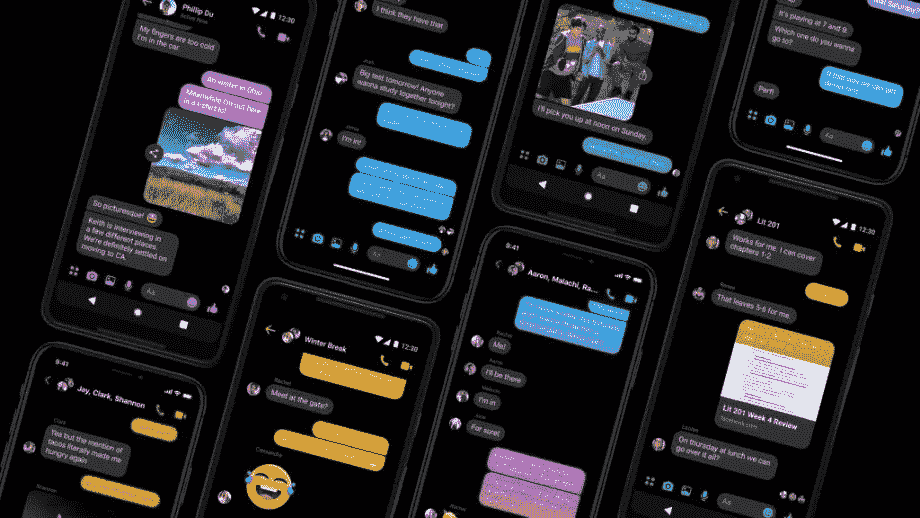

# 反应自然黑暗模式和主题

> 原文：<https://javascript.plainenglish.io/react-native-dark-mode-and-theming-dc299bec206d?source=collection_archive---------0----------------------->

iOS 中新的黑暗模式让我兴奋不已。我可以使用所有我喜欢的应用程序，但现在它们都变暗了😎。好吧，没那么令人兴奋，但我认为对许多人来说，只是演示文稿的变化就令人耳目一新。



我不得不立即对我们工作中的应用程序进行一些修改，我也开始思考如何将这一特性推广到我自己的应用程序中。自然地，当谈到颜色(或色彩)时，它们都遵循相似的模式🙄)和主题化。

我将讲述我提出的主题化和黑暗模式的方法和设置，以及如何调整它，使用户在你的应用程序中定制他们的体验更加多样化。

# 当前设置

目前，我们将颜色和主题集中在一个地方。为了这篇文章，我将只讨论颜色，但是当然主题化可以并且可能应该包含`spacing`、`font`、`icon` …任何你想要在你的应用程序中保持一定一致性的东西。

```
/src
-- /theme/index.js
```

在根处，我们有我们的`theme`。这是我们存储颜色的地方(以及你想在应用范围内使用的所有东西)。这是一个例子。

```
// theme/index.jsconst palette = {
  palette01: '#000000',
  palette02: 'rgba(255,255,255,1)',
}export const colors = {
  paragraphText: palette.palette01,
  buttonPrimaryBg: palette.palette02,
  headingText: palette.palette01,
}
```

*为什么要拆分调色板和颜色？*好问题。这样，我们就可以通过使用案例在更精细的层次上定义颜色，并从调色板中重复使用。这确保了我们不会产生 50 种灰度😏。当然，我们最终会在所有颜色中重复使用调色板，但这实际上并不重要，这也是重点。这也意味着在主题化的时候，我们可以单独改变调色板或者颜色(或者两者都改变，如果我们愿意的话)。

只是一个简单的例子来说明它们是如何被清晰地使用的；

```
// ButtonPrimary/index.js...import { colors } from 'theme'const ButtonPrimary = ({ onPress, children }) => (
  <TouchableOpacity onPress={onPress} style={styles}>
    {children}
  </TouchableOpacity>
)const styles = {
  backgroundColor: colors.buttonPrimaryBg,
}export default ButtonPrimary
```

这里没有什么令人兴奋的事情发生，但是我们确实把主题从组件本身中分离出来了。很好的开始。

# 黑暗模式

黑暗模式是这篇短文的主题，是 iOS 独有的，但也有其他主题/UI 影响 Android 的设置，如夜间模式。我想这在未来会变得更加普遍，不管用户对*设备*的偏好如何，这种相同的想法都可以用来改变用户的内部设置。

如果你像我一样正在使用 [Expo](https://docs.expo.io/versions/latest/) (我真的很喜欢它…但是下次会有更多关于它的内容)，那么你可以使用`[react-native-appearance](https://www.npmjs.com/package/react-native-appearance)`来倾听用户的设备偏好。这目前仅适用于 iOS，不考虑 Android，但根据这里的文档；

> `Appearance` API 可能会在`react-native@>=0.61`发布

所以这应该为我们将来的使用做好准备。如果你没有使用 Expo，还有其他的模块，比如`[react-native-dark-mode](https://www.npmjs.com/package/react-native-dark-mode)`也采用了类似的方法。

`react-native-appearance`为我们提供了几种处理用户偏好的方法，但对我来说最直接和实用的似乎是[挂钩](https://www.npmjs.com/package/react-native-appearance#usage)。

*我不打算深入研究如何使用钩子，但是我推荐你* [*花点时间阅读一下它们*](https://reactjs.org/docs/hooks-intro.html) *。他们太棒了。*

这里是正在使用的`react-native-appearance`钩子，直接取出文档；

```
...import { useColorScheme } from 'react-native-appearance'function MyComponent() { let colorScheme **=** useColorScheme() **if** (colorScheme **===** 'dark') { *// render some dark thing* } **else** { *// render some light thing* }}
```

因此，如果我们以之前的例子为例，我们可以这样做:

```
// ButtonPrimary/index.jsimport { useColorScheme } from 'react-native-appearance'
import { colors } from 'theme'const ButtonPrimary = ({ onPress, children }) => { 
const colorScheme = useColorScheme()
  return (
    <TouchableOpacity 
      onPress={onPress} 
      style={{ 
        backgroundColor: colorScheme === 'dark' 
          ? colors.buttonPrimaryBgDark 
          : colors.buttonPrimaryBg 
      }}
    >
      {children}
    </TouchableOpacity>
  )export default ButtonPrimary
```

我的意思是……会有用的。但是它的可读性不是很好，所有关于选择颜色的逻辑现在都在我们的组件和我们可能想要影响的其他组件中，这些组件可能是最具代表性的组件。

所以不实用。但是很容易解决。

我将创建我自己的挂钩，它将使用和`useColorScheme`挂钩，并返回我的*主题*颜色。如果我需要的话，它还可以返回配色方案。这将意味着对我之前写的`colors`对象做一些改动，但不会太大。先看那个；

```
// theme/index.jsconst palette = {
  palette01: '#000000',
  palette02: 'rgba(255,255,255,1)',
}export const colors = {
  paragraphText: palette.palette01,
  buttonPrimaryBg: palette.palette02,
  headingText: palette.palette01,
}export const themedColors = {
  default: {
    ...colors,
  },
  light: {
    ...colors,
  },
  dark: {
    ...colors,
    buttonPrimaryBg: palette.palette01,
    paragraphText: palette.palette02,
  },
}
```

同样，这里没有什么太令人兴奋的事情发生——只是添加了一个新的对象`themedColors`这是我们将进行主题化的地方。`light`和`default`此刻正在做同样的事情，简单地在原始颜色集中展开，但是`dark`现在用一个特定主题集覆盖了一些原始颜色(注意`dark`和`light`的颜色现在是如何反转的)。

现在轮到钩子了。

```
// theme/hooks.jsimport { useColorScheme } from 'react-native-appearance'import { themedColors } from '.'export const useTheme = () => {
  const theme = useColorScheme() const colors = theme ? themedColors[theme] : themedColors.default return {
    colors,
    theme,
  }
}
```

我们从我们的定制挂钩返回颜色和主题。`colors`将被分配给用户偏好的主题(如果可用)，如果没有选择或定义，则返回到`default`。

这个钩子的用法变得与我们最初的`ButtonPrimary`实现惊人地相似。

```
// ButtonPrimary/index.js...import { useTheme } from 'theme/hooks'const ButtonPrimary = ({ onPress, children }) => {
  const { colors } = useTheme()
  return (
    <TouchableOpacity 
      onPress={onPress} 
      style={{ 
        backgroundColor: colors.buttonPrimaryBg 
      }}
    >
      {children}
    </TouchableOpacity>
  )
}export default ButtonPrimary
```

我们需要做的就是导入定制的挂钩，并从那里解构颜色，而不是直接从我们的主题🎉

对于整个应用程序的大规模部署，这是可扩展和可管理的。

# 不利方面

总是有一个…我们不得不写我们的颜色风格，这有点令人失望。如果你需要的话，你仍然可以扩展你的其他风格，但是这会让它变得稍微有点混乱。在我看来，这是一个很好的权衡主题风格。

# 扩展示例

这只是显示了如何使用用户设备设置，它只限于 iOS。您可以相对容易地扩展挂钩以包含来自用户的设置，这意味着用户可以决定他们的应用内设置来覆盖设备设置。