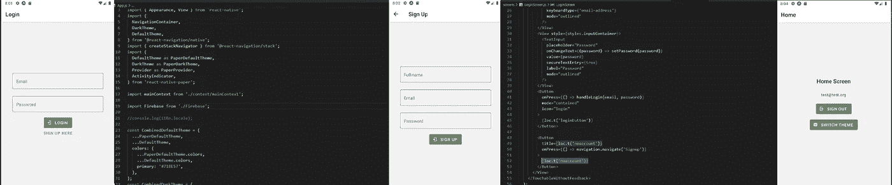
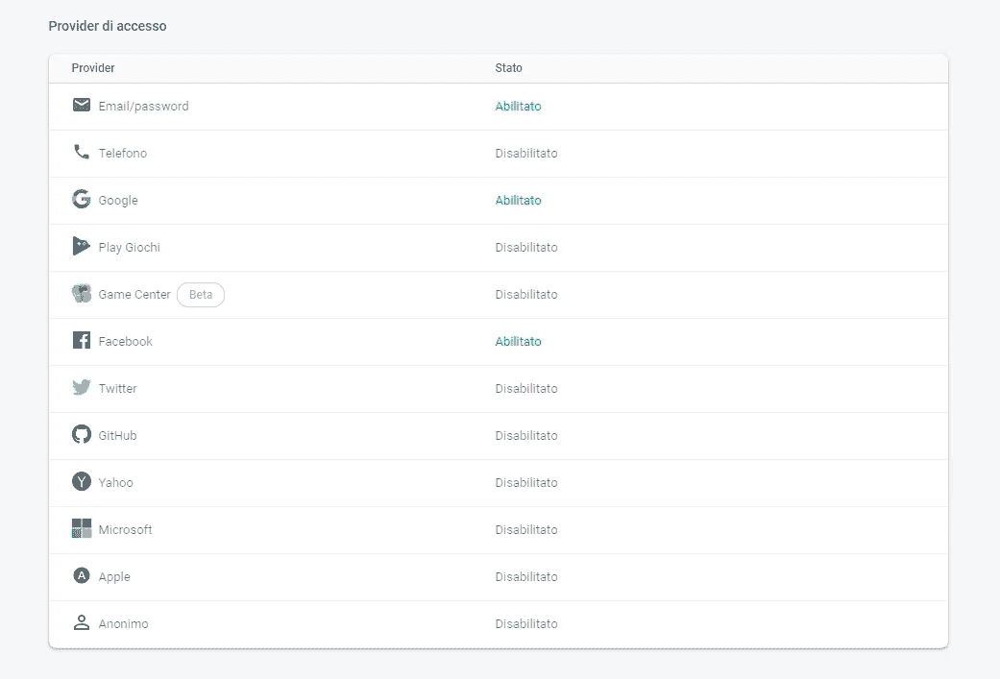
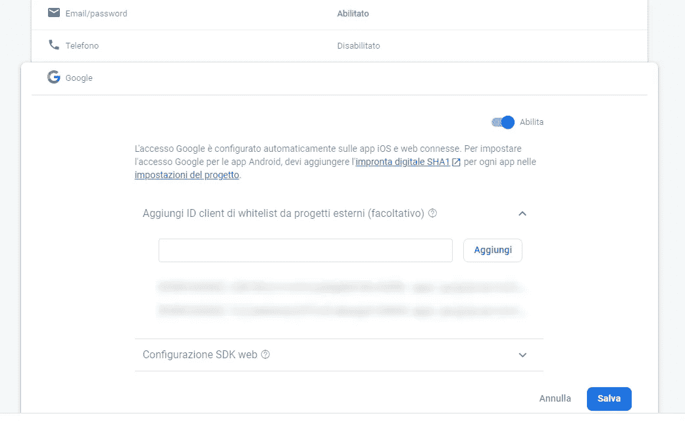
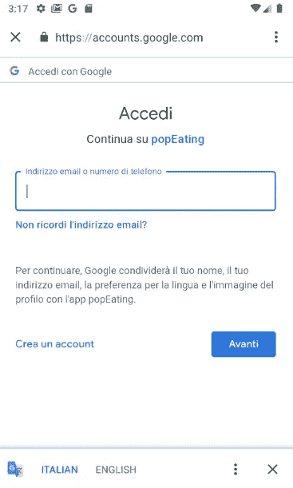

# React Native:如何在 Expo 项目中添加 Firebase Google 认证

> 原文：<https://javascript.plainenglish.io/react-native-firebase-adding-google-authenticaton-in-an-expo-project-2-ed20cb440732?source=collection_archive---------1----------------------->



**请注意**:这篇文章是我上一篇文章的扩展，所以这里显示的代码只是这个功能的一部分，如果你想从头开始，你可以从这个 URL 开始阅读:

[](/react-native-firebase-email-authenticaton-in-an-expo-project-2e413e9a4890) [## React Native:世博项目中的 Firebase 电子邮件认证

### 在我学习 React Native 应用程序开发的旅程中，我决定尝试制作一个小型的包含应用程序，它将…

javascript.plainenglish.io](/react-native-firebase-email-authenticaton-in-an-expo-project-2e413e9a4890) 

继我之前使用 Firebase 和电子邮件/密码认证([见我之前的故事](https://medium.com/react-native-playground/react-native-firebase-email-authenticaton-in-an-expo-project-2e413e9a4890))开发一个基本登录应用程序的成功尝试之后，我决定开始附加到这个基本系统，更多的登录提供商，因为 Firebase 与他们中的许多人很好地集成，我决定从谷歌登录开始。

Expo 提供了两个 Google sign in API:Google sign in(【https://docs.expo.io/versions/latest/sdk/google-sign-in/】)看起来更容易实现，但不幸的是只能用在独立的应用程序中——这意味着你每次都需要构建你的应用程序进行测试——和 Google()在 Expo 应用程序中工作(在我看来也是独立的),它缺乏关于 Firebase 集成的文档，需要更多的调整才能让它按预期工作。由于目前我将呆在世博会内，我选择了第二个。

# 这个应用程序如何工作

这个应用程序将扩展我以前的一个([https://medium . com/react-native-playground/react-native-firebase-email-authenticaton-in-an-Expo-project-2e 413 e9 a 4890](https://medium.com/react-native-playground/react-native-firebase-email-authenticaton-in-an-expo-project-2e413e9a4890))添加一个*登录谷歌*按钮，一旦点击该按钮，用户通过谷歌认证，认证密钥将发送到 Firebase，以在 Firebase 上创建/认证用户。一旦在 Firebase 上通过身份验证，用户就会被导航到一个“登录屏幕”。

# 先决条件

在开始之前，您需要一个带有电子邮件/密码登录方法和(至少)Google 签名方法的认证工作流的工作 Firebase 项目



Enable Google Provider in Firebase Authentication

您还需要在 Google 开发者控制台中创建 OAuth 2.0 客户端 ID(本指南遵循 Expo Google API 文档([https://docs.expo.io/versions/latest/sdk/google/](https://docs.expo.io/versions/latest/sdk/google/)部分“在 Expo 应用程序中使用它”):

*   前往谷歌开发者控制台凭证(【https://console.developers.google.com/apis/credentials】T2)，如果需要，创建一个新的应用程序
*   单击“创建凭据”，然后单击“OAuth 客户端 ID”并遵循程序
*   创建 IOS OAuth 客户端 id 和 Android OAuth 客户端 ID
*   对于 IOS，唯一需要的信息是“捆绑包标识符”，将其设置为

```
host.exp.exponent
```

*   对于 Android，将“包名”设置为:

```
host.exp.exponent
```

*   还生成一个指纹，在终端运行以下命令

```
openssl rand -base64 32 | openssl sha1 -c
```

*   将上述命令的输出粘贴到“签名证书指纹”中
*   在这两种情况下，一旦您单击 create，您将收到一个客户端 ID，请记下它，它将用于应用程序配置和 Firebase

一旦你有了 Android 和 IOS 的客户端 ID，它们就可以被添加到 app.json 的额外部分

```
"extra": {"IOS_KEY": "<generated_client_id>","ANDROID_KEY": "<generated_client_id>",...
}
```

为了让 Firebase 与您的应用程序正常工作，请将这些客户端 ID 添加到 Firebase 中 Google 配置的外部客户端 ID 白名单中



Add both client id to whitelist

请记住，这种配置将只在 Expo 的开发过程中工作，当构建一个独立的应用程序时，您需要做一些调整(稍后将详细介绍)

在我们的应用程序中，我们安装了谷歌依赖项

```
expo install expo-google-app-auth
```

我们假设您已经安装了 Firebase 依赖项和所有其他需要的库(导航、react-native-paper 等等)，如果没有，请参考我之前的指南= >[**https://medium . com/react-native-playground/react-native-Firebase-email-authenticaton-in-an-Expo-project-2e 413 e9 a 4890**](https://medium.com/react-native-playground/react-native-firebase-email-authenticaton-in-an-expo-project-2e413e9a4890)

一切配置妥当后，我们就可以开始为登录编写 Google 扩展了。

# App.js

在 App.js 中，我们开始添加所需的导入:

```
import Constants from 'expo-constants'; //So we can read app.json extra
import * as Google from 'expo-google-app-auth'; //google auth libraries
import firebase from 'firebase'; //basic firebase
import Firebase from './Firebase'; //This is the initialized Firebase, you can find it in my GitHub
```

然后我们添加一个函数来登录 Google，只是一个基本的 Google 登录和一个后续的 Firebase 登录

此登录功能导出到上下文中的其他组件:

我们现在可以在中使用新的登录系统了

# LoginScreen.js

在 LoginScreen.js 中，我们从上下文中“导入”登录函数

```
const { handleGLogin } = useContext(mainContext);
```

然后我们创建一个按钮来登录谷歌

```
<Button 
 style={{ backgroundColor: '#4285F4', marginTop: 20 }}
 onPress={() => handleGLogin()}
 mode="contained"
 icon="google"
>
Login with Google
</Button>
```

在这一点上，应用程序应该显示与谷歌按钮登录，如果一切都正确设置按钮应该让用户登录，并添加到 Firebase 的谷歌用户，如果不存在。



# 土豆太郎

目前，所有的错误信息都没有得到处理

# 上线

当应用程序在 Expo 中正确运行时，无需代码重构即可创建独立版本，只需在应用程序和 Google develper 控制台中添加一些信息:

## 适用于 Android

*   在`app.json`中添加正确的`package.name`(例如 com.mycompany.myapp)
*   从您的项目构建一个 apk
*   用`expo fetch:android:hashes`创建谷歌证书指纹并复制
*   转到[谷歌开发者证书](https://console.developers.google.com/apis/credentials)
*   单击 Create credentials，然后单击 API Key，最后在弹出的模式中单击 RESTRICT KEY。
*   点击键限制下的 Android apps 单选按钮，然后点击+添加包名和指纹。
*   救援
*   单击创建凭据，然后单击 OAuth 客户端 ID，然后选择 Android 单选按钮。
*   用与上面相同的数据填充签名证书指纹字段和包名称字段
*   转到[谷歌开发者证书](https://console.developers.google.com/apis/credentials)并找到你的 API 密匙。
*   打开`app.json`并将你的谷歌 API 密钥添加到`android.config.googleSignIn.apiKey`
*   从上面取`Google Certificate Hash`，添加到`android.config.googleSignIn.certificateHash`下的`app.json`
*   当您使用`Google.logInAsync(..)`时，传入 OAuth 客户端 ID 作为`androidStandaloneAppClientId`选项

```
const result = await Google.logInAsync({ //CHANGE (or add) standalone keys hereiosStandaloneAppClientId: Constants.manifest.extra.IOS_STANDALONE_KEY,androidStandaloneAppClientId: Constants.manifest.extra.ANDROID_STANDALONE_KEY,});
```

*   还要将 OAuth 客户机 ID 添加到 Firebase 中 Google 配置的外部客户机的白名单中

## 适用于 IOS

*   如果你还没有`bundleIdentifier`的话，给你的`app.json`加一个。
*   打开浏览器进入[谷歌开发者证书](https://console.developers.google.com/apis/credentials)
*   单击创建凭据，然后单击 OAuth 客户端 ID，然后选择 IOS。
*   在 Bundle ID 字段中输入您的`bundleIdentifier`,然后点击 Create。
*   将给定的 IOS URL 方案添加到您的`app.json`中的`ios.config.googleSignIn.reservedClientId`下。
*   在使用`Google.logInAsync`的地方，提供 OAuth 客户端 ID 作为`iosStandaloneAppClientId`选项(*见上面的*)。

## 结论

现在您可以重新构建应用程序了！

这个项目需要帮助吗？在 https://github.com/popeating/FirebaseLogin 下载完整的项目

在 lennaz@gmail.com 联系我