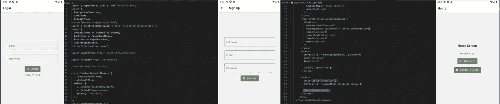
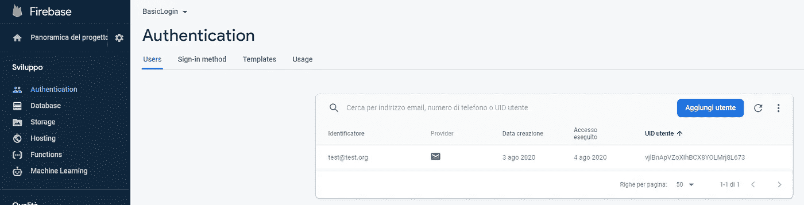

# react Native:Expo 项目中的 Firebase 电子邮件认证

> 原文：<https://javascript.plainenglish.io/react-native-firebase-email-authenticaton-in-an-expo-project-2e413e9a4890?source=collection_archive---------2----------------------->



***更新*** :一旦你完成了这些，请阅读我的“扩展”教程，学习如何在 Expo 项目中添加 Google 登录到 Firebase =>

[](https://popeating.medium.com/react-native-firebase-adding-google-authenticaton-in-an-expo-project-2-ed20cb440732) [## React Native: Firebase 在 Expo 项目中添加谷歌认证(#2)

### 请注意:这篇文章是我上一篇文章的扩展，所以这里显示的代码只是部分的…

popeating.medium.com](https://popeating.medium.com/react-native-firebase-adding-google-authenticaton-in-an-expo-project-2-ed20cb440732) 

在我学习 React Native 应用程序开发的过程中，我决定尝试制作一个小型的包含应用程序，它将服务于一个独特的任务，一个自包含的登录系统，使用 Firebase Auth，使用(目前)电子邮件/密码登录方法。

即使这款应用只是一个框架，我也试图让它在界面/可用性方面尽可能完整，在界面上使用 react-native-paper 组件，如果支持的话启用黑暗主题，添加翻译和其他小改动。我试图用现代的方式编码，所以我利用了上下文和状态挂钩，当然，这段代码并不完美，我会继续在 https://github.com/popeating/FirebaseLogin 的 GitHub [上更新它。](https://github.com/popeating/FirebaseLogin)

# 这个应用程序如何工作

基本上，该应用程序由两个导航堆栈中的 3 个屏幕组成。一个堆栈保存登录和注册(尚未实现)屏幕，一个堆栈保存登录用户的主屏幕。应用程序启动时，*正在加载*状态为活动状态，并且*用户将*状态记录为假；它将显示一个页面加载器，在此期间，我们将使用 useEffect 检查 Firebase 用户状态:

```
Firebase.auth().onAuthStateChanged((user) => {…})
```

如果它改变并返回一个用户，那么我们根据用户对象的存在将 *isLoading* 设置为 false，将 *userLogged* 设置为 true 或 false。这两个值的组合允许我们显示正确的堆栈。
如果用户登录，堆栈显示主屏幕(实际上只有一个退出按钮和一个切换主题的按钮)，如果用户没有登录，它显示登录屏幕，还有一个注册屏幕的链接。
我构建这个项目是为了将来在需要用户登录的更大的应用程序中实现。这个应用程序也没有错误凭证的错误消息和其他容易实现的东西(代码被注释)

# 先决条件

在开始编码之前，我在 Firebase([https://console.firebase.google.com/](https://console.firebase.google.com/))上创建了一个新项目，并添加了认证服务，我选择了电子邮件/密码作为登录方式，我还创建了一个测试用户:



然后我从项目设置中复制了 Firebase 配置(左上角的齿轮图标)


我在世博会开始了一个新项目:

```
expo init FirebaseLogin
```

并且我安装了一些我计划使用的模块(这个项目只需要 firebase、navigation 和 Constants，但是我也安装了 localization 和 react-native-paper)

```
expo install firebase
npm install react-native-paper
expo install expo-localization
npm install i18n-js
expo install expo-constants
npm install @react-navigation/native
//navigation dependencies
expo install react-native-gesture-handler react-native-reanimated react-native-screens react-native-safe-area-context @react-native-community/masked-view
```

配置 app.json 以包含 Firebase conf

一旦 app.json 包含了 Firebase 配置，就可以导入到其他文件中；例如，我们在项目的根目录下创建一个文件，在那里我们根据配置初始化 Firebase 应用程序，然后我们可以在其他屏幕和组件中导入这个初始化

由于我们将使用上下文(为了使函数和对象可用于多个组件，我们创建了一个可用于以后导入的上下文，它将被称为 mainContext，并将被用作周围的提供者:

# App.js

这将是我们的应用程序的切入点，让我们开始导入一些东西，没有什么花哨的只是所需的模块，和一些定义

接下来，仍然在 App.js 中，我们可以继续构建应用程序

此时，应用程序不会运行，因为我们仍然缺少屏幕，让我们添加它们

# HomeScreen.js

这是用户登录后将看到的屏幕，它非常简单，只有一个带有退出按钮和切换主题按钮的空白页面；两个 onPress 动作都激活了一个函数，该函数通过上下文
对屏幕可用。当前用户来自*firebase . auth()*̶i̶t̶̶c̶a̶n̶̶a̶l̶s̶o̶̶b̶e̶̶r̶e̶a̶d̶̶f̶r̶o̶m̶̶c̶o̶n̶t̶e̶x̶t̶，我坚持使用它，因为用户并不总是出现在上下文中(我认为这是因为一切都是异步的)


This is how the Home looks like

# LoginScreen.js

这里也没有什么奇特的，一个简单的表单，接受电子邮件和密码(更新和管理，但钩状态)，执行一个功能“抓取”从上下文，它还包含一个链接导航到注册屏幕


# SignUpScreen.js

注册屏幕只需使用 Firebase API 创建一个新用户，并在创建时登录该用户


# 其他有用的东西

我添加了几个我总是很难实现的细节，以方便使用。
例如，包含键盘的屏幕被括在

```
<TouchableWithoutFeedback onPress={() => Keyboard.dismiss()}>//CODE</TouchableWithoutFeedback>
```

因此，如果您在文本输入之外单击，键盘将会关闭

## 翻译

为了让翻译工作，我使用了以下“框架”:

*   创建一个本地化实用程序，如下所示:

```
//utils/localization.js
import * as Localization from 'expo-localization';
import loc from 'i18n-js';//Get the device language
loc.locale = Localization.locale; //Create as many translation you need
import en from '../locale/en';
import it from '../locale/it'; loc.fallbacks = true;
loc.translations = { it,  en,}; export default loc;
```

*   创建本地化字典

```
//locale/en.js
export default {
 mappa: 'Map'
 clickme: 'Click me',
 home: 'Home',
 notifiche: 'Notifications',
 entra: 'Login',
 loginButton: 'Login',
 signupButton: 'Sign Up',
 noaccount: 'Sign up here',
 signup: 'Sign Up',
 nome: 'Full name',
 signout: 'Sign out',
 theme: 'Switch theme',
};
```

*   在组件中使用本地化字符串

```
//Component.js
import loc from '../utils/localization';...<Text>{loc.t('clickme')}</Text>
```

# 待办事项

如果登录凭证错误或其他类型的错误，登录页面不会显示错误，登录仅在手机在线时有效(当然),但不检查互联网是否可用，代码肯定会得到优化

# 需要帮助吗？

这个项目需要帮助吗？在 https://github.com/popeating/FirebaseLogin[下载完整的项目](https://github.com/popeating/FirebaseLogin)

在 lennaz@gmail.com 联系我