# react Native—Spotify 的完整认证流程

> 原文：<https://javascript.plainenglish.io/react-native-full-authentication-flow-with-spotify-bc0a5b895696?source=collection_archive---------1----------------------->

React Native 中的身份验证可能是一次地狱之旅。让我们尝试构建一个 React 原生应用程序，并使用 Spotify 作为身份验证提供者。

*我的目标是基于 Spotify API 开发一款应用。第一个挑战是建立一个认证流程，允许 Spotify 用户登录我的应用程序。*


# 第 1 部分:OAuth——它是如何工作的？

> *[*OAuth 2.0 是行业标准的授权协议。*](https://oauth.net/2/)*

**如果您不熟悉 oAuth，我建议您阅读本文档。它会给你一个主要概念的清晰概述。**

*重要的是要知道 oAuth 支持几个认证流:*

*   *[客户凭证流程](https://auth0.com/docs/flows/concepts/client-credentials)*
*   *[授权代码流程](https://auth0.com/docs/flows/concepts/auth-code)*
*   *[资源所有者密码凭证授予](https://auth0.com/docs/api-auth/grant/password)*

*我们设置中最常见的流程是授权代码流程:*

*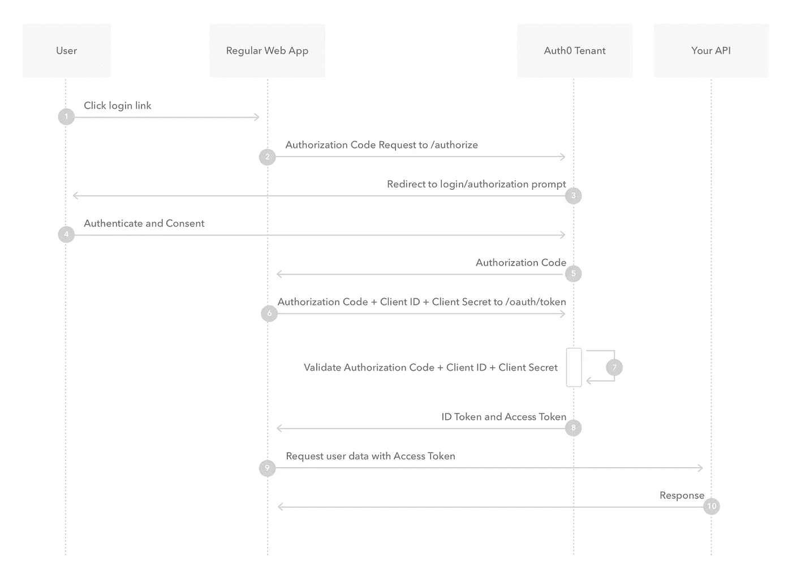*

## *Spotify 授权流程*

*我们将使用 Spotify 作为 oAuth 提供商。所以我们来看看他们的授权流程。*

*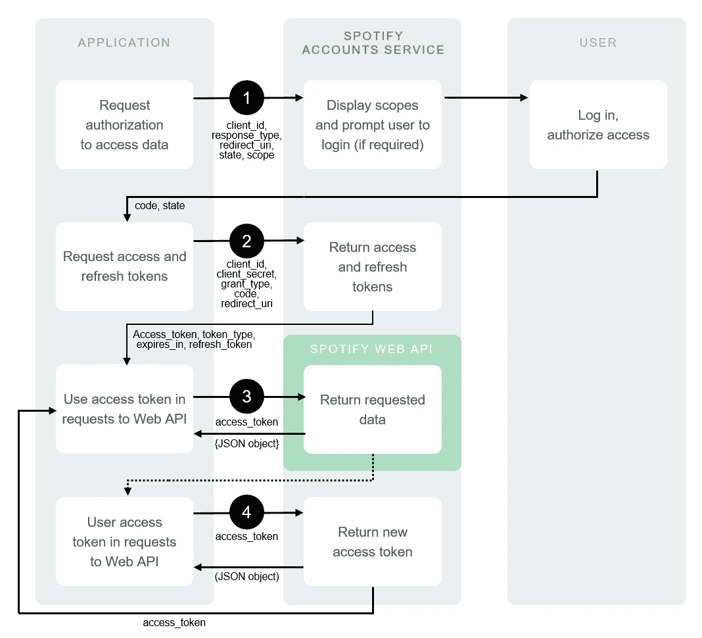*

*Spotify authorization flow*

*因此，让我们浏览一下该模式，并尝试理解将会发生什么:*

*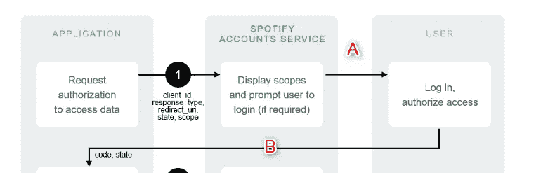*

*Spotify authorization flow — part 1*

*我们的客户端应用程序将要求用户通过我们的 oAuth 提供者登录。Spotify 登录页面将显示一些关于我们的应用程序需要的授权范围的附加信息。用户登录并批准授权范围。 **(A)**
他将被重定向到我们的客户端应用程序的预定义 URL 以及 Spotify 提供的代码。这个代码的意思是:用户同意登录您的应用程序。 **(B)***

*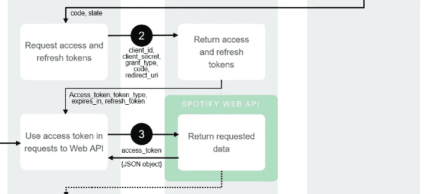*

***2** 现在，Spotify 知道用户想要验证你的应用程序。但是 Spotify 并不能 100%确定这个应用就是你的应用。
所以在你拥有代码的情况下，你不能以用户的名义执行 API 调用。
您需要询问访问令牌和刷新令牌。在这一步中，您借助*客户端密码向 Spotify 证明您是的所有者。* 我之前提到过，但是客户端秘密必须保密。这就是为什么我们需要我们的后端 API，因为这是一个安全的地方来存储我们的秘密。
我们对我们的后端执行一个调用，包括我们刚刚从 Spotify 收到的代码。我们的后端将作为一个*代理*使用这段代码并注入我们的应用程序的客户端秘密来执行对 Spotify 的新调用，请求访问令牌和刷新令牌。我们返回访问令牌和刷新令牌。从现在起，我们可以以用户的名义进行呼叫。*

***3** 访问令牌有一个有限的生存时间。使用刷新令牌，我们可以向 Spotify 索要新的访问令牌。*

*你可以在这里了解更多:
[https://developer . Spotify . com/documentation/general/guides/authorization-guide/# authorization-code-flow](https://developer.spotify.com/documentation/general/guides/authorization-guide/#authorization-code-flow)*

# *第 2 部分:为我们的应用程序设置基础*

**您需要 Node.js 才能继续下面的步骤。* [https://nodejs.org/en/](https://nodejs.org/en/)*

## *为 Android 上的 React Native 做准备*

*遵循“React Native CLI 快速入门”下的官方文档中的步骤。向下滚动到“Android 开发环境”，安装 Android Studio。*

***[](https://reactnative.dev/docs/environment-setup) [## 设置开发环境

### 该页面将帮助您安装和构建您的第一个 React 本机应用程序。如果您是移动开发的新手，那么…

反应性发展](https://reactnative.dev/docs/environment-setup) 

注意:我们将在 Android 上测试我们的应用程序。

# 注册 Spotify 应用程序

在[https://developer.spotify.com/](https://developer.spotify.com/)上创建一个账户

在您的控制面板中，您会发现一个创建新客户端 id 的按钮。

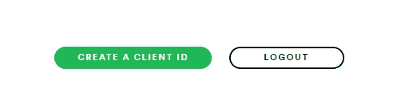

完成所有步骤后，您将看到以下屏幕:

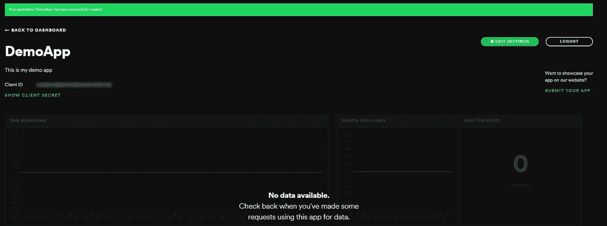

在此页面上，您可以编辑您的 Spotify 应用程序设置。在左上角显示您的**客户 ID** 和**客户密码**。当按下“编辑设置”按钮时，会弹出添加**重定向 URIs** 的选项。

在接下来的步骤中，您将需要您的客户端 ID 和客户端密码。目前，**只要记住你可以在这里找到它们**。* 

# *初始化我们的 React 本机应用程序*

**如果您已经有一个 React 本地项目，请跳过这一部分**

*用以下内容初始化项目:*

```
*npx react-native init AwesomeProject*
```

**注:由于 npm 版本 5.2.0 npx 预先打包在 NPM 中。使用 npx，您可以直接从 npm 注册表中使用任何节点包，而无需安装它。过去，我们会全局安装软件包(npm install react-native -g ),然后直接从我们的计算机上使用它。这已经没有必要了，这意味着您将始终使用 npm 上可用的最新版本。**

*在您喜欢的 IDE 中打开项目。我将在 Visual Studio 工作。【https://code.visualstudio.com/】T5
*

*编辑您的文件夹结构:*

*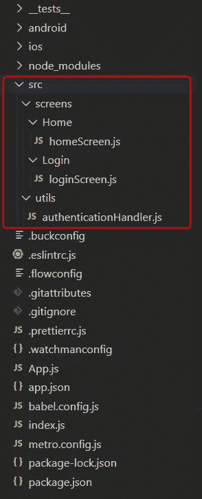*

# *第 3 部分:在客户端应用程序中处理身份验证*

*处理标准 oAuth 流是很多应用程序都会遇到的事情。所以，在某个地方，已经有人写了这段代码。*

*让我们使用这个库: [react-native-app-auth](https://github.com/FormidableLabs/react-native-app-auth)*

*导航到我们的新项目并安装库:*

```
*cd AwesomeProject
npm install react-native-app-auth --save*
```

## *创建身份验证处理程序*

*authenticationHandler.js*

*我们定义了一个将由授权库使用的配置:*

*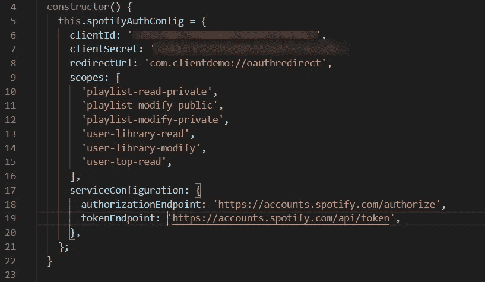*

*那么我们在看什么？*

***ClientID &客户端机密**:Spotify 定义的客户端 ID &客户端机密。通过[https://developer.spotify.com/](https://developer.spotify.com/)进入您的 Spotify 开发者仪表盘。您将在左上角看到您的应用程序的客户端 ID。*

***重定向 URI:**Spotify 将用户登录后重定向到的 URI。*

***范围:**你的应用程序需要的范围(由 Spotify 定义)。这定义了您的应用程序在用户帐户上获得哪些授权。*

*范围列表:[https://developer . Spotify . com/documentation/general/guides/scopes/](https://developer.spotify.com/documentation/general/guides/scopes/)*

***授权端点:**该端点将提示典型的 Spotify 登录屏幕。*

***令牌端点:**通过此端点请求访问令牌和刷新令牌*

*您可以在本页找到有关两个端点的更多信息:*

*[https://developer . Spotify . com/documentation/general/guides/authorization-guide/# authorization-code-flow](https://developer.spotify.com/documentation/general/guides/authorization-guide/#authorization-code-flow)*

***郑重声明:** 你应该**永远不要**通过你的客户端应用或者前端暴露你的客户端秘密。在第二章中，我将解释如何使用 Firebase 函数作为代理来完成这项工作。*

## *我们定义了两种方法*

*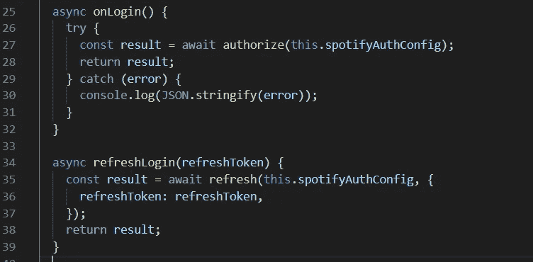*

## *使其与 Android 兼容:*

*向 android/app/build.gradle 添加 manifes 占位符。*

*通过添加这一行，我们的应用程序将“理解”Spotify 身份验证中使用的重定向 URI。*

*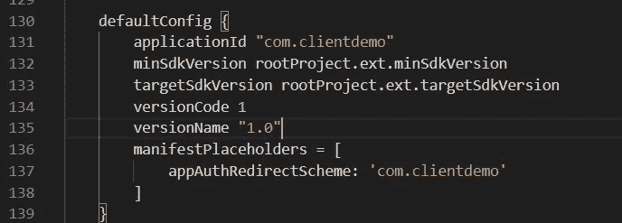*

# *构建我们的登录屏幕*

*所以我们将坚持基本原则。目前，我们将只构建一个屏幕:登录屏幕。*

*让我们在登录屏幕上添加一个按钮。按下此按钮将执行 onLogin 方法。*

*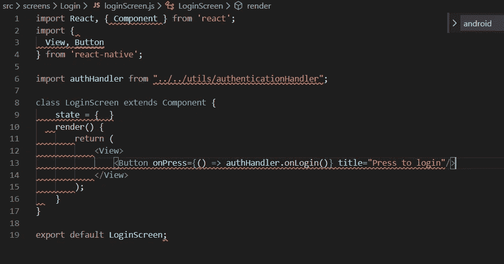*

# *修改 App.js*

*App.js 是 React 本地应用程序的主要入口文件。目前，我们将始终返回我们的登录屏幕。*

# *在 Android 设备上运行我们的应用*

*现在在你的 Android 设备或模拟器上运行这个应用程序:
(如果你不知道如何访问 https://reactnative.dev/docs/getting-started[](https://reactnative.dev/docs/getting-started)**，向下滚动到“准备 Android 设备”)***

```
**npx react-native run-android**
```

****这应该是结果:****

******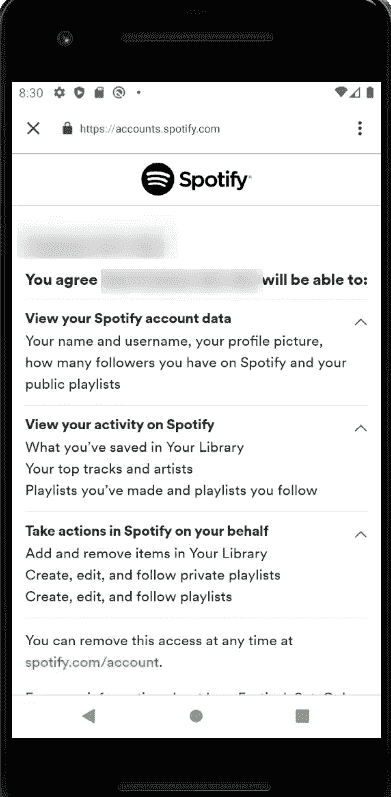****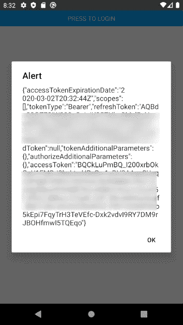**

**好吧！我们有一个工作，非常简单的应用程序与 Spotify 认证流程。**

# **现在的版本有什么问题？**

*   **我们的客户秘密暴露在我们的客户端应用程序中。客户端秘密应该永远是秘密的，所以这是不好的。我们将在下一章中解决这个问题**
*   **我们只有一个屏幕..我们稍后将添加一些导航。**

# **第 4 部分:后端——使用 Firebase 作为代理**

## **创建一个 Firebase 项目**

***在 Firebase 控制台中创建一个 Firebase 项目。如果你知道怎么做，你可以跳过这一部分。***

**转到[https://firebase.google.com/](https://firebase.google.com/)并按下“开始”。使用您的 Google 帐户登录或创建一个新帐户。**

**登录后，您将看到以下屏幕:**

****

**按“添加项目”创建一个新的 Firebase 项目。**

****启用 Blaze 账户****

**创建新项目时，标准项目计划将是“Spark”。
这是 Firebase 的免费版本，但是它不允许我们的函数执行外部 API 调用。**

**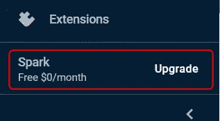****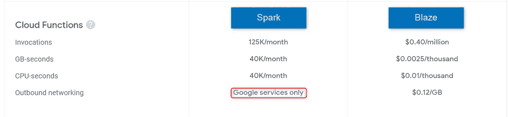**

**Spark does not allow external calls**

**blaze 定价计划是一项现收现付计划。这意味着你将不得不关注你的账单计划。我已经在许多演示项目和概念验证中使用了这个计划。我收到的最高月账单是€0.07 英镑。请注意，调用 Firebase 函数的无限循环会给你带来一个非常糟糕的账单。**

**你可以阅读这个故事，看看最坏的情况是什么。**

**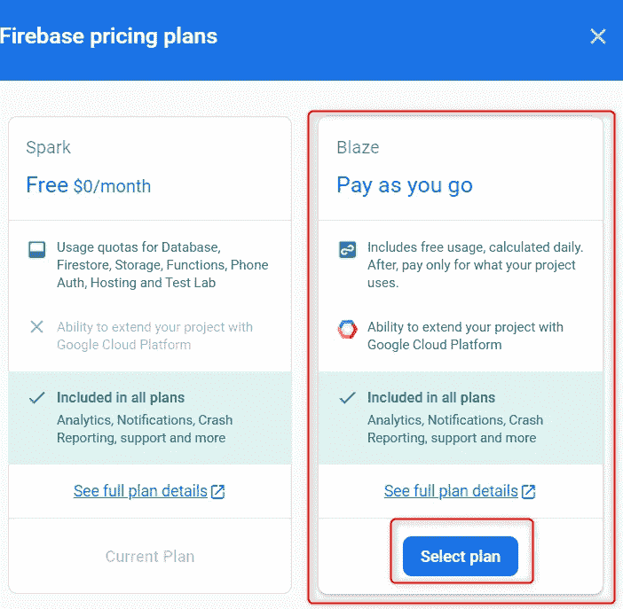**

**你可以配置预算提醒来跟踪你的账单。我建议这样做，以避免意想不到的账单。**

## **安装 Firebase 工具**

**在 Firebase 控制台中，选择您新创建的项目，然后在左侧菜单中选择 Functions。**

**按“开始”**

**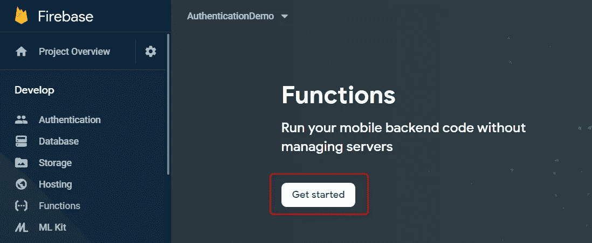**

*   **安装 firebase 工具(-g 表示我们将全局安装，因此我们可以在任何地方使用 firebase 工具):**

```
**npm install -g firebase-tools**
```

## **初始化我们的 Firebase 函数+ Express 项目**

**现在打开命令提示符，导航到要初始化项目的文件夹:**

```
**firebase init**
```

**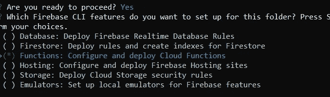**

*   **选择功能**
*   **使用现有项目**
*   **选择您新创建的项目**
*   **选择 Javascript
    *我们不会在这个演示中使用 ESLint，但是我建议在真实项目中使用它***
*   **现在不要安装与 npm 的依赖关系**

**您应该会看到这个屏幕:**

**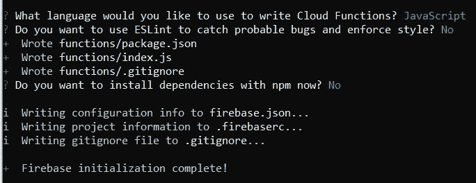**

**进入 functions 文件夹并安装 express:**

```
**cd functions
npm install express --save**
```

> *****您成功初始化了您的项目！*****

**让我们安装 npm 依赖项并部署我们的第一个(空)项目**

```
**npm install
cd ../
firebase deploy**
```

*****如果你没有得到任何错误，你的空 app 就部署好了！*****

**到目前为止一切顺利。但是你的应用还不能做任何事情:-)**

## **构建、部署和测试我们的第一个 API**

**转到 functions 文件夹(由 firebase 工具创建)**

```
**npm install body-parser --save**
```

***Body-parser 是一个中间件，它将以一种更易于使用的格式解析传入的请求。您可以在没有 body-parser 的情况下工作，但是这让事情变得简单多了。***

**创建此文件结构:**

**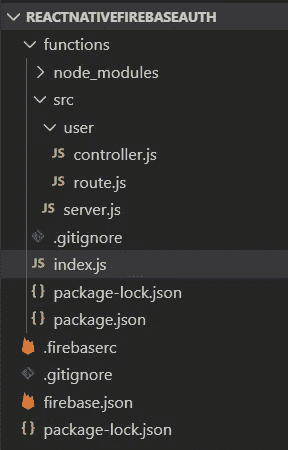**

***注意:有很多关于 React 原生项目中文件结构的“最佳实践”的文章。为了这个演示，我将保持简单。老实说，我没有 goto 结构，所以我所有的项目都有稍微不同的结构。***

****index.js****

**这将是我们的 Firebase 函数的主文件。在这个文件中，我们将定义要导出的函数，并通过 Firebase 函数使其可用。通过使用 runWith，我们可以定义我们希望分配给函数多少内存，以及我们希望函数在多少秒后超时。**

**在这种情况下，我们定义了一个函数“api ”,它将根据请求运行我们的服务器函数。(从 out 导入。/src/server.js 文件)**

> **[阅读 Firebase 文档的这一部分](https://firebase.google.com/docs/functions/manage-functions)以获得定义函数时所有可能性的完整概述。**

**所以基本上，我们的 index.js 会定义我们想要通过 Firebase 公开哪些函数。**

**在这个截图中可以看到，Firebase 现在可以识别一个内存为 2GB、超时为 120 秒的函数“api”。**

**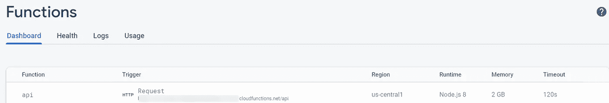**

****server.js****

**这将是我们的 express api 的入口文件。对我们的/api/* url 的每个调用都将通过这个文件来处理。**

**在这种情况下，我们定义了一个路径/用户，它将通过。/user/route.js。**

**例如，如果我们想创建一个 API 端点/api/user/getuser/:id:我们将在。/user/route.js，这是我们将讨论的下一个文件**

****user/route.js****

**我们定义了一个路由:/authentication/**

**(完整路径 API/用户/身份验证)**

**该路由需要一个 POST 请求，并将通过函数 controller.authentication 来处理这个调用。/控制器文件。**

****user/controller.js****

***重要提示:我们在后台工作，所以可以使用你的 clientSecret。不要在你的前端应用程序中这样做！***

**控制器文件将处理逻辑。我为用户 API 端点构建了一个特定的控制器文件。再说一次，找到适合你的项目的文件结构取决于你。**

**在这种情况下，我有一个 proxySpotifyToken 方法，它将处理我们的授权调用，并在需要的地方注入 oAuth 提供者的客户机秘密。**

**因此，在这一点上，我们可以对外部端点(API/用户/身份验证)执行 Post 请求。在我们的正文中，我们除了“代码”或“刷新 _ 令牌”之外都没有填写。有三种情况:**

1.  **code 和 refresh_token 为空:我们发送一个响应 403，告诉我们的客户端用户没有被授权。**
2.  **refresh_token 已填写:我们的用户之前已经进行了身份验证，客户端正在请求一个新的访问令牌，以便以我们用户的名义执行新的 API 调用。
    我们的回应将是:{ todo:"刷新访问令牌" }**
3.  **代码已填写:客户端没有刷新令牌，因此这是一个新的“新鲜”身份验证。该代码将用于请求访问令牌和刷新令牌。
    我们的响应将是:{ todo:"获取刷新令牌&访问令牌" }**

> **这有用吗？**

**我们在[邮差](https://www.postman.com/)里测试一下这个吧！**

*   **正在检索刷新令牌和访问令牌:检查！**

**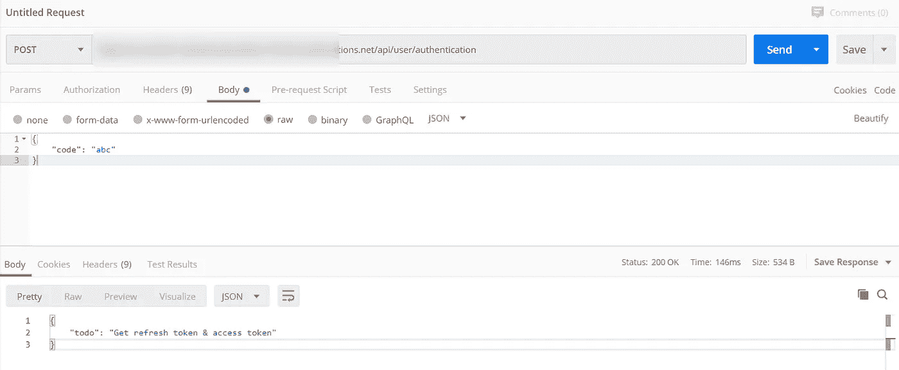**

*   **刷新访问令牌:检查！**

**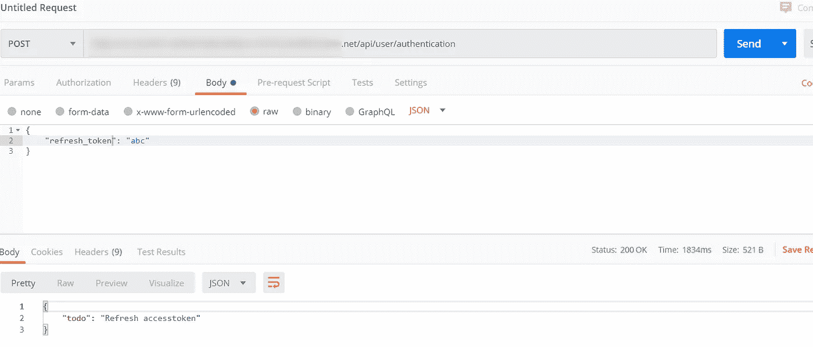**

*   **未授权呼叫— 403 状态:检查！**

**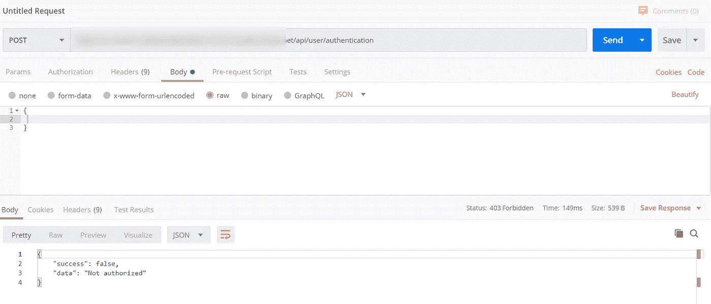**

**现在，我们有了一个工作的迷你 API，它基本上可以..没什么。**

**但我们仍然有点兴奋，因为我们得到了预期的回应！这意味着我们可以开始实现一些逻辑，做一些本地自由风格！**

****那就这么办吧！****

> ****写出重要逻辑****

**现在，我们希望我们的后端与 oAuth 提供者(Spotify)通信，并返回有效的访问令牌和刷新令牌。**

**在简介中，我们谈到了 Spotify 认证流程。这部分主要集中在**步骤 2 和 3。****

****

**所以我们有两种情况需要解决:**

1.  **用授权码交换访问令牌和刷新令牌**
2.  **用刷新令牌交换新的访问令牌**

**让我们来定义我们的配置:**

**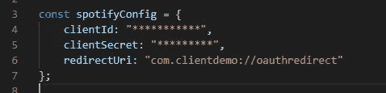**

*   ****客户端 ID &客户端密码:**您可以在 Spotify 的开发者仪表盘中找到。**
*   ****重定向 URI:** 一个你必须加入 Spotify 仪表盘白名单的网址。在这篇博客中，无论何时你需要填写一个重定向 URL，你都需要使用同一个 URL。**

> **因此，让我们来看看 controller.js 中的第一个场景:**

**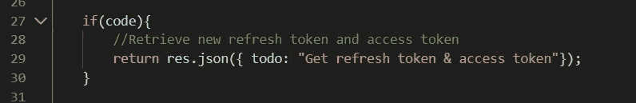**

**为此，根据 Spotify 文档，我们必须对这个端点执行 POST 调用:[https://accounts.spotify.com/api/token](https://accounts.spotify.com/api/token)**

**应填写以下标题和正文请求参数:**

**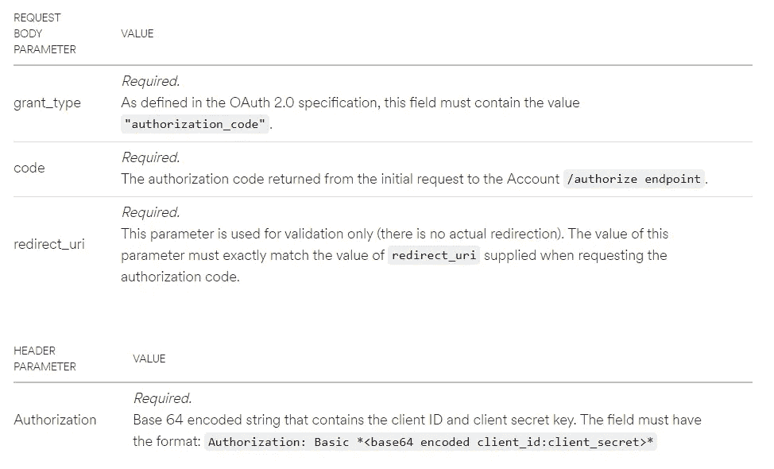**

**我们将使用一个用 Javascript 包装 Spotify API 的库:**

**[https://github.com/thelinmichael/spotify-web-api-node](https://github.com/thelinmichael/spotify-web-api-node)**

**因此，再次打开命令提示并转到 functions 文件夹:**

```
**npm install spotify-web-api-node --save**
```

**现在，您可以通过导入该库:**

```
**var SpotifyWebApi = require(‘spotify-web-api-node’);**
```

**我们将使用 spotifyConfig 作为构造函数参数初始化变量 spotifyApi。这样，我们所有的调用都将使用正确的客户端 id、客户端密钥和重定向 url。**

**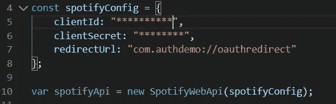**

**因此，我们将添加一点代码来处理我们的请求:**

**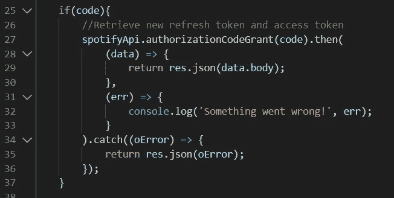**

**我们将使用传入的授权代码获取访问令牌和请求令牌。authorizationCodeGrant 方法返回访问令牌和刷新令牌。我们将直接向客户返回响应:**

```
**res.json(data.body)**
```

> **让我们深入探讨第二种情形！**

**在此场景中，我们希望使用现有的刷新令牌请求新的访问令牌。**

**我们仍将使用 Spotify API 包装库。
首先，我们将使用方法设置刷新令牌**

```
**spotifyApi.setRefreshToken().**
```

**然后，我们将使用 refreshAccessToken()刷新我们的访问令牌**

**当此调用成功时，我们将把主体返回给客户。我还将 refresh token 添加到我们的主体中(第 25 行)，这样我们就可以从那里使用它。**

**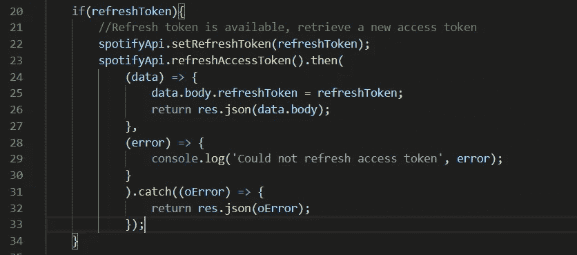**

**就像前面的场景一样，对于我们的客户端应用程序，它看起来就像我们直接调用了 Spotify API。但因为我们想隐藏我们的客户秘密，我们使用我们的 firebase 函数作为代理。**

# **在我们的 React Native 应用程序中使用 Firebase 代理**

***现在我们有了一个运行在 Firebase 上的 Proxy，以及一个直接连接到 Spotify 的 React Native 前端，包括我们的客户端 id 和客户端密钥。***

***这是不安全的，原因很简单，客户机密应该保持机密。我们将不得不把这些点连接起来，更新我们的代码库，使其更加安全。***

**让我们看一下之前编写的一些代码:**

****

**让我们做一些改变:**

*   **删除客户机密**
*   **将 tokenEndpoint URL 更改为 Firebase 终结点**

**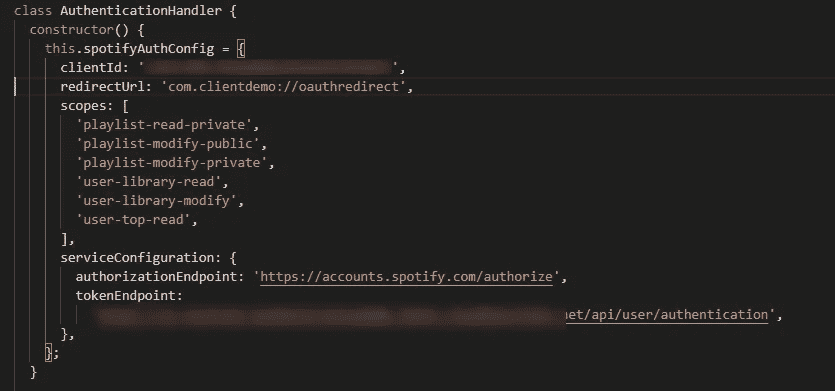**

**一切仍然会很顺利。但现在，我们的客户秘密隐藏在我们的 Firebase 项目中。真棒。**

# **第 5 部分:保持身份验证状态**

***现在我们可以对用户进行身份验证了，接下来我们希望应用程序逻辑的其余部分基于当前身份验证状态进行处理。此外，我们希望使用当前令牌执行所有下一个 API 调用。我们希望应用程序做的第三件事是将用户的刷新令牌保持在某个状态，因此当用户重新打开应用程序时，他将自动再次通过身份验证。***

## **使用 redux 保持我们的身份验证状态**

**我将向你展示如何用 Redux 存储认证状态。如果你不知道 Redux 是如何工作的，我建议你看一些他们的文档。**

**我们将使用官方的 Redux Toolkit 库来尽可能简化这个设置。**

****

**安装所需的依赖项以使用 Redux:**

```
**npm install @reduxjs/toolkit --save
npm install react-redux --save
npm install @react-native-community/async-storage --save
npm install redux-persist --save**
```

## **Redux 设置**

**使用以下结构创建一个“redux”文件夹:**

****

## **authenticationSlice.js:**

**如果您熟悉 Redux，但不熟悉 Redux Toolkit，您会注意到这不是定义 reducers 和动作的标准方式。我不会详细介绍 redux 工具包是如何工作的。但是在幕后，Redux 工具包创建了我们从标准 Redux 中了解到的所有必要的对象。**

**我们正在定义一个身份验证状态，其中的一些操作将处理我们的访问令牌和刷新令牌的持久性。**

****reducers/index.js****

**我们在这个文件中定义了根归约器。使用“persistReducer ”,我们将能够在我们的设备上持久化我们的 Reducer。异步存储将用于保存我们设备上的数据。我们创建一个身份验证配置，该配置将保留我们的身份验证状态，但访问令牌除外。这是因为我们只想保存我们的刷新令牌。每次打开我们的应用程序时，都应该刷新访问令牌。**

****商店/商店. js****

**店里汇集了 Redux 的一切。**

## **App.js**

**我们需要在 App.js 中做一些修改，以便我们的应用程序知道如何处理我们的商店:**

## **loginScreen.js**

**此外，我们希望我们的登录屏幕与我们的 Redux 商店通信。
因此，让我们修改我们的 loginScreen.js 代码。**

**我们将导入用于操作身份验证状态的操作。有了 Redux 的 connect 模块，我们将能够用 Redux 状态“连接”我们的组件。mapStateToProps 和 mapDispatchToProps 是 connect 中可用的方法，允许我们将 redux 状态和 redux 调度映射到我们的组件。这样，我们将能够通过 this.props 在我们的组件内部调用和使用它们。**

**这正是我们在成功登录过程后在此代码中所做的事情:**

```
**this.props.setAccessToken({accessToken: authenticationObject.accessToken});this.props.setRefreshToken({refreshToken: authenticationObject.refreshToken,});**
```

# **第 7 部分:基于身份验证的导航**

***现在我们可以验证我们的用户了。如果我们可以只在用户没有被认证的情况下显示登录页面，那不是很好吗？***

**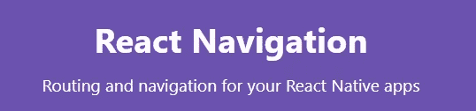**

**对于我们的导航，我们将使用 React 本机导航最常见的 goto 库:**

 **[## 反应导航|反应导航

### 描述将放入

reactnavigation.org](https://reactnavigation.org/)** 

**我们将为我们的应用程序创建两个导航:**

****登录导航
访客导航****

**您可以想出任何其他合适的名称，但是为了本教程的清晰起见，我想直截了当地说:-)。**

**如果我们想要导航，我们还需要构建一些额外的屏幕:**

*   **我的个人资料(仅适用于经过身份验证的用户)**
*   **MyFavoriteMusic(仅适用于已验证的用户)**
*   **登录屏幕(仅针对客人)**
*   **主屏幕(仅适用于客人)**
*   **入口屏幕**

**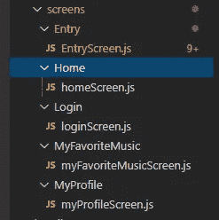****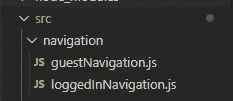**

**因此，让我们安装一些必需的依赖项:**

```
**npm install react-navigation react-native-reanimated react-native-gesture-handler react-native-screens react-native-safe-area-context @react-native-community/masked-view @react-navigation/bottom-tabs  [@react](http://twitter.com/react)-navigation/native react-native-screensnpm install**
```

****BottomTabNavigator:****

**有不同种类的导航器。我们将使用 BottomTabNavigator，它会在屏幕底部以选项卡的形式显示不同的导航路径。**

****guestNavigation.js:****

****loggedInNavigation.js:****

****EntryScreen.js:****

**我们的入口屏幕将从 App.js 文件中调用。该屏幕将根据当前认证状态显示正确的导航器。它还将处理我们的自动登录:当刷新令牌可用但我们还没有访问令牌时，我们将尝试刷新它。**

****myProfileScreen.js:****

****myfavoritemusicscreen . js:****

****App.js****

**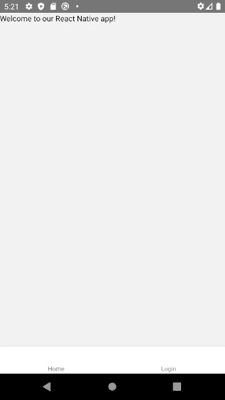************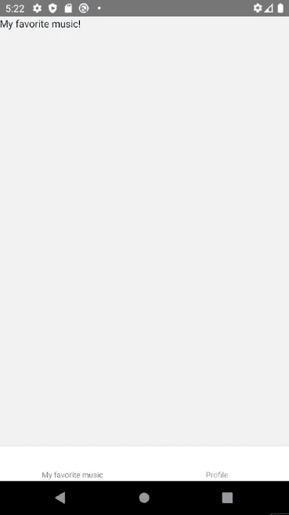**

**所以现在我们有了一个针对访客的导航和一个针对登录用户的导航。这不是很好吗？**

# **下一步是什么？**

## **反应钩**

**在本教程中，我一直在使用 React 组件类。然而，用钩子工作会更干净。一些认证逻辑可以在定制钩子内部进行管理。了解更多信息:**

**[](https://reactjs.org/docs/hooks-intro.html) [## 介绍钩子-反应

### 钩子是 React 16.8 中的新增功能。它们允许您使用状态和其他 React 特性，而无需编写类。这个…

reactjs.org](https://reactjs.org/docs/hooks-intro.html) 

## 与自定义身份验证相结合

在我的一个项目中，我想在我的 Firebase 身份验证中保留一个用户群。所以我使用了上述原则，并将其与 Firebase 的自定义身份验证相结合:

[](https://firebase.google.com/docs/auth/web/custom-auth) [## 使用自定义身份验证系统通过 JavaScript 中的 Firebase 进行身份验证

### 通过修改您的身份验证服务器，您可以将 Firebase 身份验证与自定义身份验证系统集成在一起…

firebase.google.com](https://firebase.google.com/docs/auth/web/custom-auth) 

添加这个可能是一个很好的挑战！这样，您可以保留一个用户群，并为每个用户保存一些自定义数据。

希望你喜欢这本书。坚持编码，每天努力提升自己！

—托马斯

Actual footage of me writing this article

## **用简单英语写的 JavaScript 的注释:**

我们总是有兴趣帮助推广高质量的内容。如果你有一篇文章想用简单的英语提交给 JavaScript，用你的 Medium 用户名给我们发邮件到[submissions@javascriptinplainenglish.com](mailto:submissions@javascriptinplainenglish.com)，我们会把你添加为作者。**