# 反应本机全屏通知(即使在锁屏)

> 原文：<https://javascript.plainenglish.io/react-native-full-screen-notification-tricking-android-1761e4fd2ac3?source=collection_archive---------1----------------------->

## 仅限 Android

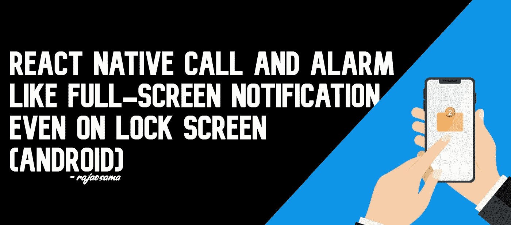

# 警报

> 从 android 10，SDK 29 开始，这一招对运行 Android 10 的设备不再有效，因为谷歌已经设置了一个限制意思，你将无法从后台启动一个应用程序。
> 
> 参考:
> 
> [https://developer . Android . com/guide/components/activities/background-starts](https://developer.android.com/guide/components/activities/background-starts)
> 
> 解决这个问题的方法是在您的应用程序中运行一个前台服务。你可以看一下限制的例外部分。
> 
> 这是我开发的前台服务。
> 
> https://github.com/Raja0sama/rn-foreground-service
> 
> 请注意，先前的解决方案没有经过测试，我假设是这样的，因为文档在异常中提到了这一点。

嗯，你在这里可能是因为你一直在寻找一种向 react 原生应用的用户显示全屏通知的方法。

我也一直在开发一个应用程序，这个应用程序是为司机和基于 android 的应用程序，每当服务器广播命令时，司机都会收到通知，在我的情况下，他可以回答他是否想接受命令的全屏通知。经过几个小时的搜索，我在互联网上没有找到解决方案，让你显示全屏通知，因为它不存在。
安卓有个东西叫[时间敏感通知](https://developer.android.com/training/notify-user/time-sensitive)，上面写的很清楚。

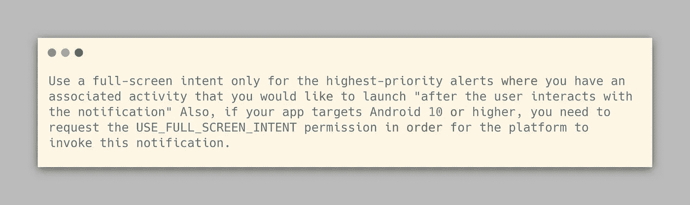

在我的例子中，我不希望它在“交互”之后显示一个正常的屏幕意图，我希望它是一个整页的通知，这显然是不支持的。

那我们现在怎么办？我们打开通知接收器上的应用程序，并在安装前获取一些参数，以导航我们的应用程序到某个屏幕，怎么样？在我的例子中，我所做的是创建一个只有一个屏幕的独立堆栈导航器，将它与 mount 上的 firebase listener 连接，显示订单的信息和操作按钮。

是的，这正是我所需要的。

然后，我开始在谷歌上搜索关于通知接收者的打开活动。不过，我没有找到，所以打开我的 Vscode，导航到 react-native-firebase/messaging，我找到了一个文件 ReactNativeFirebaseMessagingReceiver.java，其中有一个名为 onReceive 的函数，所有的通知都在这里传递，这就是我所需要的。

我开始测试它；首先，我尝试像这样从 remoteMessage 获取数据

```
Log.d('Testing ',remoteMessage.getData().toString());
```

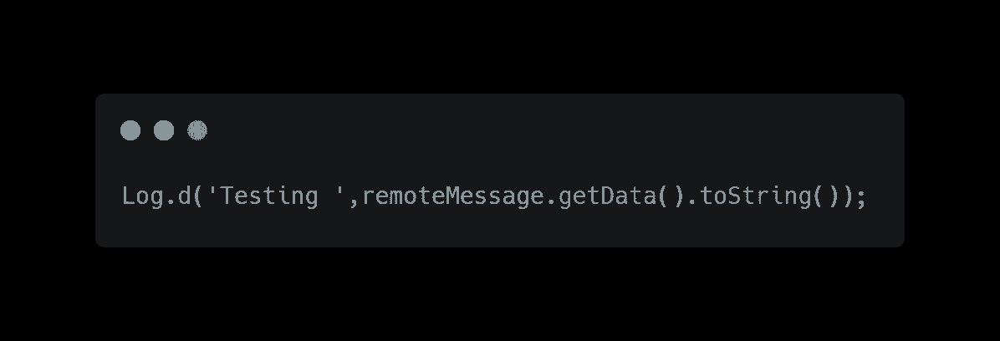

而在 android Studio 中收到的日志是

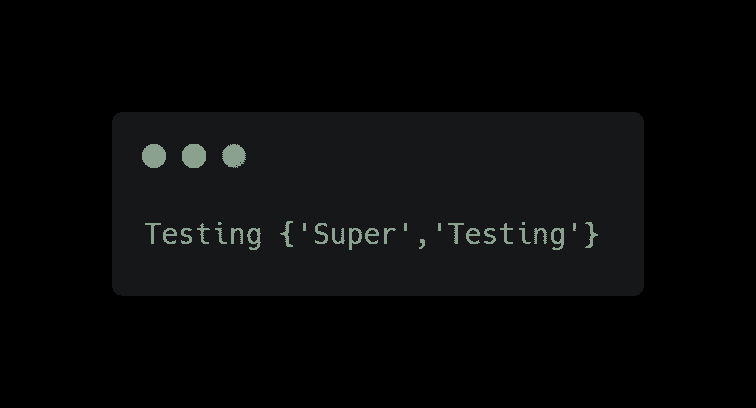

答对了，我收到了一个相当于 javascript JSON 对象的 map，
我通过使用这行代码获取了 Super next

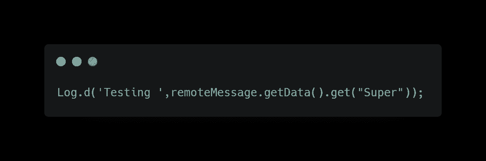

我重建，我得到了结果**测试测试**。这就是我所需要的。
下一步是看我是否能从后台打开活动，在我研究的时候，我发现很多资料说你不能从后台打开活动。那么现在该怎么办呢，我没有尝试打开一个活动，而是尝试打开一个应用程序，我尝试通过`getLaunchIntentForPackage`打开我自己的应用程序

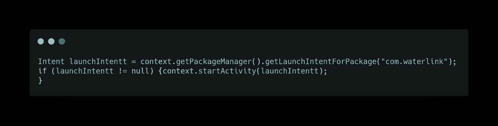

答对了，收到通知如果我的应用程序在后台或者因为推送而被关闭，它会重新打开我的应用程序，这是我想要的。在活动状态下，没有不同的行为，因为我试图打开的进程已经打开；因此，没有变化。

之后我所有的问题都解决了，所有的问题都解决了，我在数据对象上做了一些条件检查，只在我需要的地方用 props 打开我的应用程序。

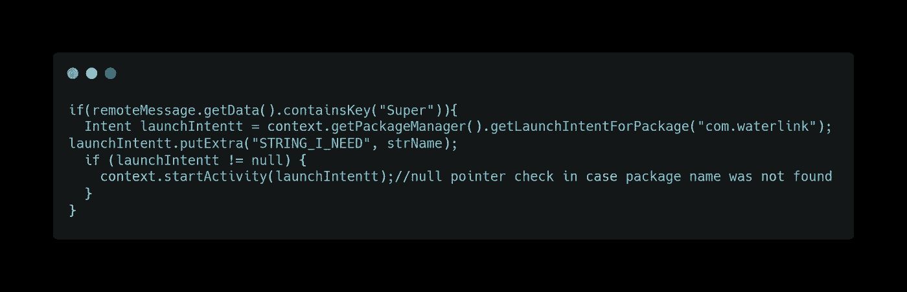

```
if (remoteMessage.getData().containsKey("Super")) {Intent launchIntentt = context.getPackageManager().getLaunchIntentForPackage("com.waterlink");
  launchIntentt.putExtra("String_I_need", "strName");
  if (launchIntentt != null) {
    Log.d("Testing ", "Inside");
    context.startActivity(launchIntentt);}
}
```

到目前为止，一切正常。我面临的最后一个问题是，如何告诉应用程序，该应用程序是由通知而不是由用户打开的。

有两个修复，要么我可以利用 putExtra 将数据发送到主活动，要么我可以在我的应用程序上有一个监听器来检查订单广播。

在我的例子中，我在我的应用程序中使用了监听器，但是对于 put Extra，你可以通过使用你的 mainactivity.java 中的一段代码很容易地解决它

转到您的主活动并声明一个变量

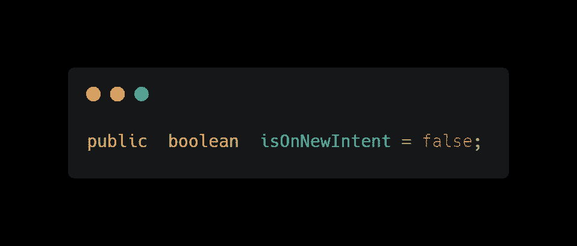

您需要覆盖 MainActivity 的两个方法。

*确保首先覆盖 onNewIntent，然后覆盖 OnStart。*

*   onNewIntent

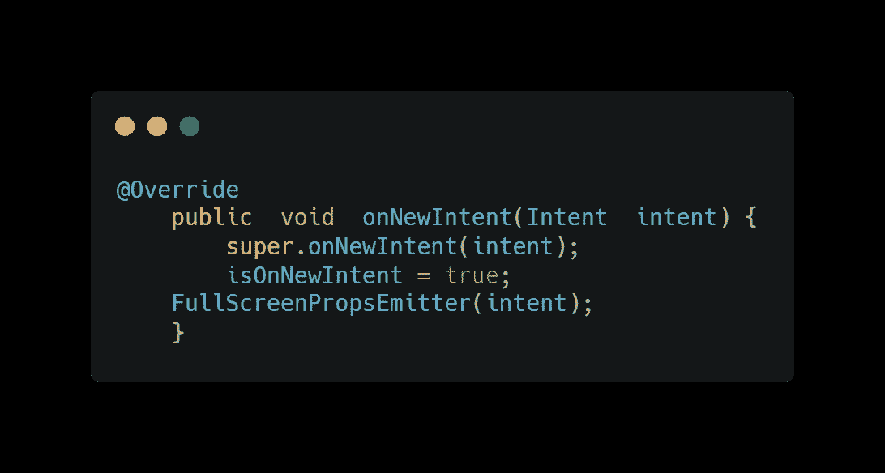

*   onStart

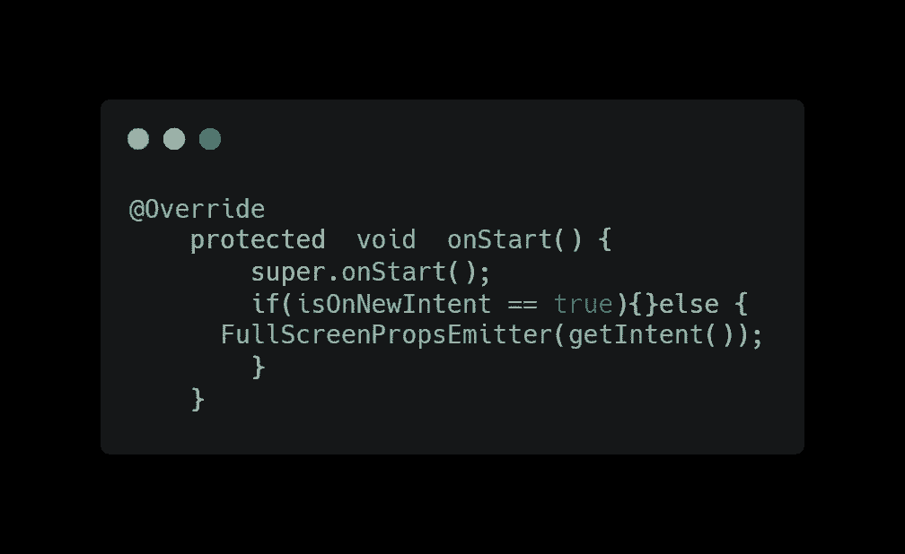

最后是我们的主要功能— `FullScreenPropsEmitter`

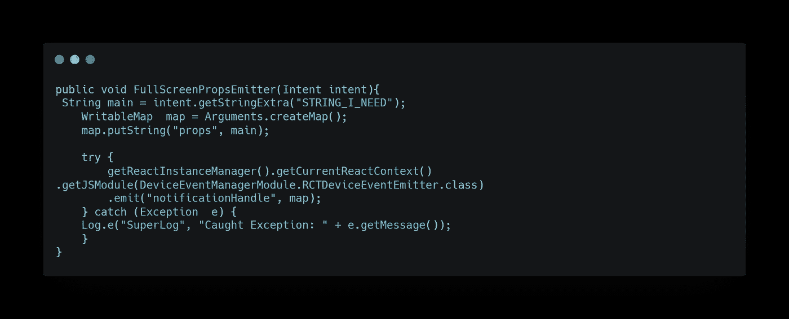

在你的 js 上获取这个道具


你也可以使用这个方法，通过这个[方法](https://reactnative.dev/docs/communication-android)发送数据作为初始道具

这就是你如何从 firebase 通知中打开你的 react 本地应用程序，并在应用程序启动和显示通知的特定屏幕上发送和接收道具。我建议你在你的应用中使用这个库，而不是使用官方的，如果你在删除旧的节点模块后重新安装，官方的会被覆盖。