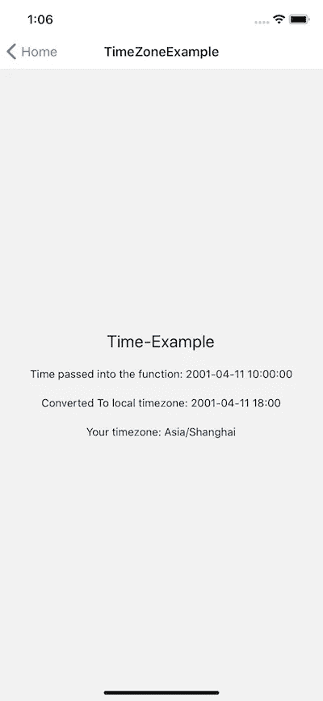

# React Native:获取用户设备时区并使用偏移量转换 UTC 时间戳

> 原文：<https://javascript.plainenglish.io/react-native-getting-user-device-timezone-and-converting-utc-time-stamps-with-offset-697902d7803?source=collection_archive---------2----------------------->


Photo by [Elisa Michelet](https://unsplash.com/@elisamichelet?utm_source=medium&utm_medium=referral) on [Unsplash](https://unsplash.com?utm_source=medium&utm_medium=referral)

与 web 相反，React Native 不在浏览器中运行，因此在试图获取时区偏移量和考虑夏令时时时会变得很棘手。

最近，我的任务是将所有后端生成的时间戳从默认的 UTC 转换为用户的设备时区。这是我一路上遇到一些问题，以及如何解决我的票的过程。

# 流程图

这是我想要的流程:

1.  以小时为单位获取用户 UTC 时间偏移量。
2.  将后端时间戳和偏移量发送到一个转换函数，该函数将转换后的+格式字符串返回到前端。

**步骤 2 中的函数将如下工作:**

## **params:**

*   *字符串:日期字符串*
*   *Int: offset*

**a)** 解析日期字符串‘datestring’。
**b)** 将数据转换成 JS 日期对象。
**c)** 使用 JS `Date `内置函数` getHours()`方法获取 date 对象的当前小时数。
**d)** 使用 JS `Date '内置函数' setHours()'在 Date 对象上设置新的小时，其中我们传入当前小时，并添加传入函数的偏移量。
**e)** 将字符串格式化到前端。
**f)** 返回最终转换后的时间戳。

## **让我们看看代码中会发生什么:**

让我们想象一下如何使用我们的函数，它可能看起来像这样

```
const convertedTimeStamp = formatTimeByOffset(utcStringFromBE, offset)
```

我根据上述步骤构建的函数如下所示:

```
export const formatTimeByOffset = (dateString, offset) => {
  // Params:
  // How the backend sends me a timestamp
  // dateString: on the form yyyy-mm-dd hh:mm:ss
  // offset: the amount of hours to add.// If we pass anything falsy return empty string
  if (!dateString) return ''
  if (dateString.length === 0) return ''// Step a: Parse the backend date string// Get Parameters needed to create a new date object
  const year = dateString.slice(0, 4)
  const month = dateString.slice(5, 7)
  const day = dateString.slice(8, 10)
  const hour = dateString.slice(11, 13)
  const minute = dateString.slice(14, 16)
  const second = dateString.slice(17, 19)// Step: bMake a JS date object with the data
  const dateObject = new Date(`${year}-${month}-${day}T${hour}:${minute}:${second}`)// Step c: Get the current hours from the object
  const currentHours = dateObject.getHours()// Step d: Add the offset to the date object
  dateObject.setHours(currentHours + offset)// Step e: stringify the date object, replace the T with a space and slice off the seconds.
  const newDateString = dateObject
    .toISOString()
    .replace('T', ' ')
    .slice(0, 16)// Step f: Return the new formatted date string with the added offset
  return `${newDateString}`
}
```

这是 GitHub 上的代码。

通过一些快速测试，随机时间偏移中的旁路表明该功能工作正常。调用它并打印结果会给出以下内容:

```
const convertedToLocalTime = formatTimeByOffset('2001-04-11 10:00:00', 7)console.log(convertedToLocalTime)
// --> "2001-04-11 17:00:00"
```

厉害！现在我们只需要获得用户的 UTC 时间偏移，我们就完成了🚀理论上这可能很简单，但是需要额外的考虑。

# JS 日期

我最初的想法是简单地使用 JavaScript Date，更具体地说是 getTimeZone 方法。这里的文档: [JS Date getTimeZone()方法](https://www.w3schools.com/jsref/jsref_gettimezoneoffset.asp)

```
const now = new Date()
const utcTimeOffset = now.getTimezoneOffset() / 60;
```

*注意:除以 60，因为该方法返回以分钟为单位的偏移量。*

**不幸的是，这并不总能给出正确的时间！**

例如，将我的系统时区改为美国西海岸，给了我一个小时错误的转换时间戳！为什么？🤔

# 夏令时

如果我们在浏览器中运行，这可能会有效，因为现在的浏览器会返回 DST 调整的偏移量(如果我错了，请纠正我)。

然而，由于我们不是在浏览器中运行，我们需要找出一种不同的方法来确定用户是否受到夏令时事件的影响。手动操作将会很棘手，因为并非所有国家都使用夏令时，而且当夏令时生效时，他们不会使用相同的日期和时间。那我们该怎么办？

让我们先搞清楚用户的时区，尽管我们不是在浏览器中运行，而是在移动设备上运行。一定有办法获取设备的时间并利用它为我们服务。

# 获取移动设备时区

每当我想在 react native 中使用原生模块时，比如使用相机，我就会求助于 Github 上的 [React native 社区。](https://github.com/react-native-community)

对我们来说幸运的是，这个社区有一个本地模块，叫做[react-native-community/react-native-localize](https://github.com/react-native-community/react-native-localize)。

我进去看了文档，发现了下面的方法: [getTimeZone()](https://github.com/react-native-community/react-native-localize#gettimezone) 。

## **是这样描述的:**

*返回用户首选时区(基于其设备设置，而非其位置)。*

```
console.log(RNLocalize.getTimeZone());
// -> "Europe/Paris"
```

好的，很好。我像往常一样将这个包安装到我的项目中:

```
yarn add react-native-localizecd ios && pod installcd ..yarn run ios
```

我运行了上面的例子:

```
console.log(RNLocalize.getTimeZone());
// -> "Asia/Shanghai"
```

好极了。如果情况变得更糟，我可以做一个查找表，记录不同时区何时进入夏令时等。**但是经过一些 google-fu 之后，就没有这个必要了，所以让我们引入 moment 时区库。**

# 时刻时区

[时刻时区文件](https://momentjs.com/timezone/)

moment timezone 库可以获取上面生成的时区值，并返回 UTC 偏移量。整洁！

*安装:*

```
yarn add moment-timezone
```

结合获取上面的设备时区，我们可以这样使用它:

```
import React, {useState, useEffect} from 'react';
import {View, Text} from 'react-native';import {formatTimeByOffset} from '../helpers/formatTimeByOffset';
import * as RNLocalize from 'react-native-localize';
import moment from 'moment-timezone';function Component() {
  const [timeToDisplay, setTimeToDisplay] = useState('');const backEndTimeStamp = '2001-04-11 10:00:00';// get device timezone eg. -> "Asia/Shanghai"
  const deviceTimeZone = RNLocalize.getTimeZone();// Make moment of right now, using the device timezone
  const today = moment().tz(deviceTimeZone);// Get the UTC offset in hours
  const currentTimeZoneOffsetInHours = today.utcOffset() / 60;useEffect(() => {
    // Run the function as we coded above.
    const convertedToLocalTime = formatTimeByOffset(
      backEndTimeStamp,
      currentTimeZoneOffsetInHours,
    );// Set the state or whatever
    setTimeToDisplay(convertedToLocalTime);
  }, []);return (
    <View
      style={{
        height: '100%',
        width: '100%',
        alignItems: 'center',
        justifyContent: 'center',
      }}>
      <Text style={{fontSize: 22, marginBottom: 20}}>Time-Example</Text>
      <Text style={{fontSize: 14, marginBottom: 20}}>
        Time passed into the function: {backEndTimeStamp}
      </Text>
      <Text style={{fontSize: 14, marginBottom: 20}}>
        Converted To local timezone: {timeToDisplay}
      </Text>
      <Text>Your timezone: {deviceTimeZone}</Text>
    </View>
  );
}export default Component;
```

让我们看看实际运行中的代码！



[这是 Github 上的代码](https://github.com/ugglr/Mini-Tutorials-React-Native/blob/master/examples/src/screens/TimeZoneExample.js)

# 成功！

我认为有很好的方法使它更紧凑，但是对于一个教程，我宁愿说得多一点也不要错过一些细节。

如果您觉得这有帮助，请告诉我！