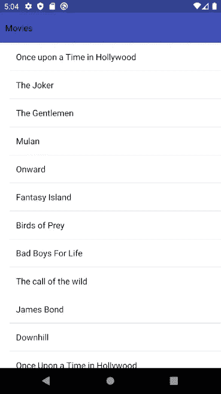
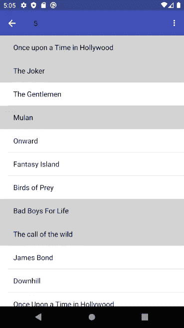
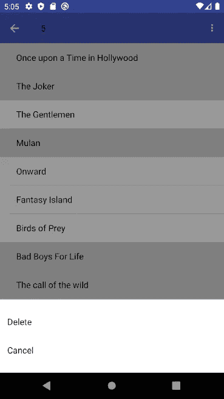
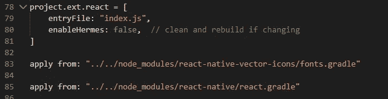

# React Native —如何基于 Nativebase 创建带有高亮选项的多选列表

> 原文：<https://javascript.plainenglish.io/react-native-how-to-create-a-multi-select-list-with-highlight-options-based-on-nativebase-d0aca4a43804?source=collection_archive---------2----------------------->

## *让我们创建一个列表，该列表可以基于原生基本用户界面库选择多个项目。*

# 为什么是 NativeBase？

Native Base 是我最喜欢的 React 原生 UI 库之一。这个项目背后的团队设法在标准的 React 本地组件上构建了一个很好的层。Native Base 中的大多数组件都非常容易使用，并且比标准组件可读性更好。


假设我们的列表中有两种模式，每种模式都会改变屏幕的行为。

# 显示方式

*   未选择任何项目。
*   在一个项目上的单次按压应该触发默认动作。比如说；导航到详细信息屏幕。
*   长按一个项目选择该项目并触发选择模式。
*   标题处于标准状态。我只想看到一个标题。

# 选择模式

*   无，可以选择 1 个或多个项目。
*   在项目上的单次按压将选择或取消选择该项目，而不是执行默认动作。
*   屏幕的标题工具栏处于选择模式；在左上角，我们将显示一个取消选择所有项目的后退按钮。在这个按钮旁边，我们将显示当前选择了多少个项目。在右上角，我们将显示一个按钮，该按钮打开一个动作菜单，其中包含可供选择的事件。

它应该是这样的:



# 积木

将本机基础添加到我们的项目:

```
npm install native-base --save
```

原生基地组件**清单、表头**和**行动表**。我们会把这三个放在一起，加入一些我们自己的逻辑来实现我们的目标。

# 创建我们的组件

因此，我们将创建 2 个组件:

**Main.js** 和**selectionlisheader . js**

主要组件将保持我们的项目的状态，并显示我们的列表。SelectionListHeader 将用于显示基于列表状态的动态标题。


# 主要的

让我们定义一个自定义钩子，它将根据我们的项目数组返回一个选择模式。

每当我们的 items 数组更新时，我们的 useSelectionChange 钩子将被调用，以便我们的 selectionMode 被更新。这样，我们可以确保 selectionMode 布尔值始终是最新的:

**让我们添加其余的逻辑:**

toggleSelect 和 clearSelection 应该是非常简单的函数。

正如您在 onPress 和 onLongPress 函数中看到的，我们可以很容易地使用 selectionMode 布尔值来确定要执行哪个逻辑。当处于选择模式时，我们希望 **onPress** 功能切换该项目的选择。

当不在 selectionMode 时，我们希望 **onPress** 执行一些其他逻辑。例如，导航到详细页面。

**onLongPress** 应仅在不处于选择模式时切换选择。当我们第一次选择一个项目时，selectionMode 会因为我们的自定义钩子而更新。

renderItem 将处理如何在我们的列表中显示单个项目。我们将根据项目的选定属性，动态地为 ListItem 分配一个样式。这样，我们可以在选中和未选中的项目之间产生视觉差异。

我们将在列表顶部插入我们的**选择列表头**:

# SelectionListHeader

让我们来看看传递给**选择列表头**的道具:

*   **选择模式**:布尔型
    定义我们的列表当前是否处于“选择模式”
*   **标题**:字符串
    标题显示在我们的头中
*   **selecteditems count**:number
    所选项目的金额(显示在表头)
*   **clear selection**:function
    当我们点击标题右上方的取消图标时调用的函数
*   **selectedActions** :对象数组
    选择几个项目时 ActionSheet (title + function)中可用的动作。

**渲染标题**:

**SelectionMode === true:**

*   左:显示后退按钮->这将通过调用由 **clearSelection** prop 传递的方法来清除我们的选择
*   正文:显示**所选项目的编号**而不是标题
*   右图:打开我们的**动作表**菜单的图标按钮

**选择模式===假:**

*   正文:展示**道具.标题**

**动作片:**

我们希望我们的**动作表**执行来自我们的**主**组件的动作。
选项将用我们动作的标题填充，这些将显示在 ActionSheet 中。

**oneexecuteaction**将决定执行哪个功能。基于动作的索引，应用由我们的主组件传递的正确函数。

# 修复 Android 中不显示的图标

可能是标题中的图标在 Android 中显示不正确。修复方法如下！

在 android/app/build.gradle 中添加:

```
apply from: "../../node_modules/react-native-vector-icons/fonts.gradle"
```

来源:[https://github.com/GeekyAnts/NativeBase/issues/2806](https://github.com/GeekyAnts/NativeBase/issues/2806)

所以现在看起来是这样的:



# 完整代码

[](https://github.com/ThomasSwolfs/React-Native-Multi-Select-List) [## Thomas wolfs/React-Native-多选列表

### 在 GitHub 上创建一个帐户，为 Thomas wolfs/React-Native-Multi-Select-List 的开发做出贡献。

github.com](https://github.com/ThomasSwolfs/React-Native-Multi-Select-List)