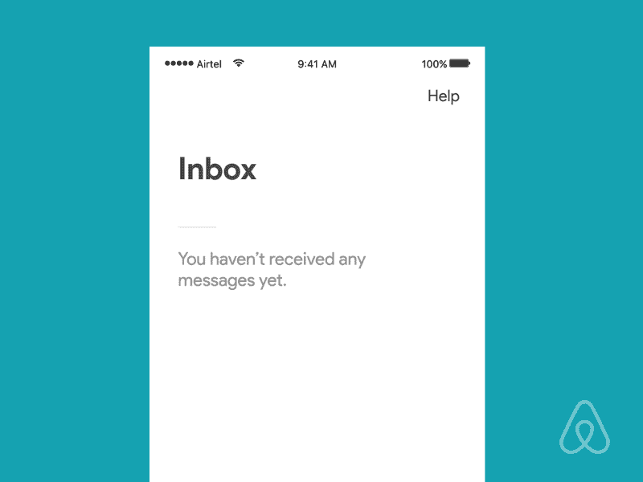
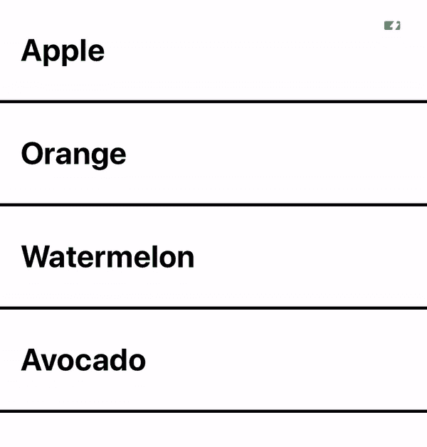
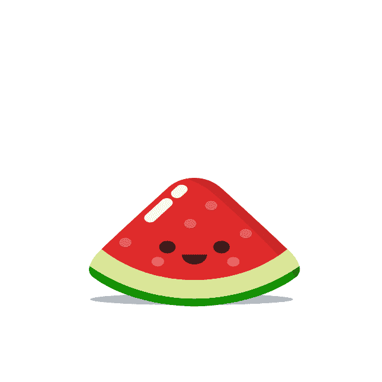
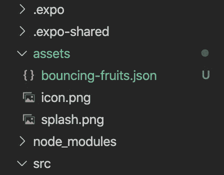
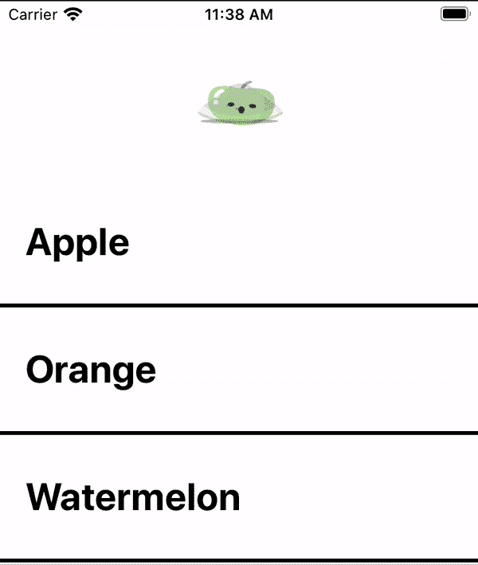
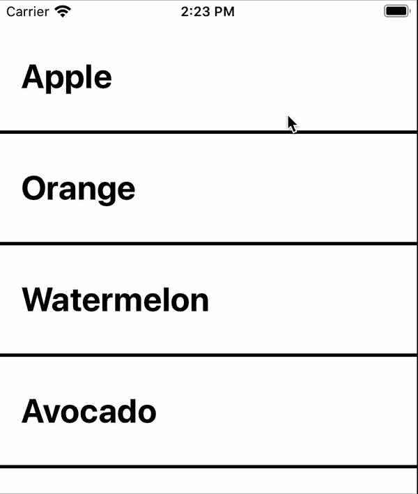
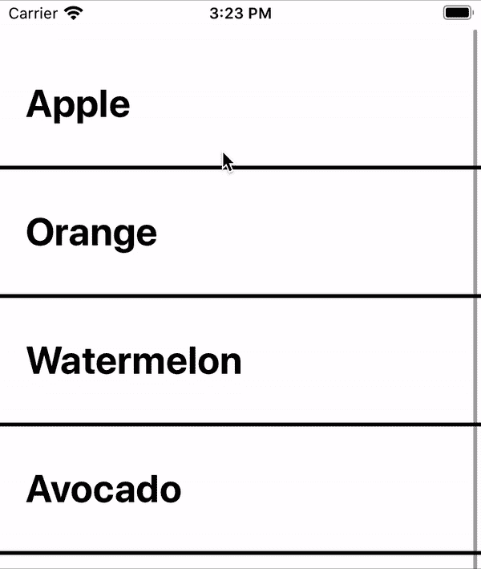
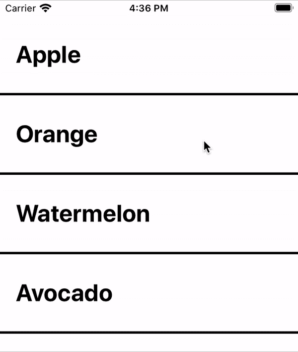

# 如何在 React Native 中创建自定义拉动以刷新动画

> 原文：<https://javascript.plainenglish.io/react-native-how-to-create-custom-pull-to-refresh-animations-aa0d14329dc0?source=collection_archive---------1----------------------->

## …通过使用洛蒂动画

# 什么是拉刷新？

我一直着迷于不同的 UI 交互，以及如此独特和不同的东西是如何变得如此熟悉和易于使用的。今天广泛使用的一个很好的例子是**拉至刷新**。

Pull to refresh on iOS

这种互动几乎可以在每个移动应用程序中找到，但我向你保证，99.99%的人从未听说过 [Loren Brichter](https://en.wikipedia.org/wiki/Loren_Brichter) ，即使我们每天都在使用他的作品。点击这里您可以了解更多关于拉至刷新如何诞生的信息[。](https://en.wikipedia.org/wiki/Pull-to-refresh)

从那时起，许多人想出了不同种类的自定义拉刷新动画。

Credits: [https://dribbble.com/shots/3026988-Pull-To-Refresh-Airbnb](https://dribbble.com/shots/3026988-Pull-To-Refresh-Airbnb)

Credits: [https://dribbble.com/shots/2242263--1-Pull-to-refresh-Freebie-Weather-Concept](https://dribbble.com/shots/2242263--1-Pull-to-refresh-Freebie-Weather-Concept)

This one’s my favorite. Stacking burgers! Credits: [https://dribbble.com/shots/10733383-Pull-to-refresh](https://dribbble.com/shots/10733383-Pull-to-refresh)

在四处挖掘之后，我意识到没有任何简单的方法来用 React Native 创建这些很酷的动画，所以我决定提出自己的解决方案。

# 我们开始吧

我想创造一些对开发者更友好的东西，因为很多解决方案只适用于特定的动画。介绍[洛蒂](https://lottiefiles.com/)

> 一个 **Lottie** 是一个基于 JSON 的动画文件格式，它使设计者能够在任何平台上发布动画，就像发布静态资产一样容易。它们是可以在任何设备上工作的小文件，可以在没有像素化的情况下放大或缩小。

使用 Lottie 可以让我们快速地将一个动画放入到我们的刷新组件中，并且自动运行。

这是我们今天要建造的东西:

Custom pull to refresh animation using Lottie

# 步骤 1:添加洛蒂动画

为了简单起见，我假设你们已经知道如何使用`FlatList`。对于那些想继续学习的人，我为这个教程创建了一个入门模板。你可以在这里[下载](https://github.com/Groftware/pulltorefreshtutorial)。下载后不要忘记运行项目中的`yarn install`或`npm install`，以确保安装了所有的依赖项。

你想做的第一件事是得到一个洛蒂动画。浏览 [Lottie 文件](https://lottiefiles.com/)，挑选一个你喜欢的动画，然后下载成 **Lottie JSON 格式**。在本教程中，我将使用这个:

Credits to Alex Martov: [https://lottiefiles.com/9258-bouncing-fruits](https://lottiefiles.com/9258-bouncing-fruits)

下载你想要的 Lottie 动画后，打开项目文件夹，将动画文件移动到`assets/`文件夹。同样，确保动画是一个`.json`文件！如果没有，回到 Lottiefiles，下载 JSON 版本。

I’ve renamed my animation to “bouncing-fruits.json”

现在您已经获得了动画文件，接下来要做的就是加载它并显示动画。为了做到这一点，我们需要使用 [**洛蒂**](https://www.npmjs.com/package/lottie-react-native)**-**[**react-native**](https://www.npmjs.com/package/lottie-react-native)。通过运行`yarn add lottie-react-native`(或使用`npm install lottie-react-native`)进行安装

导航到`FruitList.jsx`，在导入语句的正下方，添加以下内容:

现在在`styles`里面，让我们创建另一种风格，叫做`lottieView`

最后，激动人心的部分，让我们将现有的`FlatList`和`LottieView`包装成一个新的`View`。下面是`FruitList.jsx`的完整代码。

现在让我们运行应用程序，您可能会看到类似这样的内容

Bouncing fruits animation

厉害！只不过，当我们打开应用程序时，动画会立即运行。这并不完全是我们所寻求的…让我们弄清楚如何真正将它转化为一种更新的推动力。

# 步骤 2:在平面列表后面“隐藏”动画

*实现拉动刷新效果的想法很简单*

1.  将动画隐藏在`FlatList`后面。
2.  随着`FlatList`向下滚动，跟踪 y 偏移的变化(他们向下滚动了多少)，并且*适当地使*动画化。
3.  当用户释放滚动视图(`onResponderRelease`)时，检查偏移是否足以触发刷新。
4.  动画在整个刷新过程中保持可见。
5.  当刷新结束时，停止动画，然后`FlatList`向上滚动隐藏动画。

为了隐藏`Flatlist`后面的动画，我们所要做的就是回到`FruitList.jsx`并更新`LottieView`的样式。

> 对于那些没有使用 starter 项目的人来说,`FlatList`必须有一个透明的背景色(或者没有背景色),每行都应该有一个背景色。只有这样做，我们才能让`FlatList`向下滚动时动画可见。

# 第三步:跟踪滚动偏移

为了跟踪滚动偏移，我们将使用`onScroll`道具，然后将其存储到名为`offsetY`的状态中。

在`FruitList.jsx`的最顶部，修改导入语句以包括`useState`，然后创建一个名为`offsetY`的新状态。

创建一个接收滚动事件的功能`onScroll`，然后将 y 偏移量设置为状态。

然后记住将`onScroll`功能分配给 oncroll`FlatList`道具。

瞧！我们现在能够跟踪`Flatlist`的 y 偏移。现在让我们利用偏移 y，然后*根据偏移制作动画*。对我们来说幸运的是，`LottieView`给了我们支柱`progress`。以下是文档必须说明的内容:

> **进程:**0-1 之间的数字，或 0-1 之间的`Animated`数字。这个数字表示动画的标准化进度。如果您更新这个道具，动画将相应地更新到该进度值的帧。如果您使用的是命令式 API，则不需要该属性。

嗯……有趣。所以`progress`是决定动画帧的百分比。目前，我们有`yOffset`，如果您做`console.log(yOffset)`并向下滚动，您会看到如下内容:

> -0.5
> -15.5
> -75.5
> -101.5
> …

要将其转换为百分比(0 到 1 之间的值)，我们还需要刷新发生的高度。

方便的是，我们已经有了。看看`lottieView`款式，你会注意到`height`被设为`100`，这就是我们的身高。让我们通过在样式之上创建一个名为`refreshingHeight`的新变量来重构它。

现在要取得进展，我们所要做的就是`-offsetY / refreshingHeight`

在`onScroll`函数之后，我们将创建`progress`变量，并将其赋给`LottieView`道具。

如果你现在运行应用程序，你应该能够向下滚动，看到动画跟随你的滚动！

# 步骤 4:刷新时

还记得**第二步**中详述的计划吗？这是我们到目前为止所做的。

1.  h̶i̶d̶e̶̶t̶h̶e̶̶a̶n̶i̶m̶a̶t̶i̶o̶n̶̶b̶e̶h̶i̶n̶d̶̶t̶h̶e̶̶`F̶l̶a̶t̶L̶i̶s̶t̶`.̶
2.  a̶s̶̶t̶h̶e̶̶`F̶l̶a̶t̶L̶i̶s̶t̶`̶s̶c̶r̶o̶l̶l̶s̶̶d̶o̶w̶n̶,̶̶t̶r̶a̶c̶k̶̶t̶h̶e̶̶c̶h̶a̶n̶g̶e̶s̶̶i̶n̶̶y̶-̶o̶f̶f̶s̶e̶t̶̶(̶h̶o̶w̶̶m̶u̶c̶h̶̶d̶i̶d̶̶t̶h̶e̶y̶̶s̶c̶r̶o̶l̶l̶̶d̶o̶w̶n̶)̶,̶̶a̶n̶d̶̶a̶n̶i̶m̶a̶t̶e̶̶t̶h̶e̶̶a̶n̶i̶m̶a̶t̶i̶o̶n̶̶a̶p̶p̶r̶o̶p̶r̶i̶a̶t̶e̶l̶y̶.̶
3.  当用户释放滚动视图(`onResponderRelease`)时，检查偏移量是否足以触发刷新。
4.  动画在整个刷新过程中保持可见。
5.  当刷新结束时，停止动画，然后`FlatList`向上滚动隐藏动画。

让我们从创建另一个新状态`isRefreshing`开始。这将用于跟踪列表是否正在刷新。在`offsetY`状态下添加以下内容。

然后在`onScroll`函数之后创建函数`onRelease`。然后将其分配给 FlatList prop `onResponderRelease`。

# 步骤 5:刷新时动画保持可见

为了确保动画可见，我们将向现有的`FlatList`添加一个空的`ListHeaderComponent`，其中的`paddingTop`相当于`refreshingHeight`。

在`isRefreshing`下面，创建一个新的状态`extraPaddingTop`。这将为我们的不可见的`ListHeaderComponent`保存填充值。然后在`onRelease`函数中，刷新时将`extraPaddingTop`置为`refreshingHeight`，刷新完毕置为 0。

我们快到了！现在运行该应用程序将显示如下内容

有几件事似乎不太对劲。动画在刷新时不动，当刷新完成时，`FlatList`突然跳回原位。但是别担心，我们接下来会解决这些问题。

# 步骤 6:刷新时显示动画，刷新结束时隐藏

我们将从刷新结束时优雅地折叠`FlatList`开始。但在此之前，让我们稍微重构一下我们的代码。每当`isRefreshing`被更新时，让我们使用`useEffect`来更新其他状态。

现在我们在`onRelease`中要做的就是`setIsRefreshing`，我们的`useEffect`钩子会自动为我们设置填充。

现在，让我们用动画来解决这个问题。创建一个新的`ref`，并将其附加到`LottieView`，这样我们就可以在刷新时触发`play`功能。参考下面的代码。

最后，让我们在动画结束时让平面列表优雅地折叠。为此，我们将利用 React Native 的[动画](https://reactnative.dev/docs/animated) API，并将`extraPaddingTop`从固定值更新为动画值。

# 我们完事了。

Your newly completed pull to refresh animation

你可以在这里找到已完成的项目[。或者在 starter 项目中，可以检出到分支`completed`来查看完成的版本。](https://github.com/Groftware/pulltorefreshtutorial/tree/completed)

> 编辑:对于那些对使用作为组件感兴趣的人，我也把它作为一个 npm 包提供了。在这里查看。

 [## 软件开发

### 你准备好进入下一关了吗？🚀立即注册我们的时事通讯，接收新鲜出炉的软件开发…

eepurl.com](http://eepurl.com/gZEdtb) 

# 链接

*   洛伦·布里切特
*   [拉至刷新](https://en.wikipedia.org/wiki/Pull-to-refresh)
*   [洛蒂档案](https://lottiefiles.com/)
*   [洛蒂-反应-原生](https://www.npmjs.com/package/lottie-react-native)
*   [React 原生动画 API](https://reactnative.dev/docs/animated)
*   [首发项目](https://github.com/Groftware/pulltorefreshtutorial)
*   [已完成项目](https://github.com/Groftware/pulltorefreshtutorial/tree/completed)