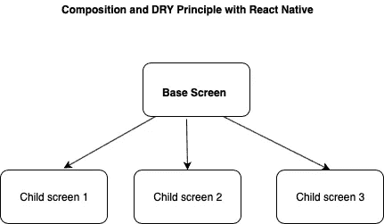

# 不要一遍又一遍地写同样的代码！

> 原文：<https://javascript.plainenglish.io/react-native-inheritance-following-dry-principle-a95332d2e56d?source=collection_archive---------4----------------------->

## 反应成分和干燥原理。

Avoid this !

Story Line

> **1。【功能不重复(干)】T1 使用作文**

Our **BaseScreen** which holds some common method for its clild screen

Child Screen Composition of **BaseScreen**

> **2。UI 不要**不要重复自己使用构图

Basic UI implementation with **Basic and repeatable** UI Components

Child UI Passed as **param** to **Base Screen**

> 感谢阅读！
> 
> 如果你喜欢这本书，请点击“拍手”。