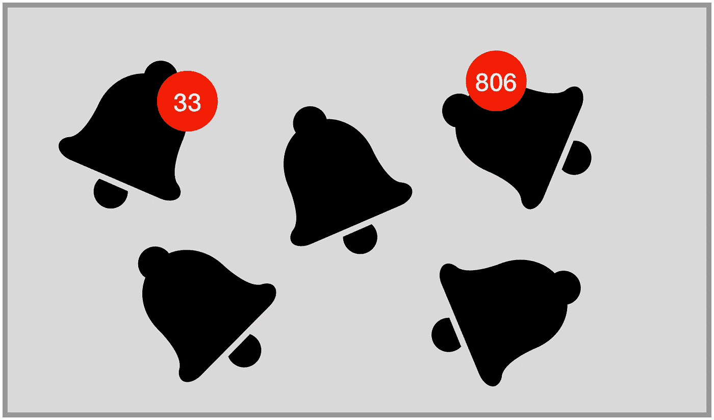

# 用服务器发送的事件对本机通知做出反应

> 原文：<https://javascript.plainenglish.io/react-native-local-notifications-with-server-sent-events-e1df2d2e3ffa?source=collection_archive---------1----------------------->



1.  *为什么？什么？等待..你在说什么？为什么呢？*
2.  *在 Express Node.js 服务器上设置服务器发送的事件*
3.  *在 React 本地应用中监听服务器发送的事件*

# *1。为什么？什么？等待..你在说什么？为什么呢？*

我想为我的 React 本机应用程序提供一些通知，但我认为推送通知看起来非常复杂，没有明确的方法来解释如何做，不赞成使用的库等。*(现在我更清楚了，因为* [*我花了很多时间挖掘这个主题*](https://medium.com/swlh/rn-push-notifications-a-complete-guide-front-back-8c238fc81d28) *)*

所以我挺郁闷的，因为我在 app 里建了聊天，没有推送通知的聊天不算聊天。

没有推送通知的聊天不算聊天？真的吗？

然后我意识到:我真的需要推送通知吗？我个人一点都不喜欢他们。对我自己来说，我把我所有的聊天软件(Messenger，WhatsApp，等等)和邮件都关掉了。我只为我的短信保留它们，因为我只接收我妻子的短信，为了我的婚姻，最好为我妻子保留推送通知…

所以我改变了我的应用程序的规格:严格来说，我想要的不是推送通知。我想要的是:

*   当我的应用程序在后台时，什么都不会发生——因为这是推送通知的区域，我现在没有能力设置它们。我不想要他们，更重要的是。是的，就是这样:不是我*不能*实现它们，而是我*不想*实现它们。甚至更好。
*   当我的应用程序从后台转到前台时，或者当它从头开始打开时，以某种通知的形式显示新消息。这很简单，只需从我的服务器上获取:问题甚至在拥有它之前就已经解决了。
*   当我的应用程序在前台时，如果有其他用户的新消息，就从他们那里获取。从技术上来说，这意味着:**我需要应用程序监听服务器，这个服务器在需要时发送数据**。

那是我在朋友 Google 上挖的，我发现了神奇的东西:**服务器发送事件**，也叫 **SSE。**我叫他们太多 SSE 了，我都忘了单词的意思了，我也经常叫技术服务器- *端*事件，不过反正。

你猜怎么着:我花了 2 到 3 个小时在我的应用程序中设置这个，时间包括谷歌搜索、编码部分、编码部分的失败和最后的成功，其中推送通知花了我至少 15 个小时。

所以让我们开始吧。

# *2。在 Express Node.js 服务器上设置服务器发送的事件*

嗯，没有比在那里放一段代码，加上注释更好的解释了。

只是给你个背景:我的 Node.js app 是用 Express 4.16.4 构建的。

```
const { getUserId } = require('../handlers/getUserId');const SSE_RESPONSE_HEADER = {
  'Connection': 'keep-alive',
  'Content-Type': 'text/event-stream',
  'Cache-Control': 'no-cache',
  'X-Accel-Buffering': 'no'
};*// We can't store our streams in database as they are response objects with javascript functions included*global.usersStreams = {} exports.setupStream = (req, res, next) => { let userId = getUserId(req);
  if (!userId) {
    next({ message: 'stream.no-user' })
    return;
  } *// Store this connection*
  global.usersStreams[userId] = {
    res,
    lastInteraction: null,
  } *// Writes response header*
  res.writeHead(200, SSE_RESPONSE_HEADER); *// Note: Heatbeat for avoidance of client's request timeout of first time (30 sec, can be fine tuned)*
  res.write(`data: ${JSON.stringify({type: 'heartbeat' })}\n\n`);
  global.usersStreams[userId].lastInteraction = Date.now() *// Interval loop*
  const maxInterval = 55000;
  const interval = 3000;
  let intervalId = setInterval(function() {
    if (!global.usersStreams[userId]) return;
    if (Date.now() - global.usersStreams[userId].lastInteraction < maxInterval) return;
    res.write(`data: ${JSON.stringify({type: 'heartbeat'})}\n\n`);
    global.usersStreams[userId].lastInteraction = Date.now()
  }, interval);function cleanConnection() {
  let userId = getUserId(req);
  clearInterval(intervalId);
  delete global.usersStreams[userId];
}req.on("close", cleanConnection);req.on("end", cleanConnection);};exports.sendStream = async (userId, data) => {if (!userId) return;
  if (!global.usersStreams[userId]) return;
  if (!data) return;const { res } = global.usersStreams[userId];res.write(`data: ${JSON.stringify(data)}\n\n`);
  global.usersStreams[userId].lastInteraction = Date.now();};
```

上面的代码运行良好，如果我参考一些专家的话[还不错，但我确信它应该得到改进，我很好奇你对此有什么看法。](https://stackoverflow.com/a/58823176/5225096)

所以让我们总结一下重要的事情:

*   一个`keep-alive`连接需要被刺激以保持活跃。可以在主题上找到一些[博客帖子](https://contourline.wordpress.com/2011/03/30/preventing-server-timeout-in-node-js/)以了解应该多长时间刺激一次，并且似乎对于 Node.js，连接在 2 分钟超时后关闭。我没有发现任何精确的东西，但是我设置了一个 55 秒的超时(代码中的`maxInterval`),它工作了。
*   注意你需要储存的是`response`，而不是`request`。这样你就可以使用`response.write`。不是`request.write`。
*   响应对象不能存储在数据库中，因为它不能序列化和重新膨胀，所以它需要存储在变量中。不需要`global`变量是因为你不在其他文件中使用它。

现在要写的内容流(`===`你发送的)，我花了一些时间来理解如何组织它。这就是为什么你只看到`**res.write('data:** some bullshit**\n\n')**`的原因，因为我在一个月前写了代码，我还没有想出如何使事情正常进行。现在我写这篇文章，我想解开这个谜，我做到了！以下是我了解到的情况，以及规格说明中提到的内容:

```
res.write('id: 12345\n')
res.write(':lines starting with : are comments and will be ignored')
res.write('event: message\n')
res.write('retry: 5000\n')
res.write(`data: ${JSON.stringify(anyDataObject)}\n\n`) 
```

*   正如`Content-Type: text/event-stream`告诉我们的，我们的流只有文本。这也意味着它可以是一个字符串化 JSON。所以让我们把我们正在发送的文本称为:**文本**，这样我们实际上就做了`res.write(TEXT)`
*   a `response`等看了`\n\n`才知道内容已经写完了，可以发送了。
*   一次可以发送多条文本:需要用`\n`将它们分开
*   以`:`开头的行将被视为注释，将被省略。
*   如果一行不是以`:`开始，而是包含在中间，那么它应该被解释为一个字段/值行，只有四个可用字段

**事件:**事件的类型。它将允许您对不同的内容使用相同的流。**客户可以决定只“听”一种类型的事件**，或者对每种事件类型做出不同的解释。

**数据:**消息的数据字段。你可以把连续的“数据”线。

**ID** :每个事件流的 ID。有助于跟踪丢失的邮件。

**重试:**这是一个我还不会使用的字段，因为我不明白为什么我会需要它，但是为了您的信息[我找到了这个解释](https://apifriends.com/api-streaming/server-sent-events/):

> 所有连接丢失后，浏览器尝试新连接之前所用的时间(毫秒)。重新连接过程是自动的，默认设置为 3 秒。在这个重新连接的过程中，最后收到的 ID 将自动发送到服务器… …这需要你自己用 Websockets 或长轮询来编码。

后端就是这样。很简单，对吧？

# *3。在 React 本地应用中监听服务器发送的事件*

这一部分也很简单:我们需要设置一个[事件源](https://developer.mozilla.org/en-US/docs/Web/API/EventSource)。我[看到](https://github.com/jordanbyron/react-native-event-source) `[react-native-event-source](https://github.com/jordanbyron/react-native-event-source)` [lib](https://github.com/jordanbyron/react-native-event-source) 在为 React Native 做这个工作(其实只是 JS，所以也可以在 React Native 之外使用)，但是在我的代码里没有用，不知道为什么。所以我所做的是在我的代码中残酷地复制粘贴`[RNEventSource](https://github.com/jordanbyron/react-native-event-source/blob/master/index.js)` [类代码](https://github.com/jordanbyron/react-native-event-source/blob/master/index.js)，以及`[EventSource polyfill](https://github.com/jordanbyron/react-native-event-source/blob/master/EventSource.js)` [和](https://github.com/jordanbyron/react-native-event-source/blob/master/EventSource.js):然后它在我的代码中工作得非常好。

这就是了！

```
import React from 'react';
import { AppState } from 'react-native';
import { BACKEND } from '../api';
import RNEventSource from '../event-source';class Notifications extends React.Component {
  state = {
    appState: AppState.currentState,
  }; componentDidMount() {
    AppState.addEventListener('change', this._handleAppStateChange);
    this.startStream();
  } _handleAppStateChange = async nextAppState => {
    const { appState } = this.state;
    const inactive = /inactive|background/;
    const active = /active/;
    if (appState.match(inactive) && nextAppState.match(active)) {
      this.startStream();
    }
    if (appState.match(active) && nextAppState.match(inactive)) {
      this.endStream();
    }
    this.setState({ appState: nextAppState });
  }; requestStreamWithBackend = userId => {
    return new RNEventSource(`${BACKEND}/stream/${userId}`);
  }

  startStream = () => {
    if (this.streamStarted) return;
    try {
      const { userId, catchServerSideEventRequested } = this.props;
      this.eventSource = this.requestStreamWithBackend(userId);
      this.eventSource.addEventListener('message', message => {
        catchServerSideEventRequested(message);
      });
      this.streamStarted = true;
    } catch (e) {
      console.log('startstream error', e);
    }
  }; endStream = () => {
    if (!this.eventSource) return;
    this.eventSource.removeAllListeners();
    this.eventSource.close();
    this.streamStarted = false;
  }; componentWillUnmount() {
    this.endStream();
  } render() {
    return null;
  }
}export default Notifications;
```

看着这段代码，您可能会想:如果我一直在渲染`null`，为什么我要使用 React 组件？首先，我在我的应用程序中设置了`redux`和`redux-saga`，但是我对`redux-saga`的`channel`设置不太适应，这是我完成这项工作所需要的。第二是`React.Component`生命周期实际上非常适合处理流的打开/重启/关闭循环:易于编写，易于理解……对我来说非常完美。第三:我实际上最终在我的应用程序中显示了通知，这是我在最终代码中呈现的…

反正那里没什么难懂的。

但是有一件事我花了太多时间才明白:`res.write('event: an-event-type\n')`和`this.eventSource.addEventListener('message', ...)`之间的关系。每次我在我的后端设置一个事件——比如`chat-message`或`test`或`prout`(这是我在测试时经常使用的一个词)——我在我的前端看不到任何东西。直到[我在](https://github.com/jordanbyron/react-native-event-source/blob/98b8730621f4ffeca865354ed7d2d22a8795a6bd/EventSource.js#L108) `[EventSource](https://github.com/jordanbyron/react-native-event-source/blob/98b8730621f4ffeca865354ed7d2d22a8795a6bd/EventSource.js#L108)` [polyfill](https://github.com/jordanbyron/react-native-event-source/blob/98b8730621f4ffeca865354ed7d2d22a8795a6bd/EventSource.js#L108) 中挖掘发现:

```
eventsource.dispatchEvent(eventType || 'message', event);
```

这意味着要用`res.write('event: chat-message\n')`接收流，需要设置`this.eventSource.addEventListener('chat-message', ...)`。

当你知道时，这听起来可能很愚蠢——对我来说确实如此，但我可以告诉你:我花了几个小时试图了解错误是来自后端，还是来自前端，或者其他什么…

# 结论

这篇文章到此为止，我认为它相当直截了当，但请告诉我是否可以修改它以使它变得更好。

最后一件事，回到与推送通知的比较:我们刚刚在我们的应用程序**中设置的是**推送通知系统，但只有当应用程序在前台时。而 Apple for iOS 或 Google for Android 处理的推送通知系统可能并没有严格使用 SSE，但我猜它是一种遵循相同原理的技术:**任何推送通知都需要服务器发送一个流给正在监听服务器的软件。**对于苹果/谷歌推送通知，是苹果/谷歌服务器通过某种*(我不知道)*方法发送通知到 iOS/Android 软件，监听他们的服务器。对于我们的本地通知，是我们通过服务器发送的事件向我们的应用软件发送通知。

女士们，先生们，女士们，先生们，干杯

# 🍻

# 参考

[](https://www.html5rocks.com/en/tutorials/eventsource/basics/) [## 使用服务器发送的事件流更新- HTML5 Rocks

### 如果您无意中看到这篇文章，并对“服务器发送事件(SSEs)到底是什么”感到疑惑，我不会感到惊讶…

www.html5rocks.com](https://www.html5rocks.com/en/tutorials/eventsource/basics/) [](https://apifriends.com/api-streaming/server-sent-events/) [## 用用例解释服务器发送的事件

### 在过去几个月与许多开发人员讨论后，我意识到他们中的很大一部分…

apifriends.com](https://apifriends.com/api-streaming/server-sent-events/) [](https://jasonbutz.info/2018/08/server-sent-events-with-node/) [## 服务器发送的带有节点的事件

### 服务器发送事件(SSEs)允许从服务器到客户端的单向通信。他们可以非常有用的东西…

jasonbutz.info](https://jasonbutz.info/2018/08/server-sent-events-with-node/) [](https://developer.mozilla.org/en-US/docs/Web/API/EventSource) [## 事件源

### EventSource 接口是 web 内容与服务器发送的事件的接口。EventSource 实例打开一个持久的…

developer.mozilla.org](https://developer.mozilla.org/en-US/docs/Web/API/EventSource) [](https://github.com/jordanbyron/react-native-event-source) [## 约旦拜伦/反应-本地-事件-来源

### React 本机应用程序的服务器发送事件！基于@remy 的 EventSource polyfill。在您的…中运行以下命令

github.com](https://github.com/jordanbyron/react-native-event-source)  [## 服务器发送的事件

### 该规范定义了一个 API，用于打开 HTTP 连接，以便从服务器接收推送通知…

www.w3.org](https://www.w3.org/TR/2009/WD-eventsource-20090421/)