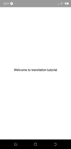
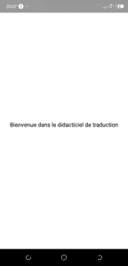
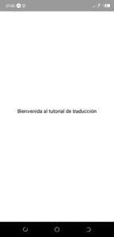

# React Native Localize:如何构建多语言应用程序

> 原文：<https://javascript.plainenglish.io/react-native-localize-how-to-build-multi-lang-app-b8604884baca?source=collection_archive---------1----------------------->

## 本地化意味着调整应用程序的翻译，以适应客户的特定国家或地区。支持多种语言(包括 RTL 语)对于任何成功的移动应用程序来说都是一个关键的特性，因为它向更大的人群开放了用户基础，并且极大地改善了用户体验。


React Native 中的本地化可能有点棘手，这就是我们写这篇教程的原因。让我们看看如何优雅地本地化 React 本地应用程序。

## 装置

expo-localization 是一个 expo 库，用于获取用户的语言环境信息，并对你的应用进行本地化。它提供了有关用户的地区、时区、区域和货币代码的信息，所有这些信息都可以帮助您定制应用程序的用户体验。让我们通过运行以下命令来安装这个包:

```
expo install expo-localization
```

**i18n-js** 携手 *expo-localization* 实现 React 原生移动& web 应用的本地化。

> 这是一个小库，提供 JavaScript 上的 Rails I18n 翻译。

```
yarn add i18n-js
```

lodash.memoize 是另一个我们需要用来缓存翻译的库。让我们也安装它:

```
yarn add lodash.memoize
```

## 创建翻译配置文件

假设我们想在 React 本地应用程序中支持 3 种语言:法语、英语和西班牙语。让我们为它们添加一个配置 json 文件，如下所示:

**fr.json**

```
//fr.json
{
    "welcome": "Bienvenue dans le didacticiel de traduction"
}
```

**en.json**

```
//en.json
{
    "welcome": "Welcome to translation tutorial",
}
```

**es.json**

```
//es.json
{
    "welcome": "Bienvenida al tutorial de traducción",
}
```

## 反应本地本地化——代码魔术

现在，我们已经准备好了配置文件，并且安装了所需的依赖项，让我们来实际实现 React 本地应用程序的本地化。

让我们创建一个名为***im localized . js***的文件，并添加以下代码片段。你可能已经猜到了，在 [Instamobile](https://www.instamobile.io/) ，我们正在使用完全相同的机制来本地化我们的 React 原生应用，这就是我们得到这段代码的地方。请随意将 IMLocalized 重命名为您自己的原始名称，但在本教程中我们将使用它(IM 前缀代表 *Instamobile* )。

```
import memoize from 'lodash.memoize'; // Use for caching/memoize for better performance
import i18n from 'i18n-js';
import * as Localization from 'expo-localization';
import { I18nManager } from 'react-native';

export const translationGetters = {
  'es-US': () => require('./es.json'),
  'en-US': () => require('./en.json'),
  'fr-FR': () => require('./fr.json'),
};

export const IMLocalized = memoize(
  (key, config) =>
    i18n.t(key, config).includes('missing') ? key : i18n.t(key, config),
  (key, config) => (config ? key + JSON.stringify(config) : key),
);

export const init = () => {

  let localeLanguageTag = Localization.locale;
  let isRTL = Localization.isRTL;

  IMLocalized.cache.clear();
  // update layout direction
  I18nManager.forceRTL(isRTL);
  // set i18n-js config
  i18n.translations = {
    [localeLanguageTag]: translationGetters[localeLanguageTag](),
  };
  i18n.locale = localeLanguageTag;
};
```

功能细分:

*   **init()** 计算出用户的地区并配置 i18n
*   **IMLocalized()** 接受存储在我们的配置文件中的字符串值的键，并获取它们的值，而 *lodash.memoize* 帮助缓存获取的值(巨大的性能优势)
*   **translationGetters()** 根据用户的语言环境获取正确的配置文件

## 创建您的视图

为了测试我们的应用程序，让我们构建一个简单的自定义 UI，以展示强大的本地化组件。

```
import React from 'react';
import {IMLocalized, init} from './IMLocalized';
import { View, StyleSheet, Text } from 'react-native';

export function WelcomeScreen(params) {
    init();
    return(
        <View style={styles.container} >
            <Text style={styles.welcomeText} >
                {IMLocalized('welcome')}
            </Text>
        </View>
    )
}

const styles = StyleSheet.create({
    container: {
        flex: 1,
        justifyContent: "center",
        alignItems: "center"
    },
    welcomeText: {
        fontSize: 16,
    }
})
```

注意使用 **IMLocalized** 。我们没有向文本组件提供简单的“欢迎”字符串，而是用一个 **IMLocalized** 调用来包装它。这是我们如何实现支持多种语言(包括 RTL 语)的反应式本地本地化的关键部分。该应用程序会神奇地以正确的语言显示“欢迎”字符串(根据用户的设备设置)，而不是显示硬编码的英语字符串。

运行您的应用程序应该如下所示:



**英语**

将设备设置更改为西班牙语，然后重新打开应用程序。请注意该字符串现在在西班牙语中的形式:



**西班牙语**

再次将设备设置更改为法语:



**法语**

## 结论

本地化您的应用程序对于接触到来自世界各地的更广泛的客户非常重要。正如我们在上面看到的，本地化您的应用程序并不是一个可怕的过程。

通过使用我们的 ***IMLocalized*** 方法，您可以简单地翻译我们应用程序中的所有字符串，将它们包装在一个 ***IMLocalized*** 调用中。您可以在所有其他移动编程语言中遵循类似的模式，如 [Swift](https://www.iosapptemplates.com/) 、[flute](https://www.instaflutter.com/)或 [Kotlin](https://www.instakotlin.com/) 。

一旦你建立了基础设施，增加对多种语言(包括 RTL)的支持就非常简单了。简单地将硬编码的字符串包装到一个翻译方法中就足够了。

## **JavaScript 简单明了**

喜欢这篇文章吗？如果是这样，通过 [**订阅我们的 YouTube 频道**](https://www.youtube.com/channel/UCtipWUghju290NWcn8jhyAw) **获取更多类似的内容吧！**