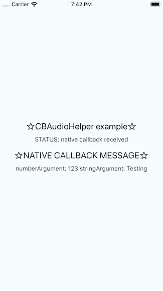
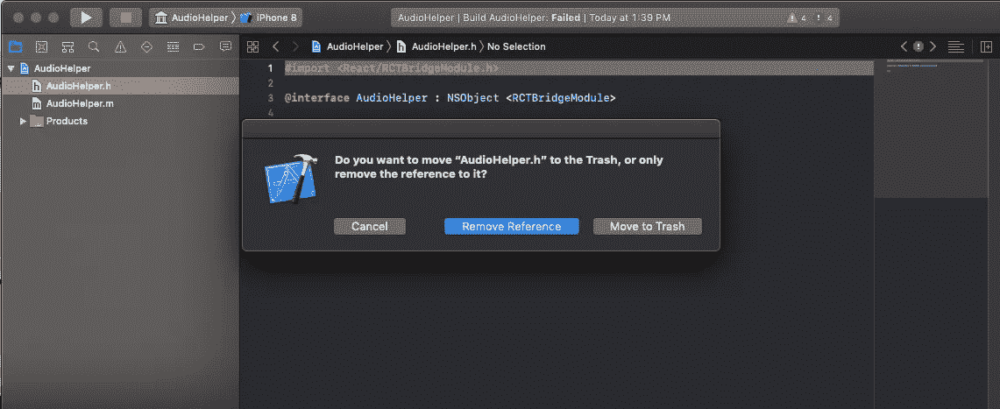
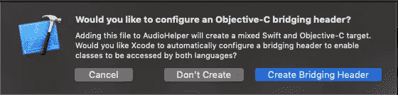

# 使用 Swift 反应本地-本地模块

> 原文：<https://javascript.plainenglish.io/react-native-native-modules-with-swift-6768ea03b3f?source=collection_archive---------0----------------------->


# 介绍

使用原生模块和访问 iOS 原生库似乎是一项艰巨的任务，但事实并非如此。这可能需要一些时间来适应，但它并不像你想象的那么难。只是一个公平的警告，你将不得不与 Objective-C 和 Swift 合作。

我的原生模块之旅始于我自愿为 React Native 创建一个与 Swift SDK 交互的模块的工作。这个教程不会和我工作中的项目有关，但是会是一个会播放一个. wav 文件的模块。我将向您展示如何创建一个模块来利用 iOS 中的 AVAudioPlayer 库。

# 基本设置

让我们从一个我们可以使用的示例项目开始创建我们的本机模块。

第一步是获得 React Native [文档](https://facebook.github.io/react-native/docs/native-modules-setup)中使用的 create-react-native-module 工具。

```
Yarn global add creat-react-native-module
```

# 创建我们的项目

在我们安装了 create-react-native-module 之后，是时候创建我们的本机模块项目了。

```
Create-react-native-module --package-indentifier io.myaudiolibrary ---generate-example AudioHelper.
```

您现在将拥有一个名为**react-native-audio-helper**的项目目录，其中包含另一个项目的**示例**子文件夹。

根文件夹**react-native-audio-helper**是我们将创建的本机模块，而**示例**文件夹是我们将用来访问本机模块的项目。

如果您不做任何修改就运行示例项目，它将如下所示:



# 沟通目标-C 和 Swift

让我们开始创建 Objective-C 和 Swift 之间的桥梁。

进入**react-native-audio-helper/IOs**文件夹，使用 XCode 打开名为`AudioHelper.xcodeproj`的代码项目。

我们应该做的第一件事是在`AudioHelper.m`的顶部插入`#import <React/RCTBridgeModule.h>`。

我们将删除`AudioHelper.h`文件，但我们希望保留 RCTBridgeModule 头。



继续删除`AudioHelper.h`，点击“移至垃圾桶按钮”。

是时候创建一个 swift 文件了，创建一个桥接头文件，将 Objective-C 文件暴露给 Swift。苹果在这里提供了一个体面的解释。



文件->新建->Swift 并将其命名为`AudioHelper.swift`，点击**创建桥头**，这将创建两个新文件:

`AudioHelper.swift`

`AudioHelper-Bridging-Header.h`

将此代码复制并粘贴到 AudioHelper 中。swift:

```
**var** player: AVAudioPlayer?**@objc(AudioHelper)
class** AudioHelper: NSObject {

   **@objc(playSound:)
   func** playSound(url: String) {
      **guard** **let** url = URL.init(string: url) **else** { **return** }
      **do** {
         **if** **#available**(**iOS** 10.0, *) {
            **try** AVAudioSession.sharedInstance()
                .setCategory(.playback, mode: .default)
         } **else** {
            // Fallback on earlier versions
         } **try** AVAudioSession.sharedInstance().setActive(**true**)
         /* The following line is required for the player to work on iOS 11\. Change the file type accordingly*/ player = **try** AVAudioPlayer(contentsOf: url, fileTypeHint: AVFileType.mp3.rawValue) /* iOS 10 and earlier require the following line:
         player = try AVAudioPlayer(contentsOf: url, fileTypeHint: AVFileTypeMPEGLayer3) */ **guard** **let** player = player **else** { **return** }
         player.play()
      } **catch** **let** error {
      print(error.localizedDescription)
      }
   }
}
```

如果您不熟悉 Objective-C 或 swift，那么在 Swift 代码中使用`@objc`语法是连接两种语言的关键。将`@objc`放在 swift 类或函数之前会将其暴露在 Objective-C 方面。

AudioHelper.m 应该是这样的:

```
**@interface** RCT_EXTERN_MODULE(AudioHelper, NSObject) RCT_EXTERN_METHOD(playSound:(NSString *)url)**@end**
```

**RCT _ 外部 _ 模块**和**RCT _ 外部 _ 方法**宏暴露了`AudioHelper` swift 类和`playSound`函数来对本机和 Javascript 做出反应。

保存项目后，我们将进入示例文件夹并重新安装新的更改:

```
rm -rf node_modules && yarn install
```

这将把我们在 AudioHelper 模块中所做的更改更新到我们将要测试的示例项目中。

# 桥接 Objective-C 和 JavaScript

如果您已经习惯了使用 Native，那么 Javascript 部分非常简单。

```
import React, { Component } from ‘react’;
import { Platform, StyleSheet, Text, View } from ‘react-native’;
import AudioHelper from ‘react-native-audio-helper’;export default class App extends Component<{}> { componentDidMount() {
      AudioHelper.playSound(“/Directory/To/Some/Mp3/Music.mp3”);
   } render() {
      return (
         <View style={styles.container}>
            <Text style={styles.welcome}>☆AudioHelper    example☆</Text>
         </View>);
   }
}const styles = StyleSheet.create({
   container: {
      flex: 1,
      justifyContent: ‘center’,
      alignItems: ‘center’,
      backgroundColor: ‘#F5FCFF’,
   },
});
```

我在这里做的是最小化自动生成的与我们的应用程序一起工作的示例项目。

代码中最重要的部分是 import 语句:

从`react-native-audio-helper;`导入 **AudioHelper**

以及调用本地函数调用来播放音频文件:

`AudioHelper.playSound(“/Directory/To/Some/Mp3/Music.mp3”);`

确保你有一个可以播放的音频文件来测试这个应用。我只是用了我硬盘上的一首旧曲目。

# 思想

本教程只是创建 React Native-Native 模块的第一步。这足以让您入门，但它有局限性，因为它只允许您从 Javascript->Swift 进行调用。我计划写更多关于本机模块的教程，包括回调、事件和线程等主题。

## 继续学习…

*   [本机模块回调](https://medium.com/@richardpetrov/react-native-native-modules-callbacks-in-swift-db627876e20f)