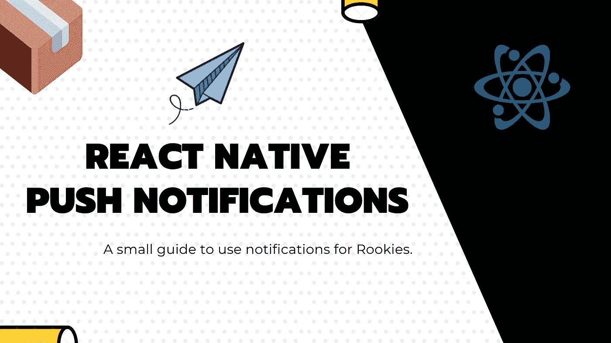

# 面向新手和技术人员的 React 本地推送通知指南

> 原文：<https://javascript.plainenglish.io/react-native-push-notifications-guide-for-rookies-and-techies-c890db40761f?source=collection_archive---------4----------------------->

## 跨平台移动基础知识

## 关于 React 本地项目上移动通知行为的最初假设和现实的小指南。

我已经被问过，我也见过很多次人们问关于推送通知和它在 react-native 中应该如何工作的问题。由于大多数本地采用者通常都是有 web 背景的人，他们不太了解通知行为。

以下是我在 Reddit 上收到的一个常见问题。

# ❓什么是推送通知？

**👨🏻‍🔬推送通知是通过网络发送到移动设备的具有标题、描述、对象有效载荷和一些参数的消息。**这些信息将用于在用户设备上显示通知窗口小部件，可以是图像、链接和许多其他东西。

它的主要目的是邀请用户做一些事情(吸引他)或者通知他一些有趣的事情。

# 如何发送推送通知？

最初，通知只是与设备安装相关联的推送令牌。稍后，这个推送令牌可以用于针对特定的设备，但在所有情况下，有人(你或你的提供商)必须到达**苹果** (APNS)或**谷歌** (FCM) **服务器**。

当您可以将这个令牌与一些目标数据相关联时，事情就开始变得有趣了…在这里，一些公司将他们的业务建立在丰富通知系统上。

利用那些公司工具会让你迭代得更快更好。

有很多，但出于本文的目的，**我们将重点关注那些与 react-native 配合良好的。**

以下是我个人认为的五大推送通知平台。

*   [**Firebase 云消息**](https://firebase.google.com/docs/cloud-messaging/) ，与其他 Firebase 产品配合非常好，尤其是针对目标。
*   [**OneSignal**](https://onesignal.com/) ，有个很有意思的 free-tier，真的在做很多事情。SDK 也不错。
*   [**推动**](https://pushbots.com/) ，看起来像一个信号。
*   [**批**](https://batch.com/) ，确实爽，但是贵。
*   [**世博**](https://docs.expo.io/versions/latest/guides/push-notifications/) (有点不同，因为是 RN 的完整框架)。

这些工具提供了一个仪表板来发布通知活动，你真的应该考虑那些发送你的通知。

# 我如何在前端处理通知？

为此，最好使用库。

大多数通知提供者，为他们的服务提供库，明白他们被绑定到服务本身并且不在任何其他地方工作。

其他一些库是通用的，最好的选择是 [WIX 本地通知](https://github.com/wix/react-native-notifications)，这是最完整和最新的免费解决方案。还有一个很棒的工具叫做[notifie](https://notifee.app/)，这是一个宣布的很棒的库，用来处理 react native 上的通知。

# 有没有可能在推送通知到达的时候触发一个功能？

是的，但是事情并不像看起来那么简单。它需要一些本地代码，一些推送提供者为此提供了很好的钩子函数。

**应用程序在前台**

大多数提供者给钩子函数在后台触发代码，所以是的，非常容易。这个案子你不会有任何问题。

**应用在后台**

你首先需要在 IOS 上启用后台通知，有时这可能有点棘手，因为 javascript 可能不会被调用。虽然这不可行，但是没有真正的保证，你应该总是认为你的代码仍然在工作，即使回调函数没有被调用。

**应用程序被终止**

这里无法使用 javascript 触发代码。你必须完全依靠本地代码或深层链接来触发应用程序在特定屏幕上打开。

那么，处理通知操作的最安全方式是什么呢？

# 使用深度链接

深层链接是匹配自定义模式的链接。在你可能见过的网页上，`http://thing.com`深层链接可能是`myapp://somestring`。

一旦应用程序使用[链接 API](https://facebook.github.io/react-native/docs/linking#getinitialurl) 打开，我们就可以解析字符串，并对打开的应用程序执行一些操作。

总是认为你的应用程序就像薛定谔猫一样，只要你没有点击通知，你的应用程序就会处于什么也没发生的状态。一旦应用程序使用深层链接的 intent 参数打开，或者收到 SDK 的通知，您应该采取副作用。