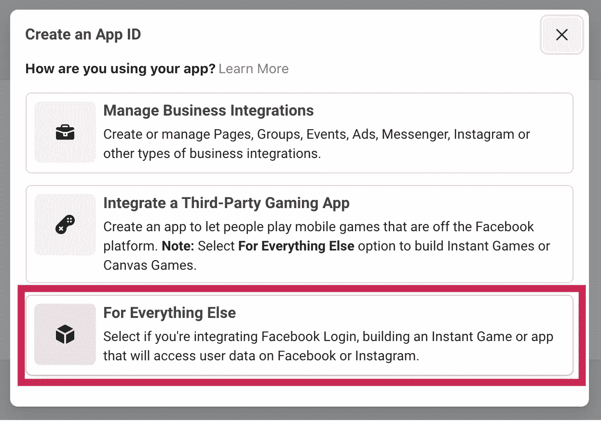
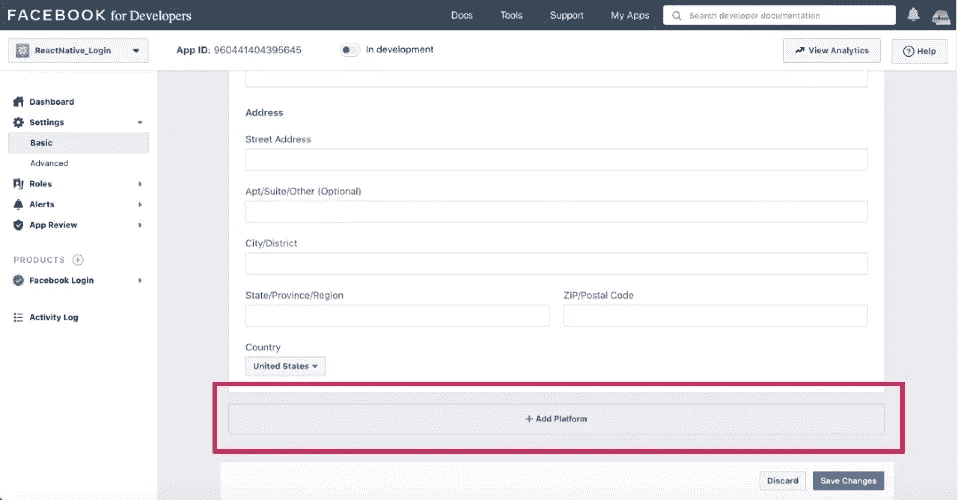
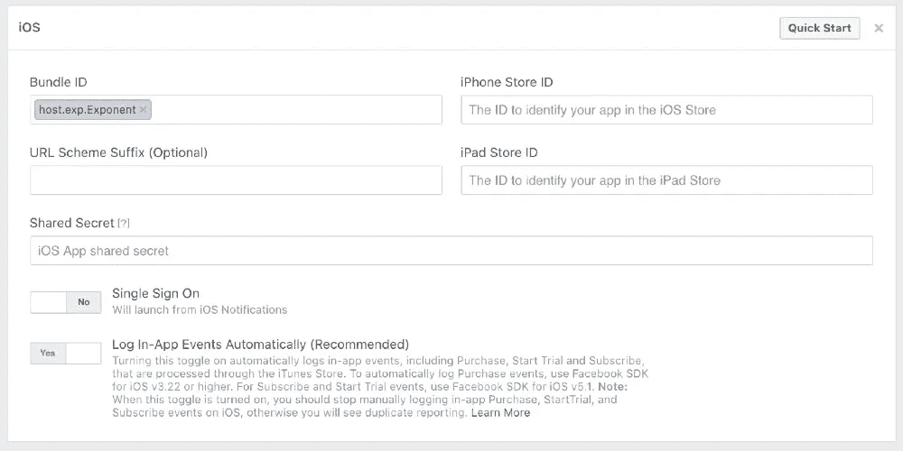
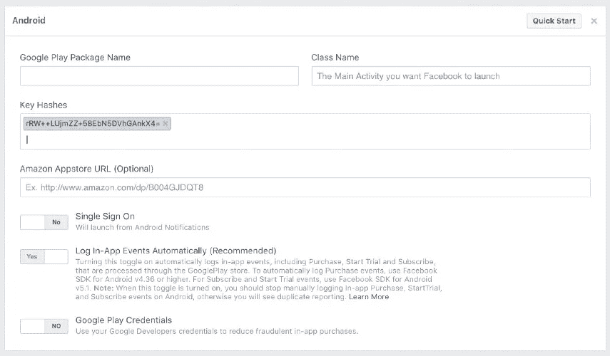
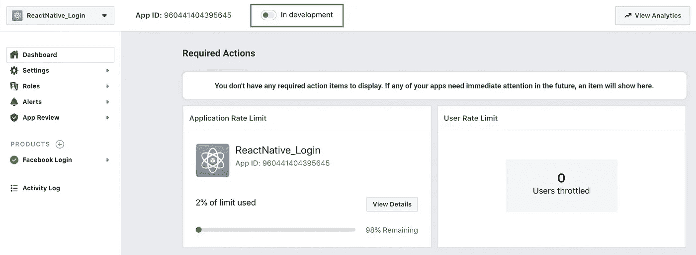
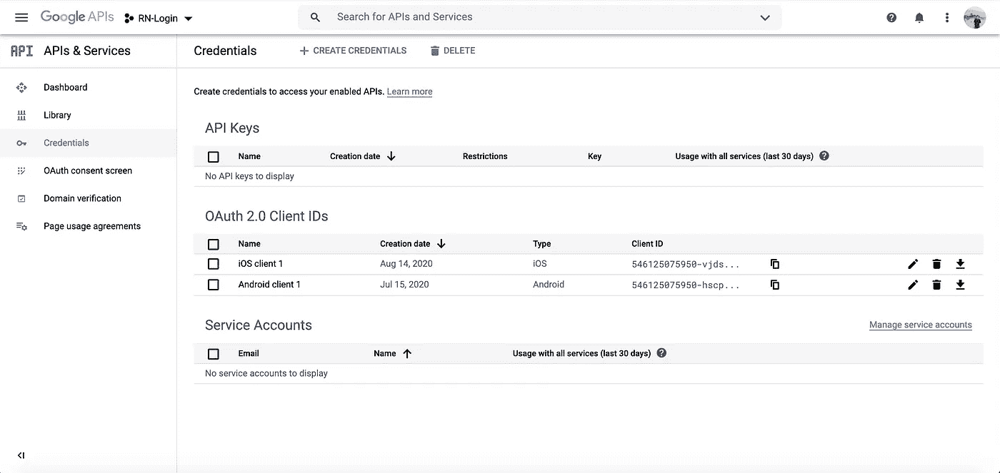
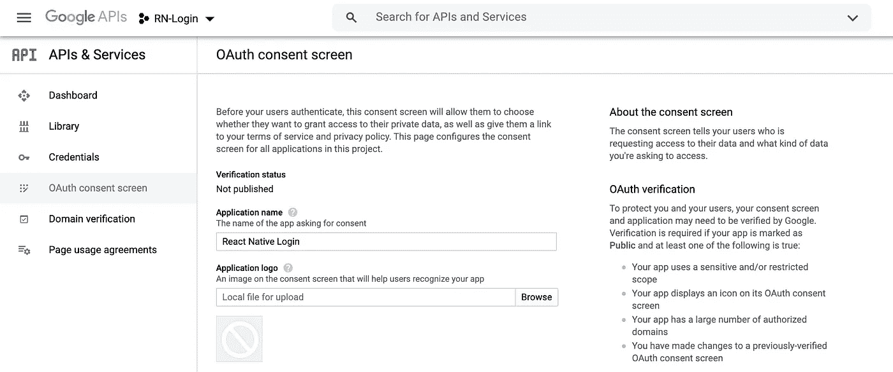
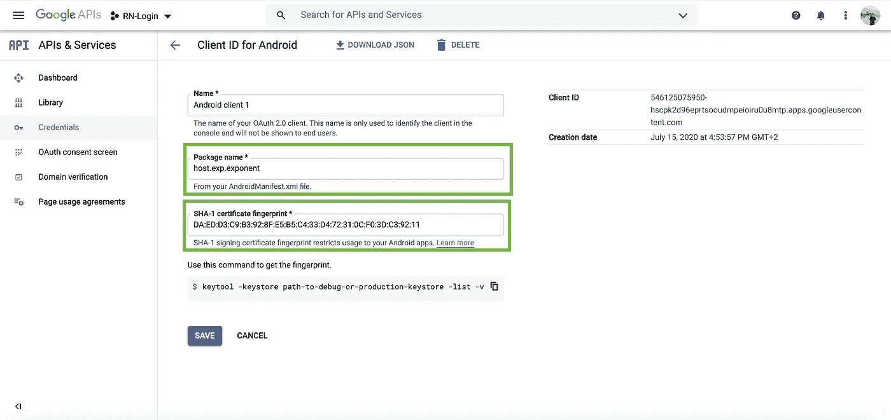

# 如何向 React 本地应用添加社交登录

> 原文：<https://javascript.plainenglish.io/react-native-social-login-2a7945fa19?source=collection_archive---------0----------------------->


## 一个关于如何在你的应用程序中添加脸书和谷歌认证的前端教程

使用您的社交媒体帐户来加快创建新应用程序和网络帐户的过程意味着在共享您的个人数据方面做出妥协，以便不必记住另一个用户名和密码。

然而，[大多数用户决定做出这种妥协](https://marketingland.com/gigya-survey-88-of-u-s-consumers-say-they-have-used-social-logins-134933)的事实意味着你绝对应该考虑在你的应用程序中加入社交登录，因为如果你不这样做，用户[可能永远不会费心安装你的应用程序](http://www.webhostingbuzz.com/blog/wp-content/uploads/2013/03/Who-s-sharing-what.jpg)。

因此，在本教程中，我将带您了解如何在 React 本地前端应用程序中设置脸书和谷歌登录的步骤。


I recently added Facebook and Google authentication flow to my Social media UI theme

**社交媒体 UI 主题**:这个演示是 React 原生社交媒体 UI 主题的一部分。你可以使用[这个链接](https://market.nativebase.io/view/react-native-social-networking-theme)来测试和购买源代码。

**React Native 资源:**有兴趣在收件箱中接收我的 React Native 每周简讯，其中包含有趣的文章、教程、视频和资源吗？[在此报名](http://knowlephant.com/)。

> **注意:**下面的教程展示了在您的 Expo 客户端应用程序中安装谷歌和脸书登录的步骤。对于设置独立或弹出的 Expo 应用程序，这些说明可能略有不同。

# 脸书认证

设置社交认证听起来可能很麻烦，但实际上并没有那么难。

With Expo‘s [Facebook Login](https://docs.expo.io/versions/latest/sdk/facebook/) and [Google App Auth](https://docs.expo.io/versions/latest/sdk/google/) SDKs any developer, beginner or experienced, can set this up.

在你的应用中设置社交登录的最大挑战是注册你的*脸书应用 id*和*谷歌客户端 id。*

所以先从这些说起。

## 注册脸书应用 ID

脸书应用 ID 用于获得脸书的授权，以使用他们的 API 登录您的应用。为此，你必须首先在你的个人[脸书开发者账户](https://developers.facebook.com/)中注册你的应用。

这个过程有 3 个步骤:

第一步:创建一个 FB 开发者账户。


**第二步:**新建一个 app。


**第三步:**注册一个新的脸书应用 ID。



现在，您应该会返回到您的应用仪表板，顶部会显示*应用 ID* 。

接下来，在你的应用的仪表盘中，点击`Setting → Basic`，然后点击`Add Platform → iOS`。



在 *iOS* 块的 *Bundle ID* 字段中，提供以下输入:`host.exp.Exponent`



…让其余的保持原样。

> **注意:** *此*捆绑 id *(上图)和*密钥散列*值(下图)仅适用于使用 Expo Cli 应用测试您的应用。在 app store 内发布的应用程序(独立应用程序)必须使用它们自己唯一的*捆绑 ID *和*密钥散列*值。*

要设置您的 Android 权限，请对 Android 重复这些步骤。一旦要求输入`Key Hashes`值，插入以下字符串:`rRW++LUjmZZ+58EbN5DVhGAnkX4=`



## 使用世博会的脸书 API 处理登录

在我们继续申请我们的 Google 客户端 id 之前，让我们先写一些代码，看看脸书认证在我们的应用程序中的运行情况。

通过在命令行提示符下运行以下命令，开始在我们的应用程序中安装 Expo 的`expo-facebook` SDK:

```
$ expo install expo-facebook
```

让我们在登录屏幕上添加一个脸书登录按钮:

为了获得使用脸书 SDK 的许可，我们必须确保首先在`useEffect`中启动 SDK。

*   要实现这一步，请确保能够访问我们之前创建的*脸书应用 ID* 。

> ***注:*** *在第一个参数中插入脸书* App ID *是可选的，但如果没有它，使用世博 App 测试登录时，所有登录尝试都会自动取消。*
> 
> *对于独立构建，您必须将* `*facebookScheme*` *、**、* `*facebookDisplayName*` *添加到您的* app.json *文件中，这些文件的值都可以在步骤 4* *中找到。*

接下来，通过使用以下代码添加一个新的 facebookLoginPress 处理函数来更新您的登录组件:

这里发生的是，一旦我们按下 FB 登录按钮，用户被要求许可。一旦提供许可，呼叫将继续检查用户是否已经登录到安装在他们电话上的脸书应用程序:

*   如果*是*，则返回一个令牌，该令牌可用于处理到主屏幕的导航。
*   如果*否*，则要求用户首先登录，之后提供令牌。

有了提供的令牌，我们现在可以调用脸书 API——参见上面的 *fbLogin* 函数——来收集用户特定的数据，比如名称和 profileImage url。

> 有关如何使用 React 上下文在 React 本地应用程序中创建流畅的登录体验的更多信息，请查看链接。

如果你想让脸书的登录对外界公开，那么请确保在你的 FB dev 帐户中设置你的登录应用程序为“live ”:



Set this setting to ‘live’ to allow other users to use FB login in your app

仅此而已。脸书登录已准备好测试。

# 使用 React Native 登录 Google

Google 身份验证的方法或多或少与上面类似。这意味着我们首先要在[谷歌开发者控制台](https://console.developers.google.com/apis/credentials)内建立一个谷歌开发账户，在那里我们可以申请我们的*安卓客户端 id* 和 *iOS 客户端 id* 。

**第一步:**一旦进入点击`Select a project -> New Project`。给你的新项目起个名字，然后点击*创建*。然后，您将被重定向回以下屏幕:



My android and iOS client ids are already installed

**第二步:**点击`+ CREATE CREDENTIALS -> oAuth client ID`。

您将被要求转到*配置同意*屏幕。在这里，选择`External User Type`并按下*创建*。

在 *OAuth 同意界面*中，只需提供您的申请名称，然后按*保存*。



接下来，点击`Credentials → + CREATE CREDENTIALS → oAuth client ID`并为您的应用类型选择 *Android* 。

在`Package name`字段中，添加:`host.exp.exponent`(见下图)。

接下来，转到命令行提示符，输入以下命令:

```
$ openssl rand -base64 32 | openssl sha1 -c
```

这将返回一个字符串，您可以将它复制/粘贴到
`SHA-1 certicicate fingerprint`字段中。



…然后按下*创建*。

您将会看到一个客户端 ID，您需要马上使用它。

至此，我们的 Google app Android 权限设置完成。要包含 iOS 权限，只需对 iOS 重复上述过程。

# 使用世博会的 Google API 处理登录

现在，让我们再写一些代码。

让我们通过添加第三个按钮来更新我们的登录按钮视图。为此，我们需要更新我们的登录屏幕:

准备好视图后，让我们继续登录处理程序。

让我们从使用`expo-google-app-auth` [SDK](https://docs.expo.io/versions/latest/sdk/google/) 扩展我们的项目开始。为此，在您的终端中运行以下命令:

```
$ expo install expo-google-app-auth
```

> **注意:** Expo 提供了第二个 GoogleSignIn SDK，它提供了许多额外的可访问性方法。然而，SDK 不允许使用 Expo 客户端应用程序进行测试。Expo GoogleSignIn 只能与独立的(在商店中发布的)Expo 应用程序一起使用。

接下来，让我们编写我们的 Google 登录处理函数。为此，用以下代码更新您的登录屏幕。

# 处理谷歌注销

Expo 的 Google Auth SDK 提供了自己的注销方法。通过这种方法，我们可以同时让用户从他们的谷歌服务账户中注销——这在脸书软件开发工具包中是不可能的。

因此，让我们在 Home 组件的注销处理程序中快速实现这一点:

这样我们的设置就完成了。来吧，试一试！

如果您觉得这篇文章很有用，您可能也会对我以前的一个教程感兴趣，这个教程重点介绍了如何使用 React Native 构建漂亮的登录屏幕:

*   [使用 React Native 创建流畅的登录和注销体验](https://medium.com/javascript-in-plain-english/creating-a-smooth-sign-in-and-logout-experience-with-react-native-62e5deffbff)
*   [如何用 React Native 构建动画登录屏幕](https://medium.com/javascript-in-plain-english/how-to-build-animated-login-screens-with-react-native-edb81cb500aa)