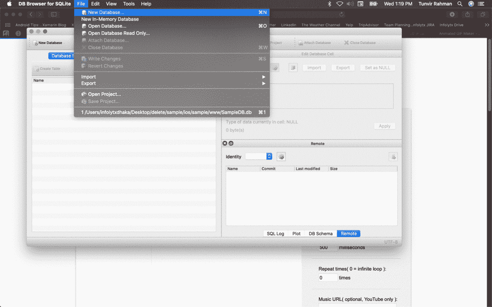

# 只需三个步骤即可对原生 SQLite 集成 Notes[iOS]做出反应。

> 原文：<https://javascript.plainenglish.io/react-native-sqlite-integration-notes-ios-807b66142b0a?source=collection_archive---------9----------------------->

## 简单的逐步过程。


Photo by [Jan Kolar (www.kolar.io)](https://unsplash.com/@jankolar) from [Unsplash](http://unsplash.com)

**项目设置**

**第一步:**先安装[**react-native-SQLite-storage**](https://github.com/andpor/react-native-sqlite-storage)

```
 npm install react-native-sqlite-storage
```

**第二步:**运行

```
open ./ios/podfilepod 'react-native-sqlite-storage', :path => '../node_modules/react-native-sqlite-storage'
```

**步骤 3:** 现在安装 pod

```
cd ./ios && pod install
```

iOS 安装完成。

**准备 SQLite 数据库**

*   下载并安装 [**DB 浏览器**](https://sqlitebrowser.org/dl/) **。**
*   创建一个 SQLite 数据库。



Create new SQLite DB

*   现在在 XCode 中打开 iOS 项目，找到 **appDelegate.h** 位置，创建 **www** 文件夹，粘贴 **yourDB.db** 到那里。


Link The db file to xcode .check the red line in the image

> 设置[iOS]到此为止。
> 
> 感谢阅读。