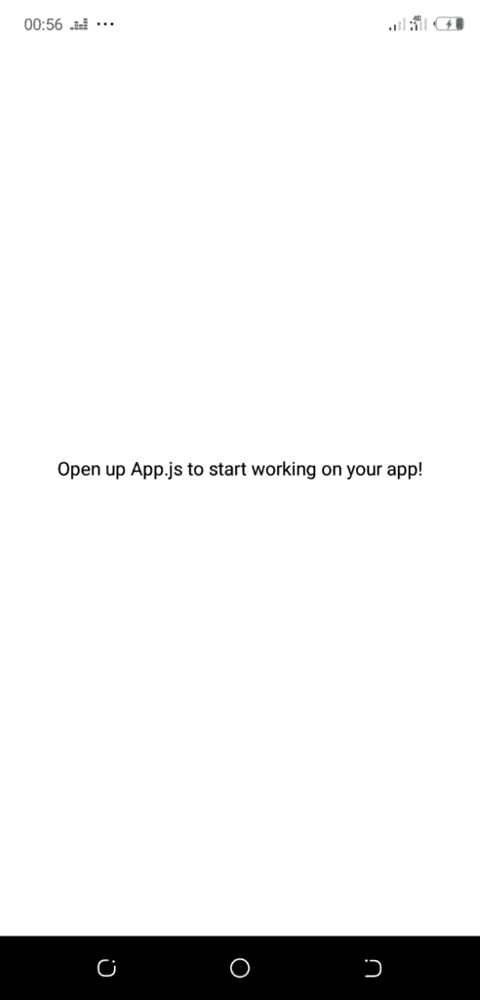
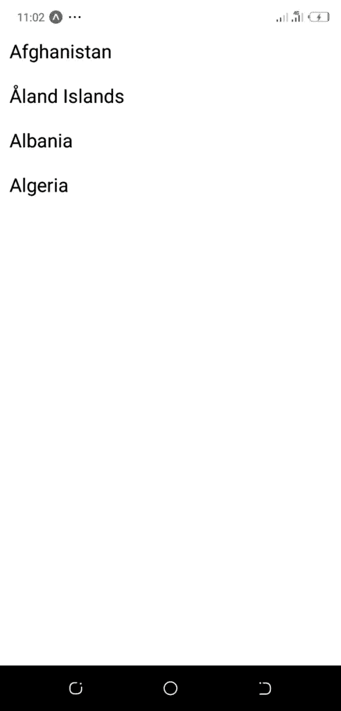
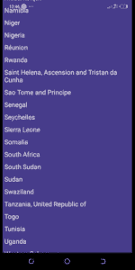

# React 原生教程:构建您的第一个 React 原生应用

> 原文：<https://javascript.plainenglish.io/react-native-tutorial-build-your-first-react-native-app-af66345c5e63?source=collection_archive---------3----------------------->

## 有兴趣学习 React Native 吗？让我们构建您的第一个 React 原生应用程序！一个显示国家列表的简单应用程序，通过网络请求从 REST API 获取。

本 React Native 教程旨在介绍 React Native，为您提供在构建真正的 React Native 应用程序之前需要了解的基础知识。之后，我们继续帮助您构建您的第一个真正的 React 原生应用程序。到本文结束时，您将构建一个可以在 iOS 和 Android 设备上运行的 React 原生应用程序。


Photo by [Luke Chesser](https://unsplash.com/@lukechesser?utm_source=medium&utm_medium=referral) on [Unsplash](https://unsplash.com?utm_source=medium&utm_medium=referral)

React Native 是一个跨平台的开发库，由脸书构建在 React 之上，用于移动开发平台。React Native 于 2013 年在脸书作为黑客马拉松项目开发，后来于 2015 年发布供公众使用。它在开发者社区中获得了巨大的人气，多家科技公司将其作为移动开发解决方案，因为 React 原生应用在 iOS 和 Android 上共享一个代码库，很难与真正的原生应用区分开来。根据 React 本地网站:

*2018 年，React Native 拥有 GitHub 中任何资源库贡献者数量第二高的*[](https://octoverse.github.com/2018/projects.html#repositories)**。今天，React Native 得到了来自世界各地的个人和公司的捐款支持，包括* [*Expo*](https://expo.io/) *，以及* [*微软*](https://www.microsoft.com/en-gb/) *。**

*在我们开始构建我们的第一个 React Native 应用程序之前，我将向您展示 React Native 的优点和缺点，以及它实际上是什么的更多细节。*

## *什么是 React Native？*

*   *React Native 是一个混合移动开发库。*
*   *React 原生应用程序用 JSX 和 Javascript 编写，并编译成本生代码。*
*   *React 原生应用包含 85–90%的共享 Javascript 和 JSX 代码*

## *什么是反应原生不是？*

*   *React Native 不是 webview*
*   *React Native 不是 React*
*   *反应本机不是 PWA*
*   *在撰写本文时，React Native 支持使用 [React Native for web](https://github.com/necolas/react-native-web) 进行 Web 开发*

## *为什么要领养/学习 React Native？*

*   *以相同的代码库和工作面向多个平台(iOS、Android、Web、TVOS)*
*   *拥有一个庞大且不断增长的社区来提供足够的支持*
*   *具有本机支持，这意味着您可以定制本机代码以适应您的用例/业务逻辑*
*   *需要 Javascript 知识。Javascript 是一种非常受欢迎的语言，学习它将会获得巨大的回报*
*   *有一个我个人称之为最佳点的特性:快速刷新(热重载)*

## *反应原生缺点？*

*React Native 也有一些缺点，但随着社区的发展，该库的开发人员一直在努力改进它们:*

*   *虽然代码库主要在各种平台之间共享，但是在开发更高级的 React 原生项目时，有时需要原生开发知识*
*   *尽管大多数 React 原生应用在外观上与原生应用看起来一样，但 React 原生似乎缺乏原生应用所实现的流畅导航。*
*   *React 本机开发人员同意 React 本机风格的错误报告不是最好的，但他们会随着时间的推移处理它。*

## *构建您的第一个 React 原生应用*

*让我们构建一个 React 原生应用程序来显示一个简单的国家列表。该应用程序将只包含一个屏幕，我们将保持其功能和风格最小化，因为本教程的目的是帮助您设置 React 本机开发人员环境，并尝试 React 本机编程语言。*

*在本 React Native 教程中，我们将使用 Expo 来构建您的第一个 React Native 应用程序。Expo 对于 React Native 世界的初学者来说是一个强大的工具，因为它让您可以轻松地在您的设备上运行和预览 React Native 应用程序。*

## *1.安装 Expo*

*遵循关于如何安装 Expo 的官方文档。一旦你安装了它，回到本教程，按照下面的步骤，以建立你的第一个反应原生应用。*

## *2.创建新的 React 本机应用程序*

```
*expo init firstapp*
```

*选择' ***空白*** 项目*

*选择' ***Y*** '与纱线一起工作。*

```
*Yarn v1.19.2 found. Use Yarn to install dependencies? (Y/n)*
```

*一旦你点击“是”, Expo 就会施展它的魔法，为你创建所有必要的文件。您可以查看一下目录结构，以了解项目的进展情况。*

## *3.运行您的第一个 React 本机应用程序*

*运行以下命令启动新创建的 React 本机应用程序:*

```
*cd firstapp yarn start*
```

*此时，如果您在前面的步骤中正确设置了 Expo，那么新的 React 本地项目应该已经成功加载，您应该能够看到该应用程序，如下图所示:*

**

*这就是你构建的第一个 React 本地应用程序。默认情况下，它会说“*打开 App.js，开始开发你的应用程序*”，我同意这不是世博会能提供的最好的欢迎信息，但我们会按照他们说的去做。我们打开 ***App.js*** 文件，看起来是这样的:*

```
*import { StatusBar } from 'expo-status-bar';
import React from 'react';
import { StyleSheet, Text, View } from 'react-native';

export default function App() {
  return (
    <View style={styles.container}>
      <Text>Open up App.js to start working on your app!</Text>
      <StatusBar style="auto" />
    </View>
  );
}

const styles = StyleSheet.create({
  container: {
    flex: 1,
    backgroundColor: '#fff',
    alignItems: 'center',
    justifyContent: 'center',
  },
});*
```

*现在，在我们继续之前，让我简要总结一下正在发生的事情。*

*   *styles 变量包含组件的各种样式字典*
*   *Function App 是一个 React 本地功能组件，默认呈现我们当前在屏幕上看到的内容，上面是导入语句，这些语句导入要使用和组合的组件以创建我们的父组件 App。*

## *4.添加国家列表*

*让我们继续，用我们自己的 UI 重写这个虚拟屏幕。正如我们之前提到的，我们将显示一个国家列表。为此，我们需要实现以下内容:*

```
*import React from 'react';
import { StyleSheet, Text, FlatList } from 'react-native';

export default function App() {

  const countriesData = [{"name":"Afghanistan"},{"name":"Åland Islands"},{"name":"Albania"},{"name":"Algeria"}]
  return (
    <FlatList
      data={countriesData}
      contentContainerStyle={styles.container}
      keyExtractor={item => item.name}
      renderItem={({item})=> <Text style={styles.text}>{item.name}</Text>}
    />
  );
}

const styles = StyleSheet.create({
  container: {
    paddingTop: 30,
  },
  text: {
    fontSize: 20,
    margin: 10
  },
});*
```

*如你所见，我们已经更新了我们的 ***App.js*** 并增加了一些东西:*

*   *一个 ***Flatlist*** 来显示国家列表*
*   *要在列表中显示的虚拟数据集*
*   *我们更新了样式对象来包含文本的样式*

*如果您还没有启动应用程序，请运行它，您应该会看到以下内容:*

**

*我们现在有东西可以利用了。但数据是静态的，我们希望有一个更长的动态列表，可以改变，我们需要这些变化反映在用户界面上。所以我们需要 UI 对数据模型的变化做出反应。这是 React 的核心概念，也因此 React Native。所以我们需要引入状态的概念。*

*React 本机组件在其状态中保存数据，每当状态发生变化时，UI 都会重新呈现以反映这些变化。让我们添加一个名为 countriesData 的状态变量，它将存储屏幕上显示的国家的动态列表。*

```
*const [countriesData, setCountriesData] = useState([])*
```

****useState*** 在 React Native 中被称为“钩子”。根据官方反应[关于挂钩的文件](https://reactjs.org/docs/hooks-state.html)*

> **挂钩是一个特殊的功能，可以让你“挂钩”React 特性**

*我们刚刚为我们的应用程序***countries data***声明了一个状态，默认值为一个空数组[]和一个函数***setcountries data***来更新***countries data***的值。例如，调用*setcountriedata([1，2，3，])* 会将*countriedata*的值更新为【1，2，3，】。*

*另一个重要的钩子 ***useEffect*** 将在下面的代码片段中应用。简单地说，在 useEffect 内部编写的任何代码都是在组件被挂载时运行的。*

```
*import React, {useState, useEffect} from 'react';
import { StyleSheet, Text, FlatList, Pressable, Alert } from 'react-native';
import { StatusBar } from 'expo-status-bar';

export default function App() {

  const [countriesData, setCountriesData] = useState([])

  function fetchCountriesData() {
    fetch('https://restcountries.eu/rest/v2/region/africa?fields=name;capital')
      .then((response) => response.json())
      .then((json) => setCountriesData(json))
      .catch((error) => console.error(error))
  }

  useEffect(()=> {
    fetchCountriesData();
  })

  return (
    <>
      <StatusBar style='light'/>
      <FlatList
        data={countriesData}
        contentContainerStyle={styles.container}
        keyExtractor={item => item.name}
        renderItem={({item})=> <Text onPress={() => {Alert.alert(`The Capital of ${item.name} is ${item.capital}`)}} style={styles.text}>{item.name}</Text>}
      />
    </>
  );
}

const styles = StyleSheet.create({
  container: {
    paddingTop: 30,
    backgroundColor: '#483D8B'
  },
  text: {
    fontSize: 18,
    margin: 5,
    color: '#fff'
  },
});*
```

*请不要害怕正在发生的事情。我们使用 [fetch API](https://reactnative.dev/docs/network.html) 从 API 端点检索国家数据，并显示非洲国家的列表。fetch API 是您在 React Native 中发出网络请求的方式。正如你所注意到的，我们使用了一个免费的 API 端点，公开在 *restcountries.eu* 网站上。这将返回一个 JSON 对象，在 *fetch* 方法的 *then()* 子句中进行解析。一旦解析成功，我们就用新检索到的国家列表更新 countriesData 状态变量。更新 state 对象的结果是，UI 也被重新呈现，我们可以在屏幕上看到国家:*

## *5.设计你的第一个 React 本地应用*

*现在让我们专注于使应用程序的设计稍微好一点，因为我们已经有了核心功能。我们将重点关注应用程序的样式，我们的重点是 ***样式*** 字典。*

```
*import React, {useState, useEffect} from 'react';
import { StyleSheet, Text, FlatList, Pressable, Alert } from 'react-native';
import { StatusBar } from 'expo-status-bar';

export default function App() {

  const [countriesData, setCountriesData] = useState([])

  function fetchCountriesData() {
    fetch('https://restcountries.eu/rest/v2/region/africa?fields=name;capital')
      .then((response) => response.json())
      .then((json) => setCountriesData(json))
      .catch((error) => console.error(error))
  }

  useEffect(()=> {
    fetchCountriesData();
  })

  return (
    <>
      <StatusBar style='light'/>
      <FlatList
        data={countriesData}
        contentContainerStyle={styles.container}
        keyExtractor={item => item.name}
        renderItem={({item})=> <Text onPress={() => {Alert.alert(`The Capital of ${item.name} is ${item.capital}`)}} style={styles.text}>{item.name}</Text>}
      />
    </>
  );
}

const styles = StyleSheet.create({
  container: {
    paddingTop: 30,
    backgroundColor: '#483D8B'
  },
  text: {
    fontSize: 18,
    margin: 5,
    color: '#fff'
  },
});*
```

*正如您所看到的，我们通过为 backgroundColor 属性提供“#483D8B”十六进制代码，将背景的颜色更改为紫色。*

*虽然语法与 CSS 非常相似，但略有不同。但是核心概念是相同的，所以如果你已经知道 CSS，学习如何样式化 React 原生应用程序将会非常容易。尤其是如果你已经熟悉 [flexbox 布局](https://reactnative.dev/docs/flexbox)的话。*

**

## *结论*

*我们看到了在移动开发过程中使用 React Native 的最大卖点是什么，以及为 iOS 和 Android 创建应用程序有多容易。*

*我们已经建立了 Expo，这是一个非常棒的工具，适合刚接触 React 本地世界的初学者。然后，我们利用 Expo 创建了我们的第一个 React 本地项目。*

*之后，我们学习了功能组件、钩子和状态。我们使用 fetch API 通过网络请求检索数据，并通过修改样式表来设计可视组件的样式。*

*恭喜你！您能够构建一个 React 本地应用程序。现在是时候学习更高级的概念了，为了增加更复杂的功能和开发全功能的移动应用，你可以发布到应用商店和谷歌 Play 商店。查看此列表中的[最佳 React Native 资源](https://www.instamobile.io/mobile-development/best-resources-learn-react-native/)以了解 React Native 的更多信息，并进入下一个级别。*

## *后续步骤*

*既然您已经了解了 best React 本机开发工具，下面是一些您可以研究的其他主题*

*   *Firebase — [推送通知](https://www.instamobile.io/react-native-tutorials/push-notifications-react-native-firebase/) | [Firebase 存储](https://www.instamobile.io/mobile-development/react-native-firebase-storage/)*
*   *如何 in React Native—[WebView](https://enappd.com/blog/react-native-life-cycle-hooks/79)|[渐变](https://www.instamobile.io/mobile-development/gradients-react-native/) | [相机](https://www.instamobile.io/react-native-tutorials/capturing-photos-and-videos-with-the-camera-in-react-native/) | [添加 GIF](https://www.instamobile.io/mobile-development/giphy-react-native/) | [谷歌地图](https://www.instamobile.io/react-native-tutorials/react-native-maps/) | [Redux](https://www.instamobile.io/mobile-development/react-native-redux/) | [调试](https://www.instamobile.io/react-native-tutorials/react-native-breakpoints-debugging/) |
    [钩子](https://www.instamobile.io/mobile-development/react-native-hooks/) | [黑暗模式](https://www.instamobile.io/mobile-development/react-native-dark-mode/) | [深度链接](https://www.instamobile.io/react-native-tutorials/deep-linking-react-native/) | [GraphQL](https://www.instamobile.io/react-native-tutorials/react-native-graphql-apollo-client/) | [异步](https://www.instamobile.io/react-native-tutorials/asyncstorage-example-react-native/)*
*   *支付— [Apple Pay](https://www.instamobile.io/react-native-controls/apple-pay-integrate-android-pay-react-native/) | [条纹](https://www.instamobile.io/react-native-tutorials/accept-payments-android-ios-apps-react-native-checkout/)*
*   *认证— [谷歌登录](https://www.instamobile.io/mobile-development/google-login-react-native-firebase/) | [脸书登录](https://www.instamobile.io/react-native-tutorials/facebook-login-react-native-firebase/) | [手机认证](https://www.instamobile.io/mobile-development/firebase-phone-authentication-react-native/) |*
*   *最佳资源— [应用创意](https://www.instamobile.io/react-native-tutorials/react-native-app-ideas-beginners/) | [播客](https://www.instamobile.io/mobile-development/react-native-podcasts/) | [时事通讯](https://www.instamobile.io/react-native-tutorials/best-react-native-newsletters/) | [应用模板](https://www.instamobile.io/react-native-tutorials/best-free-react-native-app-templates-2018/)*

*如果你需要一个基础来开始你的下一个 React 原生应用，你可以通过利用我们的 [React 原生模板](https://www.instamobile.io/templates/)来节省几个月的开发时间。*

**原载于 2020 年 7 月 24 日*[*https://www . insta mobile . io*](https://www.instamobile.io/react-native-tutorials/build-react-native-app/)*。**