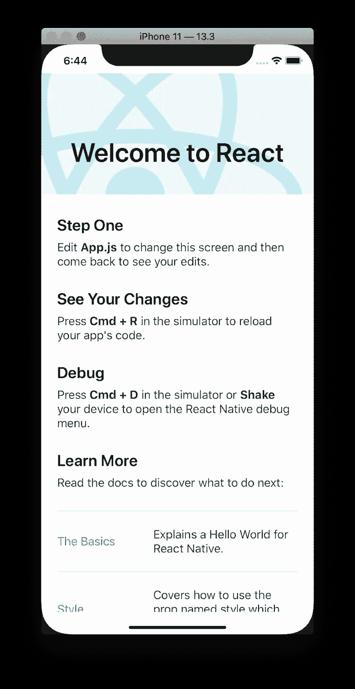
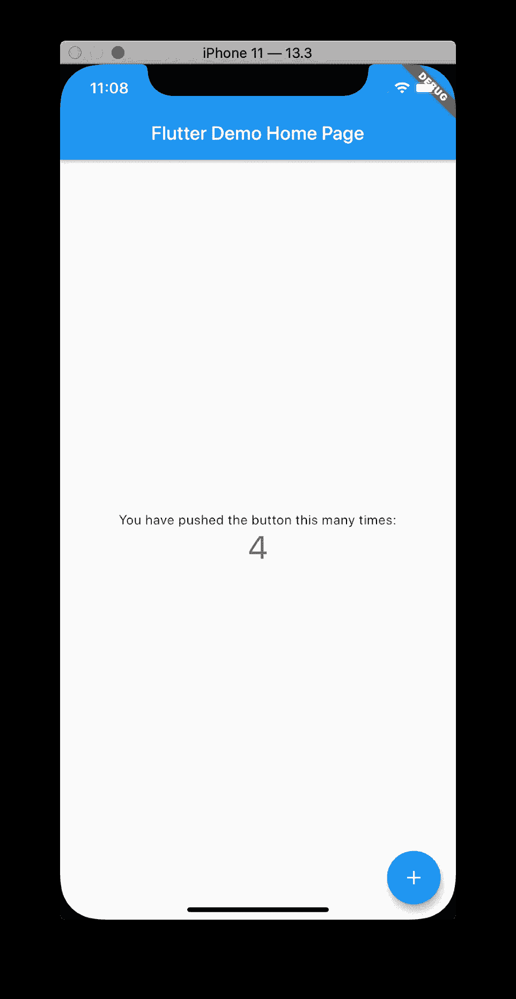
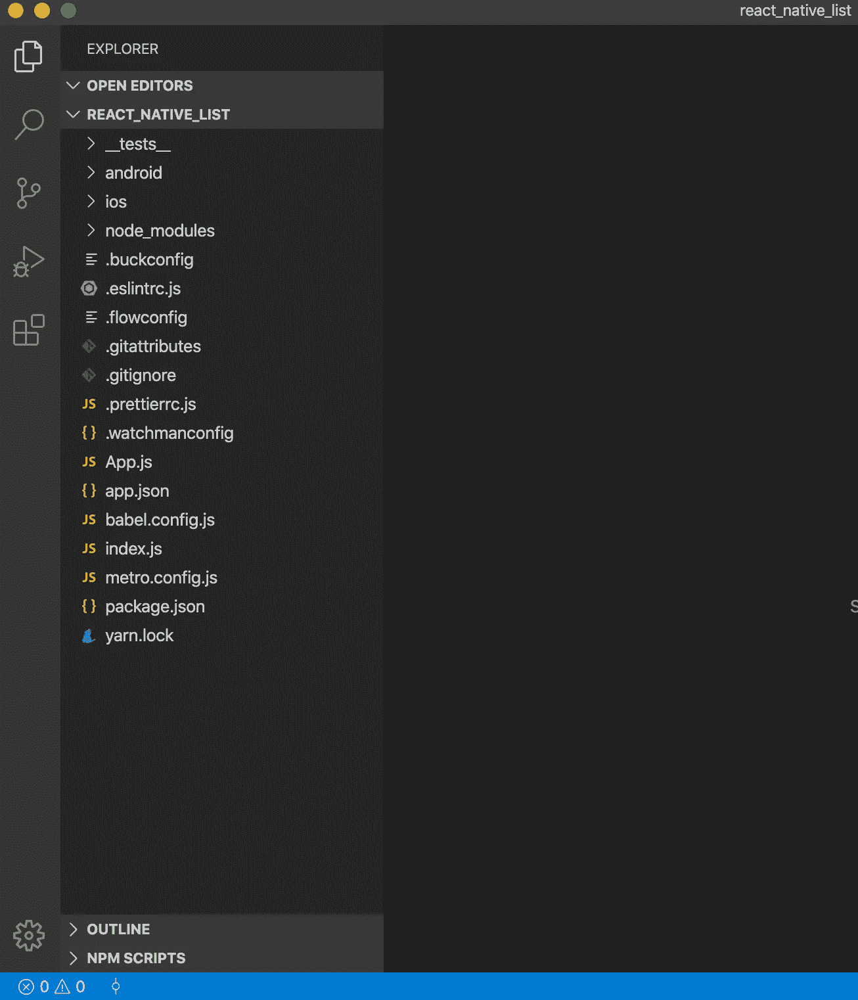
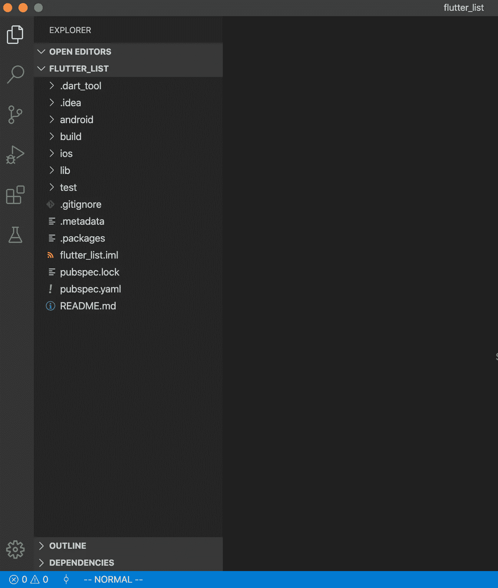
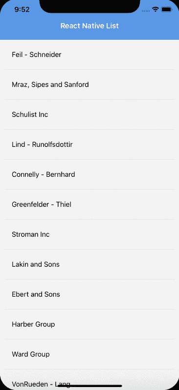
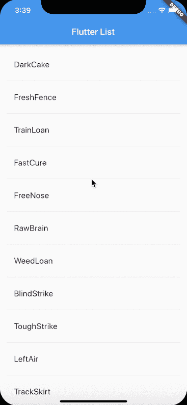

# 自然反应和颤振的区别

> 原文：<https://javascript.plainenglish.io/react-native-vs-flutter-51457d26d9f4?source=collection_archive---------5----------------------->

## 反应自然与扑动


Photo by [Jp Valery](https://unsplash.com/@jpvalery?utm_source=unsplash&utm_medium=referral&utm_content=creditCopyText) on [Unsplash](https://unsplash.com/s/photos/formula-1?utm_source=unsplash&utm_medium=referral&utm_content=creditCopyText)

[reactor Native](https://reactnative.dev/)和[flute](https://flutter.dev)是两种最流行的跨平台移动框架。我读过很多关于“反应自然”和“扑动”的比较。多数文章为 TL DR，无代码库。我不知道哪个框架适合我。所以我想谈谈并开发一个完全相同的应用程序，解释两者之间的区别。

我将开发同样的应用程序，显示公司名称列表。让我们开始探索框架。

# **什么是自然反应和飘动？**

React Native 是一个跨平台的移动开发框架，由脸书内部启动，他们在 2015 年开放源码。React Native 使用 JavaScript 语言和 React 库为安卓和 iOS 平台构建应用程序。JavaScript 是网络和移动社区中非常流行的语言。

颤振是谷歌开发的一个开源跨平台移动框架。Flutter 使用的是谷歌在 2011 年推出的 Dart 语言。Dart 是一种针对任何平台上的快速应用程序的客户端优化语言。Dart 是一种新的编程语言，并不那么受欢迎。

# 安装和项目配置

## 反应自然

可通过节点包管理器安装 React Native。我使用苹果操作系统，我将与`Homebrew`一起工作。如果你没有自制程序，你应该安装它。让我们通过以下命令安装它:

```
$ /usr/bin/ruby -e "$(curl -fsSL https://raw.githubusercontent.com/Homebrew/install/master/install)"
```

安装`Homebrew`后:

```
brew install node
brew install watchman
npm install -g react-native-cli
```

现在，我们可以从命令行访问 reaction-native。让我们创建一个名为`react_native_list`的新的反应土著项目:

```
react-native init react_native_list
cd react_native_list
react-native run-ios
```

就这样，我们已经成功运行了我们的 React Native 应用程序。



React Native App

## 摆动

您必须下载一个安装软件包[fluth . zip](https://storage.googleapis.com/flutter_infra/releases/beta/macos/flutter_macos_v0.9.4-beta.zip)文件，并稳定发布 Flutter SDK。我们可以通过下一行来完成:

```
curl -O [https://storage.googleapis.com/flutter_infra/releases/beta/macos/](https://storage.googleapis.com/flutter_infra/releases/beta/macos/flutter_macos_v1.12.13+hotfix.8-stable.zip)[flutter_macos_v1.12.13+hotfix.8-stable.zip](https://storage.googleapis.com/flutter_infra/releases/beta/macos/flutter_macos_v1.12.13+hotfix.8-stable.zip)
mkdir ~/development
cd ~/development
unzip ~/Downloads/flutter_macos_v1.12.13+hotfix.8-stable.zip
```

将`flutter`工具添加到您的路径中:

```
export PATH**=**"$PATH:`pwd`/flutter/bin"
```

您可以使用以下命令查看是否需要安装任何依赖项来完成安装:

```
flutter doctor
```

接下来，我们可以通过从命令行运行以下命令来创建并启动一个新的颤振应用程序:

```
flutter create flutter_list
cd flutter_list
open -a Simulator // if you don't run simulator
flutter run
```

就这样，我们已经成功运行了我们的颤振应用程序。



# 项目结构

## 反应自然

React Native 采用脸书的[通量](https://facebook.github.io/flux/)架构。简而言之，React Native 使用 JavaScript 桥与本机模块通信。JavaScript 代码在运行时被编译成本机代码。

因此，我们的项目结构如下所示:



React Native Structure

## 摆动

Dart 框架使用 Skia C++引擎，它拥有所有的协议、组合和通道。Flutter 拥有在 Flutter 引擎中开发应用程序所需的一切。

所以我们的项目结构看起来像这样:



Flutter Structure

让我们讨论一下核心项目结构:

*   **Android**-Android native app 项目，运行并构建我们的 Flutter 项目；
*   **ios**-iOS 的 xcode 项目，在构建 iOS 的 Flutter 应用时使用；
*   lib-包含你的 Flutter 应用程序代码的主文件夹；
*   **pub spec . YAML**-您在处理项目设置时经常使用的项目配置文件。如果您想添加一个库，您将使用这个文件。

# 魔法编码

## 反应自然

我们的主代码位于`App.js`中。

我们使用`faker.js`来生成启动名称。然后为了显示列表名称，我们使用了`FlatList` react 本地组件。

最后，我们的应用程序是这样工作的:



React Native List

## 摆动

现在，我们的代码在`lib/main.dart`中，我们将使用它。

首先，我们将使用`[english_words](https://pub.dartlang.org/packages/english_words)`开源包来生成启动名称，所以我们必须将它安装到我们的项目中。我们应该这样修改`pubspec.yaml`文件:

```
dependencies:
  flutter:
    sdk: flutter

  cupertino_icons: ^0.1.2
  english_words: ^3.1.0   *# add this line*
```

您应该会在控制台中看到以下内容:

```
flutter packages get
Running "flutter packages get" in startup_namer...
Process finished with exit code 0
```

接下来，我们创建`RandomWordsState`最小状态类。

`State<RandomWords>`表示您正在使用专门用于`RandomWords`的通用`State`类。这个类保存生成的单词对列表。

有状态小部件维护可能在小部件的生命周期中改变的状态。现在，将有状态的`RandomWords`小部件添加到`main.dart`:

之后，我们将扩展`RandomWordsState`来生成和显示单词配对列表。

`_suggestions`列表到`RandomWordsState`类，用于保存建议的单词配对。`_biggerFont`用于制作字体大小的变量。`_buildSuggestions()`方法创建一个 ListView，显示建议的几个单词。`_buildRow`功能在`ListTile`中显示每个新的配对。

最后，我们的应用程序是这样工作的:



Flutter List

# 利弊

## 反应自然

*   Javascript 生态系统非常受欢迎，有很多工具和库，你可以轻松地使用 JS 进行 Web、移动和后端工作
*   React Native 可以由软件包管理器安装，没有任何麻烦
*   React Native 有一个庞大的社区
*   React Native 有大量 UI 组件，比 Flutter 更广泛。Flutter 使用的是基于小部件的布局，这对于开发者来说并不友好
*   您可以通过代码推送快速更新应用程序

## 摆动

*   Dart 是类型化语言，JS 不是。这样更安全。但是你可以在 RN 上使用 Typescript
*   Flutter 拥有优秀的文档和丰富的测试特性
*   Flutter 和 Dart 由谷歌和新的谷歌 Fuchsia OS 提供支持。因此，它将针对新操作系统进行更多优化
*   如果你来自本土背景，Flutter 更容易工作
*   颤振开发工具大于 RN

# Github 链接到这两个应用

React 原生名单:[https://github.com/Gapur/react-native-list](https://github.com/Gapur/react-native-list)

颤振排行榜:【https://github.com/Gapur/flutter-list 

# 结论

我们讨论了两个非常好的框架，但是哪个更适合你，这取决于你的用例。祝你好运。感谢阅读，希望这篇文章对你有用。编码快乐！

# 资源

[](https://nevercode.io/blog/flutter-vs-react-native-a-developers-perspective/) [## 颤振与反应原生:一个开发人员的观点

### 我们正在尝试使用 Flutter 和 React Native 来找出跨平台应用程序的最终冠军…

nevercode.io](https://nevercode.io/blog/flutter-vs-react-native-a-developers-perspective/) [](https://medium.com/javascript-in-plain-english/react-native-vs-flutter-a-comparison-from-real-project-experience-perspective-1e7fbd56f217) [## React Native 与 Flutter:从实际项目经验的角度进行比较

### 除了基础知识之外，如何反应 native 和 Flutter 是不同的，对于不知道哪一个的人来说有实际的事实…

medium.com](https://medium.com/javascript-in-plain-english/react-native-vs-flutter-a-comparison-from-real-project-experience-perspective-1e7fbd56f217) [](https://codeburst.io/react-native-vs-flutter-57c4cd2d2b9c) [## 反应自然 vs 颤动

### 目前全球约有 25 亿智能手机用户，而且这一数字还在上升。人们用他们的…

codeburst.io](https://codeburst.io/react-native-vs-flutter-57c4cd2d2b9c) [](https://codelabs.developers.google.com/codelabs/first-flutter-app-pt1/#0) [## 创建一个无限的延迟加载列表

### Flutter 是 Google 的 UI 工具包，用于为移动、web 和桌面构建漂亮的本地编译应用程序，来自…

codelabs.developers.google.com](https://codelabs.developers.google.com/codelabs/first-flutter-app-pt1/#0) [](https://medium.com/javascript-in-plain-english/i-created-the-exact-same-app-in-react-and-vue-here-are-the-differences-e9a1ae8077fd) [## 我在 React 和 Vue 中创建了完全相同的应用程序。以下是不同之处。

### React vs Vue。最后是 Vue 和 React 的并列代码对比！🎉

medium.com](https://medium.com/javascript-in-plain-english/i-created-the-exact-same-app-in-react-and-vue-here-are-the-differences-e9a1ae8077fd)