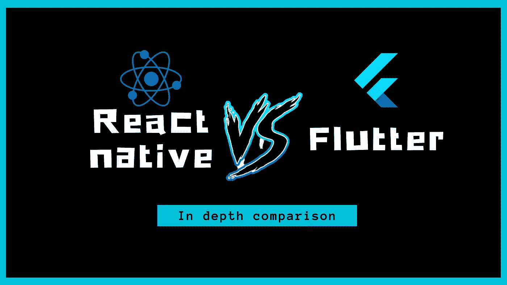

# React Native 与 Flutter:从真实项目经验的角度进行比较

> 原文：<https://javascript.plainenglish.io/react-native-vs-flutter-a-comparison-from-real-project-experience-perspective-1e7fbd56f217?source=collection_archive---------0----------------------->

## 除了基础知识之外，How React native 与 Flutter 有所不同，事实是人们不知道从哪一个开始！

在过去的几个月里，我看到了这两个框架之间的很多比较。每个人都在谈论并不重要的争论，比如语言或安装 CLI。我想分享一个关于项目中重要的真实事物的观点，以及如何为您的需求选择合适的框架的战场辩论。

**✋🏻⚠️声明:** *请收起你的白骑士♘盔甲，这里没有攻击任何框架，也没有任何种类的巨魔。* ***一切都受制于你:你来自哪里，你需要什么。***

*在我写这篇文章的时候，我已经有 3 年使用 React Native 的经验，并且我有 ReactJS / NodeJS 的 web 背景，因此我的首选是 RN。但是我也非常喜欢 Flutter，我关注它的发展，我非常确定这个框架有一个光明的未来。两者都是很棒的工具，你应该在你的应用中高度考虑它们。*

***哦对了！*** *在接下来的几行中，我会多次引用“RN”来表示 React Native。就像我上面说的，我每天都在练习 RN，但实际上我没有练习 Flutter 那么多。如果你看到我的论点中有错误，请不要犹豫留下评论，我会检查并考虑它。🙏🏻*

***既然一切都已经说了，我们可以开始了*😁**

# 🤝操作工具

已经有很多关于 Dart 和 JS、原生组件、脚手架等的比较了。我不会在这里做更多的阐述，你可以在谷歌上随意搜索，你会得到很多相关的结果。

**简单来说:** Dart 是原生类型的，它是一种非常好的语言，最初被设计用来取代 Javascript(但谷歌没有成功地让 Chrome 以外的其他浏览器发布 Dart VM)。另一方面，JS 不是本机类型的，而是可以用 [Typescript](http://www.typescriptlang.org/) 扩展。

然后我们可以谈论你最喜欢的 IDE，你最喜欢的 scaffold CLI 或工具…

但是这并不是真正重要的。我们关心框架给我们实现目标的自由和灵活性，而不是乍看之下如何把握。你习惯了一切。

所以让我们来谈谈随处可见的流行观点，我在工作中从同事那里听到的同样的观点😄

# 🚫颤动 VS 反应本地战斗中的错误论点

> Dart 是一种类型化语言，而 JS 不是。这样更安全。

类型安全绝对是任何应用程序的首选，尤其是移动应用程序，由于构建和存储验证，移动应用程序在首次展示时具有更大的惯性。

JS 也可以使用 Typescript 和 Flow 来实现这一点。目前，这并没有优化 dart 的性能，但这在未来可能会发生变化，尤其是随着 RN 在 2020 年推出新的引擎/体系结构。

但是请记住，在某些情况下，拥有一种非静态类型语言也是一件非常好的事情。有时它允许替换变量的类型而不需要重新编译。我经历过一个网球应用程序的案例，其中使用一个整数的`0`、`15`、`30`、`40`枚举返回游戏点数。然后我们为游戏优势添加了`AD`字符串，这是一开始没有提供的。由于非静态类型，我们可以在不发布新版本的情况下做到这一点，只需更改 GraphQL 方案并返回新值。在 Dart 中，这将导致崩溃或错误。

> Flutter 和 Dart 由谷歌提供支持，新的谷歌 Fuchsia 操作系统是未来的发展方向。RN 将会平稳的死去，因为 Flutter 将会为他们的新操作系统做更好的优化。

没有人能预测未来，但有一点是肯定的:**目前，世界上一些最伟大的公司正在押注 react native。**

例如，微软正在开发许多工具，如 CodePush 或 RN windows / Mac，一些最流行的工具如 Word 正在移植到 RN。

**不和谐**一家最大的消息/音频通信初创公司也在 react native 上发布了不错的文章，他们成功地使用 RN 让[接近了 native 的表现](https://blog.discordapp.com/how-discord-achieves-native-ios-performance-with-react-native-390c84dcd502)。

RN 还用于银行业:[https://callstack.com/blog/secure-your-react-native-app/](https://callstack.com/blog/secure-your-react-native-app/)call stack 在 React Native EU 2019 上向我们展示了这一点。

Flutter 肯定是一个强有力的选择，并将继续增长，但我认为这两个框架都将是 Fuchsia 的竞争对手。

# ✅颤振 VS 反应本土的真实论点

> 颤振比反应本地有更好的性能

没什么好说的，多亏了原生编译，我们目前只能同意这一点。但是通过一些优化，你可以有一个很好的 RN 体验而不会发现问题。

> 当你来自一个本土背景时，Flutter 更容易掌控。

事实上，由于默认的类型语言和实现逻辑，这也是正确的。Flutter 比 RN 更接近 Android 和 Ios。大部分逻辑取自 Java，唯一的主要区别是声明性方面，它不同于 Android 的命令性方面

你正在编写带有描述你的应用程序预期状态和布局的小部件，而你以前是在这里编写类和调用函数的。

> Flutter devtools 很棒，而 react one 目前很差

老实说，在这里颤振和反应之间有巨大的差距。flutter 团队对 VSCode 和 Android studio 进行了出色的集成，提供了许多渲染调试器和分析工具。

另一方面，React native 除了 ReactDevTool 和小插件之外，还有很差的开发工具，大部分原生调试依赖于 android/ios 的原生库。脸书最近发布了 [Flipper](https://fbflipper.com/) 来改善这一点，但当我写这篇文章时，这仍然是实验性的。

正如我们所看到的，有一些好的论据支持我们的两个框架。让我们更深入地了解风格和行为方面的主要差异。

# 📌主要差异

## 🛫空中更新-编译

因为 Javascript 的本质是及时编译而不是提前编译。使用 React Native 可以利用空中更新。使用[微软代码推送](https://github.com/microsoft/react-native-code-push)或 [Expo.io](https://docs.expo.io/versions/latest/guides/configuring-ota-updates/) 非常简单。

这是目前我不能顺利切换到 Flutter 的首要原因(除了我真的很喜欢 React paradigm 这个事实)。**这是真正的游戏规则改变者** **特别是在事件应用程序上，**在这种情况下，打补丁的时间非常短，而且在很短的时间内就有很多用户。

**有了 expo，你可以在没有任何代码编译和开发环境的情况下开始一个项目**。这对于**P**roof**O**f**C**一旦接受甚至共享 bug 报告场景给 RN 核心团队来说是一个巨大的优势。这就像使用[https://snack.expo.io/](https://snack.expo.io/)一样简单

Dart 也支持 JIT，但是目前，这不可能像 Javascript 允许的那样进行代码推送更新，你可以触发安装意图，但是…这不一样，不是吗？

也许 Flutter 团队将来会给我们提供一个更好的解决方案，但是目前，还没有官方的强大的库来支持它。

## 💻开发经验和布局

*   **➡️开发工具**

调试工具非常庞大，这对于开发经验来说是一个强有力的论据。正如我们在本文中看到的，你可以在优化中比在 RN 中更容易和更深入。

*   **➡️ UI 定义**

但是另一方面，虽然 React native 依靠 JSX 来简单地描述 UI 定义，但 Flutter 使用的是基于小部件的布局，在我看来这相当冗长，而且对开发人员不友好。

有很多样板文件，如果没有 IDE，我们最终会陷入难以阅读的嵌套地狱。**这对于拉动式请求审核来说可能很困难。**

此外，没有(AFAIK)明确的方法将纯设计与小部件本身分开，就像 styled-components 或`StyleSheet.create`那样，只是通过样式属性传递它。

JSX 利用简单、可读的布局定义，甚至更多地利用像[样式组件](https://www.styled-components.com/)这样的库。这给了 RN 一个很好的优势，因为任何来自 web 背景的开发人员都可以很快开始使用 RN。

*   **➡️热重装**

两个框架都很好地支持热重载，这是一种享受。而且可以同时在 IOS 和 Android 上使用。

## 👨🏻‍💻👩🏼‍💻社区和图书馆

Javascript 生态系统非常受欢迎，有很多工具和库，而 Dart 很酷，社区小得多，也年轻得多。

你有很多关于 Dart 的包，但大多数 IT 初创公司目前没有提供 Dart SDK，而 NodeJS 在所有这些方面都非常受欢迎。

唯一能让 Dart 回来的是，它得到了 Google 的支持，这可能会在未来推动许多图书馆使用它的语言。

这给了一个很好的反应点。

# 🚛外卖/TLDR；📦

这将总结并帮助你在我们两个主角之间选择一个框架。

**⚡️There 没有好坏之分，将取决于具体情况和您的团队偏好/知识。**

## ✈️旋舞着飞镖

**如果你打算赌未来**，Fluter 和 Dart 是设计你的应用的强有力选择。

我不认为你会在技术堆栈上有任何风险，唯一的风险是你将不得不自己解决许多事情或编写一些代码，这是因为生态系统是相当新的。您将无法像使用 JS 那样利用他人构建的工具。

但是 Dart 是一种很好的语言，它解决了 Javascript 的许多问题。

**💁🏻‍♂️Currently，如果以下句子中至少有一部分是正确的，我会推荐从 Flutter 开始**

*   **你来自非 Javascript 和 React 背景**，这是因为你无法利用你的经验
*   你**不是来自网络开发**和**没有基于 CSS** 的布局经验。
*   你没有一个严格的截止日期，在你的交付方面有灵活性。因为你不会像使用 React 那样从外部获得太多的帮助，而且设计一个特定的 UI 会更加困难。
*   颤振路由也比著名的反应导航更复杂。
*   **性能**是你的应用的一级特性。
*   至少在接下来的几个月/一年里，你接受失去无线更新的好处，并依赖 AppStore / Playstore 更新流。

## ⚛️反应原生和类型脚本(或 Javascript)

**另一方面，React Native 得到了脸书和其他许多公司的支持。这是同类产品中最先进的框架。**

尽管 JS 中缺少诸如打字之类的特性，但是您可以使用一些工具来填补这个空白(您应该这样做)，例如 **Typescript** 。

**💁🏻如果你有很多符合下列句子的东西，‍♂️I 会推荐使用 React Native**

*   你已经是 React、Vue 或 Angular 的开发者，并且熟悉基于组件的应用。
*   **你有网络背景**你熟悉 CSS 布局**，你有使用像`styled-components`这样的库的经验。**
*   你喜欢依赖一个庞大而丰富的开发者生态系统和可以在你的应用中使用的工具，你想从流行论坛如 stack overflow 上获得外部支持。
*   您希望利用 Microsoft Codepush 或 Expo.io 的空中更新来快速修复和交付补丁。
*   您希望使用流行的 SASS 工具，这些工具能够为 NodeJS 提供现成的支持。

[**🇫🇷STOP！你是法国人吗🥖？您也可以访问 ici 网站，接收法国的私人通讯🙂**](https://codingspark.io)