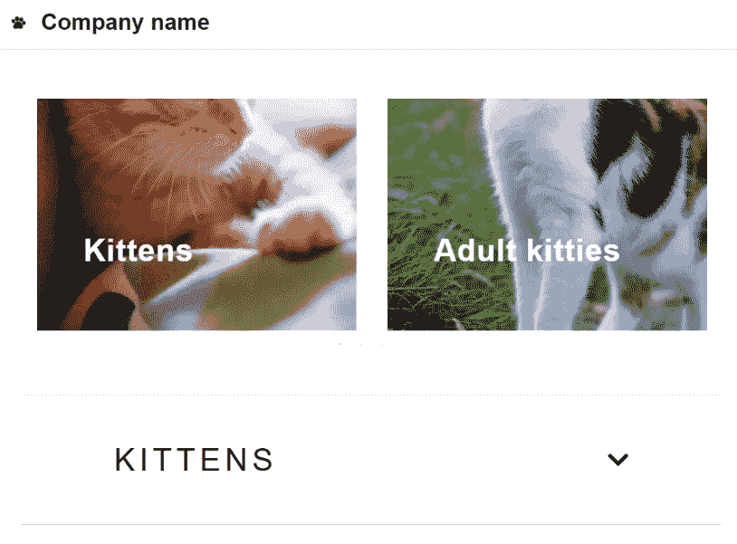
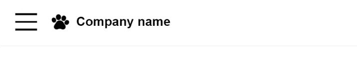
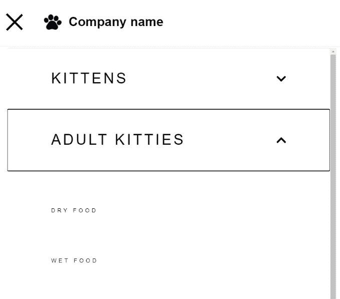
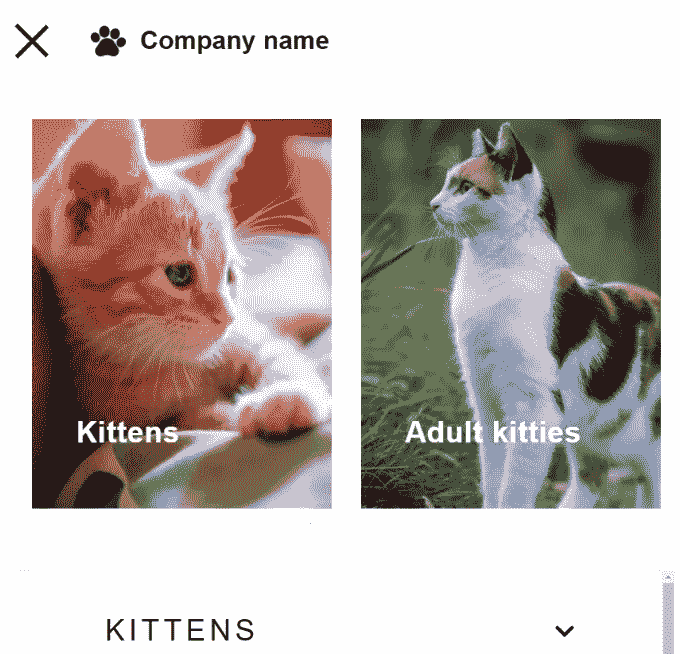
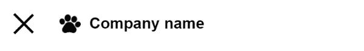

# 反应导航栏与汉堡菜单，旋转木马和手风琴列表

> 原文：<https://javascript.plainenglish.io/react-navbar-with-hamburger-menu-carrousel-and-accordion-list-4be8b789c256?source=collection_archive---------8----------------------->

## 从头开始构建 React 组件，无需库



React navigation bar with carrousel and accordion components

在这个练习中，我们希望手机上的导航栏显示一个汉堡包菜单。



React navigation bar with hamburger menu

当菜单被点击时，它应该显示一个下拉菜单，包括一个旋转木马和一个折叠菜单，列出了网站的主要类别和子类别。

首先，让我们构建项目的结构。我们将为`components`准备一个文件夹，其中包含以下组件:

```
- accordion
  - Accordion.js
  - style.js
- burgerMenu
  - BurgerMenu.js
  - style.js
- carrousel
  - Carrousel.js
  - style.js
- header
  - Header.js
  - style.js
- sidemenu 
  - sideMenu.js
  - style.js
- logo
  - Logo.js
  - style.js
```

我将使用样式化的组件，所以每个组件都有自己的`style`文件。此外，为了节省时间，这个项目中使用的唯一库是 slick-slider carrousel。我会告诉你如何设计一点，以满足你的需要。

因此，就依赖性而言，您需要安装:

*   样式组件
*   字体-图标真棒
*   旋转木马的反应滑溜和滑溜旋转木马

我们现在将开始按照复杂性的顺序(从最少到最多)一个接一个地构建组件。因此，我们将从徽标组件开始。

你可以在这里找到最终的项目:[带汉堡菜单的 React 导航条，旋转木马，手风琴](https://codesandbox.io/s/react-navbar-menu-with-accordion-carrousel-and-hamburger-menu-c9m0k)。

# React 中的徽标组件

徽标组件不过是一个带有包装器和链接的样式化的`img`,所以我们可以在用户单击徽标时将用户引导到主页。

```
// Logo.jsimport React from "react";
import { LogoWrapper, StyledLogo } from "./style";
import logo from "./../../../static/logo.png";const Logo = () => {
  return (
    <LogoWrapper>
      <a href="">
        <StyledLogo src={logo} />
      </Link>
    </a>
  );
};export default Logo;
```

`logo.png`文件在`static`文件夹中，所以如果你有不同的文件夹结构，你需要调整路径。

这是这个的样式:

```
// logo/style.jsimport styled from "styled-components";
import { device } from "./../../styles/devices";export const LogoWrapper = styled.div`
  display: flex;
  align-items: center;
  padding: 0;
  margin: 0;[@media](http://twitter.com/media) ${device.laptop} {
    padding: 0px 2.76vw;
  }
`;export const StyledLogo = styled.img`
  height: 4.8vw;[@media](http://twitter.com/media) ${device.laptop} {
    height: 1.8vw;
    padding-left: 0px;
  }
`;
```

我在整个项目中使用了几个常量，比如设备断点、颜色和字体。这些都位于一个`src/styles`文件夹中。我们首先有一个颜色文件，名为`colors.js`:

```
// src/styles/colors.jsexport const colors = {
  COLOR_WHITE: `#FFFFFF`,
  COLOR_BLACK: `#000000`,
  COLOR_LIGHT_GREY: `#e0dedf`,
};
```

然后，一个用于设备断点的文件，叫做`devices.js`:

```
// src/styles/devices.jsexport const breakpoints = {
  mobileS: "320px",
  mobileM: "375px",
  mobileL: "425px",
  tablet: "768px",
  laptop: "1024px",
  laptopL: "1440px",
  desktop: "2560px",
};export const device = {
  mobileS: `(min-width: ${breakpoints.mobileS})`,
  mobileM: `(min-width: ${breakpoints.mobileM})`,
  mobileL: `(min-width: ${breakpoints.mobileL})`,
  tablet: `(min-width: ${breakpoints.tablet})`,
  laptop: `(min-width: ${breakpoints.laptop})`,
  laptopL: `(min-width: ${breakpoints.laptopL})`,
  desktop: `(min-width: ${breakpoints.desktop})`,
  desktopL: `(min-width: ${breakpoints.desktop})`,
};
```

最后，我们将字体保存在一个`typography.js`文件中:

```
// src/styles/typography.jsexport const fonts = {
  fontPrimary: `"MaisonNeueBook", sans-serif`,
};export const fontSizes = {
  fontXS: `12px`,
  fontS: `14px`,
  fontM: `16px`,
  fontL: `24px`,
  fontXL: `32px`,
  fontXXL: `48px`,
};
```

# React 中的手风琴组件

接下来，我们来制作手风琴。这个非常复杂，因为它需要显示两个级别的类别，这里将命名为`categories`和`subcategories`。



React accordion component with subcategories

我们希望在选项卡打开或关闭时显示一个人字形图标。为此，我们将使用`font-awesome`图标。

```
import React, { useState } from "react";
import {
  StyledAccordionSection,
  AccordionWrapper,
  AccordionTitle,
  AccordionItems,
  AccordionItem,
  AccordionIcon,
} from "./style.js";
import { Link } from "./../link/Link";
import { faChevronDown } from "[@fortawesome/free-solid-svg-icons](http://twitter.com/fortawesome/free-solid-svg-icons)";export const Accordion = (props) => {
  const [open, setOpen] = useState(false);return (
    <AccordionWrapper open={open} onClick={() => setOpen(!open)}>
      <AccordionTitle>
        {props.accordionTitle}
        <AccordionIcon
          open={open}
          onClick={() => setOpen(!open)}
          icon={faChevronDown}
        />
      </AccordionTitle>
      <AccordionItems open={open}>
        {props.subcategories.map((subcategory) => (
          <AccordionItem open={open}>
            <Link to={subcategory.url}>{subcategory.name}</Link>
          </AccordionItem>
        ))}
      </AccordionItems>
    </AccordionWrapper>
  );
};export const AccordionSection = (props) => {
  return <StyledAccordionSection>{props.children}</StyledAccordionSection>;
};
```

以及造型:

```
import styled from "styled-components";
import { FontAwesomeIcon } from "[@fortawesome/react-fontawesome](http://twitter.com/fortawesome/react-fontawesome)";
import { colors } from "../../styles/colors";
import { fontSizes } from "../../styles/typography";export const StyledAccordionSection = styled.div`
  display: flex;
  flex-direction: column;
  height: 100vw;
  overflow: auto;
  margin: 8vw 0px;
`;export const AccordionWrapper = styled.div`
  display: block;
  height: auto;
  background-color: ${colors.COLOR_WHITE};
  transition: all linear;
`;export const AccordionTitle = styled.button`
  display: flex;
  justify-content: space-between;
  align-items: center;
  width: 100%;
  padding: 6vw 12vw;
  text-transform: uppercase;
  font-size: 4vw;
  position: relative;
  letter-spacing: 0.15em;
  background-color: ${colors.COLOR_WHITE};
  border: none;
  border-bottom: 1px solid ${colors.COLOR_LIGHT_GREY};
  border-top: 1px solid ${colors.COLOR_LIGHT_GREY};
`;export const AccordionItems = styled.ul`
  list-style: none;
  display: flex;
  flex-flow: column nowrap;
  justify-content: center;
  align-items: center;
  width: 100%;
  padding: ${({ open }) => (open ? `4vw 12vw` : `0px`)};
  text-transform: uppercase;
  font-size: 4vw;
  margin: 0;
  position: relative;
  letter-spacing: 0.15em;
`;export const AccordionItem = styled.li`
  display: ${({ open }) => (open ? "block" : "none")};
  background-color: ${colors.COLOR_WHITE};
  padding: 6vw 12vw;
  width: 100%;
  font-size: ${fontSizes.fontS};&:last-of-type {
    margin-bottom: 2vw;
  }
`;export const AccordionIcon = styled(FontAwesomeIcon)`
  font-size: 3vw;
  transform: ${(props) => (props.open ? "rotate(180deg)" : "rotate(0deg)")};
`;
```

接下来，我们将创建旋转木马，然后将所有组件放在侧边栏菜单中，当单击汉堡菜单时，侧边栏菜单会打开或关闭。

# React 中的 Carrousel 组件

为此我们将使用`slick-slider`库。组件如下:

```
import React, { Component } from "react";
import { ImageWrapper, SliderImage, ImageTitle } from "./style";
import { Link } from "./../link/Link";
import Slider from "react-slick";
import "slick-carousel/slick/slick.css";
import "slick-carousel/slick/slick-theme.css";const categoryImages = [
  {
    name: "",
    alt: "",
    url: "",
    categoryUrl: "",
  },
  {
    name: "",
    alt: "",
    url: "",
    categoryUrl: "",
  },
  {
    name: "",
    alt: "",
    url: "",
    categoryUrl: "",
  },
  {
    name: "",
    alt: "",
    url: "",
    categoryUrl: "",
  },
];export default class Carousel extends Component {
  render() {
    const settings = {
      dots: true,
      arrows: true,
      infinite: true,
      speed: 1000,
      slidesToShow: 2,
      slidesToScroll: 1,
      className: "slides",
    };return (
      <Slider {...settings}>
        {categoryImages.map((categoryImage) => {
          return (
            <ImageWrapper>
              <Link to={categoryImage.categoryUrl}>
                <SliderImage src={categoryImage.url} alt={categoryImage.alt} />
                <ImageTitle>{categoryImage.name}</ImageTitle>
              </Link>
            </ImageWrapper>
          );
        })}
      </Slider>
    );
  }
}
```

以及造型:

```
import styled from "styled-components";
import { colors } from "./../../styles/colors";
import { fonts } from "./../../styles/typography";export const ImageWrapper = styled.div`
  display: block;
  height: 100%;
  position: relative;
`;export const SliderImage = styled.img`
  display: block;
  box-sizing: border-box;
  height: 53.333vw;
  width: 100% !important;
  padding: 0px 2vw;
  object-fit: cover;
`;export const ImageTitle = styled.h3`
  position: absolute;
  bottom: 4vw;
  left: 8vw;
  font-size: 4vw;
  font-family: ${fonts.fontPrimary};
  letter-spacing: 0.025em;
  color: ${colors.COLOR_BLACK};
  z-index: 10;
`;
```

旋转木马和手风琴将显示在一个侧边菜单组件中，该组件只在移动设备上打开，只有当汉堡包菜单被点击时才打开。



React carrousel component with slick slider

# React 中的侧菜单组件

我们将导入前面提到的组件，并在该组件中添加侧菜单的数据输入，但是您也可以从外部源查询它。

```
// sideMenu.jsimport React from "react";
import { Accordion, AccordionSection } from "./../accordion/Accordion";
import Carrousel from "./../carrousel/Carrousel";
import { StyledSideMenu } from "./style";const sideCategories = [
  {
    id: 1,
    name: " ",
    subcategories: [
      {
        id: 1,
        name: " ",
        url: " ",
      },
      {
        id: 2,
        name: " ",
        url: " ",
      },
    ],
  },
  {
    id: 2,
    name: " ",
    subcategories: [
      {
        id: 1,
        name: " ",
        url: " ",
      },
      {
        id: 2,
        name: " ",
        url: " ",
      },
    ],
  },
  {
    id: 3,
    name: " ",
    subcategories: [
      {
        id: 1,
        name: " ",
        url: " ",
      },
      {
        id: 2,
        name: " ",
        url: " ",
      },
    ],
  },
  {
    id: 4,
    name: " ",
    subcategories: [
      {
        id: 1,
        name: " ",
        url: " ",
      },
      {
        id: 2,
        name: " ",
        url: " ",
      },
    ],
  },
];const SideMenu = (props) => {
  return (
    <StyledSideMenu open={props.open} onClick={props.onClick}>
      <Carrousel />
      <AccordionSection>
        {sideCategories.map((sideCategory) => (
          <Accordion
            accordionTitle={sideCategory.name}
            subcategories={sideCategory.subcategories}
          />
        ))}
      </AccordionSection>
    </StyledSideMenu>
  );
};export default SideMenu;
```

以及造型:

```
import styled from "styled-components";
import { colors } from "../../styles/colors";export const StyledSideMenu = styled.aside`
  box-sizing: border-box;
  height: 100vh;
  width: 100vw;
  position: fixed;
  top: 14.1vw;
  z-index: 99;
  overflow: hidden auto;
  padding: 4vw;display: ${({ open }) => (open ? "block" : "none")};
  background: ${colors.COLOR_WHITE};
`;
```

顺便说一句，这里的代码要有这种漂亮的格式，你可以使用[更漂亮的操场](https://prettier.io/playground/)。将您的代码粘贴到那里，然后复制到这里。

接下来，让我们创建汉堡包菜单，看看这一切都在行动。

# 反应汉堡菜单

我们希望它只在手机上显示，关闭时显示典型的三线图标，打开时分别显示一个`X`。



React hamburger menu — open state

```
// burgerMenu.jsimport React, { useState } from "react";
import { BurgerMenuWrapper, BurgerLine } from "./style";
import SideMenu from "./../sidemenu/SideMenu";const BurgerMenu = () => {
  const [open, setOpen] = useState(false);return (
    <div>
      <BurgerMenuWrapper open={open} onClick={() => setOpen(!open)}>
        <BurgerLine open={open}></BurgerLine>
        <BurgerLine open={open}></BurgerLine>
        <BurgerLine open={open}></BurgerLine>
      </BurgerMenuWrapper>
      <SideMenu open={open} />
    </div>
  );
};export default BurgerMenu;
```

这是它的造型:

```
import styled from "styled-components";
import { device } from "./../../styles/devices";
import { colors } from "./../../styles/colors";export const BurgerMenuWrapper = styled.div`
  height: 4.8vw;
  display: flex;
  -webkit-box-pack: justify;
  justify-content: space-between;
  flex-direction: column;
  margin: 4vw;[@media](http://twitter.com/media) ${device.laptop} {
    display: none;
  }
`;export const BurgerLine = styled.div`
  background-color: ${colors.COLOR_BLACK};
  height: 0.5vw;
  width: 6vw;
  align-self: center;
  transition: all linear;&:first-child {
    transform: ${(props) => (props.open ? "rotate(45deg)" : "rotate(0deg)")};
    transform-origin: top left;
  }&:nth-child(2) {
    opacity: ${(props) => (props.open ? "0" : "1")};
  }&:last-of-type {
    transform: ${(props) => (props.open ? "rotate(-45deg)" : "rotate(0deg)")};
    transform-origin: bottom left;
  }
`;
```

现在，我们唯一需要做的就是将这些组件添加到标题或主导航中。

# React 中的标题组件

```
// header.js import React from "react";
import { HeaderWrapper } from "./style";
import BurgerMenu from "./../burgerMenu/BurgerMenu";
import Logo from "./../logo/Logo";
import NavigationLinks from "./../navigationLinks/NavigationLinks";const Header = () => {
  return (
    <HeaderWrapper>
      <BurgerMenu />
      <Logo />
      <NavigationLinks />
    </HeaderWrapper>
  );
};export default Header;
```

下面是标题的样式:

```
import styled from "styled-components";
import { device } from "./../../styles/devices";
import { fonts } from "./../../styles/typography";export const HeaderWrapper = styled.header`
  position: relative;
  height: 13.0667vw;
  width: 100%;
  padding: 0;
  margin: 0;
  display: flex;
  flex-flow: row nowrap;
  align-items: center;
  border-bottom: 1px solid rgb(229, 229, 229);
  font-family: ${fonts.fontPrimary};[@media](http://twitter.com/media) ${device.laptop} {
    height: 6.9vw;
  }
`;
```

就这样，你的导航栏现在可以使用了。确保在桌面视图中为主要类别添加几个链接，并且只在手机上显示侧菜单。

我希望你喜欢这个练习！你可以在这里看到[最终项目](https://codesandbox.io/s/react-navbar-menu-with-accordion-carrousel-and-hamburger-menu-c9m0k)。