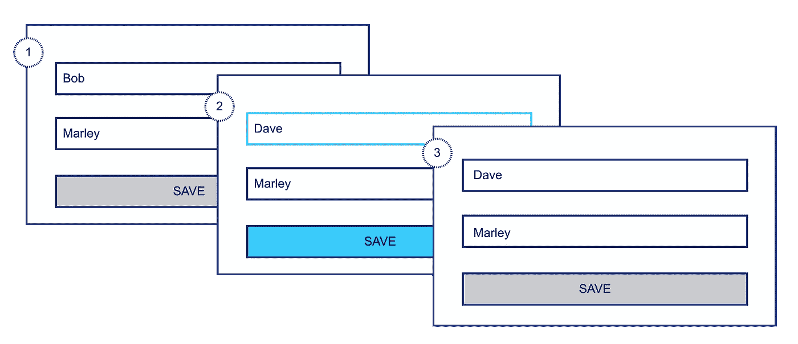

# 用输入字段和按钮对更改作出反应

> 原文：<https://javascript.plainenglish.io/react-onchange-with-input-field-button-854f0035b94a?source=collection_archive---------1----------------------->

fig(a): UI component flow

我们希望组件在加载时显示初始渲染数据。如果用户通过编辑进行更改，那么我们希望提供一个保存选项，如果用户单击保存，那么我们进行 POST 调用，并将保存按钮更新为保存并禁用它，一旦更新成功，按钮标签恢复为保存，但在下一次编辑之前保持禁用状态。简而言之，只有当输入字段是脏的时，该按钮才会被启用。

主要问题有(一)。留意输入值的变化&启用/禁用保存按钮。㈡。处理 API 请求时启用/禁用保存按钮。

1.  探索输入字段的 onChange

查看代码，您可以看到应用程序加载时显示的初始数据(即 Bob)。如果用户将姓名更改为 Bobby，则表单是脏的，并且“保存”按钮被启用。很好，但是这样做的问题是 onChange 会被触发，即使用户把名字改回`Bob`(比如 Bobby 对 Bob)。我们需要一些自定义功能来验证实际数据的变化和控制保存按钮。

2.自定义输入字段的更改和控制保存按钮

3.API 调用期间管理按钮

最后，我们需要确保启用/禁用按钮是在数据没有变化和 API 调用期间完成的。我的意思是，当用户*没有真正*改变数据(尽管表单可能是脏的)时，我们*不想*启用保存按钮，我们也想保持禁用状态，并从保存到保存更新文本…直到 api 调用完成。以下是完整的要旨。

4.演示

 [## 启用\ u002f 禁用 onChange 按钮- CodeSandbox

### CodeSandbox 是一个为 web 应用程序量身定制的在线编辑器。

codesandbox.io](https://codesandbox.io/embed/enabledisable-onchange-button-c623m) 

最后，*“易用性可能是看不见的，但它的不存在肯定是看不见的。”—* IBM

我过去的三个博客

1.  [映射、还原和过滤的内部工作原理](https://medium.com/@mahesh2684/inner-workings-of-map-reduce-filter-f06ba87f2509?source=friends_link&sk=5dfae6d629f96ff27c49445e73befe0a)
2.  [思考中做出反应](https://medium.com/@mahesh2684/thinking-in-react-manage-user-interaction-in-react-apps-611074e004b8?source=friends_link&sk=9493f10d6e59c9c028a497d137fb44fa)
3.  [将上下文 API 与高阶组件进行反应](https://medium.com/@mahesh2684/react-context-api-with-higher-order-component-279d5f93eda4?source=friends_link&sk=bb0c4a4288c5507fa22f349cb622cfe5)