# React Redux 深潜:React with Redux 中的状态管理

> 原文：<https://javascript.plainenglish.io/react-redux-deep-dive-state-management-in-react-with-redux-b9af8b039bcc?source=collection_archive---------6----------------------->


# 介绍

在 React 的世界里，高效的状态管理是开发人员为了制作一个可靠的网站而必须执行的最重要的事情之一，Redux 是实现这一点的最佳方式之一。
在这篇文章中，我们将看到如何开始使用 Redux，并使用它来轻松管理 React 应用程序中的状态。

# Redux 是什么？

## Redux 是 JavaScript 应用程序的可预测状态容器。

Redux 用于以不可变的方式管理和更新状态。
这意味着，当对状态进行更改时，现有状态不会更新为新值，而是创建现有数据的新引用，进行更改并以此替换旧状态。

# 为什么是 Redux？

Redux 有助于创建一个单一的真相来源。Redux 允许您在一个地方维护您的所有数据，使生活变得更加轻松。您所有的数据存储和操作都发生在一个地方。介绍到此为止..是时候把手弄脏了。

# 我们要建造什么？

我们将建立一个简单的应用程序，我们可以管理两个实体，职位和待办事项。可以在这里看一下已经完成的网站[。我们会的](https://senshiii.github.io/React-Redux-101/)

*   `Loading Posts and Todos from the JSON PlaceHolder API`
*   `Adding a Post or Todo`
*   `Deleting a Post or Todo`

我们将在这个项目中使用的主要包是

# 设置项目

1.  您可以从这个 [repo](https://github.com/senshiii/React-Redux-101) 中克隆项目。主分支使用基于类的组件。如果你喜欢钩子，就克隆钩子分支。克隆完成后，运行`npm install`。
2.  在你的浏览器中安装 [Redux 开发工具](https://chrome.google.com/webstore/detail/redux-devtools/lmhkpmbekcpmknklioeibfkpmmfibljd)作为扩展。Redux 开发工具提供了一个界面来跟踪您的状态变化，状态信息，行动，允许我们恢复到以前的状态版本，等等..

# 了解冗余流

redux 流的三个主要组成部分包括:

**Store:**Store 是数据和逻辑的中枢，这是您的应用程序订阅的内容。

**动作:**动作基本上是从您的应用程序“分派”的事件。动作由它们的“类型”唯一标识，这用于触发商店数据中的特定变化。动作基本上是一个具有类型属性的对象。我们还可以将该对象中的附加数据发送给 reducer，这些数据将在 reducer 函数的 action 参数中提供。

```
const action = { type: 'ACTION_TYPE_1' } 
const anotherAction = { type: 'ACTION_TYPE_2', data: 'ANY TYPE OF DATA: OBJECT, STRING, ETC...' }
```

**Reducer:**Reducer 可以被认为是一个事件监听器，它监听动作，然后更新状态(如果需要的话)并返回新的和更新的状态。缩减器是接受旧状态和动作对象并返回更新/新状态的函数。

```
const reducer = (prevState, action) => { 
   /* STUFF HAPPENS */ 
   return updatedState 
}
```

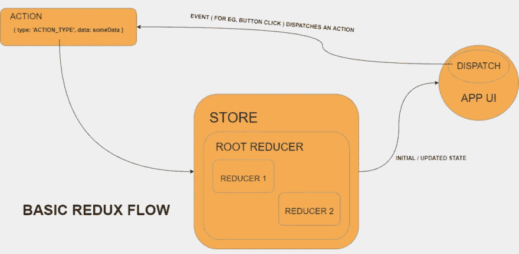

Redux 流从一个特定“类型”的动作开始，由于某些事件，该动作从应用程序 UI 被分派。动作被缩减器接受，然后缩减器根据动作的“类型”改变状态。它可能只会改变国家的某一部分。其余的数据被重新创建并保留。

在上图中，**根减速器**块中有两个小减速器块。这是因为一个商店可以有多个**片/片**状态。每个状态片段都有自己的动作列表，并有自己独立的缩减器。然而，重要的是要注意，商店只能接受一个缩小，即根缩小。因此，单个切片被组合成一个根归约器，单个切片可以通过映射到一个对象来访问，我们将在后面看到。

另一个需要理解的**超级重要的**概念是当*异步任务*参与时的冗余流。

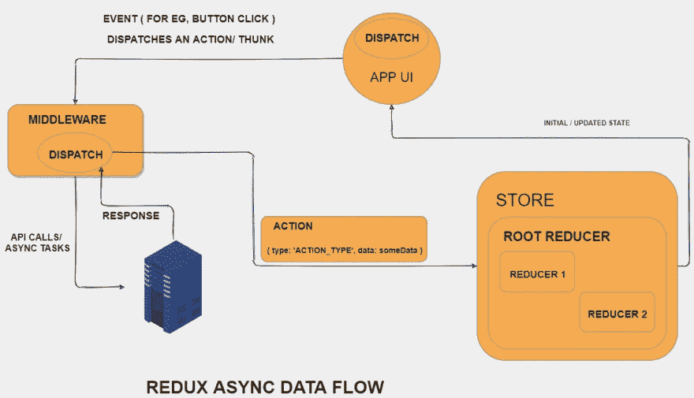

Redux 存储本身无法执行异步任务。所有操作同步发生。但是几乎所有现实生活中的应用程序都需要执行异步任务。

那么我们如何做到这一点呢？我们使用 **thunks** 作为**中间件**。Thunks 只不过是一个返回另一个函数的函数。

因此，为了执行一个异步任务，我们调度一个 thunk…异步任务被执行，并且在完成时，必要的动作被调度。查看上面的图表以可视化流程。

# 浏览代码

看一下我们看到的 src 文件夹

有 4 个组件:

*   帖子—显示所有帖子、加载和错误消息。显示 Post 组件列表。
*   待办事项—显示所有待办事项、加载和错误消息。显示待办事项组件列表。
*   待办事项—显示单个待办事项
*   帖子—显示单个帖子

主容器是显示文章和 Todos 组件的父组件。

让我们先检查一下存储文件夹中的文件。

## **store/index.js**

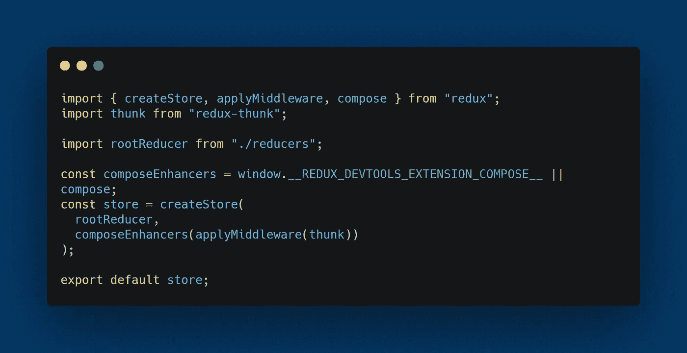

该文件设置将在 React 应用程序中使用的商店。首先，我们从设置商店所需的库中导入必要的东西。

我们还从 reducers 文件夹中导入 rootReducer。

接下来，我们设置 Redux 开发工具。(有关连接 Redux 开发工具的更多信息，请查看此处的)

继续，现在我们使用 createStore 方法创建商店并传入 *rootReducer* 并使用 add *thunk* 作为使用 *applyMiddleware* 函数的中间件。

如果您想在生产中隐藏 redux dev 工具，您可以这样做。

```
const composeEnhancers = process.env.NODE_ENV === 'development' ? window.__REDUX_DEVTOOLS_EXTENSION_COMPOSE__ || compose : compose;
```

## **store/types.js**

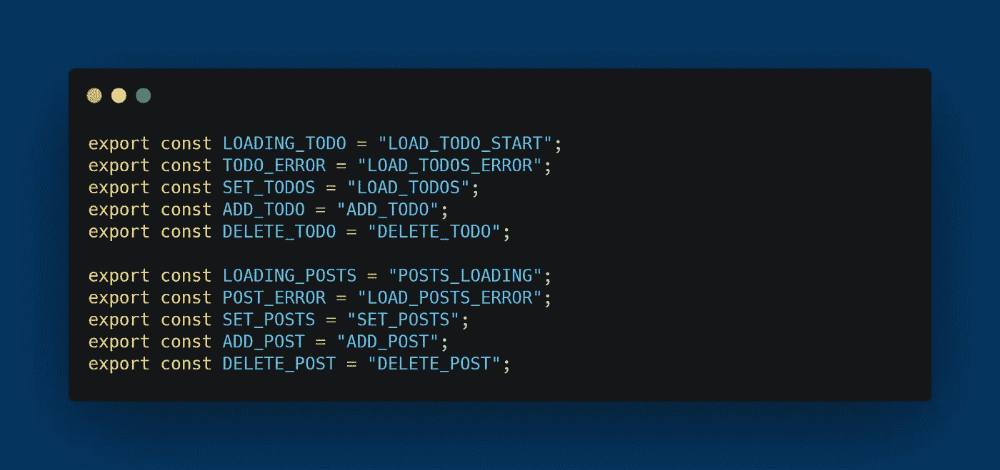

这个文件列出了所有不同的动作类型，这些动作类型在调度动作时会用到，在决定调度动作时也会在 reducer 中用到。

“操作”和“减速器”文件夹具有类似的结构。对于每个状态片段，在各自的文件夹中都有一个动作文件和 reducer 文件。actions 文件夹中的索引文件导出所有动作，reducer 文件夹中的索引文件导出上面的存储文件使用的 rootReducer。

我将解释这个国家的一部分。对于另一个片(Todo)，概念是相同的。

## **actions/post-actions.js**

如前所述，动作是一个对象，我们将使用函数来返回对象。这是最常用的模式。我们会遇到两种函数。一个直接返回动作对象，另一个返回 thunk。
从动作文件中导出的函数是将要从 React 应用程序中调用的函数。

## **直接返回动作 obj 的示例函数:**

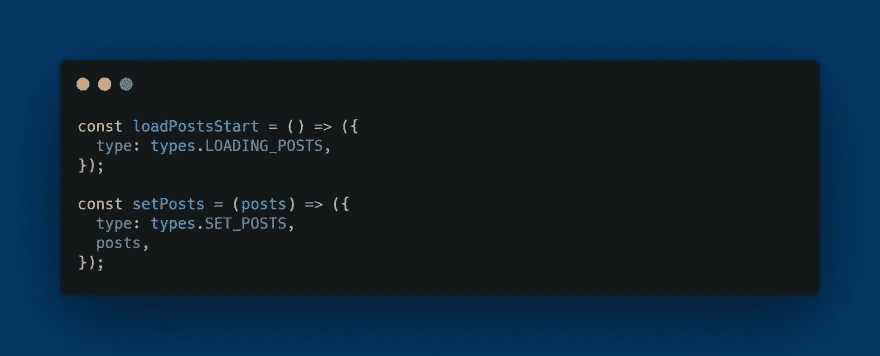

第一个函数只返回动作对象。第二个函数只是返回带有一些通过参数接收的附加数据的对象。

## **返回 thunk 的函数示例:**

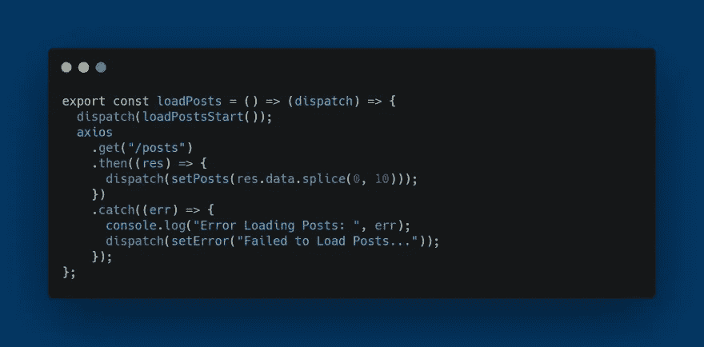

这个函数返回另一个函数(基本上是一个 thunk)，它有一个参数 dispatch，用于在异步任务完成之前和/或之后调度事件。
如代码所示，在这个函数的开始，我们通过调用 loadPostsStart 函数来调度 **LOADING_POSTS** 动作。
当成功提取帖子后，调用 setPosts 函数并传递提取的帖子作为参数，从而调度 **SET_POSTS** 动作。最后，如果有错误，我们通过调用 setError 函数来调度 **POST_ERROR** 动作。

对于我们执行的每种类型的操作，我们都要编写所需的函数。如果操作涉及任何异步任务，我们编写一个 thunk 函数和其他函数，当异步任务结束时，这些函数将分派事件。

这是另一个使用参数的 thunk。


## **actions/index.js**

在这个文件中，来自不同文件的所有操作都在一个对象中导入和导出，该对象将在 React 组件中使用，以调度操作。

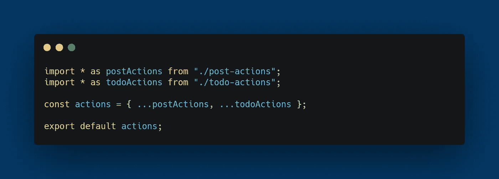

## **减速器/后置减速器. js**

在每个 reducer 文件中，首先定义初始状态，然后是 reducer 函数。在 reducer 函数中，开关盒用于确定动作的类型，然后进行相关的更改，并返回更新后的状态对象。在默认情况下，返回当前状态。

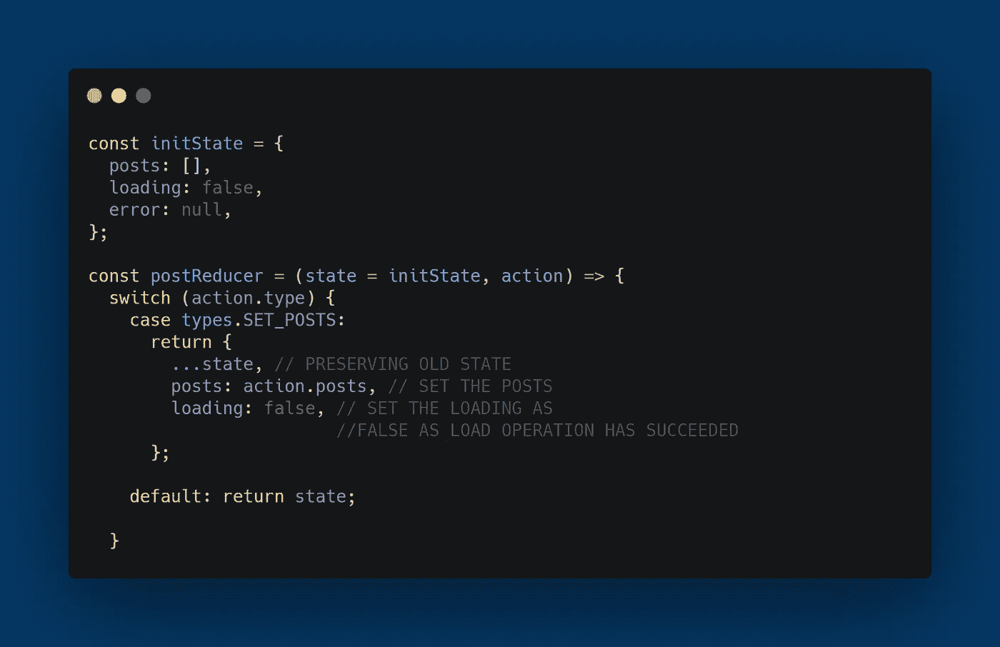

更新状态时要记住的最重要的一点是，必须重新创建整个状态，或者换句话说，我们需要对现有状态进行深度克隆，更新一些部分并返回更新后的状态。

如果您使用数组、嵌套对象或对象数组，并且您会经常使用它们，那么深度克隆就非常重要。

执行所有这些的深度克隆的最好和最简单的方法是使用 JSON.parse()和 JSON.stringify()。

这是一个更新文章的动作，它是一个对象数组。

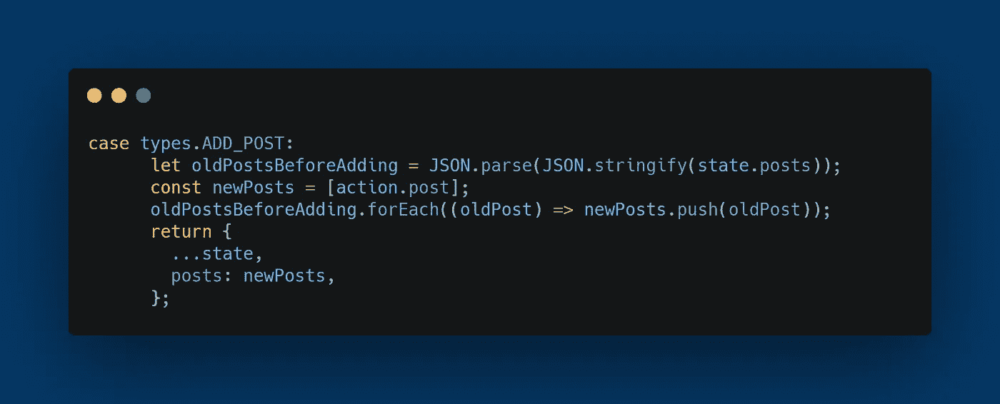

这是一个添加帖子的动作。在这里我们可以看到，首先 posts 数组是深度克隆的。然后用新帖子创建一个数组，所有旧帖子都被添加到这个数组中。最后，更新后的状态被返回，先前的状态被重新创建并保留(…state)，posts 数组被更新。

您可以在每一步查看 reducer 文件中的注释。

## **reducers/index.js**

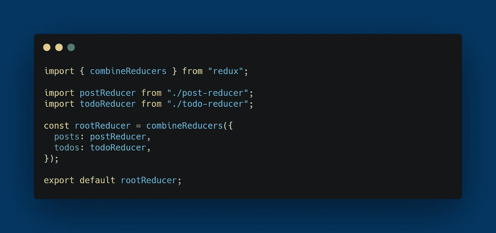

在这个文件中，我们将所有的归约器合并成一个归约器，通常称为 rootReducer。注意，当我们调用 combineReducers 时，我们将每个 reducer(属于一个特定的状态片)映射到一个对象的属性。这用于区分 React 应用程序中状态的不同部分。

# 将商店连接到 React 应用程序

现在，最后一步是将商店连接到我们的 React 应用程序。

## 第一步。**src/index . js 中的提供者**


我们导入提供者组件和商店，并将其传递给商店道具。整个应用程序由提供者组件包装。

## 第二步。 **mapStateToProps 和 mapDispatchToProps**

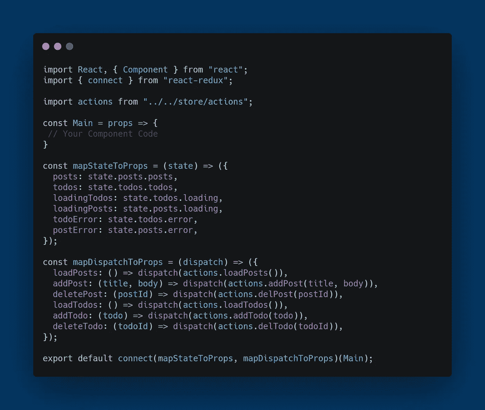

我们需要创建两个常数-

1.  mapStateToProps 具有一个参数 state 的函数，可用于从状态的不同部分提取数据，并将它们映射到组件中作为属性可用的属性。
    例如:Posts、loadingPosts(提取自 posts 切片)、todos(提取自 todos 切片)等。可以通过 props.posts、props.todos 等方式访问。
2.  mapDispatchToProps —带有一个参数调度的函数，用于映射调用带有可选附加数据的调度函数来调度某个事件的函数。这些也可以作为连接组件中的道具。

最后，我们调用 connect，传递 mapStateToProps 和 mapDispatchToProps 对象，然后传递我们的组件。然后我们通常在应用程序中使用这些作为道具。

*您可以使用 mapStateToProps(省略第二个参数)或 mapDispatchToProps(将 null 作为第一个参数传递)来调用 connect。*

# 使用 Redux 开发工具

单击此圆形图标打开 Redux 开发工具。您可以检查所有已调度的操作。在右边的部分，您可以查看所有内容、操作、整个状态数据、状态数据的差异等。

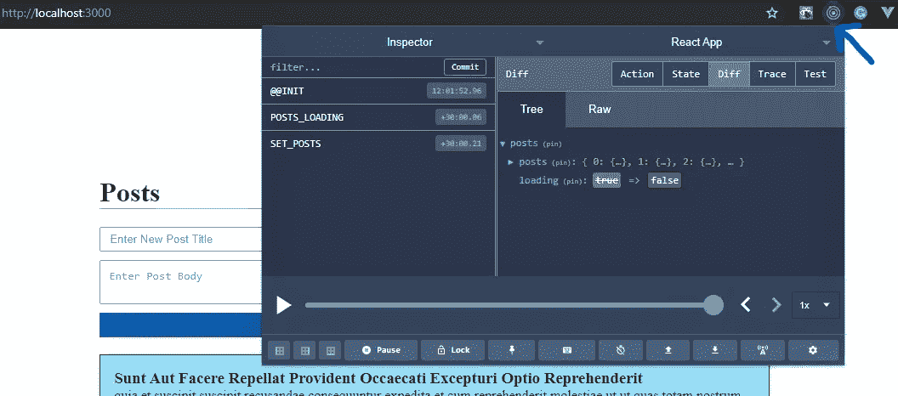

就这样了。希望您对 Redux 如何与 React 一起工作有一个坚实的基本理解。摆弄代码。你总能从[官方文件](https://react-redux.js.org/using-react-redux/connect-mapstate)中学到更多。请随意提出任何拉动请求。会很高兴见到他们。下次见。👋❤

我的更多文章:

*   如何构建你的 React 应用:[https://medium . com/swlh/demystifying-the-folder-structure-of-a-React-app-c 60 b 29d 90836](https://medium.com/swlh/demystifying-the-folder-structure-of-a-react-app-c60b29d90836)

*原载于 2020 年 11 月 29 日*[*https://dev . to*](https://dev.to/senshiii/react-redux-deep-dive-state-management-in-react-with-redux-5299)*。*