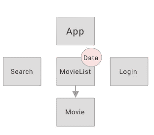
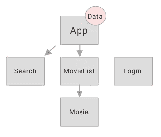
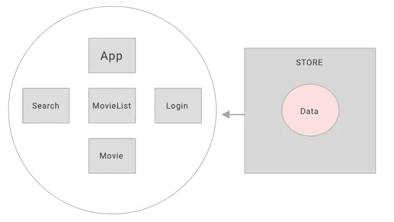
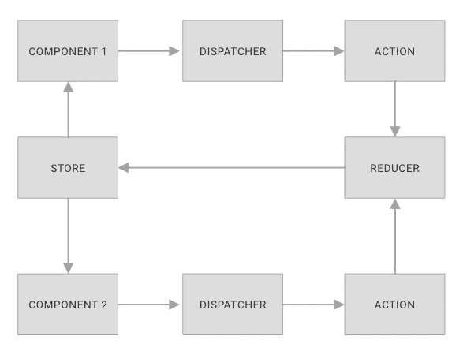
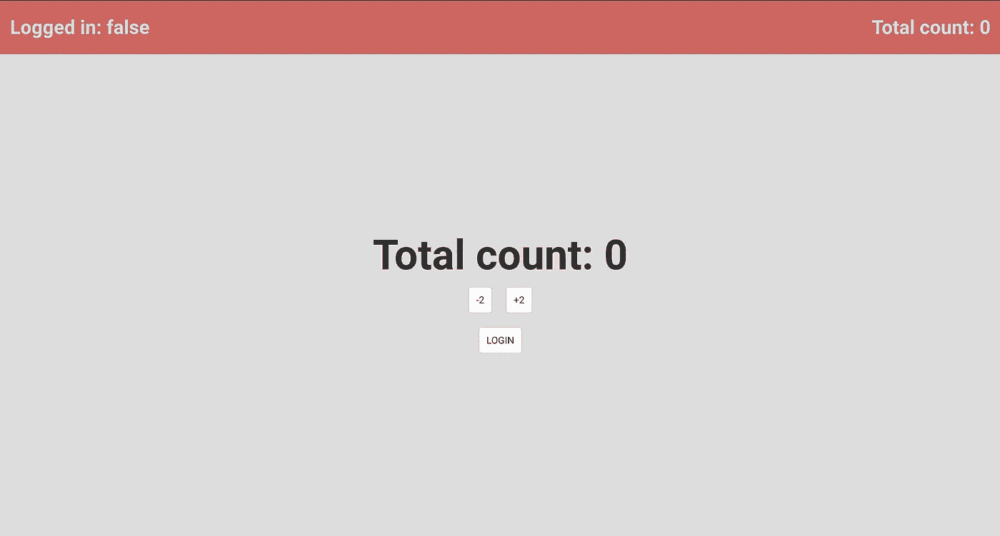
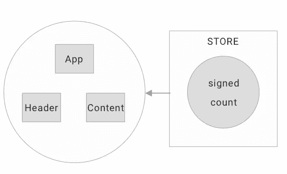
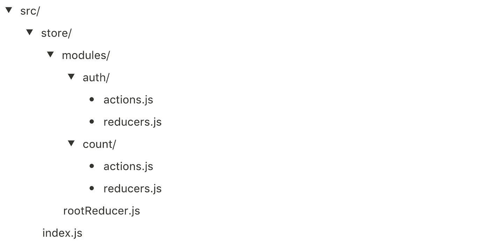
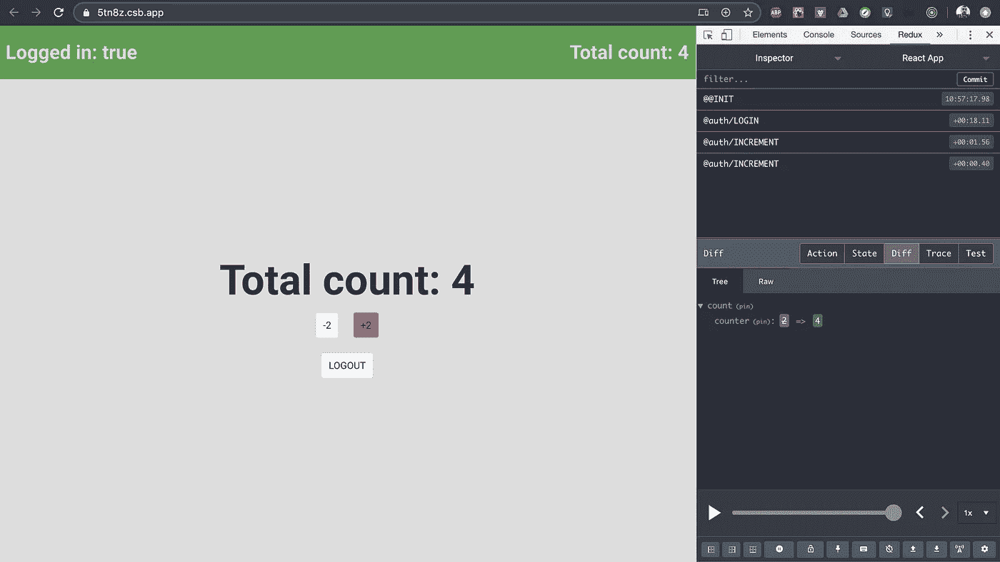

# 适合初学者的 React Redux

> 原文：<https://javascript.plainenglish.io/react-redux-for-beginners-d51b46cb6d58?source=collection_archive---------1----------------------->

## 通过本实践教程，了解什么是 Redux，如何在 React 项目中配置和使用它。


## 在 React 应用程序中，信息从父元素向子元素单向流动。

在下面的例子中，我们有一个应用程序的例子，用户可以检查他们最喜欢的电影。请注意，MovieList 组件可以访问一个 API，该 API 返回要在屏幕上显示的电影列表。当我们想要访问一部特定的电影时，我们可以通过 Props 将数据传递给电影组件。



Search component can't access data

当我们想使用搜索栏时，问题就出现了。请注意，它在我们的组件树中位于 MovieList 的同一层，因此我们无法在这两个组件之间共享数据。为了解决这个问题，我们必须将数据存储在两者的父组件中，在本例中是 App。



States of application inside App component

现在 Search 和 MovieList 都可以访问数据，但这是处理这种情况的最佳方式吗？

将电影列表信息保留在应用程序中没有多大意义，因为这些信息对该组件没有任何意义(它存在的唯一原因是允许与搜索组件共享数据)。另一个要点是，这里我们讨论的是一个 5 组件应用程序。想象一下这样一种情况，我们的应用程序不断增长，我们需要管理几十个组件。保持它的有序会非常复杂，那么如何解决这个问题呢？

让我们在应用程序中创建一个全局状态，这样所有组件都可以从中访问数据。



Application with global state

首先，我们需要了解从现在开始将要用到的四个概念:

*   **STORE →** 这是我们应用程序的全局状态。
*   **动作→** 与名字所暗示的相反，动作并没有执行的逻辑，它们是返回一个对象或动作名称的函数，要用一个可选的有效负载来执行。
*   **减速器→** 减速器是实际执行我们行动的人。基本上，他们有一个开关，可以根据用户通知的动作来决定我们的应用程序要做什么。
*   **调度员→** 调度员负责调用动作。

这些概念是脸书创建的称为 Flux 的架构的一部分，Redux 是该架构的实现，其工作方式如下:

1.  组件调用调度程序
2.  调度员触发操作
3.  Reducer 监听动作，并根据调用的动作在我们的应用程序中执行更改
4.  Reducer 更新存储(应用程序全局状态)
5.  组件根据存储值更新它们的值



Flux architecture

动作和缩减器使用发布者/订阅者模式工作。在底层，被调用的动作发布一个被 reducers 监听的对象。基于这些对象的属性，reducers 执行某些操作并更新存储，其中包含应用程序的全局状态。

我知道这听起来令人困惑，但我保证当我们去实践时会更容易理解！

让我们用下面的例子来理解如何在我们的项目中配置和使用 Redux:



App interface

这个超级简单的应用程序将由两个组件(Header 和 Content)构成，这两个组件共享用户登录时的信息和总数。正如我们前面看到的，在同一级别的两个组件之间共享这些状态的最佳方式是使用存储。



App components

我假设如果你正在学习 Redux，那是因为你已经对 React 的基础有了一些了解。在本教程中，我不会详细介绍我们将使用的两个组件(Header 和 Content)的实现，也不会介绍如何使用 GlobalStyle 的样式组件，而是专注于 Redux 的配置和使用。如果你感兴趣，我有另一篇文章[解释如何建立这个结构。](https://medium.com/javascript-in-plain-english/how-to-build-reusable-layouts-in-react-js-daf8adcbca79)

组件的创建及其风格化非常简单，只是为了教学目的，正因为如此，我相信你在理解最终可用的代码时不会有任何困难。

# 配置 Redux

我们需要做的第一件事是在我们的项目中配置 Redux。

让我们安装以下库:

```
yarn add redux react-redux
```

安装完成后，我们需要创建这个文件夹结构来组织我们的代码:



存储文件夹将包含关于 Redux 的所有必要信息。

*   `index.js`文件将负责设置我们的存储，并允许组件访问它们的值。
*   在 modules 文件夹中，我们将根据它们的功能来分离我们的操作和 reducers。在这种情况下，我们有认证动作和计数动作。
*   每个模块的文件夹内都有它的动作和减少器。
*   最后，我们将有一个名为 rootReducer 的文件。这是一个通常用来描述 redux 方法的名称，该方法采用多个 redux 并将它们组合成一个对象。我们将在后面看到，当我们创建商店时，它只接受一个缩减器，我们使用这个函数来解决这个问题。

# 创建操作

让我们从动作文件开始。基本上，它们包含返回一个对象的函数，这个对象将被 reducers 听到。在这些对象中，我们通常发送两个值:`type`和`payload`。

Type 是 reducer 将会听到的键，以确定将执行哪个动作，因此它需要是唯一的。在 type 中，我喜欢在动作名之前传递模块名，因为这样更容易调试，我们将在后面看到。

Payload 是可选的，在它里面我们可以传递参数给 reducer。

`./src/store/modules/auth/actions.js`:

```
export function login() {
  return {
    type: "@auth/LOGIN"
  };
}export function logout() {
  return {
    type: "@auth/LOGOUT"
  };
}
```

`./src/store/modules/count/actions.js`:

```
export function increment(number) {
  return {
    type: "@auth/INCREMENT",
    payload: number
  };
}export function decrement(number) {
  return {
    type: "@auth/DECREMENT",
    payload: number
  };
}
```

# 创建减速器

Reducers 将有一个初始状态，我们将根据应用程序触发的动作来改变它，总是使用类型参数作为键。

在这个文件中，我们将使用一个名为 immer 的库来帮助我们管理应用程序状态的变化，因为始终值得记住的是，React 状态是不可变的。如果你想知道更多细节，你可以查看他们提供的[大文档](https://github.com/immerjs/immer)！

要安装 immer，只需使用以下命令:

```
yarn add immer
```

检查以下减速器的实施情况。

`./src/store/modules/auth/reducers.js`:

```
import produce from "immer";const INITIAL_STATE = {
  signed: false
};export default function auth(state = INITIAL_STATE, action) {
  return produce(state, draft => {
    switch (action.type) {
      case "@auth/LOGIN":
        draft.signed = true;
        break;
      case "@auth/LOGOUT":
        draft.signed = false;
        break;
      default:
    }
  });
}
```

`./src/store/modules/count/reducers.js`:

```
import produce from "immer";const INITIAL_STATE = {
  counter: 0
};export default function auth(state = INITIAL_STATE, action) {
  return produce(state, draft => {
    switch (action.type) {
      case "@auth/INCREMENT":
        draft.counter += action.payload;
        break;
      case "@auth/DECREMENT":
        draft.counter -= action.payload;
        break;
      default:
    }
  });
}
```

注意，reducer 是一个接收状态和动作的函数(包含我们前面看到的类型和有效负载)。

如果我们的存储仍然是空的，我们的 INITIAL_STATE 将发挥作用，用我们定义的默认值填充它。

从我们的 reducer 返回调用我们从 immer 内部导入的`produce`。请注意，该生成器获取一个状态并返回一个草稿。在这个草稿中，我们添加了一个开关来根据类型选择动作，并用相应的值修改状态。注意，这个草稿包含了我们状态的一个副本，可以修改(immer 为我们处理它，并最终返回带有我们想要更改的值的状态)。

# 组合减速器

当我们创建商店时，我们需要传递一个 reducer 作为参数。为了解决这个问题，让我们创建文件`./src/store/modules/rootReducer.js`。在里面，我们将使用 redux 的`combineReducers`方法，它将负责组合我们所有的 reducers 并返回一个值添加到存储中。

```
import { combineReducers } from "redux";import auth from "./auth/reducer";
import count from "./count/reducer";export default combineReducers({
  auth,
  count
});
```

# 创建商店

配置 redux 的最后一步是创建存储，将我们的 reducers 配置作为参数传递到文件`./src/store/index.js`中。为此，我们将使用 redux 的`createStore`方法。

此外，我们将使用一个名为 [Redux Devtools](https://github.com/zalmoxisus/redux-devtools-extension) 的调试工具，它将帮助我们识别正在调用的操作(相信我，它将使您的应用程序调试变得更加容易)。要安装 redux devtools，只需按照他们页面上的教程，非常简单！我使用谷歌 Chrome，直接从 Chrome 网上商店安装。

现在，让我们安装 redux devtools 库，它将帮助我们进行设置:

```
yarn add redux-devtools-extension
```

我们将向`createStore`函数传递两个参数:我们的`rootReducer`(它包含所有的 reducers)和一个名为`enhancer`的新参数，在这里我们将通知我们想要添加到存储中的其他特性，例如中间件或持久性(我们将在以后的帖子中讨论这些设置)。

```
import { createStore } from "redux";
import { devToolsEnhancer } from "redux-devtools-extension";import rootReducer from "./modules/rootReducer";const enhancer =
  process.env.NODE_ENV === "development" ? devToolsEnhancer() : null;const store = createStore(rootReducer, enhancer);export default store;
```

注意，配置非常简单，只有在开发环境中，增强器才应该存在。我们可以通过检查 NODE_ENV 环境变量来控制这一点。当我们使用 create-react-app 创建我们的应用程序时，如果我们使用参数`start`启动我们的应用程序，它就具有开发价值。当我们构建我们的应用程序时，这个值变成了`production`。

# 在我们的组件和商店之间搭建桥梁

还记得我在这篇文章的开头提到 React 中的信息是单向流动的吗？使用 Redux，我们将保持相同的模式，将所有组件包装在一个名为`Provider`的`react-redux`组件中。该组件将把我们之前设置的商店作为属性。

因为我们应用程序中的其他所有东西都比提供者低一个级别，所以所有组件都可以访问商店中的值。

`./src/App.js`文件将如下所示:

```
import React from "react";
import { Provider } from "react-redux";import Content from "./components/Content";
import Header from "./components/Header";import store from "./store";import GlobalStyle from "./styles/global";function App() {
  return (
    <Provider store={store}>
      <Header />
      <Content />
      <GlobalStyle />
    </Provider>
  );
}export default App;
```

# 从存储中检索值

为了访问存储值，我们将使用 react-redux 中一个名为 useSelector 的函数。以 Header 组件为例，我们能够从存储内部检索这两个值，并将它们添加到 JSX。如果这些值改变了，我们的组件会用新的值再次呈现！

```
import React from "react";
import { useSelector } from "react-redux";import { Container } from "./styles";export default function Header() {
  const count = useSelector(state => state.count.counter);
  const signed = useSelector(state => state.auth.signed); return (
    <Container signed={signed}>
      <h1>Logged in: {String(signed)}</h1>
      <h1>Total count: {count}</h1>
    </Container>
  );
}
```

# 触发动作

我们需要执行的最后一步是触发动作来改变存储中的状态。现在我们将以内容组件为例。注意，除了`useSelector`，我们还从 reactRedux 内部导入了`useDispatch`。此外，我们需要从各自的文件中导入我们的操作。

我们使用 useSelector 重复了在 Header 组件中执行的相同过程来检索商店状态，并使用`useDispatch`创建了一个 dispatch，它将负责触发我们的操作，正如我们在开头的图表中看到的那样。

```
import React from "react";
import { useSelector, useDispatch } from "react-redux";import { Container } from "./styles";import { login, logout } from "../../store/modules/auth/actions";
import { increment, decrement } from "../../store/modules/count/actions";export default function Main() {
  const count = useSelector(state => state.count.counter);
  const signed = useSelector(state => state.auth.signed);
  const dispatch = useDispatch(); return (
    <Container>
      <h1>Total count: {count}</h1> <div>
        <button onClick={() => dispatch(decrement(2))}>-2</button>
        <button onClick={() => dispatch(increment(2))}>+2</button>
      </div> {signed ? (
        <button onClick={() => dispatch(logout())}>LOGOUT</button>
      ) : (
        <button onClick={() => dispatch(login())}>LOGIN</button>
      )}
    </Container>
  );
}
```

请注意，在按钮的`onClick`功能中，我们通过调度来触发我们的操作。在`increment`和`decrement`动作中，我们将一个值作为参数传递。

将 dispatch 放在 arrow 函数中是非常重要的，这样只有当用户单击按钮时它才会被调用，否则每当组件被渲染时它们都会被触发，这将最终在您的代码中生成一个无限循环(如果发生这种情况，react 会触发一个错误)。



# 结论

Redux 一开始可能看起来很混乱，但是不要被它吓到，只要稍微练习一下，你就会发现它并没有那么复杂。我希望这个简短的教程可以帮助你理解在许多项目中出现的这种架构背后的概念。

你可以在 codesandebox.io 中查看这个项目的完整实现:

Project implementation on codesandbox.io

如果你有兴趣更多地了解我是如何构建这个应用程序的，你可以查看我的其他文章，其中我展示了[如何在 React JS](https://medium.com/javascript-in-plain-english/how-to-build-reusable-layouts-in-react-js-daf8adcbca79?source=your_stories_page---------------------------) 中构建可重用布局，以及[如何在 React JS](https://medium.com/javascript-in-plain-english/how-to-build-reusable-layouts-in-react-js-daf8adcbca79?source=your_stories_page---------------------------) 中构建可重用布局。

希望这篇教程能对你的项目有所帮助！感谢阅读！