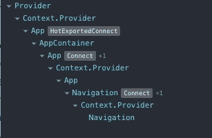
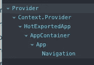

# 组织反应的更好方法——Redux 钩子

> 原文：<https://javascript.plainenglish.io/react-redux-hooks-organization-2aa38755d8fb?source=collection_archive---------0----------------------->

钩子无疑是惯用反应的未来。作为一名软件工程团队的领导者，我的任务是确保我的团队能够及时了解当今有意义的技术。就钩子而言，我的团队已经开始在新项目中采用它们。因此，我认为深入了解社区在他们周围形成的一些最新特征会很有用。

钩子范例允许所有组件都是功能组件，并且从无状态组件到具有本地状态的组件的转换是无缝的。在 reactor-redux 模块中引入钩子后，与商店相连的组件(或者我们认为的“容器”)也是如此。

考虑预挂钩范例中的一个连接组件:

**Listing 1** — Connected component without hooks.

因为我的团队使用 Typescript 来确保类型安全，所以在这种情况下，我们创建一个组件，为已经定义的类型定义一个接口(在 redux action generator 中),作为组件支柱的类型定义，然后我们将组件包装在一个更高级的连接组件中，该组件使用两个函数——一个将状态映射到其对应的支柱接口，一个将我们想要分派的任何函数映射到其对应的支柱接口。我们不仅不必要地重新定义我们的接口，并编写额外的函数来将实体映射到这些接口(我们倾向于为需要使用相同实体的每个容器重新编写)，而且我们还用包装的组件污染了虚拟 DOM，这使得检查更加困难。考虑用浏览器中的反应工具检查的这个容器的虚拟 DOM:

**Figure 1** — Virtual DOM with higher-ordered component wrappers.

在检查这个虚拟 DOM 时，您可以看到我们有包装整个应用程序的原始提供程序，将商店链接到我们的应用程序，后面是 2 个连接的组件(容器)，第一个是父级应用程序容器，第二个是我们的导航容器，在清单 1 中引用。您会注意到，每个连接的组件在虚拟 DOM 的组件树上创建了 3 个级别:1)组件被上下文提供者包装后的默认导出；2)上下文提供者本身来自 react-redux 中的“connect”函数；3)您想要连接的实际组件。正如您所看到的，从声明性编程的角度来看，这可能会用树中不必要的组件污染虚拟 DOM。如果您导入到应用程序中的组件是实际的基本组件，而不是通过用更高级的连接组件包装该组件而创建的默认导出，那么这种模式也会产生出错的机会。那么，我们能做得更好吗？

React-redux 在它们的库中实现了新的钩子来替换这个连接包装器(如果使用 Typescript，请确保安装了 7.1.0 或更高版本，并且安装的类型声明匹配)。它们是*使用选择器*挂钩和*使用分配器*挂钩。 *useSelector* 钩子从总体提供者包装器中提供的存储中返回值。该值将在存储更新时更新，并导致组件重新呈现。 *useDispatch* 钩子提供了一个分派函数，该函数连接到总体提供者包装器中提供的存储。使用这些挂钩，我们可以简化我们的连接组件，如下所示:

**Listing 2** — Simplified component with react-redux hooks.

这段代码的样板文件要少得多，也更容易理解。它消除了导入错误组件的可能性，因为该文件中只有一个可导出的组件。您也不必重新声明选择器和分派函数的类型，因为它们隐含在动作生成器/选择器中。使用钩子还提供了一个额外的好处，即在使用非连接组件，突然需要将它转换成容器时，可以更容易地重构。在这种情况下，你需要做的就是添加你想要的钩子，然后你就自动连接上了。在这种情况下，相比之下，redux 工具中的组件树也将更加清晰:

Figure 2 — Virtual DOM with react-redux hooks.

这显然更容易检查。

一旦我的团队意识到这些好处，我就更进一步，提出了一种新的设计模式，围绕如何在项目中组织这些 react-redux 挂钩。使用定制钩子，我们只需编写一次选择器/调度钩子，然后根据需要将它们分解成我们的功能组件。考虑这些在名为 user.ts 的文件(对应于用户操作文件和用户缩减文件)中创建的定制钩子，并放置在项目的钩子文件夹中:

Listing 3 — Custom hooks to centralize dispatch and selectors.

这些自定义钩子返回包含 react-redux 钩子的对象。我们可以根据需要将这些定制挂钩分解到我们的连接组件中，这样我们就不必在每个连接组件中重写它们。查看使用这些自定义挂钩重构的组件:

Listing 4 — Connected component refactored with custom hooks.

正如您所看到的，这个新的连接组件更简单，更容易转换，更不容易出错，并且选择器和调度器更加模块化。我们只需要在我们的定制钩子中编写一次选择器和调度钩子，然后我们在组件中使用钩子，只析构我们需要的选择器和调度钩子。

# TL；速度三角形定位法(dead reckoning)

**高阶连接组件的问题**(包装在 react-redux 连接函数中的组件):

1)为每个连接的组件不必要地重写接口和映射函数

2)用 react 工具检查时污染的组件树

3)导入连接组件时出错的机会

4)将非连接组件重构为连接组件需要大量痛苦的样板代码。

**解决方案**是使用 react-redux *useSelector* 和 *useDispatch* 钩子以及自定义钩子。

*更多内容请看*[***plain English . io***](http://plainenglish.io)