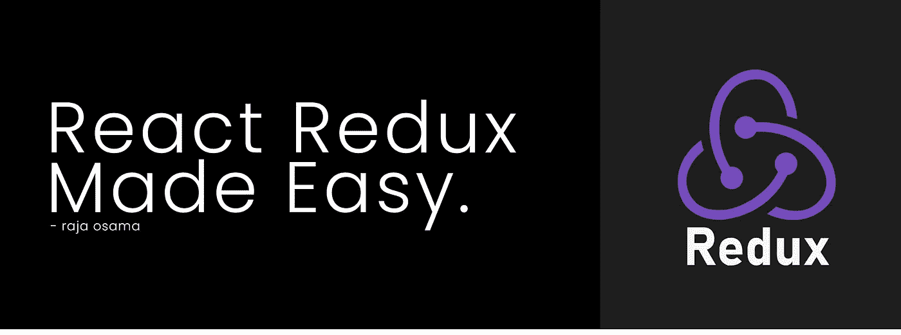
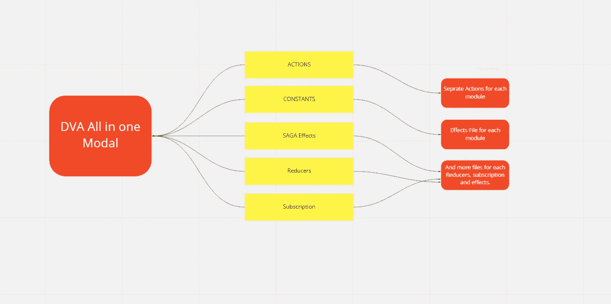
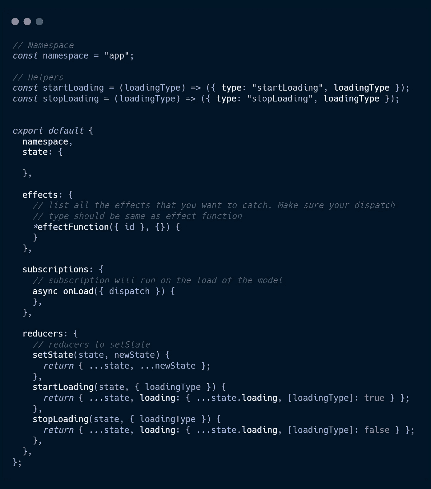
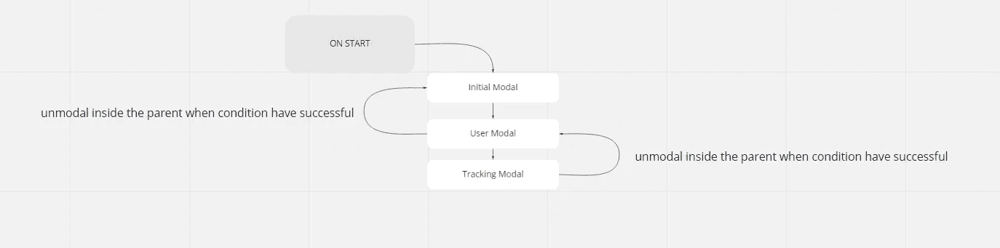
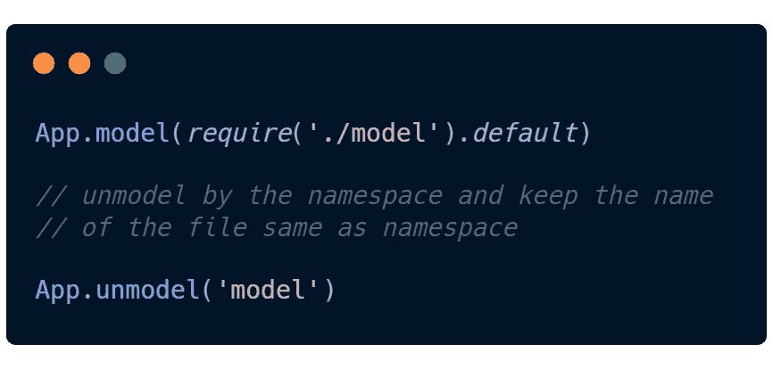
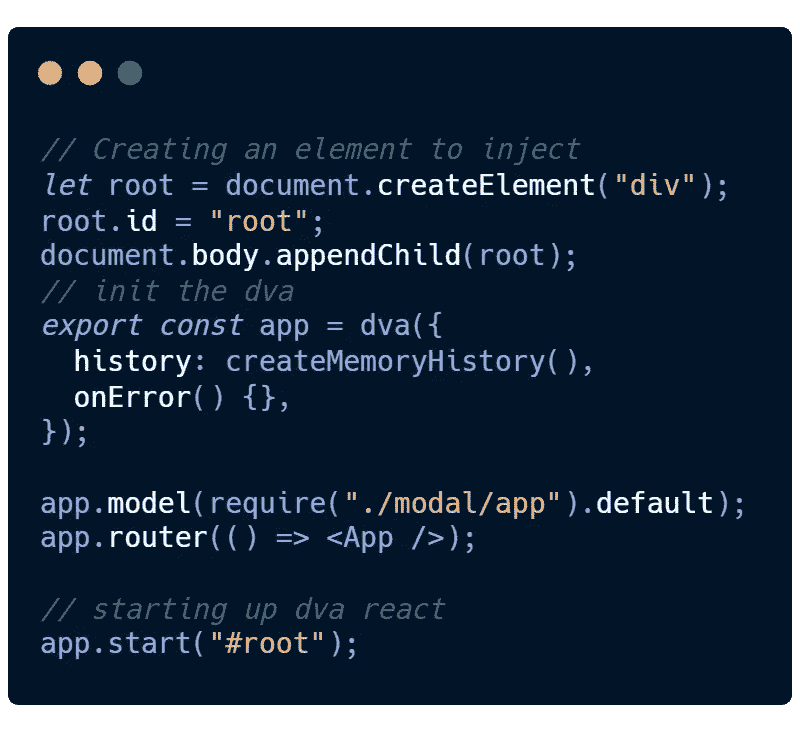

# React Redux 变得简单

> 原文：<https://javascript.plainenglish.io/react-redux-made-easy-4e7395caeb58?source=collection_archive---------12----------------------->

## 学习 Redux 是相当复杂的，而在一个可扩展的网站上实现它是非常复杂的，所以时间变成了一场噩梦。

现在是 2020 年，对于 React 状态管理，人们通常会选择 Redux 或 Context。Redux 通常用于大型应用程序，而由于项目的结构化，Context API 主要用于较小的应用程序。

我个人认为，状态管理仍然是一个巨大的混乱，因为无论你做什么，随着你的项目增长，无论你使用什么，管理状态和整个项目结构都将变得困难。我讨厌当我不得不创建多个文件并从 10 个不同的文件中导入状态管理时，看到如此混乱的代码结构简直让我发疯。

那么解决办法是什么呢？最近，大约 6 个月前，我偶然发现了 reducks 的概念，这个概念很快引起了我的注意，这是一个概念，根据这个概念，你的 reducers，actions 和 effects 以及 subscription 都应该在一个地方。点击这里，你可以了解更多关于[的信息。](https://github.com/alexnm/re-ducks)

由一个文件管理所有模块相关的状态是一个可靠的概念，但是我们需要一个更实际的方法。经过一段时间的研究，我发现了一个叫做 DVA 的库。它基于 [redux](https://github.com/reactjs/redux) 、 [redux-saga](https://github.com/redux-saga/redux-saga) 和 [react-router](https://github.com/ReactTraining/react-router) 。基本上我们在 DVA 都有模特，用`actions` 、 `reducers`、`effects`、`subscriptions.`组织模特

它和 reducks 有什么不同？嗯，它不是，我觉得它是基于 reducks 的概念，它最初被称为榆树的概念。嗯，榆树基本上是一种以适应性强、生长迅速和抗逆性强而闻名的树。你可以通过互联网了解更多关于 elm 的信息。

这是一个 DVA 模型的例子。

[https://gist.github.com/Raja0sama/386bf808a174a4c76a715609a1af646a](https://gist.github.com/Raja0sama/386bf808a174a4c76a715609a1af646a)

这是一个简单的 DVA 结构，它显示了我们如何将 reducers、effects 和 subscription 组合在一个文件中，以将我们从混乱的项目结构中拯救出来，并给我们自己一些模块化。

我发现 DVA 最棒的特性之一是按需加载模型；我们可以在一个模型中完成所有的身份验证，在成功登录后，我们可以调用另一个名为 User 的模型，该模型管理所有与用户相关的全局状态管理。注销时，我们可以取消用户模型的建模，以节省一些清理和重置全局状态的时间。

您可以像这样初始化 DVA。

感谢您阅读这篇短文。希望你觉得有用。

[LinkedIn](https://www.linkedin.com/in/rajaosama/) 🔗
Github🔗
[网站](https://rajaosama.me/)🔗