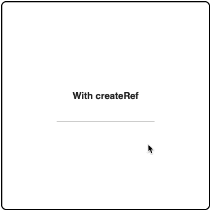
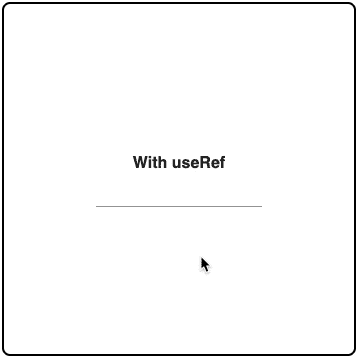

# React 引用，包括类组件和功能组件。

> 原文：<https://javascript.plainenglish.io/react-refs-both-class-and-functional-components-76b7bce487b8?source=collection_archive---------0----------------------->

不可避免的是，在开发过程中的某个时刻，你会使用别人的组件。然而，您的用例可能是组件内部机制的外部。你得黑进去。


Obligatory Unsplash Image | [Tatiana Rodriguez](https://unsplash.com/@tata186) — Unsplash

# 问题是

引用用例的一个很好的例子是框架输入库。在这种情况下，我们将讨论材质 UI 的 [TextField 组件](https://material-ui.com/api/text-field/)。**稍后会有一些澄清和提示，请原谅我和我的例子。**

假设您有一个表单，在呈现时，您希望它被自动选中。您的基本输入代码如下所示:

```
import React from 'react';
import { TextField, Typography } from '@material-ui/core';export default class CustomInput extends React.Component {
  constructor(props){
    super(props);
  } render() {
    return (
      <div>
        <Typography style={{fontSize: 16, fontWeight: 'bold'}}>
          Without Ref
        </Typography>
        <TextField />
      </div>
    )
  }
}
```


Basic Input Rendering without a ref

# 解决方案是:

[React](https://reactjs.org/) 框架包含两种类型的组件。功能和类组件。我们的解决方案将关注 react 的两个关键方法， [createRef](https://reactjs.org/docs/refs-and-the-dom.html#creating-refs) 和最近的 react hook [useRef](https://reactjs.org/docs/hooks-reference.html#useref) 。 **createRef 可用于类组件和功能组件**。然而，在这些例子中，我将为每个组件类型使用一个。

**类组件:**

利用 React 的 createRef 方法，我们可以在上面的基本代码中添加以下几行。这将首先在我们的类中创建一个名为 myInput 的 ref。因为我们使用的是 materialUI 中的 textField，所以这实际上包装了 input 的基本组件。**如果您在自定义组件中使用它，应该使用 ref prop 而不是 inputRef** 。最后，有时我们可能想要在一个还没有挂载的组件上触发一个方法。因此，如果电流可用，我们称之为电流。如果不是，它将被存储为 null。

```
// Between class and constructor
myInput = React.createRef();// Add this prop to the textfield
inputRef={this.myInput} // Check if our ref has been assigned and if so, focus.
componentDidMount() {
  this.myInput.current && this.myInput.current.focus();
}
```



Class Component | Input rendering with createRef

**功能组件:**

在这个例子中，我们将使用 react 的钩子。**类组件示例也可以，只需去掉** `**this**` **，使用** `**myInput**` **作为自己的变量。我们呈现非焦点输入字段的基本代码如下所示:**

```
import React from 'react';
import { TextField, Typography } from '@material-ui/core';export default function CustomInput({ classes }) {
  return (
    <div>
      <Typography style={{fontSize: 16, fontWeight: 'bold'}}>
        Without Ref
      </Typography>
      <TextField />
    </div>
  )
}
```

增加了以下几行:

```
// Import our hooks
import React, { useRef, useEffect } from 'react';// create our ref
const myInput = useRef();// This is equivalent to our componentDidMount, this will focus
useEffect(() => myInput.current && myInput.current.focus());// Parse our ref to our textField
<Textfield inputRef={myInput} />
```



Functional Component | input rendering with useRef

# 最后的想法

*   如果除了 focus 之外不需要 ref，可以直接使用下面的语句:

```
<TextField inputRef={input => input && input.focus()} />
```

*   props 中包含了许多专门用于这些用例的框架组件。比如`autoFocus`、`onClick`等等。**首先阅读你的文档，**这篇文章最适用于你自己的定制组件或者输入或表单的独特用例。
*   如果我漏掉了什么，请评论！这是最近实现的一个滚动想法，我不怀疑我遗漏了一些东西。

## 进一步阅读

[](https://bit.cloud/blog/introducing-component-compare-easily-review-component-changes-l4qyxtoo) [## 比特博客

### 组件驱动软件的官方博客。围绕现代组件驱动的 web 开发的文章…

比特云](https://bit.cloud/blog/introducing-component-compare-easily-review-component-changes-l4qyxtoo) 

*更多内容看* [***说白了就是***](https://plainenglish.io/) *。报名参加我们的* [***免费周报***](http://newsletter.plainenglish.io/) *。关注我们关于* [***推特***](https://twitter.com/inPlainEngHQ) ， [***领英***](https://www.linkedin.com/company/inplainenglish/) ***，***[***YouTube***](https://www.youtube.com/channel/UCtipWUghju290NWcn8jhyAw)***，以及****[***不和***](https://discord.gg/GtDtUAvyhW) *对成长黑客感兴趣？检查出* [***电路***](https://circuit.ooo/) ***。****