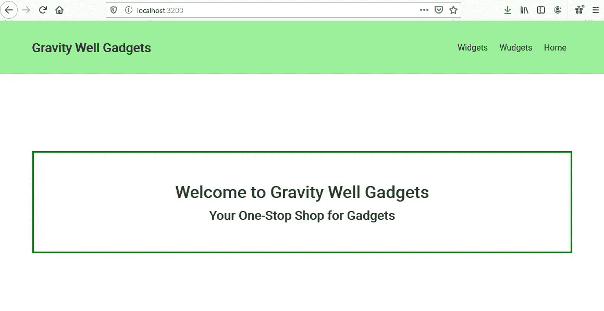
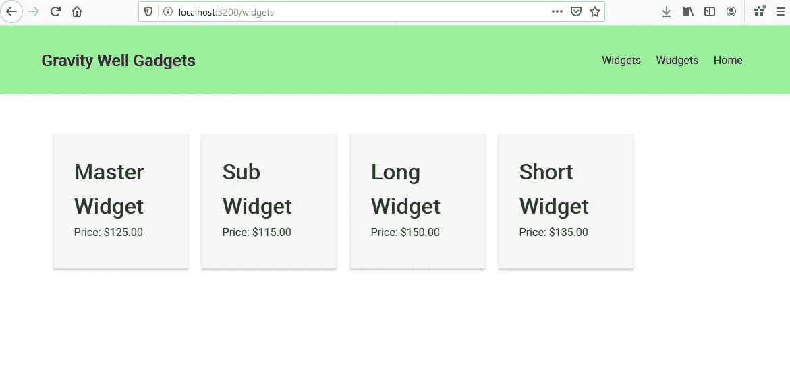
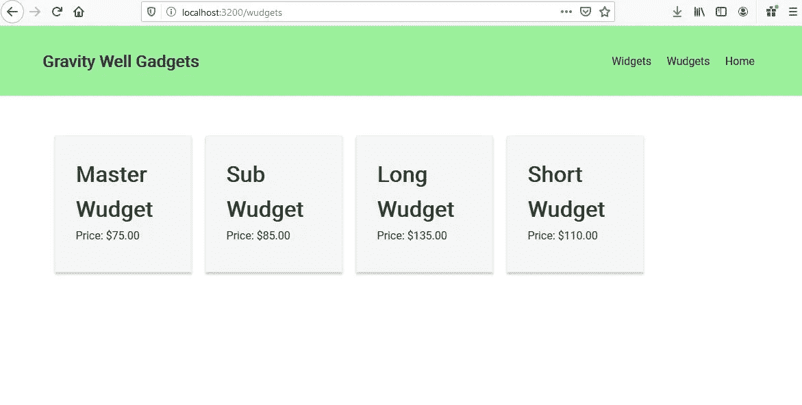
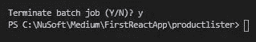
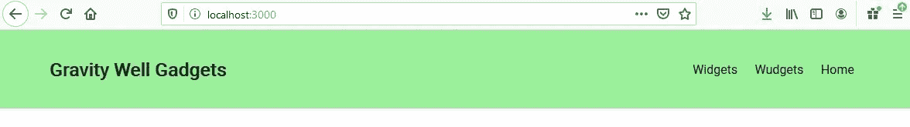

# 如何使用 React-Router 创建 SPA

> 原文：<https://javascript.plainenglish.io/react-router-and-spas-made-easy-19fd1db0d6fc?source=collection_archive---------1----------------------->

## 反应提示

## 使用客户端路由创建单页应用程序


Photo by [John Schnobrich](https://unsplash.com/@johnschno?utm_source=medium&utm_medium=referral) on [Unsplash](https://unsplash.com?utm_source=medium&utm_medium=referral)

> 一个**单个** - **页面应用** (SPA)是一个 web **应用**或网站，它通过用来自 web 服务器的新数据动态重写当前 web **页面**来与 web 浏览器交互，而不是浏览器加载整个新**页面**的默认方法。

在 React 中，这是通过使用浏览器路由器实现的，通常称为 React 路由器和链接。

通过防止页面刷新，并使用路由器和链接，可以防止出现白屏或空白页。这是获得无缝用户体验的一种常见方式。React router 还允许用户利用浏览器功能，如后退按钮和刷新页面，同时保持应用程序的正确视图。

> React Router 和动态客户端路由允许我们构建一个具有导航功能的单页面 web 应用程序，而无需在用户导航时刷新页面。React 路由器使用组件结构来调用组件，组件显示适当的信息。

*这是基于组件的 web 开发系列的第二篇文章。您可以从这篇文章开始，但是请参考上一篇文章来复习某些内容。*

[](https://link.medium.com/ITVWprATp5) [## 创建您的第一个 React 应用程序

### 在本教程中，我们将构建一个应用程序来显示产品列表，如下所示。产品将是我们自己的…

link.medium.com](https://link.medium.com/ITVWprATp5) 

# 你将学到什么

*   如何创建一个持续显示的导航栏？
*   什么是**反应路由器**及其工作原理。
*   什么是**链接**及其工作原理。
*   如何构建一个**单页面应用**。

# 我们的应用

在我们的应用程序(下图)中，我们创建了一个单页面应用程序来显示一个小工具列表，可以是 Widgets 或 Wudgets。

*   **小部件**将是一个组件，创建一个**小部件**组件的列表。当单击导航栏中的小部件链接时，可以访问它。
*   **Wudgets** 将是一个创建一个由**Wudgets**组件组成的列表的组件。当单击导航栏中的 Wudgets 链接时，可以访问它。
*   **导航条**将是*持续显示*的组件。
*   **主页**将是一个组件，当用户导航到我们的网站或当主页链接被点击时显示。

当我们点击链接在 Widgets、Wudgets 和 Home 之间导航时，我们不会看到页面刷新。我们将有一个能够显示所需组件的单一页面，由客户端路由控制—一个单一页面应用程序。



Home page Component will show when the web site is accessed. It will also display when the Home Link is clicked and corresponds to the Route “/”



The Widgets Component displaying a list of Widget Components (each card is a Widget.) Accessed when the client-side /widgets Route is accessed by clicking the Link.



The Wudgets Component displaying a list of Wudget Components (each card is a Wudget.).Accessed when the client-side /wudgets Route is accessed by clicking the Link.

# 避实就虚的 TL；速度三角形定位法(dead reckoning)

我将带我们浏览一下**主页**和**小部件**组件，完成后，它们将创建一个完整的**客户端可路由的单页面应用程序**。但是作为练习，我将把添加 Wudgets 组件的任务留给您。它与小部件相同。然而，我会包括所有的最终代码。

我的目标是指导，而不是用代码把你打傻。

# 工具和设置

我将使用 [Visual Studio 代码](https://code.visualstudio.com/) (VSCode)

您需要安装 [node.js](https://nodejs.org/en/) 。

# 入门指南

## 创建基本的 React 项目结构

1.  创建一个应用程序所在的文件夹。
2.  启动 VSCode 并打开刚刚创建的文件夹。
3.  打开终端窗口。
4.  在终端中键入以下内容来创建我们的项目， **productlister。**

```
npx create-react-app productlister
```

*参见* [*创建您的第一个 React 应用*](https://link.medium.com/ITVWprATp5) *了解三个主要核心文件(App.js、App Component、index.js 和 index.html)以及 props 对象。*

创建应用程序后，让我们确保它能够运行。

5.在终端中，键入以下内容以进入应用程序的目录。

```
cd productlister
```

6.在终端中，启动开发 web 服务器，并通过键入以下命令在开发 web 服务器中测试运行应用程序:

```
npm start
```

**要停止 web 服务器，在终端中使用 CTRL+C 并选择 y。**



Stop the web server from running on Port 3000

6.停止端口 3000 上的开发 web 服务器。请记住，仅仅关闭浏览器并不会终止开发 web 服务器。

**重启开发 web 服务器** **，随时使用 *npm start 运行应用程序。***

# 安装 React 路由器

1.  在终端窗口类型中，

```
npm install react-router-dom
```

注意，在文档和 API 中，实际的组件被称为**浏览器路由器**。大多数人更喜欢把组件称为**路由器**，所以我们在导入的时候会给它取路由器的别名。

2.打开 src 文件夹中的 App 组件(App.js)。我们将删除一些不必要的项目并导入浏览器。

将 App.js 替换为以下内容:

```
import React, { Fragment } from 'react';
import { BrowserRouter as Router, Route, Switch } from 'react-router-dom';
import './App.css';const App =()=>{
  return (
    <Fragment>
      Gravity Well Gadgets
    </Fragment>)};export default App;
```

*如果你输入****NPM start****它会相当平淡无奇，但会显示重力井小工具。*

膨胀:

1.  从“react”导入 React，{ Fragment }；
    这里我们导入 **React** 对象。我们也导入**片段**。

> [*片段*](https://www.geeksforgeeks.org/reactjs-fragments/) 让你不用给 DOM 添加额外的节点就能分组一个孩子列表。

2.从“react-router-dom”导入{ BrowserRouter as Router，Route，Switch }；
BrowserRouter 是我们的客户端路由器。**我们将其别名为路由器**。Route 是一个组件，它将让我们创建< Route >和 Switch<Switch>，遍历其子< Route >并呈现匹配当前 URL 的第一个。

**在我们的应用程序中，每个<路径>将引用一个要渲染的组件。<开关>和一个还没有提到的项目<链接>，将允许应用程序决定用<路由>/组件来渲染。**

# 创建我们的导航栏组件

我们将在应用程序中使用的 CSS 如下。用这个 css 替换 **App.css** 的内容。这当然是一个你可以进一步定制的领域。

```
.product {
  display: inline-block;
  background-color: whitesmoke;
  margin: 10px;
  border: 1px solid #eee;
  box-shadow: 0 3px 3px #ccc;
  width: 200px;
  height: 200px;
  padding: 30px;}
.home{
  text-align: center;
  border: 3px solid green;
  padding: 50px 0;
  margin-top: 100px;
}
[@import](http://twitter.com/import) url('[https://fonts.googleapis.com/css?family=Roboto'](https://fonts.googleapis.com/css?family=Roboto'));/* Global Styles */
:root {
  --nav-primary-color: lightgreen;
  --nav-text-color:Black;
  --nav-a-hov-color:Blue;}* {
  box-sizing: border-box;
  margin: 0;
  padding: 0;
}body {
  font-family: 'Roboto', sans-serif;
  font-size: 1rem;
  line-height: 1.6;
  background-color: #fff;
  color: #333;
}a {
  color: var(--nav-primary-color);
  text-decoration: none;
}a:hover {
  color: #666;
}ul {
  list-style: none;
}img {
  width: 100%;
}/* Utilities */
.container {
  max-width: 1100px;
  margin: auto;
  overflow: hidden;
  padding: 0 2rem;
}/* Text Styles*/
.x-large {
  font-size: 4rem;
  line-height: 1.2;
  margin-bottom: 1rem;
}.large {
  font-size: 3rem;
  line-height: 1.2;
  margin-bottom: 1rem;
}.bg-primary{
  background: var(--nav-primary-color);
  color: var(--nav-text-color);
}/* Navbar */
.navbar {
  display: flex;
  justify-content: space-between;
  align-items: center;
  padding: 2rem 4rem;
  z-index: 1;
  width: 100%;
  opacity: 0.9;
  margin-bottom: 3rem;
}.navbar ul {
  display: flex;
}.navbar a {
  color: var(--nav-text-color);
  padding: 0.45rem;
  margin: 0 0.25rem;
}.navbar a:hover {
  color: var(--nav-a-hov-color);
}/* Mobile Styles */
[@media](http://twitter.com/media) (max-width: 700px) {
  .hide-sm {
    display: none;
  }.grid-2,
  .grid-3,
  .grid-4 {
    grid-template-columns: 1fr;
  }/* Text Styles */
  .x-large {
    font-size: 3rem;
  }.large {
    font-size: 2rem;
  }.lead {
    font-size: 1rem;
  }/* Navbar */
  .navbar {
    display: block;
    text-align: center;
  }.navbar ul {
    text-align: center;
    justify-content: center;
  }
}
```

1.  在 src **文件夹下创建一个名为**组件**的文件夹。这将包含我们的组件。**
2.  在 components 文件夹中创建一个名为 **Navbar.js** 的组件。
3.  在 **Navbar.js** 中输入以下内容。注意{Link}和<链接>。

```
import React from 'react';
import {Link} from 'react-router-dom'const Navbar = ({title}) =>{

        return (
            <nav className="navbar  bg-primary">
            <h1>
             {title}
            </h1>
            <ul>
                <li>
                <Link to=''>Widgets</Link>
                </li>
                <li>
                <Link to=''>Wudgets</Link>
                </li>
                <li>
                <Link to=''>Home</Link>
                </li>
            </ul>
          </nav>
        )

}
 Navbar.defaultProps={
  title:'Gravity Well Gadgets'
};export default Navbar
```

这个导入{Link}将允许我们建立<link> s，类似于标签，但是被设计为与路由器一起使用。

> <link>在你的应用程序中提供声明性的、可访问的导航。

<link>的“to”属性将指向包含我们想要的组件的路径。比如<link to="’/widgets’…</root">

Before our Navbar will display we need to import it into the App Component. Since we want it to always show, it will be the first item in our <router>。</router>

4.打开 **App.js** ，修改如下。请注意以粗体显示的项目。

```
import React, { Fragment } from 'react';
import { BrowserRouter as Router, Route, Switch } from 'react-router-dom';
import './App.css';
**import Navbar from './components/Navbar';**const App =()=>{
  return (
   ** <Router>
      <div className='App'>
        <Navbar />   
      </div>
      </Router>**
  )};export default App;
```

我们导入了 Navbar，但是我们也开始设置我们的<router>，它将包含我们组件的<route>。</route></router>

当一个<link>在导航条中被点击时，再做一点工作，<router>会寻找在<link to="…</root"></router>

**中指定的路径，运行你的应用程序或者检查你的浏览器，你应该有一个带链接的导航条。**



Navbar with Links

# 创建我们的主页组件

接下来，让我们创建简单的 Home 组件。我们还将为它指向一个<link>，并为它创建一个<route>。</route>

由于我们最终将为 Home、Widgets 和 Wudgets 提供一个<link>和<route>，我们也将使用<switch>。</switch></route>

> <**开关** / >组件将只呈现匹配/包含该路径的第一条路线。一旦找到与该路径匹配的第一条路由，它将不再寻找任何其他匹配。不仅如此，它允许嵌套路由正常工作，这是< **路由器** / >无法处理的事情

1.  在 components 文件夹中，用下面的代码添加一个名为 **Home.js** 的文件。

```
import React from 'react';const Home=()=> {
    return (
      <div className='home'>
        <h1>Welcome to Gravity Well Gadgets</h1>
        <h2>Your One-Stop Shop for Gadgets</h2>
      </div>
    );
  }export default Home;
```

接下来我们需要修改 **Navbar.js** 中对应 Home 的<link>。我们还需要将 Home 组件导入 App.js，并在 App.js 中创建一个到 Home 组件的<路由>。

2.通过如下修改主页<链接>来修改 **Navbar.js** 。

```
<Link **to='/'**>Home</Link>
```

3.修改 **App.js** 如下。

```
import React, { Fragment } from 'react';
import { BrowserRouter as Router, Route, Switch } from 'react-router-dom';
import './App.css';
import Navbar from './components/Navbar';
**import Home from './components/Home';**const App =()=>{
  return (
    <Router>
      <div className='App'>
        <Navbar />   
         ** <div className='container'>
            <Switch>
              <Route exact path='/' component={Home} /> 
            </Switch>** **</div>**
      </div>
      </Router>
  )};export default App;
```

我们已经添加了一个

来帮助我们集中不同的组件。

<switch>还没有很多工作，因为我们只有一个<route>。</route></switch>

注意路径为“/”的<route>将如何指向组件主目录。</route>

为组件定义<route>有多种语法方法，但是对于 Home 组件或 About 组件来说，这种方法既有用又简单。</route>

运行应用程序将显示 Home 组件，因为路径被定义为“/”。虽然<link>工作正常，但并不令人兴奋，因为我们只定义了一个<route>。</route>

# 添加我们的小部件和小部件组件

*我们将在一组对象中定义我们的小部件产品。这是为了简单起见，但是这当然可以来自数据库。*

我们将在 **App.js** 中添加我们的**widget proods**数组。数组将被传递给 Widgets 组件，Widgets 组件将使用 Widgets 组件映射数组。

1.  将以下 Widget 产品添加到导入语句正下方的 **App.js** 中。

```
const widgetprods=[
  {name: 'Master Widget', price:'$125.00'},
  {name: 'Sub Widget', price:'$115.00'},
  {name: 'Long Widget', price:'$150.00'},
  {name: 'Short Widget', price:'$135.00'}
]
```

2.接下来，我们将创建**小部件**组件。在 components 文件夹中，添加一个名为 **Widget.js** 的文件，并添加以下内容。

```
import React from 'react';const Widget=(**props**)=> {
    return (
      <div className='product'>
        <h1>{props.name}</h1>
        <p>Price: {props.price}</p>
      </div>
    );
  }export default Widget;
```

widgetprod 数组中的名称和价格将从 Widgets 组件传递到 props 对象中的这个组件。

将不会有**到小部件组件的<路由>。<路径>将到达<小部件>组件，该组件将调用小部件组件。**

*如果需要查看道具对象，参见* [*前文*](https://link.medium.com/ITVWprATp5) *。*

3.接下来，我们将创建**小部件**组件。在 components 文件夹中，添加一个名为 **Widgets.js** 的文件，并添加以下内容。注意 Widget 组件和道具的传递。

```
import React from 'react';
**import Widget from './Widget';**const Widgets =(**{prods}**)=>{
    return (
    <div>

      {prods.map(prod=>(

       ** <Widget name={prod.name} price={prod.price} />**

      ))}
    </div>
    )};

  export default Widgets;
```

**小部件**组件被导入。**widget proods**数组将从 App.js 中的< Route >到 Widgets 组件传递给{prods}

我们需要在 App.js 中导入 Widgets 组件，并添加一个<route>。</route>

4.修改 **App.js** 如下。请注意以粗体显示的项目。

```
import React, { Fragment } from 'react';
import { BrowserRouter as Router, Route, Switch } from 'react-router-dom';
import './App.css';
import Navbar from './components/Navbar';
import Home from './components/Home';
**import Widgets from './components/Widgets';**const widgetprods=[
  {name: 'Master Widget', price:'$125.00'},
  {name: 'Sub Widget', price:'$115.00'},
  {name: 'Long Widget', price:'$150.00'},
  {name: 'Short Widget', price:'$135.00'}
]const App =()=>{
  return (
    <Router>
      <div className='App'>
        <Navbar />   
          <div className='container'>
            <Switch>
              <Route exact path='/' component={Home} /> 
              **<Route
                exact
                path='/widgets'
                render={(props)=>
                  <Fragment>

                    <Widgets prods={widgetprods}/>

                  </Fragment>
                }
              />**
            </Switch> </div>
      </div>
      </Router>
  )};export default App;
```

这个<route>有点复杂。我们告诉它组件的路径，但是因为我们想要传递 props，widgetprods 数组，所以我们使用 render。这允许我们指定组件、小部件以及道具，</route>

5.最后一步是在 **Navbar.js** 中告诉我们的<link>小部件的路径。

```
<Link to='/widgets'>Widgets</Link>
```

如果您运行您的应用程序，您现在可以在小部件和主页之间无缝导航。

## **发生了什么？**

Navbar.js 中的<link>被告知组件的路径。这告诉 App.js 中的<router>到<switch>到合适的<route>。对于小部件，我们在小部件<route>的 props 对象中传递数据。Widgets 组件正在{prod}中接收道具。然后将每个产品映射到一个小部件组件。</route></route></switch></router>

# 最终的完整产品，包括 Wudgets

我鼓励你先自己尝试一下。

## **Navbar.js**

```
import React from 'react';
import {Link} from 'react-router-dom'const Navbar = ({title}) =>{

        return (
            <nav className="navbar  bg-primary">
            <h1>
             {title}
            </h1>
            <ul>
                <li>
                <Link to='/widgets'>Widgets</Link>
                </li>
                <li>
               ** <Link to='/wudgets'>Wudgets</Link>**
                </li>
                <li>
                <Link to='/'>Home</Link>
                </li>
            </ul>
          </nav>
        )

}
 Navbar.defaultProps={
  title:'Gravity Well Gadgets'
};export default Navbar
```

## 组件文件夹中的 Wudget.js (Wudget 组件)。

```
import React from 'react';const Wudget=(props)=> {
    return (
      <div className='product'>
        <h1>{props.name}</h1>
        <p>Price: {props.price}</p>
      </div>
    );
  }export default Wudget;
```

## 组件文件夹中的 Wudgets.js (Wudgets 组件)。

```
import React from 'react';
**import Wudget from './Wudget';**const Wudgets =({prods})=>{
    return (
    <div>

      {prods.map(prod=>(
        <Wudget name={prod.name} price={prod.price} />

      ))}
    </div>
    )};

  export default Wudgets;
```

## App.js

```
import React, { Fragment } from 'react';
import { BrowserRouter as Router, Route, Switch } from 'react-router-dom';
import './App.css';
import Navbar from './components/Navbar';
import Home from './components/Home';
import Widgets from './components/Widgets';
**import Wudgets from './components/Wudgets';**const widgetprods=[
  {name: 'Master Widget', price:'$125.00'},
  {name: 'Sub Widget', price:'$115.00'},
  {name: 'Long Widget', price:'$150.00'},
  {name: 'Short Widget', price:'$135.00'}
]**const wudgetprods=[
  {name: 'Master Wudget', price:'$75.00'},
  {name: 'Sub Wudget', price:'$85.00'},
  {name: 'Long Wudget', price:'$135.00'},
  {name: 'Short Wudget', price:'$110.00'}
]**const App =()=>{
  return (
    <Router>
      <div className='App'>
        <Navbar />   
          <div className='container'>
            <Switch>
              <Route exact path='/' component={Home} /> 
              <Route
                exact
                path='/widgets'
                render={(props)=>
                  <Fragment>

                    <Widgets prods={widgetprods}/>

                  </Fragment>
                }
              /> ** <Route
              exact
              path='/wudgets'
              render={(props)=>
                <Fragment>

                  <Wudgets prods={wudgetprods}/>

                </Fragment>
              }
            />**
            </Switch></div>
      </div>
      </Router>
  )};export default App;
```

# 结论:

这让我们尝到了使用客户端路由在单页面应用程序中创建无缝用户体验的滋味。

它教会了我们使用<route>和<link>创建和路由组件的方法。</route>

我们可以向这个简单的应用程序中添加许多东西，我鼓励您尝试一下。

首先，我建议添加一个关于组件，<link>和<route>。</route>

您还可以考虑将小部件/Wudget 和小部件/Wudget 组件合并到产品/产品组件中。

我也鼓励你更详细地研究我们提到的每一个项目。

**感谢您的阅读和编码！**

*想看就看，加入 Medium 帮我继续写作。*

[](https://bobtomlin-70659.medium.com/membership) [## 通过我的推荐链接加入灵媒——重力井(罗伯·汤姆林)

### 作为一个媒体会员，你的会员费的一部分会给你阅读的作家，你可以完全接触到每一个故事…

bobtomlin-70659.medium.com](https://bobtomlin-70659.medium.com/membership) 

你也可以享受，

[](https://medium.com/javascript-in-plain-english/creating-your-second-react-application-d6d50e3e1e91) [## 创建您的第二个 React 应用程序:管理状态

### 使用功能组件上的 useState 挂钩管理状态

medium.com](https://medium.com/javascript-in-plain-english/creating-your-second-react-application-d6d50e3e1e91) [](https://medium.com/javascript-in-plain-english/react-router-and-spas-made-easy-19fd1db0d6fc) [## 使用 React-Router 创建 SPA

### 使用客户端路由创建单页应用程序

medium.com](https://medium.com/javascript-in-plain-english/react-router-and-spas-made-easy-19fd1db0d6fc) [](https://medium.com/javascript-in-plain-english/using-reacts-useeffect-hook-to-fetch-data-and-periodically-refresh-that-data-2a69b6d44081) [## 使用 React 的 useEffect 钩子获取数据并定期刷新数据

### 使用 useEffect 获取功能组件中的数据，并根据需要使用 setInterval 刷新数据。

medium.com](https://medium.com/javascript-in-plain-english/using-reacts-useeffect-hook-to-fetch-data-and-periodically-refresh-that-data-2a69b6d44081) [](https://medium.com/javascript-in-plain-english/two-ways-of-managing-state-in-a-functional-react-form-ef0929eefe67) [## 在函数式反应表单中管理状态的两种方法

### 在注册表单中，对每个输入使用 useState 挂钩，而不是使用一个用户对象和一个 useState 挂钩。

medium.com](https://medium.com/javascript-in-plain-english/two-ways-of-managing-state-in-a-functional-react-form-ef0929eefe67) [](/what-is-next-js-and-server-side-rendering-9e24ea21c144) [## 什么是 Next.js 和服务器端渲染

### Next.js 是由 Vercel 创建的 React 框架。与使用客户端渲染的 React 不同，Next.js 使用服务器端…

javascript.plainenglish.io](/what-is-next-js-and-server-side-rendering-9e24ea21c144) 

## **来自简明英语团队的笔记**

你知道我们有四种出版物吗？给他们一个 follow 来表达爱意:[**JavaScript in Plain English**](https://medium.com/javascript-in-plain-english)[**AI in Plain English**](https://medium.com/ai-in-plain-english)[**UX in Plain English**](https://medium.com/ux-in-plain-english)[**Python in Plain English**](https://medium.com/python-in-plain-english)**—谢谢，继续学习！**

**此外，我们总是有兴趣帮助推广好的内容。如果您有一篇文章想要提交给我们的任何出版物，请发送电子邮件至[**submissions @ plain English . io**](mailto:submissions@plainenglish.io)**，附上您的媒体用户名和您感兴趣的内容，我们将会回复您！****