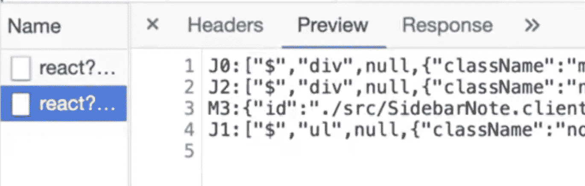
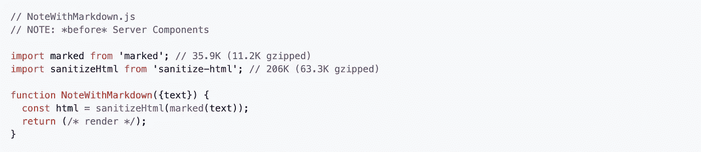
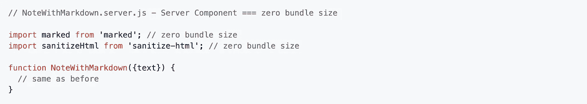

# React 的新服务器组件初探

> 原文：<https://javascript.plainenglish.io/react-server-components-2cf9f8e82c1f?source=collection_archive---------0----------------------->

## 解释在 React.js 中获取数据的新方法

Source: [reactjs.org](https://reactjs.org/)

昨天，React 团队宣布了一个新特性:服务器组件。

该功能仍处于试验阶段；还没有真正的文档。
关于什么简单说就是:React.js 中的数据&组件取数。

服务器组件允许我们从后端加载组件。组件已经在后端呈现，可以无缝集成到正在运行的应用程序中。

所以这有点像服务器端渲染，但工作方式不同。

类似于你从 Next.js 的 **getInitialProps** 中了解到的，服务器组件可以获取数据并将其传递给前端组件。

然而，与经典的 SSR 不同，服务器组件更具动态性。我们可以在应用程序执行期间获取一个服务器树；客户端状态不会丢失。

他们在技术上也有所不同。使用 SSR，我们的 JavaScript 代码在服务器上被呈现为 HTML。这就创建了一个 HTML 模板，它是我们网页的可见部分。

这被发送到客户端，加上用于交互的 JavaScript 代码。由于 SSR，我们可以更早地看到一些东西，但交互性可能会延迟。

服务器组件动态包含在应用程序中，并以特殊形式传递，如下图所示。

所有的 JavaScript 指令都被执行。1 + 1 变成 2，也以格式传递。组件是静态的，**不能交互。**与 SSR 相比，只有可见的部分被通过——交互性缺失。

Source: [twitter.com](https://twitter.com/swyx/status/1341136473546899459)

服务器组件的大优势在哪里？

# 零束尺寸组件

JavaScript 世界充满了巨大的库。想想像 Moment.js 这样的包，它的大小有几千字节，但是我们只使用了其中的几个函数。

对于应用程序的性能，因此对于用户来说，这当然是非常糟糕的——所有的代码都被传送到前端。

摇树可以用来保存我们不需要的代码。剩下的还是很多代码，往往只执行一次。例如，格式化日期。

感谢服务器组件，我们也可以节省我们的前端代码。

Source: [Github](https://github.com/reactjs/rfcs/blob/bf51f8755ddb38d92e23ad415fc4e3c02b95b331/text/0000-server-components.md)

例如，React 团队展示了导入渲染 Markdown 库的代码——如您所见，这个库非常大。

当然，我们不想把那么多代码发送给用户——这会耗费时间和带宽。此外，该组件根本没有交互性——它只是呈现 Markdown。

**解决方案:服务器组件。**

Source: [Github](https://github.com/reactjs/rfcs/blob/bf51f8755ddb38d92e23ad415fc4e3c02b95b331/text/0000-server-components.md)

这里值得注意的是，文件扩展名是“server.js”，但代码基础是相同的——只是现在一切都发生在服务器上。

因此，客户机只获得呈现的结果，而不是将 Markdown 库的全部代码发送给客户机。

总之，服务器组件不会影响我们前端应用的捆绑包大小。代码只在后端运行，对用户不可见。

## 服务器组件具有完全后端访问权限

在所有这些 React 代码都在我们的后端运行之后，这一点现在应该很清楚了。因此，类似于 Next.js，我们可以访问后端，尽管在 Next 中只能绕道数据库、文件系统等。

服务器组件使得这种访问相当容易。React 生态系统通过几个库进行了适当的访问。

除了 **react-pg** 和 **react-fetch** ， **react-fs** 就是其中之一。
没错，“fs”，代表文件系统。

**是的，我们可以用 React.js 访问我们后端的文件系统。**

Source: [Github](https://github.com/reactjs/rfcs/blob/bf51f8755ddb38d92e23ad415fc4e3c02b95b331/text/0000-server-components.md)

还支持访问数据库和其他服务。

**感谢您的阅读！**

## [加入我的简讯，了解更多有趣的内容](http://eepurl.com/hacY0v)

有关 React.js 的更多信息，请查看:

 [## 我用 React 和 Preact 构建了相同的应用程序。以下是不同之处

### 以及测量的大小、性能和实现

medium.com](https://medium.com/javascript-in-plain-english/i-built-the-same-app-with-react-and-preact-here-are-the-differences-b0da382a6f72)  [## Next.js for React:为什么你现在应该尝试一下

### 我们生活在服务器端渲染的时代。Next.js 在这方面很棒。这里有几个你应该检查它的理由…

medium.com](https://medium.com/better-programming/next-js-for-react-why-you-should-give-it-a-try-right-now-e3b1886e4f20)