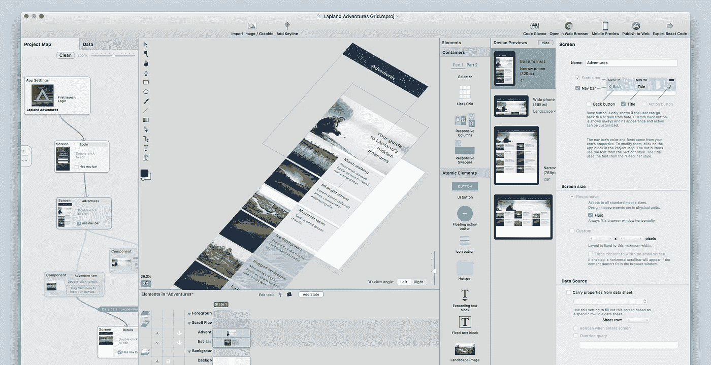

# React Studio —光速进入现代 web 应用程序制作

> 原文：<https://javascript.plainenglish.io/react-studio-lightspeed-into-modern-web-app-production-df88401e0b4c?source=collection_archive---------7----------------------->

## 拆除设计和开发之间的墙

官方网站:[https://reactstudio.com/](https://reactstudio.com/)

## 一个应用程序将它们绑定在一起

# 特征

*   融入并**优化现有工作流程**；不需要放弃或改变任何工具或投资。
*   开发人员保留所有现有的工具和集成。项目和代码输出完全开放，**无厂商锁定**。
*   给开发人员一个简单的方法来**打包新代码**供设计人员控制拖放使用。
*   拖放使用**现有的 React/npm 包**，导出时保留 npm 依赖关系。
*   集成插件编辑器与 **API 验证器**以确保接口兼容性。
*   使用脸书官方**“create-react-app”**项目结构导出完整项目。
*   使用 Git 分支的智能**版本控制**集成。
*   **使用 real React 组件创建拖放式 web 应用**。
*   用于**组件属性**的可定制交互式用户界面。
*   复杂而易用的工具，用于**响应屏幕布局**和交互设计。
*   使用**内置绘图工具**和/或继续使用 Illustrator、Photoshop 和 Sketch 等工具。
*   **从草图导入** —我们的高级传输插件允许你将符号作为组件，将层指定为动态元素，等等。
*   **移动预览** —在任何移动设备上立即查看您的设计。
*   **发布到 Web** —只需一次点击，即可获得您的 Web 应用程序的永久 URL。
*   内置的**插件商店**可以让你出售自己的插件给其他用户。

# 例子

*   [火星体验](https://neonto.cloud/u/marsdemo/)
*   [预约屏幕](https://neonto.cloud/u/appointmentdemo/)
*   [美元货币仪表板](https://neonto.cloud/u/currencydemo/)
*   [拉普兰历险记](https://neonto.cloud/u/adventuresdemo/)
*   [独立艺术家](https://neonto.cloud/u/exampleindieartist/)
*   [每日星座运势](https://neonto.cloud/u/horoscopedemo/)

# 指南和教程

*   [React 工作室博客](https://medium.com/@reactstudio)
*   [YouTube 上的视频教程](https://www.youtube.com/channel/UCrcoH14H-MLS-MKxZGMwVGQ/feed)

# 社区

[支持&论坛](https://discuss.reactstudio.com/)

# 对于开发人员

*   [插件 API 参考](http://neonto.com/developer/plugin-api) —注意:这些 API 适用于包括 React Studio 在内的多个 Neonto 产品。我们正在专门为 React Studio 开发 doc 版本。
*   [设计编译器讲解](https://medium.com/@reactstudio/meet-the-design-compiler-17ae89f985bb)—React Studio 插件的最佳教程
*   [巅峰框架:为什么库和框架会枯竭【React Studio 元开发方法背后的哲学](https://hackernoon.com/peak-framework-and-the-runtime-barrier-why-libraries-and-frameworks-are-exhausted-64d7f03d946b)