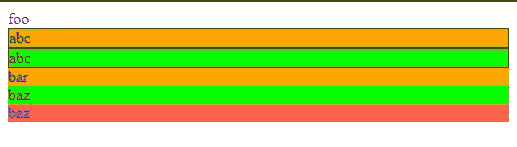

# React 风格的组件——更复杂的选择器和选择性传递道具

> 原文：<https://javascript.plainenglish.io/react-styled-components-more-complex-selectors-and-selectively-passing-props-9e12a3d60167?source=collection_archive---------5----------------------->


Photo by [Waldemar Brandt](https://unsplash.com/@waldemarbrandt67w?utm_source=medium&utm_medium=referral) on [Unsplash](https://unsplash.com?utm_source=medium&utm_medium=referral)

React 是构建现代交互式前端 web 应用最常用的前端库。它还可以用来构建移动应用程序。

在本文中，我们将研究用伪选择器创建样式化的组件，并为其他组件创建样式化的包装器。

# 在 Render 方法之外定义样式组件

我们可以用`styled-components`在 render 方法之外定义样式化组件。

例如，我们可以如下定义包装组件:

```
import React from "react";
import styled from "styled-components";const StyledWrapper = styled.div`
  font-weight: bold;
`;const Wrapper = ({ message }) => {
  return <StyledWrapper>{message}</StyledWrapper>;
};export default function App() {
  return (
    <div className="App">
      <Wrapper message="foo" />
    </div>
  );
}
```

在上面的代码中，我们创建了具有自己风格的`StyledWrapper`组件。然后我们创建了使用它的`Wrapper`组件。随着`message`道具传了进去。然后我们就可以把`message`当做`Wrapper`的道具用在`App`上了。

因此，我们将在屏幕上看到粗体字“foo”。

# 赝元素、赝选子和嵌套

`styled-components`支持类似 SCSS 的语法来定义样式化组件的样式。用于转换 CSS 的预处理器是 stylis。

例如，我们可以编写以下代码来定义带有 props 和 stylis 代码的样式，如下所示:

```
import React from "react";
import styled from "styled-components";const Thing = styled.div.attrs(() => ({ tabIndex: 0 }))`
  color: blue;
  &:hover {
    color: red;
  }
  & ~ & {
    background: tomato;
  }
  & + & {
    background: lime;
  }
  &.foo {
    background: orange;
  }
  .foo & {
    border: 1px solid ${props => (props.primary ? "red" : "green")};
  }
`;export default function App() {
  return (
    <div className="App">
      <Thing>foo</Thing>
      <Thing className="foo" primary>
        <Thing>abc</Thing>
        <Thing primary>abc</Thing>
        bar
      </Thing>
      <Thing className="bar">baz</Thing>
      <Thing>baz</Thing>
    </div>
  );
}
```

在上面的代码中，我们有`Thing`组件，其中我们用伪选择器定义了样式。

`&:hover`是`Thing`悬停时的选择器。

`& ~ &`是`Thing`同级的选择器，但它可能不直接紧挨着它。

`& + &`是`Thing`旁边的一个`Thing`。

`&.foo`是带有`foo` CSS 类的`Thing`。

`.foo &`是`Thing`里面跟`foo`一类的东西。我们也有一个动态风格的`${props => (props.primary ? “red” : “green”)}`，我们检查`primary`道具，然后相应地应用颜色。

然后我们得到下面的彩色文本:



我们可以添加`&&`伪选择符来增加规则在组件上的特异性。

例如，我们可以写:

```
import React from "react";
import styled from "styled-components";const Thing = styled.div`
  && {
    color: blue;
  }
`;export default function App() {
  return (
    <div className="App">
      <Thing>foo</Thing>
    </div>
  );
}
```

然后我们只对`Thing`应用指定的样式。因此，我们用`&&`避免与其他组件中的样式冲突。


Photo by [Pineapple Supply Co.](https://unsplash.com/@pineapple?utm_source=medium&utm_medium=referral) on [Unsplash](https://unsplash.com?utm_source=medium&utm_medium=referral)

# 附加附加道具

我们可以传入一个对`attrs`方法的回调，这样我们就可以选择基本元素接收的道具。例如，如果我们有一个输入，我们希望它只接收`value`属性和`size`属性，我们可以写:

```
import React from "react";
import styled from "styled-components";const Input = styled.input.attrs(({ value, size }) => ({
  size,
  value
}))`
  color: palevioletred;
  font-size: 1em;
  margin: ${props => props.size};
  padding: ${props => props.size};
`;export default function App() {
  return (
    <div className="App">
      <Input value="foo" size="5px" />
    </div>
  );
}
```

在上面的代码中，我们获取了`value`和`size`道具，并在回调中将它们设置为属性，然后传递给`attrs`方法。

我们还在字符串中动态地将`size`属性传递给我们的样式。

然后，当我们添加`Input`并将`value`设置为`'foo'`并将`size`设置为`'5px'`时，我们将会看到它们反映在我们的样式化输入中。

# 结论

我们可以在 render 方法之外创建样式化的组件。此外，除了 CSS 选择器，我们可以使用 SCSS 选择器来选择元素。

`&`选择器用于选择当前元素。然后，我们可以使用其他选择器来选择相邻元素或子元素。

此外，我们可以使用`&&`选择器选择一个特定的元素。

最后，我们可以使用`attrs`方法有选择地传递 props 作为组件的属性值。

## 进一步阅读

[](https://bit.cloud/blog/introducing-component-compare-easily-review-component-changes-l4qyxtoo) [## 比特博客

### 组件驱动软件的官方博客。围绕现代组件驱动的 web 开发的文章…

比特云](https://bit.cloud/blog/introducing-component-compare-easily-review-component-changes-l4qyxtoo) 

*更多内容请看*[***plain English . io***](https://plainenglish.io/)*。报名参加我们的* [***免费周报***](http://newsletter.plainenglish.io/) *。关注我们关于*[***Twitter***](https://twitter.com/inPlainEngHQ)[***LinkedIn***](https://www.linkedin.com/company/inplainenglish/)*[***YouTube***](https://www.youtube.com/channel/UCtipWUghju290NWcn8jhyAw)***，以及****[***不和***](https://discord.gg/GtDtUAvyhW) *对成长黑客感兴趣？检查* [***电路***](https://circuit.ooo/) ***。*****